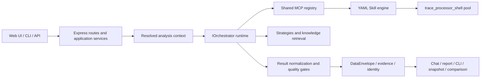

# SmartPerfetto Technical Architecture

[English](technical-architecture.en.md) | [中文](technical-architecture.md)

This document explains the current implementation boundaries. See
[Architecture Overview](overview.en.md) for a shorter entry point,
[Agent Runtime](agent-runtime.en.md) for runtime details, and the
[Data Contract](../../backend/docs/DATA_CONTRACT_DESIGN.en.md) for table and
evidence transport.

## 1. More Than One Web Plugin

SmartPerfetto exposes one analysis core through several products:

| Surface | Entry | Important boundary |
|---|---|---|
| Source Web | `./start.sh` | Uses committed `frontend/`; normal users do not build the Perfetto submodule |
| Frontend development | `./scripts/start-dev.sh` | Only for AI Assistant plugin work |
| Docker | `docker-compose.hub.yml` | Cannot read host Claude Code login state |
| npm CLI | `smp` / `smartperfetto` | Node.js `>=24 <25`; no Web UI |
| Portable | Three platform release assets | Bundles Node.js 24, backend, frontend, trace processor, and runtime assets |
| HTTP/SSE API | `/api/*` | Web, CLI support, and integrations reuse backend contracts |

A feature cannot be verified on only one entry point. The authoritative surface
list is [`.claude/rules/product-surface.md`](../../.claude/rules/product-surface.md).

## 2. Component Boundaries



Primary directories:

- `backend/src/routes/`: HTTP/SSE and input boundaries;
- `backend/src/assistant/application/`: session preparation and reuse;
- `backend/src/agentRuntime/`: provider-neutral runtimes and result convergence;
- `backend/src/agentv3/`: shared MCP, strategy loading, planning, and verifier
  compatibility namespace;
- `backend/src/services/skillEngine/`: YAML Skill execution;
- `backend/skills/`: deterministic trace-evidence programs;
- `backend/strategies/`: scene methodology, prompts/templates, and report rules;
- `backend/src/services/traceProcessorService.ts`: trace processor lifecycle and leases;
- `perfetto/ui/src/plugins/com.smartperfetto.AIAssistant/`: plugin source;
- `frontend/`: committed UI consumed by source, Docker, and portable products.

## 3. Main Analysis Flow

```text
POST /api/agent/v1/analyze
  -> AgentAnalyzeSessionService.prepareSession()
  -> resolve workspace / user / trace / provider / source / knowledge context
  -> createAgentOrchestrator()
  -> select Claude / OpenAI / Pi / OpenCode / Qoder runtime
  -> use the shared MCP registry for SQL, Skills, knowledge, and planning
  -> DataEnvelope + evidence/claim/identity sidecars
  -> final-result normalization / report-contract gate
  -> SSE chat projection + HTML report + snapshot + CLI artifact
```

`options.analysisMode` supports:

- `fast`: lightweight tools and deterministic direct-evidence paths;
- `full`: full tools, planning, and quality checks;
- `auto`: non-negotiable context rules, then semantic classification.

When a reference trace, codebase, or private knowledge source requires full
context, a requested `fast` mode must not silently drop the capability.

## 4. Runtimes And Providers

Four production runtimes implement the shared `IOrchestrator` contract:

| Runtime | Primary providers | Resume state |
|---|---|---|
| `claude-agent-sdk` | Anthropic, Bedrock, Vertex, Claude-compatible, local Claude login | Claude session id |
| `openai-agents-sdk` | OpenAI Responses, OpenAI-compatible, Ollama/chat-completions | history + response id |
| `pi-agent-core` | Provider Manager custom profile / Pi model config | opaque transcript |
| `opencode` | OpenCode SDK and custom providers | OpenCode session id + isolated directories |

Selection order is request-level Provider Manager profile, persisted session
snapshot, `SMARTPERFETTO_AGENT_RUNTIME`, then the default runtime. A session
pins its provider/runtime at creation; resume must not silently follow a newly
activated profile.

Provider Manager profiles override `.env` fallback. Docker and portable
authentication environments differ from the host, so source-only Claude login
cannot be documented as universal.

## 5. MCP Tool Surface

`backend/src/agentv3/mcpToolRegistry.ts` is the source for descriptors,
exposure, and allowlists; `claudeMcpServer.ts` supplies implementations and
request-shaped composition. The total is intentionally dynamic:

- fast and full requests expose different surfaces;
- code-aware tools require permission;
- comparison tools require a reference trace;
- artifact tools depend on session capabilities;
- deprecated/internal tools do not automatically become public contracts.

Docs describe tool families and visibility rather than copying a static count
or maintaining a second registry. See the [MCP Tools Reference](../reference/mcp-tools.en.md).

## 6. Strategies And Skills

The two content layers have different jobs:

```text
Markdown Strategy / Template
  -> classification, methodology, constraints, final_report_contract

YAML Skill
  -> SQL / iterator / conditional / composite execution
  -> deterministic DataEnvelope evidence
```

Durable prompt content does not belong in TypeScript. Scene methodology lives
in `backend/strategies/`; deterministic evidence lives in `backend/skills/`.
Skill inventory, scene lists, and the pipeline catalog are discovered from the
tree/frontmatter/index rather than copied into code or docs.

Rendering-pipeline teaching content under `docs/rendering_pipelines/` is read at
runtime through `doc_path`. It is synchronized from a pinned source rather than
edited manually:

```bash
npm run sync:rendering-pipelines -- --source <checkout> --apply
npm run check:rendering-pipelines
```

See the [Skill System Guide](../reference/skill-system.en.md).

## 7. Trace Processor And Evidence

`TraceProcessorService` manages the `trace_processor_shell` pool, port leases,
trace loading, and SQL RPC. Source, npm, Docker, and portable products must
follow the same pin and integrity rules. An explicit `TRACE_PROCESSOR_PATH` is
user-owned; launchers do not change its permissions or overwrite it.

DataEnvelope output feeds:

- the evidence contract;
- deterministic claim verification;
- process/thread identity resolution;
- report provenance;
- analysis-result snapshots;
- comparison metrics.

Chat readability and audit provenance are separate surfaces. Hiding raw SQL
from chat must not remove provenance from reports, snapshots, or CLI artifacts.

## 8. Two Comparison Products

SmartPerfetto maintains two distinct comparison products:

1. **Raw trace comparison** queries current + reference traces in one AI
   session. CLI `smp compare` and the dual-view UI share backend comparison
   context, Skills, and report sections.
2. **Analysis-result comparison** compares persisted snapshots across windows
   or traces and follows workspace/RBAC/share rules.

They may reuse standard metrics and report sections, but raw comparison must
not become a private UI/CLI prompt, and snapshot comparison must not be
described as arbitrary history-versus-history raw dual view.

## 9. Source And Knowledge Context

### Code-Aware

Codebases pass through `PathSecurityGate` preview/register/reindex.
`metadata_only` exposes `CodeRef`; `provider_send` additionally requires
registration consent and an explicit request mode. Raw source never belongs in
sessions, logs, SSE, reports, or exports.

### Android Internals

The signed built-in Knowledge Pack and a private checkout are separate sources:

- the bundled Pack ships with every product and can update through a TUF
  channel; its provenance is background knowledge, never current-trace
  evidence;
- a private checkout requires a path allowlist, rights acknowledgement,
  provider consent, and request-level source selection.

The resolved analysis context pins codebase/knowledge generations,
tenant/workspace/user, provider consent, and session continuity. Resume,
reports, and snapshots must preserve those boundaries.

## 10. Output And Persistence

The final result is not one Markdown string:

| Surface | Retained content |
|---|---|
| SSE / AI chat | Readable conclusion, necessary evidence summary, and progress |
| HTML report | Evidence, claims, identity, background references, and appendix |
| CLI artifact | Turn, report, resume state, and machine-readable output |
| Analysis-result snapshot | Standard metrics, evidence references, comparison input |
| Provider session snapshot | Runtime/provider-specific resume state |

`final_report_contract`, normalization, and quality gates converge provider
outputs on shared semantics rather than patching one provider-specific string
at one exit.

## 11. Release Assets

Release surfaces are independent:

- npm bundles CLI dist, Skills, Strategies, SQL, trace processor, and the
  Knowledge Pack;
- portable additionally bundles Node.js 24, native dependencies, backend,
  `frontend/`, and a launcher;
- Docker builds a Linux image from `main` using committed `frontend/` and
  runtime assets;
- normal source use also consumes `frontend/`; only UI development builds the
  submodule.

See the [Release Runbook](../reference/release.en.md) and
[Portable Packaging](../reference/portable-packaging.en.md).

## 12. Verification

Verification depends on change type; the complete landing gate is:

```bash
npm run verify:docs
npm run verify:pr
```

Important focused entries:

```bash
cd backend
npm run validate:skills
npm run validate:strategies
npm run test:scene-trace-regression
npm run cli:pack-check
npm run verify:codebase-aware
```

Additionally:

- dual-trace browser contract: `npm run test:e2e:dual-trace`;
- trace corpus: `npm run trace:regression`;
- runtime-read pipeline docs: `npm run verify:rendering-pipelines`;
- portable: use the script checks, launcher cross-build, full package build,
  and manifest verification in the [testing rules](../../.claude/rules/testing.md);
- provider-backed E2E requires safely available credentials; unit tests are not
  a substitute;
- Android capture can claim a recording smoke only with a connected device;
  offline checks prove proposal/config/CLI contracts only.

## 13. Change Map

| Goal | Change location |
|---|---|
| Add deterministic analysis | `backend/skills/` |
| Change AI methodology or report rules | `backend/strategies/` |
| Add/change an MCP tool | registry + implementation + reference + tests |
| Change DataEnvelope | backend source + generator + generated frontend types + consumers |
| Change API contract | route/application service + tests + API docs |
| Change AI Assistant UI | Perfetto plugin + dev/browser test + `frontend/` prebuild |
| Change runtime/provider | `agentRuntime/` + Provider Manager + session snapshot tests |
| Change release assets | package/release scripts + runtime-asset tests + release docs |

After architecture changes, use [`AGENTS.md`](../../AGENTS.md) and the relevant
`.claude/rules/` file to choose the required verification tier.
