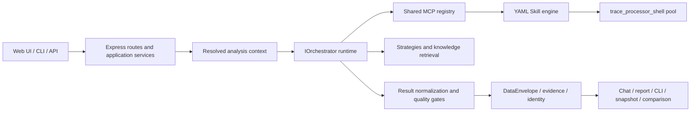

# SmartPerfetto 技术架构

[English](technical-architecture.en.md) | [中文](technical-architecture.md)

本文从实现边界解释当前 SmartPerfetto。快速入口见
[架构总览](overview.md)，runtime 细节见 [Agent Runtime](agent-runtime.md)，
表格和证据传输见 [Data Contract](../../backend/docs/DATA_CONTRACT_DESIGN.md)。

## 1. 产品不是单一 Web 插件

SmartPerfetto 在同一分析核心上提供多种入口：

| 产品面 | 入口 | 关键边界 |
|---|---|---|
| 源码 Web | `./start.sh` | 使用提交的 `frontend/`，普通用户不构建 Perfetto submodule |
| 前端开发 | `./scripts/start-dev.sh` | 只用于修改 AI Assistant plugin |
| Docker | `docker-compose.hub.yml` | 不读取宿主机 Claude Code 登录态 |
| npm CLI | `smp` / `smartperfetto` | Node.js `>=24 <25`，不包含 Web UI |
| portable | 三平台 release asset | 内置 Node.js 24、backend、frontend、trace processor 和 runtime assets |
| HTTP/SSE API | `/api/*` | Web、CLI 辅助服务和内部集成都复用后端 contract |

因此功能修改不能只验证其中一个入口。权威产品面清单在
[`.claude/rules/product-surface.md`](../../.claude/rules/product-surface.md)。

## 2. 组件边界



主要目录：

- `backend/src/routes/`：HTTP/SSE 路由与输入边界；
- `backend/src/assistant/application/`：session 准备和复用；
- `backend/src/agentRuntime/`：provider-neutral runtime 与输出收敛；
- `backend/src/agentv3/`：共享 MCP、策略加载、计划/verifier 等兼容命名空间；
- `backend/src/services/skillEngine/`：YAML Skill 执行；
- `backend/skills/`：确定性 trace 证据程序；
- `backend/strategies/`：场景方法、prompt/template 和报告要求；
- `backend/src/services/traceProcessorService.ts`：trace processor 生命周期和租约；
- `perfetto/ui/src/plugins/com.smartperfetto.AIAssistant/`：Perfetto UI 插件源码；
- `frontend/`：源码、Docker 和 portable 实际消费的提交版 UI。

## 3. 一次分析的主流程

```text
POST /api/agent/v1/analyze
  -> AgentAnalyzeSessionService.prepareSession()
  -> 解析 workspace / user / trace / provider / source / knowledge context
  -> createAgentOrchestrator()
  -> 选择 Claude / OpenAI / Pi / OpenCode runtime
  -> 通过共享 MCP registry 调用 SQL、Skill、知识和计划工具
  -> DataEnvelope + evidence/claim/identity sidecar
  -> final result normalization / report contract gate
  -> SSE chat projection + HTML report + snapshot + CLI artifact
```

`options.analysisMode` 支持：

- `fast`：轻量工具面和确定性 direct-evidence path；
- `full`：完整工具、计划和质量检查；
- `auto`：先应用不可绕过的上下文规则，再由语义分类器决定。

reference trace、codebase 或私有 knowledge source 需要完整上下文时，不能为了满足
用户传入的 `fast` 而静默丢掉能力。

## 4. Runtime 与 Provider

四个 production runtime 都实现共享 `IOrchestrator` 合约：

| Runtime | 主要 Provider | 恢复状态 |
|---|---|---|
| `claude-agent-sdk` | Anthropic、Bedrock、Vertex、Claude-compatible、本机 Claude 登录 | Claude session id |
| `openai-agents-sdk` | OpenAI Responses、OpenAI-compatible、Ollama/chat-completions | history + response id |
| `pi-agent-core` | Provider Manager custom profile / Pi model config | opaque transcript |
| `opencode` | OpenCode SDK 与 custom provider | OpenCode session id + 隔离目录 |

选择顺序是：请求显式 Provider Manager profile、持久化 session snapshot、
`SMARTPERFETTO_AGENT_RUNTIME`、默认 runtime。session 创建后固定 provider/runtime；
恢复时不能因为当前 active profile 改变而静默换 provider。

Provider Manager profile 优先于 `.env` fallback。Docker/portable 中的认证环境与宿主机
不同，不能把源码路径下可用的 Claude 登录态写成所有发布形态都可用。

## 5. MCP 工具面

`backend/src/agentv3/mcpToolRegistry.ts` 是工具描述、exposure 和 allowlist 的注册源，
`claudeMcpServer.ts` 提供实现与按请求组合。工具不是固定总数：

- fast/full 请求暴露面不同；
- code-aware 工具需要授权；
- comparison 工具只在 reference trace 存在时注册；
- artifact 工具依赖当前 session 能力；
- deprecated 或内部工具不会自动成为公开契约。

公开文档应说明工具家族和可见性，不复制静态数量或手工维护另一份 registry。
完整说明见 [MCP 工具参考](../reference/mcp-tools.md)。

## 6. Strategy 与 Skill

两类内容职责不同：

```text
Markdown Strategy / Template
  -> 分类、方法、约束、final_report_contract

YAML Skill
  -> SQL / iterator / conditional / composite execution
  -> deterministic DataEnvelope evidence
```

长期 prompt 内容不写入 TypeScript。新增场景方法修改 `backend/strategies/`；
新增确定性证据修改 `backend/skills/`。Skill 数量、场景列表和 pipeline catalog 都从
文件树/frontmatter/index 发现，不能在代码或文档中固定复制。

渲染管线教学内容位于 `docs/rendering_pipelines/`，运行时通过 `doc_path` 读取。
这些文件由同步工具从固定来源更新，不手工编辑：

```bash
npm run sync:rendering-pipelines -- --source <checkout> --apply
npm run check:rendering-pipelines
```

Skill 合约见 [Skill 系统指南](../reference/skill-system.md)。

## 7. Trace Processor 与证据

`TraceProcessorService` 管理 `trace_processor_shell` pool、端口租约、trace load 和 SQL
RPC。源码启动、npm、Docker 和 portable 必须使用同一 pin/校验规则；显式
`TRACE_PROCESSOR_PATH` 是用户拥有的覆盖路径，启动器不会替用户改权限或覆盖文件。

Skill/SQL 输出经过 DataEnvelope 后会继续形成：

- evidence contract；
- deterministic claim verification；
- process/thread identity resolution；
- report provenance；
- analysis-result snapshot；
- comparison metric。

聊天可读性与审计来源是分离产品面。隐藏聊天中的 raw SQL 不能删除报告、snapshot 或
CLI artifact 中用于复核的 provenance。

## 8. 两种对比产品

SmartPerfetto 维护两类不同对比：

1. **Raw trace comparison**：current + reference trace 在同一 AI session 中实时查询。
   CLI `smp compare` 与双窗 UI 复用后端 comparison context、Skill 和报告 section。
2. **Analysis-result comparison**：比较已持久化 snapshot，可跨窗口、跨 trace，
   并受 workspace/RBAC/share 规则约束。

两者可以共享标准指标和报告 section，但不能把 raw trace 对比实现成 UI/CLI 私有 prompt，
也不能把 snapshot comparison 误写成任意两个历史 raw trace 的双窗。

## 9. 源码与知识上下文

### Code-Aware

代码库先经过 `PathSecurityGate` preview/register/reindex。默认 `metadata_only` 只向
模型提供 `CodeRef`；`provider_send` 还需要注册时同意和本次请求显式选择。原始源码
不能写入 session、日志、SSE、报告或 export。

### Android Internals

内置签名 Knowledge Pack 与私有 checkout 是两个来源：

- 内置 Pack 随各发布形态分发，TUF channel 可更新；分析只把 provenance 当作背景知识，
  不能伪装成当前 trace 证据；
- 私有 checkout 需要路径 allowlist、权利确认、provider 同意和 request-level source id。

统一 analysis context 会固定 codebase/knowledge generation、tenant/workspace/user、
provider consent 和 session continuity。恢复、报告和 snapshot 不能绕过这些边界。

## 10. 输出与持久化

最终输出不是单一 Markdown 字符串：

| 产品面 | 保留内容 |
|---|---|
| SSE / AI chat | 可读结论、必要证据摘要和进度 |
| HTML report | 证据、claim、identity、背景知识引用和 appendix |
| CLI artifact | turn、report、resume state 和机器可读输出 |
| analysis-result snapshot | 标准指标、证据引用、comparison 输入 |
| provider session snapshot | runtime/provider-specific 恢复状态 |

`final_report_contract`、normalizer 和质量门禁负责让各 runtime 收敛到共享结果语义，
而不是用 provider-specific 字符串补丁修某一个出口。

## 11. 发布资产

发布面彼此独立：

- npm CLI 包含 CLI dist、Skills、Strategies、SQL、trace processor 和 Knowledge Pack；
- portable 还包含 Node.js 24、原生依赖、backend、`frontend/` 和 launcher；
- Docker 从 `main` 构建 Linux image，消费提交的 `frontend/` 和 runtime assets；
- 源码 checkout 的普通路径也消费 `frontend/`，只有 UI 开发才构建 submodule。

发布顺序、签名和 smoke 见 [发布手册](../reference/release.md) 与
[portable 打包](../reference/portable-packaging.md)。

## 12. 验证策略

最小验证由改动类型决定，完整合入门禁是：

```bash
npm run verify:docs
npm run verify:pr
```

关键专项入口：

```bash
cd backend
npm run validate:skills
npm run validate:strategies
npm run test:scene-trace-regression
npm run cli:pack-check
npm run verify:codebase-aware
```

此外：

- 双 Trace 浏览器契约：`npm run test:e2e:dual-trace`；
- trace corpus：`npm run trace:regression`；
- runtime-read 渲染文档：`npm run verify:rendering-pipelines`；
- portable：按 [测试规则](../../.claude/rules/testing.md) 运行脚本静态检查、
  launcher cross-build、全包构建和 manifest 校验；
- provider-backed E2E 只有安全凭证存在时运行，不能用单测冒充真实模型验证；
- Android capture 只有连接真实设备时才能声明抓取 smoke 通过，离线只证明
  proposal/config/CLI contract。

## 13. 修改位置速查

| 目标 | 修改位置 |
|---|---|
| 新增确定性分析 | `backend/skills/` |
| 修改 AI 方法或报告要求 | `backend/strategies/` |
| 新增/修改 MCP 工具 | registry + implementation + reference + tests |
| 修改 DataEnvelope | backend source + generator + frontend generated types + consumers |
| 修改 API contract | route/application service + tests + API 文档 |
| 修改 AI Assistant UI | Perfetto plugin source + dev/browser test + `frontend/` prebuild |
| 修改 runtime/provider | `agentRuntime/` + Provider Manager + session snapshot tests |
| 修改发布资产 | package/release scripts + runtime-asset tests + release docs |

架构修改完成后，再按
[`AGENTS.md`](../../AGENTS.md) 和 `.claude/rules/` 中对应规则选择验证层级。
