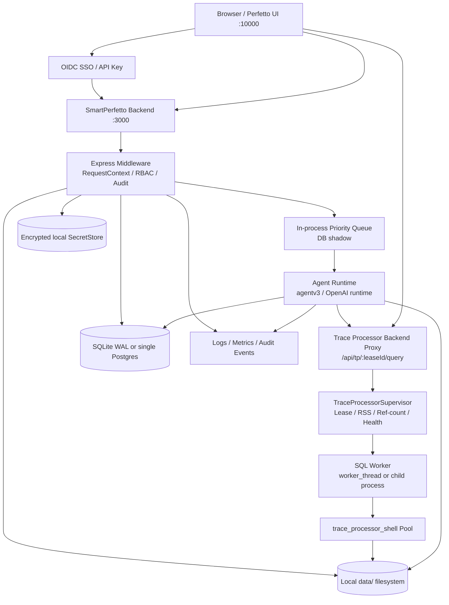
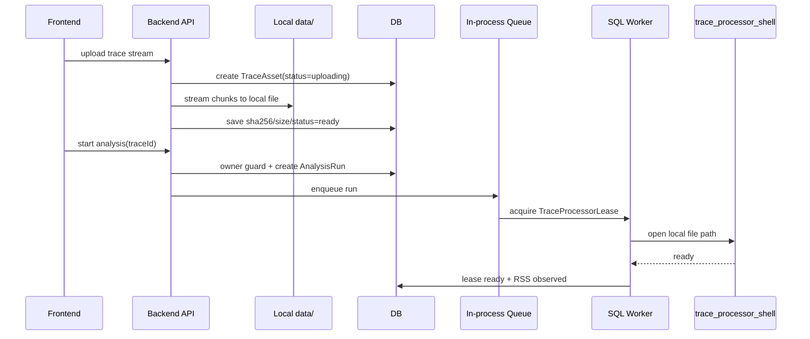

# SmartPerfetto 企业级多用户与多租户 Feature 开发文档

## 0. 开发执行 TODO

> 本节从下文设计中拆出的工程主导执行清单，作为后续每次 PR 的对照表。
>
> 强制约束：
>
> 1. 所有改动必须在专门的 feature 分支上进行（建议 `feature/enterprise-multi-tenant`），不直接对 `main` 提交。
> 2. 每完成一项把 `[ ]` 改成 `[x]`；只在该项的代码、测试、文档都落地后才打勾。
> 3. 测试必须随主线推进同步补全，不允许“先合代码再补测试”。每个主线段都关联一组 §0.6 / §0.7 中的测试或反证用例。
> 4. 开发过程中**如果新增或引用了任何文档**（ADR、设计稿、运维 runbook、第三方资料、Codex review 结论等），都登记到 §0.9，对应工程项完成后再打勾。
> 5. 顺序可调，但调整必须在本 TODO 内显式更新结构后再提交，避免 TODO 与实际节奏脱节。
>
> 2026-05-09 scope update: 维护者明确将 §0.4.3 真实大 trace
> RSS 矩阵和 §0.8 真实 50 在线用户压测后移为维护者后续实测。本轮 agent
> 目标只收口代码、自动化、文档、门禁和可复用 harness；这些延期项打勾不代表已经产生真实测量数据。

### 0.0 工程准备
- [x] 创建开发分支 `feature/enterprise-multi-tenant`（基于最新 `main`，不直接动 `main`）
- [x] 跑 baseline：`cd backend && npm run typecheck` + `npm run test:scene-trace-regression`，记录基线指标
- [x] 复读 `README-review.md` 与 `appendix-ha.md`，确认 v1 主线不引入 Redis/NATS/Vault/Postgres HA
- [x] 在后端引入 `enterprise` feature flag（默认关闭），用于灰度切换 RequestContext / lease proxy / DB-authoritative 路径

### 0.1 第一里程碑（§22，最小可用边界）
- [x] 1.1 `RequestContext` middleware（`backend/src/middleware/auth.ts` 重构）覆盖 trace / agent session / report 三条高风险链路
- [x] 1.2 owner guard：`/api/traces`、`/api/agent/v1/*`、`/api/reports/*` 加 `tenantId/workspaceId/userId` 过滤，未授权统一 404
- [x] 1.3 主线 C 第一批最小改动（详见 4.1，独立 PR，不与 lease 大重写混合）
- [x] 1.4 前端 `windowId` 注入 + pending trace key 加 windowId（`ai_panel.ts` / `session_manager.ts` / `backend_uploader.ts`）
- [x] 1.5 SSE 路径明确收敛到 `fetch + ReadableStream` + `Authorization: Bearer` + `Last-Event-ID` cursor replay
- [x] 1.6 `ProviderSnapshot` hash + resume 校验（`agentAnalyzeSessionService.prepareSession`），不再只比 `providerId`
- [x] 1.7 DB schema 最小切片：`organizations / workspaces / users / memberships / trace_assets / analysis_sessions / analysis_runs / agent_events / provider_snapshots`
- [x] 1.8 三用户 + 双窗口回归脚本（落到 `backend/src/scripts/`），覆盖 D1/D2

### 0.2 主线 A：身份与权限（§18）
- [x] 2.1 `RequestContext` 接口与解析 middleware（SSO / API key / dev 三模式）
- [x] 2.2 OIDC SSO 集成 + Onboarding flow（§15 全流程，含 audit）
- [x] 2.3 API key 管理（创建 / 撤销 / scope / 过期 / 审计）
- [x] 2.4 Membership / Role / RBAC 权限矩阵（§8.2）+ owner guard 全 route 覆盖
- [x] 2.5 旧 API 兼容 wrapper：返回 `Deprecation: true` + `Sunset` header；统一走 RequestContext
- [x] 2.6 Resource-oriented API 切到 `/api/workspaces/:workspaceId/*`（§8.3）
- [x] 2.7 前端 workspace selection UI + workspace/window 上下文持久化分层（§9.2 表格）
- [x] 2.8 单元测试覆盖：RequestContext 解析 / RBAC / owner guard / 旧路径包装

### 0.3 主线 B：存储与持久化（§18）
- [x] 3.1 选 SQLite WAL 还是单 Postgres，落地 ADR；建立 repository 抽象（默认追加 tenantId/workspaceId filter）
- [x] 3.2 实现 §10.2 全部核心表 + 索引 + migration（含 audit / tombstone）
- [x] 3.3 trace metadata 入 DB；trace 文件迁到 `data/{tenantId}/{workspaceId}/traces/`
- [x] 3.4 report metadata 入 DB；report 内容迁到 `data/{tenantId}/{workspaceId}/reports/`（§14.2）
- [x] 3.5 `logs/claude_session_map.json` 迁到 `runtime_snapshots`
- [x] 3.6 provider 从 `data/providers.json` 迁到 DB metadata + encrypted SecretStore
- [x] 3.7 Memory / RAG / Case / Baseline 表加 scope（§14.1，先 filter 后语义召回）
- [x] 3.8 双写 → 切读 → 退役 三阶段（§17），每阶段都能回滚；准备 filesystem + DB snapshot
- [x] 3.9 SecretStore：libsodium 加密 + OS keyring 解 master key + secret rotation + 读取审计
- [x] 3.10 集成测试：backend restart 后 session/report/trace metadata 可恢复

### 0.4 主线 C：运行时隔离（§18 + §11）
- [x] 4.1 §11.10 第一批最小改动（独立 PR）
  - [x] 4.1.1 timeout 不直接 `destroy()` frontend-owned processor（`workingTraceProcessor.ts`）
  - [x] 4.1.2 critical stdlib loader 进入 per-processor queue，禁止与用户 SQL 自并发
  - [x] 4.1.3 `createFromExternalRpc` 按 port 去重，复用同 port wrapper
  - [x] 4.1.4 LRU 跳过 ExternalRpcProcessor 或改为 lease/ref-count 判定
  - [x] 4.1.5 pending trace localStorage key 加 `windowId`，必要时迁 sessionStorage
  - [x] 4.1.6 AI session cache 加 mtime/CAS 或改为后端权威 session list
- [x] 4.2 上传链路 stream 化（§11.1）：URL 上传不再 `arrayBuffer()` 全量进内存；本地上传与 RAM/磁盘策略联动；temp file 用 traceId/uuid + 原子 rename
- [x] 4.3 RSS benchmark：scroll/startup/ANR/memory/heapprofd/vendor 大 trace × 100MB/500MB/1GB，记录启动 RSS、load peak、query headroom（harness、审计脚本和本机候选扫描已完成；真实 18-cell 大 trace 矩阵由维护者后续实测）
- [x] 4.4 `TraceProcessorLease` 4 类 holder（frontend_http_rpc / agent_run / report_generation / manual_register）+ 状态机（§11.4）+ 分级 TTL
- [x] 4.5 Backend proxy `/api/tp/:leaseId/{status,websocket,query,heartbeat}`（§11.3）
  - [x] 4.5.1 同时支持 `/status` HTTP / `/websocket` 二进制双向 / `/query` HTTP
  - [x] 4.5.2 前端 `HttpRpcEngine` 抽象成 `HttpRpcTarget`（direct-port + backend-lease-proxy）
  - [x] 4.5.3 同一 frontend WebSocket holder 内严格 FIFO，不做乱序返回
  - [x] 4.5.4 企业模式禁用浏览器直连裸 `127.0.0.1:9100-9900`
- [x] 4.6 SQL Worker（worker_thread / child process）+ non-preemptive priority queue P0/P1/P2（§11.7）
- [x] 4.7 RAM budget + 启动后实测 RSS + admission control（§11.5），暴露 stats endpoint
- [x] 4.8 Shared / isolated 自动判定（§11.6），UI 明确展示队列/共享/独立状态
- [x] 4.9 24h query timeout 覆盖 WorkingTraceProcessor 与 ExternalRpcProcessor 双路径；独立 health channel `SELECT 1`（§11.8）
- [x] 4.10 crash recovery + backoff（1s/5s/15s + jitter）+ 稳定 leaseId；单 supervisor 重启，holder 不各自重试
- [x] 4.11 `/api/traces/cleanup` 企业模式禁用或 admin-only + draining + audit
- [x] 4.12 §11.11 漏洞清单：每行设计验收都打勾验证

### 0.5 主线 D：控制面与合规（§18）
- [x] 5.1 tenant / workspace / member / provider / quota 管理 UI 与后端 API
- [x] 5.2 `audit_events` 表 + 关键操作埋点（trace / report / provider / memory / cleanup / delete / promote）
- [x] 5.3 配额 / 预算 / retention policy（§16.1，含 quota_exceeded 终态）
- [x] 5.4 Tenant export bundle（§16.2，含 SHA256 + tenant identity proof）
- [x] 5.5 Tenant tombstone + 7 天硬删窗口 + async purge + audit proof（§16.3）
- [x] 5.6 Custom skill v1 处置（§14.3）：禁用 write endpoint 或修 loader 闭环
- [x] 5.7 Legacy AI route 处置（§14.4 表）
  - [x] 5.7.1 移除 `/api/agent/v1/llm` direct LLM proxy
  - [x] 5.7.2 移除 `/api/advanced-ai`
  - [x] 5.7.3 移除 `/api/auto-analysis`
  - [x] 5.7.4 `agent/core/ModelRouter` DeepSeek 全局 provider 路径
  - [x] 5.7.5 `agentv2` fallback
- [x] 5.8 管理员运行时 dashboard：active leases / RSS / queue length / events / LLM cost
- [x] 5.9 安全审计：ID 枚举、跨 tenant、无权限 provider/report/memory 访问

### 0.6 测试矩阵补全（§20，与主线绑定）
- [x] 6.1 Unit：RequestContext / RBAC / owner guard / provider resolution / ProviderSnapshot hash
- [x] 6.2 Integration：trace upload/list/delete/download；agent analyze/resume/respond/stream；report read/delete
- [x] 6.3 Concurrency：多用户同时 upload / analyze / query / cancel / cleanup
- [x] 6.4 Dual-window e2e：D1-D10 每个场景至少 1 个自动化用例（详见 §0.7）
- [x] 6.5 Security：ID 枚举、跨 tenant、无权限访问统一 404
- [x] 6.6 Runtime：lease acquire / release / heartbeat / stale / crash recovery
- [x] 6.7 Persistence：backend restart / queue shadow 恢复 / DB reconnect / SecretStore failure
- [x] 6.8 SSE：fetch-stream reconnect / cursor replay / terminal event 落库
- [x] 6.9 Migration：dry-run / 双写 / 切读 / 退役 / snapshot restore
- [x] 6.10 Regression：每次 PR 跑 `cd backend && npm run test:scene-trace-regression`
- [x] 6.11 PR Gate：合入前 `npm run verify:pr` 通过

### 0.7 §23 反证循环（双窗口阻断验收，每条都对应一个自动化测试）
- [x] D1 两窗口分别上传同名 trace → temp file / TraceAsset / lease / session 不互相覆盖
- [x] D2 A 长 SQL 中，B 上传并分析另一个 trace → A 的 SSE 不断、A lease 不被 destroy、B 能排队或运行
- [x] D3 A 前端 timeline，B 跑 full agent → A WebSocket 走 lease；P0 不被 P2 长任务无限阻塞
- [x] D4 trace_processor_shell crash → leaseId 稳定；前端不持有旧 port；supervisor 单点重启
- [x] D5 浏览器断网 / 休眠 30 分钟后恢复 → frontend grace 生效；reacquire lease 或自动 reload
- [x] D6 SSE 在 conclusion 后、analysis_completed 前断开 → AgentEvent replay 能补回 reportUrl
- [x] D7 手动 cleanup / delete → running run / active lease / 正在生成的 report 被 draining 保护
- [x] D8 Provider 配置在 session 中途变更 → resume 校验 ProviderSnapshot hash，不复用错误 SDK session
- [x] D9 后端进程重启 → pending/running/terminal run 状态、events、trace metadata 可恢复或转 failed
- [x] D10 机器内存接近上限 → admission 拒绝新 lease，不通过 OOM 杀已有窗口

### 0.8 §19 总验收
- [x] 50 在线用户 + 5-15 running run + pending 排队稳定（harness 与真实运行保护已完成；真实环境压测由维护者后续实测）
- [x] 任意用户不能猜测 traceId/sessionId/runId/reportId 越权访问
- [x] A 删除/cleanup 自己资源不影响 B 的 running run / active lease
- [x] Provider 隔离：A 改个人 provider 不影响 B；管理员改 workspace default 只影响新 session
- [x] Provider config 变更后 resume 不复用错误 SDK session
- [x] SSE fetch-stream 断线后 `Last-Event-ID` 续推
- [x] 双窗口同时打开两 trace，pending trace / AI session / SSE / lease 全不串
- [x] 单次慢 SQL 不直接 kill frontend-owned lease
- [x] Memory / SQL learning / case / baseline 默认 tenant/workspace 隔离
- [x] Tenant export / tombstone / async purge / audit proof 全可用
- [x] 压测覆盖几千 trace metadata、几百次/天 LLM 调用，并记录 p50/p95、错误率、worker RSS、queue length、LLM cost（harness 与报告审计已完成；真实环境指标由维护者后续实测）

### 0.9 新增 / 引用文档登记（开发过程中持续追加）
> 规则：开发过程中只要新增设计文档、ADR、运维 runbook、外部参考资料、Codex/expert review 结论等，把相对路径或链接登记在这里；阅读完且对应工程项完成后再打勾。**只追加不重排**，避免 git diff 噪音。
- [x] `docs/archive/features/enterprise-multi-tenant/README.md`（本文）
- [x] `docs/archive/features/enterprise-multi-tenant/README-review.md`（review 结论已吸收到本文）
- [x] `docs/archive/features/enterprise-multi-tenant/appendix-ha.md`（未来扩展，v1 仅作参考）
- [x] `docs/archive/features/enterprise-multi-tenant/agent-goal.md`（AI 接手用 self-contained goal prompt）
- [x] `docs/archive/features/enterprise-multi-tenant/baseline.md`（0.0 baseline 命令与实测结果）

> 追加模板：新增 ADR / 设计 / runbook 在本区末尾追加，例如 `docs/adr/0001-enterprise-db-choice.md`。

- [x] `docs/archive/features/enterprise-multi-tenant/adr-0001-sqlite-wal-repository.md`（§0.3.1 SQLite WAL + repository abstraction 决策）
- [x] `docs/archive/features/enterprise-multi-tenant/rss-benchmark.md`（§0.4.3 RSS benchmark runbook；真实 100MB/500MB/1GB 大 trace 实测由维护者后续补齐）
- [x] `docs/archive/features/enterprise-multi-tenant/runtime-isolation-checklist.md`（§0.4.12 §11.11 漏洞清单设计验收证据）
- [x] `docs/archive/features/enterprise-multi-tenant/security-audit.md`（§0.5.9 安全审计证据）
- [x] `docs/archive/features/enterprise-multi-tenant/runtime-dashboard.md`（§0.5.8 管理员运行时 dashboard API 契约与验证）
- [x] `docs/archive/features/enterprise-multi-tenant/admin-control-plane.md`（§0.5.1 tenant/workspace/member/provider/quota 管理面契约与验证）
- [x] `docs/archive/features/enterprise-multi-tenant/unit-coverage-matrix.md`（§0.6.1 Unit 覆盖证据与 test:core 固定入口）
- [x] `docs/archive/features/enterprise-multi-tenant/integration-coverage-matrix.md`（§0.6.2 Integration 主链路覆盖证据与 test:core 固定入口）
- [x] `docs/archive/features/enterprise-multi-tenant/concurrency-coverage-matrix.md`（§0.6.3 多用户并发 upload/analyze/query/cancel/cleanup 覆盖证据）
- [x] `docs/archive/features/enterprise-multi-tenant/security-coverage-matrix.md`（§0.6.5 ID 枚举、跨 tenant/workspace、无权限资源访问覆盖证据）
- [x] `docs/archive/features/enterprise-multi-tenant/runtime-coverage-matrix.md`（§0.6.6 lease acquire/release/heartbeat/stale/crash recovery 覆盖证据）
- [x] `docs/archive/features/enterprise-multi-tenant/persistence-coverage-matrix.md`（§0.6.7 backend restart/queue shadow/DB reconnect/SecretStore failure 覆盖证据）
- [x] `docs/archive/features/enterprise-multi-tenant/sse-coverage-matrix.md`（§0.6.8 fetch-stream reconnect/cursor replay/terminal event 落库覆盖证据）
- [x] `docs/archive/features/enterprise-multi-tenant/pr-gate-regression-evidence.md`（§0.6.10/§0.6.11 scene trace regression 与 PR gate 证据）
- [x] `docs/archive/features/enterprise-multi-tenant/acceptance-evidence.md`（§0.8 §19 总验收证据；50 用户压测 / load metrics 标记为维护者后续实测）
- [x] `docs/archive/features/enterprise-multi-tenant/load-test-report.md`（§0.8 50 在线用户压测报告；真实企业压测环境由维护者后续实测）
- [x] `docs/archive/features/enterprise-multi-tenant/release-notes.md`（§9 终态 release notes；agent scope complete，RSS 矩阵与 50 用户压测由维护者后续补齐）

### 0.10 PR / 提交收尾（每次 PR 都要走）
- [x] 每个主线 / 子主线一个独立 PR；不跨主线串改动（PR #129 独立承载 acceptance evidence / SQLite WAL repository hardening / readiness closeout）
- [x] 提交前运行 `/simplify`（CLAUDE.md 强约束；本轮为 Codex 会话，已完成 scoped diff review，无额外可拆分改动）
- [x] PR Gate `npm run verify:pr` 通过
- [x] 涉及 `perfetto/` 子模块：先推 `fork`，再推主仓 + 更新 `frontend/`（本 PR 不涉及 `perfetto/` gitlink）
- [x] 涉及 `frontend/` 重建：执行 `./scripts/update-frontend.sh` 后再提交（本 PR 不涉及 AI plugin UI 或 `frontend/` 重建）
- [x] 合并前确认本 TODO 中所有依赖项已打勾，未完成的明确标记到下一个 PR（真实 RSS 矩阵和真实 50 用户压测已按维护者指令后移）
- [x] 涉及 agent runtime / MCP / report / provider / session 触点的 PR 必须跑 §6.10 trace regression
- [x] 大改动配套 `codex` review（CLAUDE.md 中 Plan→Review→Revise→Execute 工作流；本轮完成 readiness audit/test review，未引入大范围运行时改动）

## 1. 文档定位

本文是 SmartPerfetto 从本地单机分析工具演进为企业级多用户系统的 feature 开发文档。它说明为什么要做、当前问题在哪里、目标架构是什么、需要改哪些模块，以及怎么把这件事拆成可执行的工程主线。

本文已经吸收 `README-review.md` 的主要结论：原方案方向正确，但按 SaaS 平台尺度引入了过多中间件。当前主线目标应收敛为约 100 人企业版，而不是一开始就做多区域 SaaS 平台。

### 1.1 目标规模

| 维度 | 当前主线目标 |
|---|---|
| 使用规模 | 约 100 人企业内部使用 |
| 同时在线 | 30 到 50 人 |
| 并发 agent 分析 | 5 到 15 个 running run，额外 pending run 排队 |
| Trace 元数据 | 几千条 |
| LLM 调用量 | 几百次/天量级 |
| 部署形态 | 单节点或少量节点 |
| 权威存储 | SQLite WAL 或单 Postgres，二选一 |
| 大文件存储 | 本地文件系统 `data/`，MinIO/S3 只作为未来 adapter |
| 凭证存储 | 本地加密 secret store，Vault/KMS 只作为未来 adapter |
| 队列与事件 | 进程内 queue + DB append-only shadow |

不在当前主线做的能力：

- 不做独立 API Gateway / SSE Gateway / NATS / Redis Streams / Vault HA / Postgres HA。
- 不做多 API pod 无状态横向扩容作为第一阶段目标。
- 不把每个用户分配独立前端端口。
- 不把本地 JSON、logs、内存 Map 继续作为企业模式的权威状态。

这些能力保留 abstraction 接口，未来扩展参考 [appendix-ha.md](appendix-ha.md)。

## 2. 背景与问题

当前用户反馈的现象是：前端共用 `:10000` 端口，后端也共用同一个服务端口；单用户使用时基本正常，多个用户或双窗口同时使用时经常报错。直觉上像是系统没有真正把不同用户、不同窗口、不同 trace、不同 provider 和底层 trace processor 资源隔离开。

前端多个用户访问同一个 `:10000` 端口本身不是问题。前端端口只是应用入口，不是隔离边界。真正的隔离必须建立在：

- 浏览器身份态：当前 tenant、workspace、user、window。
- 前端本地状态：不能让不同用户或不同窗口覆盖同一个 `agentSessionId`、pending trace、AI session cache。
- 后端请求上下文：每个 API 请求都有 `tenantId/workspaceId/userId/roles/scopes/requestId`。
- 后端资源归属：trace、session、run、report、provider、memory、log 都有 owner 和访问控制。
- 运行时资源：trace_processor、SQL query、LLM run、SSE stream、report generation 都有租约、配额、队列和生命周期保护。

## 3. 当前实现风险与事实校正

下面是当前代码中可以确认的多用户风险。表格刻意区分“完全无鉴权”和“已有鉴权但缺 owner guard”，避免在错误前提上做架构判断。

| 风险面 | 当前实现 | 多用户影响 |
|---|---|---|
| 身份模型 | `backend/src/middleware/auth.ts` 未配置 `SMARTPERFETTO_API_KEY` 时注入固定 `dev-user-123`；配置后也只是 API key identity | 没有 tenant、workspace、真实 user、membership、role 边界 |
| Route 覆盖 | `/api/traces`、`/api/export`、`/api/reports`、`/api/memory` 等不是统一 RequestContext 入口 | trace、报告、memory、导出存在跨用户访问风险 |
| Agent route | `backend/src/routes/agentRoutes.ts` 已有 `router.use(authenticate)` | 问题不是完全无鉴权，而是 `sessionId/traceId/reportId` 缺 owner guard |
| Trace 上传与管理 | `backend/src/routes/simpleTraceRoutes.ts` 提供 upload/list/delete/download/cleanup，注释仍是 simple upload without auth | 用户可能看到、删除、下载或 cleanup 他人 trace |
| TraceProcessor 管理 | `backend/src/services/traceProcessorService.ts` 和 `workingTraceProcessor.ts` 使用进程内 Map 与全局 Factory | trace processor 生命周期不属于具体 tenant/workspace/trace lease |
| 端口池 | `backend/src/services/portPool.ts` 是全局单例，端口范围默认 `9100-9900` | 端口是内部实现，不应暴露为前端长期契约 |
| SDK session map | `backend/src/agentv3/claudeRuntime.ts` 使用 `logs/claude_session_map.json` 和内存 Map | 多副本不可用，也缺少 tenant/workspace 维度 |
| Session 持久化 | `backend/src/services/sessionPersistenceService.ts` session schema 无 tenant/user/workspace 字段 | 无法做权限过滤、审计和可靠恢复 |
| Provider 凭证 | `backend/src/services/providerManager/` 使用全局 `data/providers.json` 和全局 active provider | 用户 A 切 provider 会影响用户 B 的新分析 |
| Provider resume | `agentAnalyzeSessionService.prepareSession()` 只比较 `providerId`，不比较 provider config snapshot | 同一个 providerId 改 model/baseUrl/timeout/secret 后，resume 可能复用错误 SDK session |
| 报告 | `backend/src/routes/reportRoutes.ts` 使用全局 `logs/reports/` 和 `reportStore` | report 读取、删除、导出不能做 owner check |
| Memory/RAG/Case | ProjectMemory、RAG、baseline、case library 默认全局文件或全局 store | 企业私有知识、SQL learning、历史案例可能跨租户混用 |
| 前端上传 | `perfetto/ui/src/core/backend_uploader.ts` 调 `/api/traces/*` 时没有统一企业身份上下文 | 严格鉴权后前端链路必须同步改造 |
| SSE 实现 | AI 面板当前是 `fetch + ReadableStream` 手动解析 SSE，不是 EventSource | 可以带 `Authorization: Bearer` header；重连和 cursor 要前端自实现 |
| Skill 数量 | 当前仓库约 126 atomic、33 composite、33 pipelines、18 modules、8 vendor overrides | Skill 多租户化面很大，v1 不应贸然开放 custom skill |

## 4. 并发报错的高优先级根因

Review 对“双窗口同时分析两个 trace”的问题做了代码取证。主文档采用下面的优先级作为运行时隔离主线 C 的依据。

| 优先级 | 根因 | 位置 | 设计要求 |
|---|---|---|---|
| P0 | 查询 wall-clock timeout 后无条件 `destroy()` 整个 processor | `workingTraceProcessor.ts` 的 `executeHttpQuery` timeout 路径 | timeout 只能 abort 当前 query；frontend-owned lease 不允许单次 timeout 直接杀 |
| P0 | critical stdlib loader fire-and-forget，与用户 SQL 自并发 | `workingTraceProcessor.ts` / `ExternalRpcProcessor` query 入口 | 进入同一个 per-processor queue；stdlib load 完成后才放用户 SQL |
| P1 | `ExternalRpcProcessor.activeQueries` 永远为 0 | `ExternalRpcProcessor` wrapper | LRU 不能把 frontend HTTP_RPC 视为 idle；应以 lease holder/ref-count 为准 |
| P1 | `createFromExternalRpc` 没按 port 去重 | `TraceProcessorFactory.createFromExternalRpc` | 相同 port 的 wrapper 必须复用 |
| P1 | 前端 pending backend trace 使用全局 localStorage key | `smartperfetto-pending-backend-trace` | key 必须带 `tenantId:userId:workspaceId:windowId` 或迁移到 sessionStorage |
| P2 | AI session cache 全量 read-modify-write 无锁 | `session_manager.ts` | 加 mtime/CAS 或改为后端权威 session list |

这部分不等于要立刻写 hotfix。用户要求的是一步到位的企业级设计，但这些根因必须进入主线 C 的第一个实施里程碑，否则新架构很容易保留同类 bug。

## 5. 设计原则

1. 隔离正确性优先于组件数量。必须保留的是 `RequestContext`、owner guard、`ProviderSnapshot`、`TraceProcessorLease` 和 audit，不是 Redis/NATS/Vault 这些中间件。
2. 100 人企业版主线使用单节点可落地组件。需要向上扩展时，通过 `ObjectStore`、`SecretStore`、`EventStream`、`JobQueue` 接口替换实现。
3. 所有 resource ID 只表示资源，不表示权限。拿到 `traceId/sessionId/runId/reportId/providerId` 不能越过 owner guard。
4. 运行时状态必须可恢复。进程内 queue 可以做执行调度，但 DB append-only shadow 必须能在重启后恢复 pending/running/terminal 状态。
5. trace_processor 端口是内部实现。浏览器不应持有裸 `9100-9900` port 作为长期连接契约。
6. 不在 TypeScript 中硬编码 prompt 内容，继续使用现有 strategy/template/skill 体系。

## 6. 100 人企业版目标架构

### 6.1 主架构图



### 6.2 分层职责

| 层 | 职责 | 不承担的职责 |
|---|---|---|
| Frontend | 登录态展示、workspace 选择、trace 上传、分析发起、fetch-stream SSE、报告展示 | 不保存长期凭证；不直连裸 trace_processor port；不做权限判断 |
| Express middleware | 解析身份、构造 RequestContext、RBAC、owner guard、审计、限流 | 不执行业务分析 |
| API service | 资源 CRUD、创建 analysis session/run、读取状态、报告导出、管理 provider | 不把内存 Map 作为企业权威状态 |
| In-process queue | 在单节点内调度 analysis run、report generation、cleanup、trace query | 不作为唯一持久化来源 |
| Agent runtime | 执行 LLM 和 MCP tools，生成 conclusion/report/events | 不绕过 trace owner guard |
| TraceProcessorSupervisor | lease、holder、ref-count、RSS、health、crash recovery、draining | 不解析大 SQL 结果 |
| SQL Worker | 持有 per-processor query queue，发 HTTP 给 trace_processor，decode 大结果并流式返回 | 不处理用户鉴权 |
| Persistence | DB 保存元数据、events、queue shadow；本地 fs 保存 trace/report；SecretStore 保存 provider secret | 不把 secret 明文写入普通业务表 |

### 6.3 未来扩展

当部署规模超过当前目标，例如多站点、多 API pod、强 HA、跨区域灾备时，才考虑引入 Redis/NATS/S3/Vault/Postgres HA。主文档只保留接口边界，具体扩展参考 [appendix-ha.md](appendix-ha.md)。

## 7. 核心领域模型

| 实体 | 说明 | 关键字段 |
|---|---|---|
| `Organization` | 企业租户 | `tenantId`, `name`, `status`, `plan`, `createdAt` |
| `Workspace` | 租户内项目/团队/产品线 | `workspaceId`, `tenantId`, `name`, `retentionPolicy`, `quotaPolicy` |
| `UserIdentity` | 用户或服务账号 | `userId`, `tenantId`, `email`, `displayName`, `idpSubject` |
| `Membership` | 用户在 workspace 内的角色 | `tenantId`, `workspaceId`, `userId`, `role` |
| `ApiKey` | CLI 或服务端调用凭证 | `keyId`, `tenantId`, `workspaceId?`, `ownerUserId?`, `keyHash`, `scopes`, `expiresAt` |
| `TraceAsset` | 上传、URL 拉取或注册的 trace | `traceId`, `tenantId`, `workspaceId`, `ownerUserId`, `localPath`, `sha256`, `sizeBytes`, `status`, `retentionUntil` |
| `TraceProcessorLease` | trace_processor 运行时租约 | `leaseId`, `tenantId`, `workspaceId`, `traceId`, `mode`, `state`, `rssBytes`, `holderCount`, `heartbeatAt` |
| `TraceProcessorHolder` | lease 持有方 | `holderId`, `leaseId`, `type`, `runId?`, `windowId?`, `reportId?`, `heartbeatAt` |
| `AnalysisSession` | 多轮对话逻辑会话 | `sessionId`, `tenantId`, `workspaceId`, `traceId`, `createdBy`, `providerSnapshotId`, `visibility`, `status` |
| `AnalysisRun` | 一次具体执行 | `runId`, `sessionId`, `tenantId`, `workspaceId`, `mode`, `status`, `question`, `startedAt`, `completedAt` |
| `ConversationTurn` | 用户输入、assistant 输出、intervention、resume | `turnId`, `sessionId`, `runId`, `role`, `contentJson`, `createdAt` |
| `AgentEvent` | SSE 可回放事件 | `eventId`, `tenantId`, `workspaceId`, `runId`, `eventType`, `payloadJson`, `cursor`, `createdAt` |
| `RuntimeSnapshot` | SDK/runtime 恢复所需状态 | `snapshotId`, `sessionId`, `runId`, `runtimeType`, `snapshotJson`, `createdAt` |
| `ProviderCredential` | LLM provider 配置 | `providerId`, `tenantId`, `workspaceId?`, `ownerUserId?`, `scope`, `secretRef`, `modelsJson`, `policyJson` |
| `ProviderSnapshot` | 首轮会话固化的 provider 摘要 | `providerSnapshotId`, `providerId`, `snapshotHash`, `runtimeKind`, `resolvedModels`, `resolvedTimeouts`, `baseUrl`, `secretVersion` |
| `ReportArtifact` | HTML/JSON/导出报告 | `reportId`, `tenantId`, `workspaceId`, `sessionId`, `runId`, `localPath`, `visibility`, `contentHash` |
| `MemoryEntry` | Project memory、SQL learning、case、baseline | `entryId`, `tenantId`, `workspaceId?`, `scope`, `sourceRunId`, `visibility`, `contentJson` |
| `SkillRegistryEntry` | system skill 或未来 workspace skill | `skillId`, `tenantId?`, `workspaceId?`, `scope`, `version`, `enabled`, `sourcePath` |
| `TenantTombstone` | tenant 删除流程记录 | `tenantId`, `requestedBy`, `requestedAt`, `purgeAfter`, `status`, `proofHash` |
| `AuditEvent` | 审计事件 | `eventId`, `tenantId`, `actorUserId`, `action`, `resourceType`, `resourceId`, `metadataJson`, `createdAt` |

## 8. RequestContext、RBAC 与 API 边界

### 8.1 RequestContext

后端每个 handler 都必须从统一 middleware 取得 `RequestContext`。业务 service 禁止直接从 header、query、body 拼权限。

```typescript
interface RequestContext {
  tenantId: string;
  workspaceId: string;
  userId: string;
  authType: 'sso' | 'api_key' | 'dev';
  roles: string[];
  scopes: string[];
  requestId: string;
  windowId?: string;
}
```

关键规则：

- 企业模式下所有 `/api/*` 默认 require auth。
- 本地 dev 模式注入 `default-dev-tenant/default-workspace/dev-user-123`。
- repository 层默认追加 `tenantId/workspaceId` filter。
- 读不到和无权访问统一返回 `404`，避免泄露资源是否存在。
- 写操作必须记录 `AuditEvent`。
- 旧 API 在兼容期也必须包一层 RequestContext 和 owner guard。

### 8.2 权限矩阵

| 操作 | Viewer | Analyst | Workspace Admin | Org Admin |
|---|---:|---:|---:|---:|
| 查看 workspace trace | 是 | 是 | 是 | 是 |
| 上传 trace | 否 | 是 | 是 | 是 |
| 下载 trace | 可配置 | 是 | 是 | 是 |
| 删除本人 trace | 否 | 是 | 是 | 是 |
| 删除他人 trace | 否 | 否 | 是 | 是 |
| 发起分析 | 否 | 是 | 是 | 是 |
| 取消本人 run | 否 | 是 | 是 | 是 |
| 查看共享报告 | 是 | 是 | 是 | 是 |
| 管理 workspace provider | 否 | 否 | 是 | 是 |
| 管理 org provider | 否 | 否 | 否 | 是 |
| 查看审计日志 | 否 | 否 | 部分 | 是 |

### 8.3 Resource-oriented API

新 API 应以 workspace 为边界。旧 API 可保留兼容期，但内部必须转到同一套 service。

| 当前形态 | 目标形态 |
|---|---|
| `GET /api/traces` | `GET /api/workspaces/:workspaceId/traces` |
| `POST /api/traces/upload` | `POST /api/workspaces/:workspaceId/traces/upload` |
| `POST /api/traces/upload-url` | `POST /api/workspaces/:workspaceId/traces/upload-url` |
| `DELETE /api/traces/:id` | `DELETE /api/workspaces/:workspaceId/traces/:traceId` |
| `POST /api/agent/v1/analyze` | `POST /api/workspaces/:workspaceId/agent/sessions/:sessionId/runs` |
| `GET /api/agent/v1/:sessionId/stream` | `GET /api/workspaces/:workspaceId/agent/runs/:runId/stream` |
| `POST /api/agent/v1/:sessionId/respond` | `POST /api/workspaces/:workspaceId/agent/sessions/:sessionId/respond` |
| `GET /api/reports/:reportId` | `GET /api/workspaces/:workspaceId/reports/:reportId` |
| `GET /api/v1/providers` | `GET /api/workspaces/:workspaceId/providers` plus org-level provider API |

兼容清退：

| 版本 | 行为 |
|---|---|
| v1.0 GA | 旧端点保留，强制经过 RequestContext + owner guard；返回 `Deprecation: true` 和 `Sunset: <date>` |
| v1.1，约 3 个月后 | 旧端点返回 `410 Gone`，只有 telemetry 中残留调用低于 5% 才允许 sunset |

## 9. 前端隔离与 SSE

### 9.1 鉴权方式

当前 AI SSE 主路径是 `fetch + ReadableStream`，不是 EventSource。因此企业版主路径可以使用：

```http
Authorization: Bearer <short-lived-access-token-or-api-key>
X-Workspace-Id: <workspaceId>
X-Window-Id: <windowId>
Last-Event-ID: <cursor>
```

要求：

- 浏览器用户通过 SSO 获取短期 access token，前端只放内存，不放 localStorage。
- CLI/server-to-server 使用企业 API key。
- fetch-stream 下没有 EventSource 内置重连，前端必须自己保存 `lastEventId` 并重连。
- 服务端每个 SSE event 必须带自增 cursor，并写入 `AgentEvent` 表。
- 断线后，后端从 `Last-Event-ID` 后继续推送。

### 9.2 前端状态 namespace

前端本地状态必须分层：

| 状态 | 存储建议 | namespace |
|---|---|---|
| access token | memory only | 不落盘 |
| workspace 偏好 | localStorage | `tenantId:userId` |
| UI 偏好、analysis mode | localStorage | `tenantId:userId:workspaceId` |
| 当前窗口 pending trace | sessionStorage 优先 | `tenantId:userId:workspaceId:windowId` |
| running `agentSessionId/runId` | sessionStorage 或后端恢复 | `tenantId:userId:workspaceId:windowId` |
| AI session 列表 | 后端权威，前端缓存可选 | `tenantId:userId:workspaceId` + mtime/CAS |

双窗口场景必须有 `windowId`。只按 `tenantId:userId:workspaceId` namespace 不够，因为同一用户同一 workspace 可以同时开两个 trace。

## 10. 存储方案

### 10.1 单档位实现

当前主线只实现一档：

```text
权威元数据  -> SQLite WAL 或 单 Postgres
大文件      -> 本地 fs data/{tenantId}/{workspaceId}/...
凭证        -> libsodium-encrypted file + OS keyring 解密 master key
事件流      -> DB agent_events append-only 表 + 自增 cursor
job queue   -> 进程内 PriorityQueue + DB persistent shadow
缓存        -> in-memory LRU
schema 索引 -> per-trace cache + DB metadata
```

预留接口，但不在当前主线实现多套 adapter：

- `ObjectStore`：local fs now，可换 S3/MinIO。
- `SecretStore`：encrypted file now，可换 Vault/KMS。
- `EventStream`：DB append-only now，可换 Redis Streams/NATS。
- `JobQueue`：in-process now，可换 NATS/SQS。

### 10.2 核心表

```sql
organizations(id, name, status, plan, created_at, updated_at)
workspaces(id, tenant_id, name, retention_policy, quota_policy, created_at, updated_at)
users(id, tenant_id, email, display_name, idp_subject, created_at, updated_at)
memberships(tenant_id, workspace_id, user_id, role, created_at)
api_keys(id, tenant_id, workspace_id, owner_user_id, key_hash, scopes, expires_at, revoked_at)

trace_assets(id, tenant_id, workspace_id, owner_user_id, local_path, sha256, size_bytes, status, metadata_json, created_at, expires_at)
trace_processor_leases(id, tenant_id, workspace_id, trace_id, mode, state, rss_bytes, heartbeat_at, expires_at)
trace_processor_holders(id, lease_id, holder_type, holder_ref, window_id, heartbeat_at, expires_at, created_at, metadata_json)

analysis_sessions(id, tenant_id, workspace_id, trace_id, created_by, provider_snapshot_id, title, visibility, status, created_at, updated_at)
analysis_runs(id, tenant_id, workspace_id, session_id, mode, status, question, started_at, completed_at, error_json)
conversation_turns(id, tenant_id, workspace_id, session_id, run_id, role, content_json, created_at)
agent_events(id, tenant_id, workspace_id, run_id, cursor, event_type, payload_json, created_at)
runtime_snapshots(id, tenant_id, workspace_id, session_id, run_id, runtime_type, snapshot_json, created_at)

provider_credentials(id, tenant_id, workspace_id, owner_user_id, scope, name, type, models_json, secret_ref, policy_json, created_at, updated_at)
provider_snapshots(id, tenant_id, provider_id, snapshot_hash, runtime_kind, resolved_config_json, secret_version, created_at)

report_artifacts(id, tenant_id, workspace_id, session_id, run_id, local_path, content_hash, visibility, created_by, created_at, expires_at)
memory_entries(id, tenant_id, workspace_id, scope, source_run_id, content_json, embedding_ref, created_at, updated_at)
skill_registry_entries(id, tenant_id, workspace_id, scope, version, enabled, source_path, created_at, updated_at)
tenant_tombstones(tenant_id, requested_by, requested_at, purge_after, status, proof_hash)
audit_events(id, tenant_id, actor_user_id, action, resource_type, resource_id, metadata_json, created_at)
```

## 11. Trace 与 trace_processor 资源模型 v3

### 11.1 前置依赖

在做完整 lease 模型前，先补两个基础能力：

1. 上传链路 stream 化。
   - URL 上传不能 `arrayBuffer()` 全量进内存。
   - 本地上传从固定 500MB 上限改为与机器 RAM budget 和磁盘策略相关。
   - 大 trace 必须先流式落盘，再交给 trace_processor。
   - 当前实现：`/api/traces/upload-url` 通过 `Readable.fromWeb(...)` + `pipeline`
     流式写入同目录 uuid `.uploading` 临时文件，超过
     `SMARTPERFETTO_TRACE_UPLOAD_MAX_BYTES` / RAM 派生上限时直接 413。
     本地 multipart 上传也写入 scoped trace 目录下的 uuid 临时文件，再原子
     rename 为 `{traceId}.trace`，避免同名 trace 的临时文件互相覆盖。
2. RSS benchmark。
   - admission control 可以先用 `trace_file_size × 系数` 粗估。
   - 实际资源占用必须以启动后 child RSS、load peak、query headroom 修正。
   - benchmark 覆盖 scroll、startup、ANR、memory、heapprofd、vendor 大 trace，大小覆盖 100MB、500MB、1GB。

在 stream 化完成前，不应把单 trace 上限写到 1GB 以上。

### 11.2 Trace 生命周期



trace_processor_shell 需要本地文件路径，不支持直接从对象存储 stream 读取。未来若换对象存储，也必须先 materialize 到 worker local cache。

### 11.3 稳定 backend proxy

企业版不再让浏览器直连裸 `127.0.0.1:9100-9900`。

```text
Browser -> Backend proxy /api/tp/{leaseId}/status
Browser -> Backend proxy /api/tp/{leaseId}/websocket
Browser -> Backend proxy /api/tp/{leaseId}/heartbeat
Agent   -> Backend proxy /api/tp/{leaseId}/query
             -> lease lookup
             -> SQL Worker
             -> trace_processor_shell:<dynamic_port>
```

收益：

- processor crash/restart 后端口变化，前端不感知。
- shared/isolated 模式切换，前端不感知。
- 鉴权、限流、排队、审计、owner guard 都在 backend proxy 一层生效。
- `leaseId` 成为稳定契约，port 只是内部实现。

关键修正：当前 Perfetto UI 的 `HttpRpcEngine` 主路径不是普通 HTTP `/query`，而是 `ws://127.0.0.1:<port>/websocket` 二进制 RPC，同时还会调用 `/status`。因此 backend proxy 必须同时支持：

- `/status` 代理，用于 UI 检测 trace_processor 可用性。
- `/websocket` 二进制双向代理，用于 Perfetto UI 的 streaming query 和 timeline 查询。
- `/heartbeat` 前端 holder 心跳，用于窗口 visible/hidden/offline TTL 与休眠恢复后的 lease reacquire。
- `/query` HTTP 代理，用于 backend agent/MCP tool 的 SQL。

不能只做 `/query`。如果前端 WebSocket 仍然直连裸 port，那么 lease、crash recovery、限流和 holder/ref-count 都绕不过前端主查询路径，双窗口问题仍然可能复现。

另外，当前 UI 的 `HttpRpcEngine` 只接受 `rpcPort` 并固定 host 为 `127.0.0.1`。企业版需要把它改成稳定 backend proxy target，而不是继续只传 port。推荐抽象为 `HttpRpcTarget`：

```typescript
interface HttpRpcTarget {
  mode: 'direct-port' | 'backend-lease-proxy';
  host?: string;
  port?: string;
  leaseId?: string;
  statusUrl: string;
  websocketUrl: string;
  heartbeatUrl?: string;
}
```

本地 dev 可以继续使用 direct-port；企业模式必须使用 backend-lease-proxy。

### 11.4 Lease holder 与状态机

TraceProcessorLease 必须覆盖 4 类 holder，少一类都会留下双窗口或报告生成误杀问题：

- `frontend_http_rpc`：浏览器窗口持有，字段包含 `windowId/sessionId`。
- `agent_run`：后台分析持有，字段包含 `runId/sessionId`。
- `report_generation`：报告生成持有，字段包含 `reportId`。
- `manual_register`：兼容现有 register-rpc 或调试入口。

状态机：

```text
pending -> starting -> ready -> idle <-> active
                              -> draining -> released
                              -> crashed -> restarting -> ready
                                           -> failed
```

生命周期规则：

- `ref_count > 0` 的 lease 不可被 cleanup 删除。
- running run、active lease、report generation artifact 都不可被 cleanup 删除。
- 删除 trace/workspace/tenant 必须先进入 draining：拒绝新 run，等待 running run 结束或显式 cancel，等待 active lease 释放，再 tombstone + async purge。
- holder heartbeat 按 holder 类型和前端可见性分级，默认只用于判定 holder stale，不是用户可见的 trace 保留时长。

分级 TTL：

| Holder | TTL 策略 |
|---|---|
| frontend visible | 心跳 90s，idle TTL 4h |
| frontend hidden | 心跳 10min，idle TTL 8h |
| frontend offline | 心跳停止后保留 30min 重连窗口，再转 stale |
| agent_run | 跟随 run lifecycle，run complete/cancel 后释放 |
| report_generation | 跟随 job lifecycle，complete/fail 后释放 |
| manual_register | idle TTL 1h |

笔记本休眠或网络恢复后，前端主动 reacquire lease。若 lease 已释放，则自动 reload trace；若还在，则直接复用。

### 11.5 RAM budget 与 admission control

固定 `maxProcessors=5` 不是企业资源模型。资源门槛应按 RAM，而不是进程数。

```text
available = container_memory_limit 或 OS_total
available -= node_main_process_rss
available -= upload_in_flight_reserve
available -= os_safety_reserve
budget = available * machine_factor
```

建议初值：

| 机器 | factor |
|---|---:|
| < 16GB | 0.60 |
| 16 到 32GB | 0.75 |
| > 32GB | 0.85 |

流程：

- acquire 前用 trace 文件大小粗估 admission。
- trace_processor 启动后记录 RSS 和 high-water mark。
- 运行中按实测 RSS 修正 lease 占用。
- 超预算时 pending 排队，不随机启动后 OOM。
- 对外暴露 stats endpoint：active leases、RSS、queue length、holder count、crash count。

### 11.6 Shared 与 isolated

默认 shared：同一 `traceId` 共享一个 lease 和 processor，节省 RAM。

isolated 是逃生口，不只靠用户 opt-in，也要支持自动判定：

| 条件 | 行为 |
|---|---|
| run 类型是 full/report/heavy skill | 倾向 isolated |
| 预估单 SQL > 5s | 倾向 isolated |
| shared queue length > 5 | 倾向 isolated |
| 前端最近 30s 有 active query | 长任务倾向 isolated |
| quota 余量不足 | 继续 shared 或排队 |
| fast mode / 短 SQL | 默认 shared |

UI 需要明确展示状态：

- 排队中，队列第 N。
- 共享 worker。
- 独立 worker，避免阻塞前端。
- 内存不足，等待其他用户释放。

### 11.7 Non-preemptive priority queue

trace_processor HTTP RPC 当前不能中断正在执行的 query。因此 priority 只能影响“下一个尚未 dispatch 的 query”，不能抢占当前 query。

```text
P0: 前端交互查询，timeline / 用户点选，期望 < 500ms
P1: agent run 内普通 SQL，期望 < 10s
P2: report generation / heavy skill / 批处理，可能较长
```

规则：

- 同一个 processor 内所有 SQL 进同一个 queue。
- 当前 query 不可中断。
- 新进 P0 插到下一个执行位。
- 长任务必须在调用方拆成 bounded steps，在 step 边界释放 queue。
- 无法拆分的长任务使用 isolated processor。
- critical stdlib loader 也必须进 queue，不能 fire-and-forget 与用户 SQL 并发。

前端 WebSocket RPC 还有一个额外限制：Perfetto UI 的 `EngineBase` 以发送顺序维护 pending query 队列。proxy 不能在同一个 WebSocket 连接内重排请求，否则响应顺序可能和前端 pending queue 不匹配。调度规则应拆成两层：

- 同一 frontend WebSocket holder 内：严格 FIFO，保证响应顺序。
- 不同 holder 之间：允许 non-preemptive priority 选择下一个 dispatch。
- Agent/backend HTTP query：可以按 P0/P1/P2 进入全局 per-lease queue。

如果未来要在同一 WebSocket 内乱序返回，必须先确认 trace_processor RPC payload 有可靠 request id，并同步改前端 demux；当前主线不做这个复杂化。

### 11.8 Timeout 与 health check

用户要求 query timeout = 24h，企业版需要落地，但不能把它当成“放一会断开”的唯一根因。

```yaml
query_timeout_ms: 86400000  # 24h，必须覆盖 WorkingTraceProcessor 和 ExternalRpcProcessor 两条路径

processor_health_check:
  liveness:
    method: "process.kill(pid, 0)"
    interval_ms: 30000
  rpc_accept:
    method: "TCP connect to localhost:port"
    interval_ms: 30000
  query_responsive:
    method: "SELECT 1 on dedicated health channel"
    interval_ms: 60000
    timeout_ms: 10000
  consecutive_failures_threshold: 3
  on_stale: "restart_lease_via_supervisor"
```

关键点：

- health check 不能用主 query queue 跑 `SELECT 1`，否则长 SQL 排队时会误判 processor dead。
- 单次 query timeout 只 abort 当前请求，不直接 destroy frontend-owned lease。
- 连续多次 timeout 或 health check stale，才由 supervisor 做 restart。
- restart 由单 lease supervisor 负责，holder 不各自重试。
- crash recovery 使用 backoff：1s、5s、15s + jitter，连续失败 3 次转 failed。

### 11.9 “放一会连不上”的独立排查

24h timeout 主要解决双窗口长 SQL 被 60s wall-clock 误杀的问题，但不保证解决“放一会后端连不上”。

需要并行排查：

| 候选 | 判断 | 排查 |
|---|---|---|
| 60s query timeout 杀 processor | 双窗口场景高嫌疑 | 查 `Query exceeded ... destroying processor` 日志 |
| HTTP keepalive / socket 断开 | 休眠恢复场景高嫌疑 | 记录 socket close、ECONNRESET、frontend reconnect |
| 笔记本 sleep / 网络恢复 | “放一会”场景高嫌疑 | 记录 visibility、online/offline、sleep 后 reacquire |
| OS/cgroup OOM kill | 可能 | 记录 child exit code、signal、RSS high-water |
| cleanup endpoint | 不是自动触发根因，但属于高危 endpoint | 企业模式禁用或 admin-only + draining |

### 11.10 主线 C 第一批最小改动

完整 lease 重写前，运行时隔离第一批 PR 应只动锚点，不在巨石文件里做大重构：

| 改动 | 文件 | 目标 |
|---|---|---|
| timeout 不直接 destroy frontend-owned processor | `backend/src/services/workingTraceProcessor.ts` | 防止单次慢 SQL 断开前端 |
| stdlib loader 进入 queue 或 await 完成 | `workingTraceProcessor.ts` | 消除同 processor 自并发 |
| `createFromExternalRpc` 按 port 去重 | `workingTraceProcessor.ts` | 防止 wrapper 重复注册 |
| LRU 跳过 ExternalRpcProcessor 或改成 lease/ref-count | `workingTraceProcessor.ts` | 防止把前端活跃 trace 当 idle |
| pending trace key 加 windowId | `perfetto/ui/src/...` | 防止双窗口覆盖 |
| session cache 加 mtime/CAS | `session_manager.ts` | 防止多窗口保存互相覆盖 |

这批改动属于 agent runtime / trace processor 触点，真正实施时需要跑 `cd backend && npm run test:scene-trace-regression`，并补双窗口 e2e。

### 11.11 仍可能漏掉双窗口问题的漏洞清单

下面这些项必须全部关闭，才能说长期方案在设计上覆盖了“双窗口双 trace”问题。

| 漏洞 | 为什么会漏 | 修复方案 | 验收 |
|---|---|---|---|
| Proxy 只代理 HTTP `/query` | 前端主路径是 WebSocket RPC，不走 `/query` | backend proxy 同时代理 `/status`、`/websocket`、`/query` | 企业模式前端 network 不再访问 `127.0.0.1:9100-9900` |
| `HttpRpcEngine` 仍只接受 port | 端口变化、restart、isolated worker 都无法隐藏 | 引入 `HttpRpcTarget`，企业模式用 lease proxy URL | processor restart 后前端 leaseId 不变 |
| 同一 WebSocket 内重排 query | 前端 pending query 依赖响应顺序 | 同一 frontend holder FIFO，不做乱序返回 | 并发 timeline 查询结果不错位 |
| Agent query 和前端 WebSocket 走两套 processor | shared/isolated 视图分裂 | 两条路径都通过同一个 `TraceProcessorLease` 解析 | 同 trace 的 frontend/agent/report holder 出现在同一 lease stats |
| SSE terminal event 不进持久事件表 | 断线后可能丢 `analysis_completed` 或 reportUrl | 所有 SSE event，包括 `connected` 之后的 terminal event，都写 `AgentEvent` | 断线发生在 conclusion 和 report 之间也能 replay reportUrl |
| running run cleanup 只看 SSE client | 断线 2h 后可能清掉仍在跑的 run | run heartbeat 独立于 SSE，cleanup 只能按 run state/heartbeat 判断 | 长 run 断开 SSE 后仍可恢复 |
| 上传临时文件名冲突 | 当前 multer temp filename 用 originalname，同名并发上传可能踩踏 | 上传使用 traceId/uuid temp path，写完后原子 rename | 两窗口上传同名 trace 不互相覆盖 |
| URL 上传全量 buffer | 第二窗口大 trace 上传会压 Node 主进程，拖慢第一窗口 | URL 和本地上传都 stream to disk；SQL worker 不在主事件循环 decode 大结果 | 大 trace 上传期间第一窗口心跳和 SSE 不超时 |
| ExternalRpc/register-rpc 兼容路径绕过新 lease | 老入口还可生成裸 port wrapper | 企业模式禁用老 register-rpc，或内部转成 lease holder | 代码搜索无企业模式可用裸 port 注册路径 |
| `/api/traces/cleanup` 悬崖 endpoint | 手动或误调用会杀所有 processor | 企业模式禁用或 admin-only + draining + audit | running lease 存在时 cleanup 返回 blocked |
| localStorage 跨窗口覆盖 | 同用户双窗口覆盖 pending trace/session | `windowId` + sessionStorage，AI session 后端权威或 CAS | 双窗口刷新后各自 traceId/sessionId 不变 |
| report generation 长 SQL 阻塞前端 | report 和 frontend 共用 processor 会拖慢 timeline | report holder 默认 P2；重任务自动 isolated | report 生成时前端 P0 query 延迟在阈值内或明确显示 isolated |
| processor crash recovery 重启风暴 | 多 holder 各自重试会放大故障 | 单 lease supervisor 重启，holder 只等待状态 | crash 后只有一个 restart 序列 |
| 24h timeout 掩盖挂死 query | timeout 变长后真挂死更难回收 | 独立 health check + admin cancel/restart lease | 挂死 query 可被管理员标记 lease draining/restart |
| RSS budget 估算错误 | 全大 trace 仍可能 OOM | admission 粗估 + 启动后实测 RSS + high-water 修正 | 压测记录 RSS，高水位超过预算时拒绝新 lease |

## 12. Agent Session、Run 与 ProviderSnapshot

### 12.1 Session 与 Run 分离

企业版需要把多轮对话和具体执行拆开：

- `AnalysisSession`：用户与一个 trace 的长期对话上下文，带 `tenantId/workspaceId/traceId/providerSnapshotId`。
- `AnalysisRun`：一次具体分析执行，带 mode、question、status、error、started/completed。
- `ConversationTurn`：用户输入、assistant 输出、intervention、resume。
- `AgentEvent`：SSE 可回放事件。
- `RuntimeSnapshot`：SDK/runtime 恢复所需最小状态。

这样做的原因：

- 同一个 session 可以有多次 run。
- SSE 可以按 run 订阅和回放。
- 单次 run 失败不污染整个 session。
- 重启后可以从 DB 恢复 pending/running/terminal 状态。

### 12.2 ProviderSnapshot 不变量

ProviderSnapshot 是隔离正确性的不变量，不是规模组件。它必须在首轮会话创建时固化，并被后续 turn 沿用。

```typescript
interface ProviderSnapshot {
  snapshotId: string; // hash(providerId + runtimeKind + resolvedModels + resolvedTimeouts + secretVersion + baseUrl)
  providerId: string;
  runtimeKind: 'claude' | 'openai' | 'deepseek' | 'custom';
  resolvedModels: {
    primary: string;
    light?: string;
    subAgent?: string;
  };
  resolvedTimeouts: {
    fullPerTurnMs?: number;
    quickPerTurnMs?: number;
    verifierTimeoutMs?: number;
    classifierTimeoutMs?: number;
  };
  baseUrl?: string;
  secretRef: string;
  secretVersion: string;
  createdAt: string;
}
```

规则：

- 同一个 SmartPerfetto session 内，后续所有 turn 使用同一个 ProviderSnapshot。
- resume 时必须校验 snapshot hash，一致才允许复用 `sdkSessionId`。
- 如果 provider config 变了但 providerId 没变，必须新开 SDK session，同时保留 SmartPerfetto conversation context，并提示用户 provider 配置已变更。
- UI 切 provider 必须新建 SmartPerfetto session，不能混用旧 session。
- ProviderSnapshot 不能保存明文 secret，只能保存 `secretRef/secretVersion` 和非敏感摘要。

## 13. Provider 与凭证隔离

### 13.1 Provider 作用域解析

企业版不再使用全局 active provider。解析顺序：

```text
user override
  -> workspace default
  -> organization default
  -> system fallback
```

解析结果在 session 首轮固化为 ProviderSnapshot。管理员之后修改 workspace default，只影响新 session，不影响运行中或已有多轮 session。

### 13.2 凭证存储

当前主线使用 encrypted local secret store：

- provider 明文 key 不进业务表、logs、SSE event、report、runtime snapshot。
- DB 只保存 `secretRef`、`secretVersion`、非敏感模型和 policy。
- secret 读取写审计日志。
- 支持 secret rotation。
- 未来可把 `SecretStore` 实现替换为 Vault/KMS。

当前实现：

- secret file 使用 libsodium `crypto_secretbox` 加密，文件只保存 nonce/ciphertext/version。
- master key 优先来自 OS keyring；CI/headless 环境可用 `SMARTPERFETTO_SECRET_STORE_MASTER_KEY` 注入，测试/dev 可显式打开本地 fallback。
- provider secret 的 create/write/read/delete/rotate 写入 `audit_events`，metadata 只记录 `secretRef` hash、version 和 SecretStore 非敏感信息。
- rotation 入口为 `POST /api/v1/providers/:id/rotate-secret`。

## 14. Memory、Report、Skill 与 Legacy AI

### 14.1 Memory/RAG/Case/Baseline

ProjectMemory、RAG、analysisPatternMemory、caseLibrary、caseGraph、baselineStore、SQL learning 都可能包含企业私有信息。

规则：

- 默认 scope 是 `tenant/workspace`。
- system knowledge 才能跨 tenant 共享，例如公开 Android/Perfetto 知识。
- 从用户 trace 和分析结果学习出来的 memory 必须带 `sourceTenantId/sourceWorkspaceId/sourceRunId`。
- 检索时先按 scope 过滤候选集，再做语义检索，不能先全局召回再过滤。
- 跨 workspace 提升 memory 需要管理员审批和审计。
- `mcpToolRegistry` 默认全局共享工具定义，但工具执行必须带 RequestContext；若未来不同 tenant 工具集不同，再引入 tenant-scoped registry。

### 14.2 Report Artifact

报告从 `logs/reports` 迁移到：

```text
data/{tenantId}/{workspaceId}/reports/{reportId}/report.html
data/{tenantId}/{workspaceId}/reports/{reportId}/report.json
```

DB metadata 保存：

- `reportId`
- `tenantId`
- `workspaceId`
- `sessionId`
- `runId`
- `createdBy`
- `visibility`
- `localPath`
- `contentHash`
- `expiresAt`

报告访问必须经过 API 鉴权，不直接暴露永久文件路径。

### 14.3 Skill 多租户化决策

v1 选择路 A：企业模式禁用 custom skill 写入。

原因：

- 当前 system skill 已经很大，约 126 atomic、33 composite、33 pipelines、18 modules、8 vendor overrides。
- `backend/skills/custom/` 当前存在 admin 写入路径但 loader 不闭环，属于已存在的悬挂功能。
- 如果 v1 开放 workspace custom skill，需要同时做 SQL 安全扫描、版本管理、回滚、优先级、审计、跨租户命名冲突，范围过大。

v1 要求：

- 企业模式下关闭 custom skill 写 endpoint，或返回明确 `404/disabled_in_enterprise_mode`。
- 清理或修复 custom skill loader 的读写闭环，避免“写得进、读不出”。
- system skill 执行仍然必须带 RequestContext，并确保 SQL/MCP tool 不越过 trace owner guard。

当前实现：

- `POST/PUT/DELETE /api/admin/skills` 在 `SMARTPERFETTO_ENTERPRISE=true` 时返回 `404` + `disabled_in_enterprise_mode`，避免 v1 开放 workspace custom skill 写面。
- `SkillRegistry` 继续读取 `backend/skills/custom/`，让非企业本地 admin 写入后 reload 能读回，不再出现写入悬挂。
- `POST /api/admin/skills/validate`、`POST /api/admin/skills/reload` 和只读 skill/vendor 查询保持可用。

后续 feature 可做路 B：workspace-scoped skill registry。

### 14.4 Legacy AI 路径处置

企业版 v1 推荐直接废弃 legacy AI route，减少未接入 RequestContext/ProviderSnapshot 的 surface area。

| 入口 | 文件 | v1 处置 |
|---|---|---|
| `/api/advanced-ai` | 已移除 | 统一走 `/api/agent/v1/analyze` |
| `/api/auto-analysis` | 已移除 | 统一走 `/api/agent/v1/analyze` |
| `agent/core/ModelRouter` DeepSeek 路径 | `backend/src/agent/core/` | 接入 ProviderSnapshot，禁止全局 provider config |
| `agentv2` fallback | `backend/src/agentv2` 已处于 legacy/deprecated 方向 | 企业模式禁用 |

当前实现：

- `/api/agent/v1/llm/*` 已移除；前端选区分析统一走 `/api/agent/v1/analyze`。
- `/api/advanced-ai/*`、`/api/auto-analysis/*` 已从后端挂载和源码中移除，不再保留 non-agent-v3 direct AI surface。
- `ModelRouter` 在企业模式下拒绝 `deepseek` provider 调用，避免走 `DEEPSEEK_API_KEY` / `DEEPSEEK_MODEL` 这类全局 provider config；企业路径必须走 ProviderSnapshot-backed runtime。
- 当前源码树无 `backend/src/agentv2` 文件可挂载，保留为已退役状态。

## 15. Onboarding Flow

100 人企业版需要完整进入路径：

```text
首次访问
  -> 检测 SSO session
  -> 无 session 时跳 OIDC IdP
  -> 回调后创建或匹配 UserIdentity
  -> 解析 tenant
       a. 邮箱域名映射
       b. SSO claim
       c. 邀请 token
       d. 都失败则进入 join tenant 页面
  -> 查询 workspace membership
       a. 单 workspace 自动进入
       b. 多 workspace 展示选择
       c. 无 workspace 提示联系管理员
  -> 解析 provider scope
  -> 进入 trace 列表
```

首次 onboarding 必须写 audit event：用户创建、workspace 选择、provider default 选择。

## 16. 配额、退化与数据可携带性

### 16.1 配额超额策略

| 触发条件 | 行为 |
|---|---|
| Tenant/workspace 并发 cap 触顶 | run 进入 pending，显示队列位置；不自动降级 |
| 单 run LLM budget 触顶 | 当前 turn 完成后输出 partial conclusion，终态 `quota_exceeded` |
| Tenant 月度预算触顶 | preflight 拒绝新 run；running run 完成后停发 |
| Fast/Full mode 降级 | 只在 run 开始前、用户选 auto 且策略允许时发生；run 中途禁止降级 |
| Trace processor RAM budget 满 | pending 排队；heartbeat stale 后才回收 |
| 磁盘空间低于阈值 | 拒绝新 trace upload，提示管理员 cleanup 或扩容 |

当前实现：

- `workspaces.quota_policy` 读取 JSON 字段：`maxTraceBytes`、`maxWorkspaceTraceBytes`、`maxConcurrentRuns`、`monthlyRunLimit`。
- trace upload preflight 在落库前拒绝单文件或 workspace trace storage 超额。
- analysis run preflight 区分 `pending` 型并发 cap 与 `quota_exceeded` 型月度 run cap。
- runtime 返回 `terminationReason: "max_budget_usd"` 时，`analysis_runs.status` / `analysis_sessions.status` 落为终态 `quota_exceeded`。
- `workspaces.retention_policy` 读取 JSON 字段：`defaultRetentionDays`、`traceRetentionDays`、`reportRetentionDays`，写入 `trace_assets.expires_at` 与 `report_artifacts.expires_at`，读路径过滤过期 artifact。

### 16.2 Tenant export

支持 tenant export bundle：

- trace manifest，不默认包含大 trace 文件本体。
- reports，HTML + JSON。
- sessions / runs / turns。
- memory / case / baseline 私有数据。
- audit 子集。
- provider metadata，去除 secrets。
- bundle SHA256 checksum 和 tenant identity proof。

当前实现：

- `GET /api/export/tenant` 生成 tenant-scoped JSON bundle，仅允许 `org_admin` 或 `tenant:export` scope。
- bundle 包含 tenant identity proof、trace manifest、report HTML/JSON、sessions/runs/turns、`memory_entries` 私有知识数据、audit 子集和 provider metadata。
- trace 文件本体默认不导出，provider `secret_ref` 与 secret-like JSON key 会被移除/脱敏。
- 响应返回 `bundleSha256`，按 stable JSON 对 bundle payload 计算；导出操作写入 `tenant.exported` audit event。

### 16.3 Tenant 删除

删除流程：

```text
request delete
  -> create TenantTombstone
  -> DB 立即 tombstone，禁止新 run/upload
  -> 7 天硬删窗口
  -> async purge 本地 fs / cache / DB rows
  -> 输出 audit proof
```

删除完成后输出删除证明：操作者、时间、资源数量、数据指纹 hash。

当前实现：

- `POST /api/tenant/tombstone` 要求 `org_admin` 或 `tenant:delete` scope，并要求 `confirmTenantId` 显式匹配。
- tombstone 会写入 `tenant_tombstones`，将 organization 状态置为 `tombstoned`，并写入 `tenant.tombstoned` audit event。
- trace upload 与 agent analyze 在 tenant tombstone 后返回 `TENANT_TOMBSTONED`，拒绝新 upload / run。
- `POST /api/tenant/purge` 在 7 天窗口后创建 async purge job；`GET /api/tenant/purge/:jobId` 查询结果。
- purge 会在无 active run / lease 时删除 tenant data 目录和 tenant-scoped DB 行，保留 tombstone、organization purged 状态与 audit proof，写入 proof hash。

## 17. 迁移策略

不要承诺从新 DB 可靠反向转回旧 JSON。迁移应分三段：

| 阶段 | 行为 | 回滚 |
|---|---|---|
| P-A 双写 | 旧 JSON/logs 仍是权威，新 DB 同步写；持续一个版本，约 4 到 6 周 | 删除 DB，恢复纯旧路径 |
| P-B 切读 | DB 成为权威，旧 JSON/logs 进入只读模式；持续一个版本 | 切回 P-A，DB 数据保留 |
| P-C 退役 | 删除旧写入路径，DB 唯一权威 | 只靠迁移前 filesystem snapshot + DB snapshot restore，不承诺自动反向转换 |

迁移前必备：

- filesystem snapshot，覆盖 `uploads/`、`logs/`、`data/`、provider 文件。
- DB snapshot，SQLite copy 或 `pg_dump`。
- dry-run 输出对象数量、hash、失败项。
- audit log 记录迁移开始时间、版本、数据指纹。

旧数据默认迁移到 `default-dev-tenant/default-workspace` 或管理员指定 tenant/workspace。

当前实现入口：

- 阶段开关：`SMARTPERFETTO_ENTERPRISE_MIGRATION_PHASE=dual-write|cutover|retired`。企业模式关闭时仍走 legacy filesystem；企业模式开启但未显式设置阶段时默认 `cutover`，保持 DB 权威路径。
- dry-run / snapshot / restore：`cd backend && npm run enterprise:migration -- --dry-run`、`--snapshot`、`--restore <snapshot-dir>`。
- P-A `dual-write`：trace/report/provider/runtime snapshot/RAG-baseline-case-project-memory 写旧文件与 DB，读取旧文件；P-B/P-C 读取 DB，旧文件不再写入。

## 18. 四条并行开发主线

原 P0 到 P6 线性阶段改为 4 条并行主线。观测、审计和并发回归贯穿所有主线。

### 主线 A：身份与权限

任务：

- `RequestContext` middleware。
- `Organization / Workspace / User / Membership / ApiKey` 表。
- OIDC SSO + API key 共存。
- RBAC + owner guard 全 route 覆盖。
- Frontend workspace selection + windowId namespace。
- 旧 API compatibility wrapper 和 deprecation header。

验收：

- 用户 A 不能 list/get/delete/download 用户 B 的 trace。
- 用户 A 不能用用户 B 的 traceId 发起分析。
- 用户 A 不能订阅用户 B 的 run stream。
- 同一用户双窗口不会覆盖 pending trace 和 running session 状态。

### 主线 B：存储与持久化

任务：

- 引入 DB schema 和 repository abstraction。
- `sessionPersistenceService` 增加 tenant/workspace/user/run 结构。
- trace metadata 入 DB，trace 文件进入 `data/{tenant}/{workspace}/traces/`。
- report metadata 入 DB，report body 进入 `data/{tenant}/{workspace}/reports/`。
- `logs/claude_session_map.json` 迁移到 `runtime_snapshots`。
- provider 从 `data/providers.json` 迁移到 DB metadata + encrypted secret store。
- Memory/RAG/case/baseline 加 scope。
- 旧数据双写、切读、退役。

验收：

- 后端进程重启后，session list、report、trace metadata、run status 可恢复。
- DB 是企业模式权威状态。
- 本地 dev 仍可低成本运行。

当前已覆盖 `backend/src/routes/__tests__/enterpriseRestartPersistence.test.ts`：
清空 in-memory report/session context 并重建 `SessionPersistenceService` 后，
`/api/traces`、`/api/reports/:id`、`/api/agent/v1/sessions` 与
`/api/agent/v1/:sessionId/turns` 均可从企业 SQLite DB 与 scoped data 文件恢复。

### 主线 C：运行时隔离

任务：

- 第一批最小改动修双窗口根因：timeout、stdlib 自并发、ExternalRpc 去重、LRU holder 保护。
- 上传链路 stream 化。
- TraceProcessorLease + 4 类 holder。
- Backend proxy 替代浏览器裸 port。
- SQL worker + non-preemptive priority queue。
- RAM budget + RSS 观测。
- Shared/isolated 自动判定。
- 24h timeout 覆盖 WorkingTraceProcessor 和 ExternalRpcProcessor。
- health check 与 query timeout 拆分。
- crash recovery + backoff + stable leaseId。

验收：

- 两个窗口同时分析两个不同 trace，任一窗口不会因为另一个窗口上传、解析、SQL 或 report generation 而断开。
- 同一个 trace 的前端查询、agent run、report generation 都通过 holder/ref-count 管理。
- cleanup 不会删除 running run、active lease、正在生成的 report。
- worker crash 后有明确重启、失败和 UI 提示。

### 主线 D：控制面与合规

任务：

- tenant/workspace/member/provider/quota 管理 UI。
- audit_events 表和关键操作埋点。
- 配额、预算、retention policy。
- Tenant export + Tenant tombstone/purge。
- Custom skill v1 禁用或修闭环。
- Legacy AI route 禁用或接入新模型。
- 管理员运行时 dashboard：leases、RSS、queue、events、LLM cost。

验收：

- 管理员能完成 workspace、member、provider、quota 配置。
- 审计能回答谁在何时访问了哪个 trace/report/provider。
- 可以按 tenant/workspace 删除数据，并输出 purge proof。

## 19. 验收标准

这个 feature 完成时必须满足：

1. 50 在线用户、5 到 15 个 running analysis run、额外 pending run 排队时，系统稳定返回 queued/running/completed/error 状态。
2. 任意用户不能通过猜测 traceId、sessionId、runId、reportId 访问别人的资源。
3. 用户 A 删除或 cleanup 自己资源，不影响用户 B 的 running run 或 active trace lease。
4. 用户 A 修改个人 provider 不影响用户 B；管理员修改 workspace provider 只影响新 session，不影响旧 session resume。
5. Provider config 变更后，resume 不复用不匹配的 SDK session。
6. SSE fetch-stream 断线后能用 `Last-Event-ID` 继续收到 run event。
7. 双窗口同时打开两个 trace，pending trace、AI session、SSE、trace_processor lease 都不串。
8. trace_processor 单次慢 SQL 不会直接 kill frontend-owned lease。
9. Project memory、SQL learning、case、baseline 默认在 tenant/workspace 内隔离。
10. Tenant export、tombstone、async purge、audit proof 可用。
11. 压测覆盖几千 trace metadata、几百次/天 LLM 调用、5 到 15 running run 混合场景，并记录 p50/p95、错误率、worker RSS、queue length、LLM cost。

## 20. 推荐测试矩阵

| 测试类型 | 覆盖内容 |
|---|---|
| Unit | RequestContext 解析、RBAC、owner guard、provider resolution、ProviderSnapshot hash |
| Integration | trace upload/list/delete/download，agent analyze/resume/respond/stream，report read/delete |
| Concurrency | 多用户同时 upload/analyze/query/cancel/cleanup |
| Dual-window e2e | 两窗口两 trace、一个长 SQL 中另一个上传、SSE 不断、PID/lease 不误杀 |
| Security | ID 枚举、跨 tenant 请求、无权限 provider/report/memory 访问 |
| Runtime | lease acquire/release/heartbeat/stale/crash recovery |
| Persistence | backend restart、queue shadow 恢复、DB reconnect、secret store failure |
| SSE | fetch-stream reconnect、cursor replay、terminal event 落库 |
| Migration | dry-run、双写、切读、退役、snapshot restore |
| Regression | `cd backend && npm run test:scene-trace-regression` 覆盖 agent/mcp/report/memory/trace processor 触点 |
| PR Gate | 合入前执行 `npm run verify:pr` |

## 21. 当前代码触点清单

| 模块 | 改造方向 |
|---|---|
| `backend/src/middleware/auth.ts` | RequestContext、OIDC/API key/dev context、RBAC |
| `backend/src/index.ts` | `/api/*` 统一鉴权和 context 注入，旧 route wrapper |
| `backend/src/routes/simpleTraceRoutes.ts` | trace owner guard、stream upload、scoped cleanup、workspace API |
| `perfetto/ui/src/core/backend_uploader.ts` and frontend callers | authenticated client、workspace/window context |
| `perfetto/ui/src/plugins/com.smartperfetto.AIAssistant/ai_panel.ts` | fetch-stream bearer、Last-Event-ID、windowId namespace、agentSessionId 隔离 |
| `perfetto/ui/src/plugins/com.smartperfetto.AIAssistant/session_manager.ts` | mtime/CAS 或后端权威 session list |
| `backend/src/services/traceProcessorService.ts` | TraceAsset DB metadata、lease owner guard、stream path |
| `backend/src/services/workingTraceProcessor.ts` | timeout 策略、stdlib queue、ExternalRpc 去重、lease/ref-count、RSS/health |
| `backend/src/services/portPool.ts` | 端口变成内部实现，不再对浏览器暴露裸 port |
| `backend/src/routes/traceProcessorRoutes.ts` | backend proxy `/api/tp/:leaseId/query`、鉴权、queue |
| `backend/src/routes/agentRoutes.ts` | session/run owner guard、AnalysisRun、AgentEvent、ProviderSnapshot |
| `backend/src/assistant/application/assistantApplicationService.ts` | session Map 不再是企业权威状态 |
| `backend/src/assistant/application/agentAnalyzeSessionService.ts` | prepareSession 校验 ProviderSnapshot hash |
| `backend/src/services/sessionPersistenceService.ts` | schema 升级到 tenant/workspace/session/run/turn |
| `backend/src/services/persistAgentSession.ts` | runtime snapshot 带 tenant/workspace/run |
| `backend/src/agentv3/claudeRuntime.ts` | SDK session map 外置、distributed 语义用 DB shadow 表示 |
| `backend/src/agentOpenAI/openAiRuntime.ts` | 同步 ProviderSnapshot 和 RequestContext |
| `backend/src/services/providerManager/*` | scoped provider、encrypted secret store、ProviderSnapshot |
| `backend/src/routes/providerRoutes.ts` | RBAC、scope、audit |
| `backend/src/routes/reportRoutes.ts` | ReportArtifact metadata、owner guard、local data path |
| `backend/src/routes/exportRoutes.ts` | RequestContext、tenant export bundle |
| `backend/src/routes/memoryRoutes.ts` | memory scope、权限、审计 |
| `backend/src/agentv3/claudeMcpServer.ts` | RAG、baseline、ProjectMemory、CaseLibrary scope |
| `backend/src/services/ragStore.ts` | tenant/workspace filter before retrieval |
| `backend/src/services/baselineStore.ts` | tenant/workspace scope |
| `backend/src/services/caseLibrary.ts`, `caseGraph.ts` | tenant/workspace scope |
| `analysisPatternMemory` / `ragVectorStore` | 隐性全局状态审计与 scope |
| `backend/src/routes/skillAdminRoutes.ts` | 企业模式禁用 custom skill write 或修 loader 闭环 |
| `/api/advanced-ai` | 已移除，统一走 agent v3 |
| `/api/auto-analysis` | 已移除，统一走 agent v3 |
| `backend/src/agent/core/ModelRouter` | 禁止全局 DeepSeek provider 路径 |

## 22. 建议第一里程碑

第一里程碑不要先做 SaaS 化，也不要先重写全部 agent runtime。建议按下面顺序落地：

1. 建立 RequestContext 和 owner guard，覆盖 trace、agent session、report 三条高风险链路。
2. 修主线 C 的双窗口 P0：timeout 不杀 frontend-owned processor、stdlib loader 入队、ExternalRpc 按 port 去重。
3. 前端加入 `windowId` namespace，并把 SSE 明确收敛到 fetch-stream + Bearer + cursor replay。
4. 引入 ProviderSnapshot hash，resume 不再只比较 providerId。
5. 建立 DB schema 的最小切片：tenant/workspace/user、trace_assets、analysis_sessions、analysis_runs、agent_events、provider_snapshots。
6. 补三用户和双窗口回归脚本。

这一步完成后，即使还没完成完整 SQL Worker 和 secret store，最重要的边界已经成立：用户、窗口、trace、session、provider 和 processor 不会继续靠全局状态互相踩踏。

## 23. 信心闭环与反证标准

不能在只写设计文档、未实现、未压测的状态下宣称“事实层面 100% 确信”。本 feature 的信心闭环必须按下面的反证循环执行：每轮先找一个仍可能让双窗口断开的路径，补设计和实现，再用 e2e 或压测反证。

### 23.1 反证循环

```text
Loop:
  1. 枚举一个仍可能绕过 lease / owner guard / queue / event replay 的路径
  2. 在代码中定位入口和状态持有点
  3. 给出必须成立的不变量
  4. 补实现或关闭入口
  5. 加自动化测试复现该路径
  6. 测试通过后进入下一轮

Stop:
  只有当下方所有阻断验收通过，才能把“双窗口双 trace”标为事实层面解决。
```

### 23.2 双窗口阻断验收

| 编号 | 场景 | 必须证明 |
|---|---|---|
| D1 | 两窗口分别上传两个同名 trace | temp file、TraceAsset、lease、session 不互相覆盖 |
| D2 | 窗口 A 长 SQL 运行中，窗口 B 上传并分析另一个 trace | A 的 SSE 不断，A 的 lease 不被 destroy，B 能排队或运行 |
| D3 | 窗口 A 使用前端 timeline 查询，窗口 B 运行 full agent | A 的 WebSocket RPC 不绕过 lease；P0 查询不会被 B 的 P2 长任务无限阻塞 |
| D4 | trace_processor_shell crash | leaseId 稳定，前端不持有旧 port；supervisor 单点重启，holder 不各自重试 |
| D5 | 浏览器断网/休眠 30 分钟后恢复 | frontend holder grace 生效；能 reacquire lease 或自动 reload trace |
| D6 | SSE 在 conclusion 后、analysis_completed 前断开 | `AgentEvent` replay 能补回 terminal event 和 reportUrl |
| D7 | 手动调用 cleanup/delete | running run、active lease、report generation 被 draining 保护 |
| D8 | Provider 配置在 session 中途变更 | resume 校验 ProviderSnapshot hash，不复用错误 SDK session |
| D9 | 后端进程重启 | pending/running/terminal run 状态、events、trace metadata 可恢复或明确转 failed |
| D10 | 机器内存接近上限 | RAM admission 拒绝新 lease，不通过 OOM 随机杀已有窗口 |

### 23.3 100% 确信的定义

这里的“100%”只能定义成工程验收意义上的 100%，不是口头保证：

- 所有双窗口阻断验收 D1 到 D10 都有自动化测试。
- 每个测试都先能在旧实现上复现或解释风险，再在新实现上通过。
- 每个运行时入口都经过 `TraceProcessorLease`：frontend WebSocket、backend agent query、report generation、manual/debug register。
- 企业模式没有任何前端可用的裸 `127.0.0.1:9100-9900` trace_processor port。
- 所有 cleanup/delete 都经过 draining，不存在全局一键 kill active processor 的路径。
- 所有 SSE terminal event 和 reportUrl 都可 replay。
- 压测覆盖 50 在线用户、5 到 15 running run、同名 trace 上传、大 trace URL stream、worker crash、sleep/reconnect。

未满足这些条件前，只能说“设计上覆盖了已知漏洞”，不能说“事实层面 100% 确信”。
