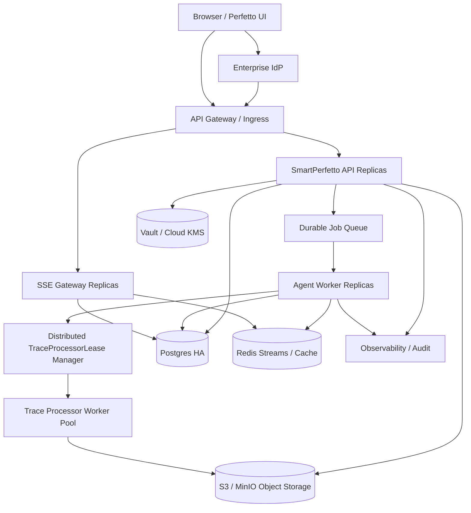

# SmartPerfetto 企业级多租户未来 HA 扩展附录

本文是 `README.md` 的附录。当前主线目标是约 100 人企业内部部署，优先使用单节点或少量节点方案。下面的 HA 形态只在规模、可用性或运维要求超过当前目标时启用。

## 1. 触发条件

考虑 HA 扩展前，应至少满足其中一个条件：

- API 或 Agent runtime 需要多副本无状态部署。
- 单节点 trace_processor pool 已不能承载并发 run。
- 企业要求数据库高可用、跨机房灾备或对象存储生命周期管理。
- 需要多 tenant 大规模隔离和独立运维配额。
- 当前 DB append-only event 表或进程内 queue 已成为瓶颈。

## 2. HA 目标架构

## 3. Adapter 替换关系

| 当前主线实现 | HA 替换实现 |
|---|---|
| SQLite WAL 或单 Postgres | Postgres HA |
| local fs `ObjectStore` | S3 / MinIO |
| encrypted local `SecretStore` | Vault / AWS Secrets Manager / GCP Secret Manager / Azure Key Vault |
| DB `agent_events` 表 | Redis Streams / NATS JetStream |
| in-process queue + DB shadow | NATS / SQS / BullMQ / Temporal |
| single backend process | API replicas + Agent workers + SSE gateway |
| in-process lease manager | DB/Redis backed lease manager |

## 4. 迁移原则

- 业务层只依赖 `ObjectStore`、`SecretStore`、`EventStream`、`JobQueue`、`LeaseStore` 接口。
- 当前主线不实现多套 adapter，避免把未来复杂度提前带入 100 人企业版。
- 切 HA 前必须完成数据迁移 dry-run、双写期、回滚演练和压测。
- trace_processor 仍以本地文件路径启动。即使 trace 存在对象存储，也要先 materialize 到 worker local cache。

## 5. 不变的隔离原则

HA 只改变组件部署形态，不改变业务不变量：

- RequestContext 必须贯穿所有服务。
- Owner guard 必须在资源读取前执行。
- ProviderSnapshot 不能保存明文 secret。
- TraceProcessorLease 必须覆盖 frontend、agent、report、manual register 四类 holder。
- 浏览器不能直连裸 trace_processor port。
- Memory/RAG/Case/Baseline 先按 tenant/workspace scope 过滤，再检索。
