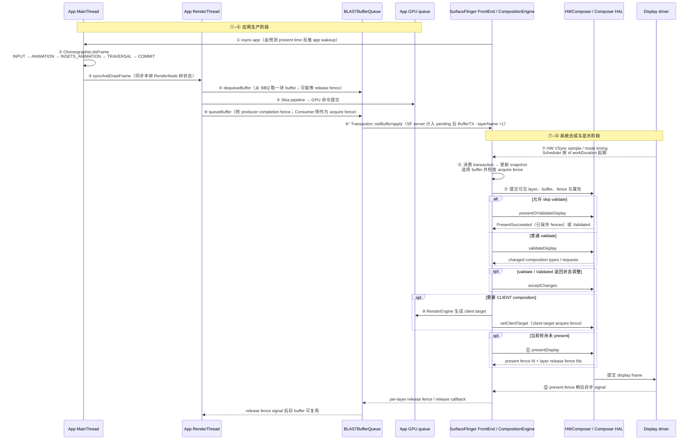

# Android Perfetto 系列 - App 出图类型 - 总览与识别方法

这篇给出 App 出图类型的公共基线：Producer 生成 buffer，SurfaceFlinger 采纳 layer 更新并组织合成，Hardware Composer（HWC）和显示设备完成 present。标准 App Window 的 Producer 位于应用进程；Camera、Video、WebView、Flutter、游戏等路径可能把生产工作交给引擎、解码器或硬件模块。

读 Perfetto 时，如果能认出 MainThread、RenderThread、SurfaceFlinger、HWC，却不确定它们在一帧中各自负责哪一段，就需要先建立这条显示路径。

这篇先把四个观察点固定下来：

- 知道标准 App Window 在显示链里主要扮演 **Producer**，而 SurfaceFlinger、HWC 与显示设备负责后续合成和 present
- 知道 `vsync-app`、MainThread、RenderThread、BLASTBufferQueue、SurfaceFlinger、HWC、Display 是怎样一环扣一环接起来的
- 知道 `queueBuffer`、`BufferTX - <layerName>` counter、`acquire fence`、`release fence`、`present fence` 分别处在路径的哪一段
- 知道以后在 Perfetto 上看到某个 App 的出图现象时，应该先问哪些问题、先看哪些层、先查哪些关键轨迹

<!--more-->

## 阅读导航


### 本文目录

- 阅读说明
- 1. 问题起点：为什么先建立显示主线
- 核心图：显示链路总图
- 2. 起帧阶段：一帧如何被 App 叫起来
- 3. 提交阶段：内容如何从 App 进入系统
- 4. 显示阶段：系统如何采纳、合成并送屏
- 5. 排查阶段：把标准路径转成检查顺序
- 6. 源码入口：优先跟读哪里
- 7. 版本演进：Android 12 到 Android 17
- 8. Perfetto 证据：按层观察一帧
- 9. 系列展开：后续文章按哪些分叉继续
- 10. 附录：易混淆概念对照表
- 总结

### 系列文章目录

1. [Android Perfetto 系列 - App 出图类型 - 总览与识别方法](S01_rendering_types_overview.md)
2. [Android Perfetto 系列 - App 出图类型 - AOSP 标准类型](S02_aosp_standard_type.md)
3. [Android Perfetto 系列 - App 出图类型 - SurfaceView 类型](S03_surfaceview_type.md)
4. [Android Perfetto 系列 - App 出图类型 - TextureView 类型](S04_textureview_type.md)
5. [Android Perfetto 系列 - App 出图类型 - 混合出图类型](S05_mixed_rendering_type.md)
6. [Android Perfetto 系列 - App 出图类型 - 多窗口类型](S06_multi_window_type.md)
7. [Android Perfetto 系列 - App 出图类型 - Software / 离屏类型](S07_software_offscreen_type.md)
8. [Android Perfetto 系列 - App 出图类型 - Native Graphics 类型](S08_native_graphics_type.md)
9. [Android Perfetto 系列 - App 出图类型 - WebView 类型](S09_webview_type.md)
10. [Android Perfetto 系列 - App 出图类型 - Flutter 类型](S10_flutter_type.md)
11. [Android Perfetto 系列 - App 出图类型 - Camera 类型](S11_camera_type.md)
12. [Android Perfetto 系列 - App 出图类型 - Video Overlay / HWC 类型](S12_video_overlay_hwc_type.md)
13. [Android Perfetto 系列 - App 出图类型 - Game 类型](S13_game_type.md)
14. [Android Perfetto 系列 - App 出图类型 - React Native 类型](S14_react_native_type.md)

## 阅读说明


作为整组文章的公共说明，这里先定义后续反复出现的对象、帧节奏和系统角色。

如果已经比较熟悉 Perfetto，这篇更像是在补“显示过程总图”；如果对工具还不熟，也没关系，因为本文先讲的是一帧怎样往前走，不要求先熟练操作界面。

后续 S02–S14 会分别分析不同出图类型；这里建立最常见的公共显示过程。平台源码固定到 Android 17 / API 37 的 `android-17.0.0_r1`，kernel 源码固定到 `android17-6.18-2026-06_r6`。S01 的主线位于 framework、HWUI、SurfaceFlinger 和 HWC，本篇没有依赖某个 kernel 函数得出结论；涉及 dma-buf、sync fence、DRM/KMS 等 kernel 实现时，仍以这个 kernel tag 为准。旧版本实现只用于解释概念演进。

## 1. 问题起点：为什么先建立显示主线


只按控件名或框架名记路径，到了 Perfetto 里仍然容易找错对象。`SurfaceView`、`TextureView`、`WebView`、`Flutter` 描述的是 API 或框架，不能直接回答“谁生产 buffer、buffer 进入哪个 Surface、是否形成独立 layer、由谁完成最终合成”。以 Flutter 为例，渲染视图可以使用 `SurfaceView` 或 `TextureView`，PlatformView 还会引入 Hybrid Composition、Texture Layer 或 Virtual Display 等不同路径。trace 里同时出现应用线程、引擎线程、BufferQueue、SurfaceFlinger 和 HWC；诊断要先确认本帧经过了哪些对象。

Perfetto 里会看到 `vsync-app`、MainThread 的 Input / Animation / Traversal、RenderThread 的 `DrawFrame`、BLASTBufferQueue 的 buffer 周转、SurfaceFlinger 的 transaction 与 composition，以及 HWC 和显示设备的 present。每个信号只说明一段工作发生过，不能单独证明用户已经看到这一帧。

比如：

- `queueBuffer` 已经发生了，画面却还是晚了一帧；
- 应用线程看起来不算忙，FrameTimeline 却已经偏了；
- 问题可能不在 GPU，而在 SurfaceFlinger 等待 buffer 或等待 present 的时机；
- App 已经“画完了”，但系统侧这一轮还没把它拿去合成。

总览篇先固定这些对象的位置和边界。后续分析不同出图类型时，再检查 Producer、Surface、layer 或合成位置从哪个节点开始变化。

## 显示链路总图


**这张图是本系列的基线参考。** 一帧从 App 觉得要更新，到 Android 显示栈可观察的 present 边界，会依次走过 12 个关键节点；后续 S02–S14 讲各种出图类型时，都会指出它在这 12 个节点里的哪一段偏离基线。这里的 present 边界不等于 panel 光学响应，也不等于用户视觉感知。



> 标准 App Window 路径下，**BLASTBufferQueue（BBQ）位于 App 进程**。RenderThread 通过 `Surface` 使用其 BufferQueue Producer；BLAST 的 Consumer 回调在同一进程取出 `BufferItem`，调用 `Transaction::setBuffer()` 并 `apply()`，再把 buffer update 送到 SurfaceFlinger。窗口几何或同步事务可以按 frame number 与这笔 buffer transaction 合并。Perfetto 中的 `BufferTX - <layerName>` counter 在 SurfaceFlinger server 侧收到 pending buffer update 后变化；`queueBuffer` 返回时不保证 counter 已经加一，counter 也不表示 position、crop、alpha 每帧都在改变。`SurfaceView` 等独立 Surface 还会增加自己的 layer 和 Producer，S03 会单独说明。

注意：本文圆圈编号是固定基线锚点。后续文章如果使用普通 `1.` / `2.` 的流程编号，那是各自场景里的叙述顺序，不和这里的 ①–⑫ 强制一一对应。`⑥'` 是紧贴 ⑥ 的服务端观测点，用来提醒 `BufferTX - <layerName>` 属于 SF server 侧 pending buffer 变化，不额外算成新的主锚点。正文后续把它简称为 `BufferTX` 时，仍指这条 per-layer counter。

### 图解 1：12 个主锚点

| 编号 | 节点 | 所属阶段 |
|:----:|------|---------|
| ① | `vsync-app` 触发 | 帧起点 |
| ② | `Choreographer.doFrame`（5 段 callback） | 主线程 |
| ③ | `syncAndDrawFrame`（UI 线程向 RenderThread 同步本帧树状态） | 主线程 / RenderThread 边界 |
| ④ | RenderThread `dequeueBuffer` | 生产 |
| ⑤ | Skia pipeline / GPU 提交 | 生产 |
| ⑥ | App / RT `queueBuffer` 到 BBQ，随 buffer 附上 producer completion fence；进入 Consumer / SF 侧后作为 acquire fence | 提交 |
| ⑥' | SF server 收到含 buffer 的 Transaction 并计入 pending，此时 `BufferTX - <layerName>` +1；latch 或 drop 后 -1 | 服务端观测点 |
| ⑦ | `vsync-sf` 触发 SF | SF 帧起点 |
| ⑧ | SF latch（检查 / 等待 acquire fence；特定条件可 latch unsignaled） | 合成 |
| ⑨ | HWC strategy：可 skip validate 时才尝试 `presentOrValidate`；PresentSucceeded 表示组合 HAL 调用走了 present 分支并返回 fence，Validated 进入 `getChangedCompositionTypes` / `acceptChanges`；否则走 `validateDisplay` slow path | 合成 |
| ⑩ | GPU client composition + `setClientTarget`（按需） | 合成 |
| ⑪ | `presentAndGetReleaseFences`：若 ⑨ 未在 fast path present，则 `presentDisplay`；随后收集 present / release fence fd | 显示 |
| ⑫ | 返回的 present fence 后续异步 signal，作为本轮显示栈 present 的时间锚点；它不等于 panel 像素完成光学响应 | 显示 |

### 图解 2：三条 fence 的流向

- **acquire fence**：Producer 提交 buffer 时会附上表示写入完成时机的 fence；Android 源码里的 `QueueBufferInput` / `BufferData` 在 Consumer / SF 侧把它称为 acquire fence。SF 用它判断 transaction / latch readiness，特定条件下可以 latch unsignaled buffer。读取 buffer 的 GPU / HWC 边界仍必须遵守这条 fence：device composition 时，layer acquire fence 会随 `setLayerBuffer()` 交给 HWC；client composition 时，RenderEngine 消费或等待原 layer 的输入 fence，随后 `setClientTarget()` 附带的是 client target 自己的 acquire fence，不是原 App layer 的那条 fence。标准 HWUI 路径里常见含义是 GPU 写入完成，Camera、Video、Native Graphics 等路径还可能来自解码器、Camera HAL、blitter 或其他硬件模块。
- **present fence**：HWC 在 ⑪ `presentDisplay()` 返回 per-display、per-frame 的 fence fd；如果走 `presentOrValidateDisplay()` fast path，只有 PresentSucceeded 分支才会返回 present fence，Validated 分支会继续 `getChangedCompositionTypes()` / requests / `acceptChanges()`，必要时完成 client composition 后再 present，不会再重复调用 `validateDisplay()`。这个 fd 会在后续 present 到达 Android 显示栈可观察边界时异步 signal。SF 用它回写和校准 present timing，App 侧通常通过 FrameTimeline、FrameMetrics、JankStats 或 Perfetto 观察这一帧的显示时间锚点。
- **release fence**：HWC 在 present 之后通过 `getReleaseFences()` 返回 per-layer、per-frame 的 fence fd，表示上一轮该 layer buffer 何时不再被 HWC 使用。SF 还会按 layer 是否 client-composited、是否仍在当前 output 上做 merge / fallback，再经 release callback / BufferQueue 回传给 Producer；RT 在 ④ 下一次 `dequeueBuffer` 时可能等这条 fence signal 后才复用旧 buffer slot。

这张图和这 12 个编号会被后续 13 篇反复引用。以后遇到具体类型时，先在心里对回这张图的哪一段，再看它的偏离处。

## 2. 起帧阶段：一帧如何被 App 叫起来


从 Android 图形系统的角度看，App 这一半负责的是**按显示节奏把这一帧生产出来**，最终显示的拥有者是 SurfaceFlinger 与显示硬件。生产过程分四个阶段：

1. 发现这一帧有必要更新；
2. 等系统给一个合适的起跑点，也就是 `vsync-app`；
3. MainThread 把这一帧的逻辑状态准备好；
4. RenderThread 或等价生产线程承接这一帧的状态，通过 Skia pipeline 把绘制命令提交给 GPU，再把图形结果交给 buffer 系统。

### 起帧 1：状态变化先进入下一帧调度

应用不会无缘无故每一帧都进入下一帧调度。通常是发生以下事件之后，应用才会进入“下一帧需要更新”的状态：

- 用户有输入；
- 某个动画还在跑；
- 某个 View 调用了 `invalidate()`；
- 某个布局发生变化，需要重新 measure / layout / draw；
- 窗口属性、Insets、可见性、尺寸发生变化。

这一步通常落在 `ViewRootImpl.scheduleTraversals()` 或相关回调调度上。Android 17 中，它会在尚未安排 traversal 时把 `mTraversalCallback` 注册到 `Choreographer.CALLBACK_TRAVERSAL`，再由 `Choreographer` 在没有 pending frame 的情况下请求下一次 VSync。`invalidate()` / `requestLayout()` 触发的是“把工作安排到后续帧”，不是每次调用都无条件申请一份新的 `vsync-app`。

### 起帧 2：`vsync-app` 从系统调度走到 App 进程

对应用来说，可观察到的是 SurfaceFlinger 体系整理后的应用侧 Vsync 事件。可以按这个顺序理解：

1. 显示硬件或者系统的 Vsync 预测逻辑给出下一次显示帧节奏；
2. SurfaceFlinger 的 Scheduler 依据预测 present time、app `workDuration` 和 `readyDuration` 反推出应用侧 wakeup time，通过 `EventThread` 把 `vsync-app` 回调给订阅者（`DisplayEventReceiver`）；
3. 应用进程里的 `DisplayEventReceiver` / `FrameDisplayEventReceiver` 通过系统侧的事件通道和 Looper 机制接到这个事件；
4. `FrameDisplayEventReceiver.onVsync()` 再把这次 Vsync 包装成主线程要处理的消息；
5. 主线程进入 `Choreographer` 的 `doFrame()`（Perfetto 中对应的 slice 名是 `Choreographer#doFrame`），这一帧正式开始。

这里容易看岔：Perfetto 里 SurfaceFlinger 进程的 `vsync-app` counter 在跳，不代表目标 App 已经开始跑这一帧。对具体 App，直接看它自己进程里的 `Choreographer#doFrame` slice 和后续回调。

### 起帧 3：MainThread 先整理输入、动画和布局状态

主线程 Input、Animation、Traversal 这几个阶段要看成一条自然的准备链，而不是互相独立的步骤。

`Choreographer` 在每一个 `vsync-app` 周期里按 callback 类型组织本帧工作。完整顺序是 **`CALLBACK_INPUT` → `CALLBACK_ANIMATION` → `CALLBACK_INSETS_ANIMATION`（Android 11+ 新增，处理系统栏 / 键盘动画）→ `CALLBACK_TRAVERSAL` → `CALLBACK_COMMIT`**。

`INSETS_ANIMATION` 位于 Animation 之后、Traversal 之前，用于把 Input 和 Animation 引起的 Insets 变化合并后再交给 View 树。Vsync 到达后，输入、动画和 Insets 状态会先推进，随后才进入 measure / layout / draw。布局和绘制必须建立在本帧已经确认的用户意图和 UI 状态上。

#### 第一步：Input

如果这一帧前面有触摸、滑动、按键等输入，主线程会先把这一帧该消费的输入处理掉。为什么它必须排在前面？因为输入会直接改变当前 UI 的状态。

比如列表正在跟手滑动，如果这一帧先去 layout，再回头处理输入，位置就会晚一帧。系统把 Input 放在前面，就是为了让这一帧后续的动画、布局、绘制都能基于**最新状态**来做。

普通输入事件本身通过 `InputChannel` / `InputConsumer` 异步送到 UI 线程，并不排队等 Choreographer。`CALLBACK_INPUT` 主要负责 **batched motion events 的帧同步消费 / 重采样**——`ViewRootImpl.scheduleConsumeBatchedInput()` 把 `mConsumedBatchedInputCallback` 注册到 `Choreographer.CALLBACK_INPUT`，随后 `doConsumeBatchedInput()` 调用 `InputEventReceiver.consumeBatchedInputEvents(frameTimeNanos)`，把同一帧内到达的一连串 `ACTION_MOVE` 重采样到本帧精确的 vsync 时刻。普通输入队列仍由 `scheduleProcessInputEvents()` / `doProcessInputEvents()` 异步处理。所以说“Input 排在最前面”，指的是帧同步的 batched input 这一刻，不是说所有输入都要在这里排队。

#### 第二步：Animation

动画阶段根据本帧时间推进属性值、滚动位置或其他连续状态。输入处理排在它前面，因此动画回调可以基于本帧已经消费的输入更新目标。属性动画、`OverScroller` 驱动的惯性滚动以及通过 `postOnAnimation()` 注册的工作，都会在这一阶段出现；没有到期的 Animation callback 时，UI 状态保持不变，不会凭空多做一轮动画计算。

#### 案例：按压滑动与惯性滑动的 callback 差异

初学者常疑惑：为什么列表在手指按住拖动时，这一帧里经常能看到 Input；手一松进入 fling，Input 很快没了，画面却还在继续动。原因是驱动源已经变了。

- 按压滑动：属于手指还在屏幕上的 manual scroll。`ACTION_MOVE` 会先在 Input 阶段被消费，`RecyclerView` 或外层滚动容器根据最新触点计算偏移，再触发 `invalidate()` 或后续布局请求。这一帧的位移源头来自输入。
- 惯性滑动：手指抬起后，不再有新的 `ACTION_MOVE`。列表还能继续动，是因为 `OverScroller` / `Scroller` 这一类对象在 Animation 阶段继续根据速度和阻尼算本帧位移，再触发 `invalidate()`。这一帧的位移源头已经从输入切到动画。

这件事在 Perfetto 上特别重要。手指按住拖动时，通常会先看到 Input 相关 slice；进入 fling 之后，Input 可能很快变轻甚至消失，持续推进位移的是 Animation。如果忽略这个阶段切换，很容易把正常 fling 误看成异常后台任务——列表继续动不需要 Input Callback，驱动源已经切到 Animation。

Input → Animation → Traversal 的顺序让同一帧先消费最新输入，再推进动画状态，随后按更新后的状态布局和绘制，减少输入到画面的额外帧延迟。

#### 第三步：Traversal

Traversal 把 View 树的待处理状态整理成 RenderThread 可以继续消费的绘制状态。三个动作存在依赖关系：

- `measure`：父 View 通过 `MeasureSpec` 给出约束，子 View 返回测量宽高。文字换行、图片尺寸、Insets 变化和父容器约束都可能触发重新测量。
- `layout`：父 View 根据测量结果确定子 View 的 `left`、`top`、`right`、`bottom`。命中测试、裁剪和后续绘制会使用这些几何结果，但 z-order、透明度等属性并不都由 `layout()` 决定。
- `draw`：软件渲染会直接写入目标 Canvas；标准硬件加速路径主要更新 View 对应的 `RenderNode` / DisplayList。这里记录“画什么”，像素工作仍由后续 RenderThread 和 GPU 完成。

尺寸确定后才能放置坐标，绘制记录又依赖最终几何关系，因此顺序固定为 `measure → layout → draw`。这不表示每个 `vsync-app` 都会完整重算整棵树：`performTraversals()` 会根据 layout request、dirty region 和节点状态决定哪些工作需要执行，未变化的 `RenderNode` 可以复用已有 DisplayList。Traversal 耗时不能只用 View 数量解释，还要看本帧哪些子树失效、是否触发重新布局以及录制范围。

#### Traversal 之后：syncAndDrawFrame 交接

在 `CALLBACK_TRAVERSAL` 执行栈末尾，UI 线程通过 `syncAndDrawFrame()` 向 RenderThread 同步本帧状态，RenderThread 上可看到 `DrawFrame` slice。UI 线程会等待 `DrawFrameTask` 完成必要的状态同步；能否在实际 draw 前提早放行，取决于 `syncFrameState()` 返回的条件。这个等待不会持续到 panel 显示完成。

### 起帧 4：RenderThread 把树状态变成 GPU 工作

标准 HWUI 路径里，主线程完成 `Traversal` 后进入 `ViewRootImpl.performDraw()`，调用 `HardwareRenderer.draw()`（`ThreadedRenderer` 继承自它，仍在 UI 线程执行）。`draw()` 内部先更新 root `RenderNode` 的 DisplayList，再通过 `syncAndDrawFrame()` 入口下发；native 侧经 `RenderProxy` 把 `DrawFrameTask` 投递到 RenderThread。这里最重要的结论是：**`syncAndDrawFrame` 是 UI 线程向 RenderThread 交接本帧状态的入口，不等于这一帧已经开始上屏。**

可以按四个步骤观察 `RenderThread` 的工作流程。

#### 第一步：帧状态同步

`DrawFrameTask` 被投到 `RenderThread` 后不会立刻调用 `queueBuffer`。`syncFrameState()` 先把本帧的 `vsync`、`frameDeadline` 等 frame info 交给 RenderThread，应用 deferred layer update，再调用 `CanvasContext::prepareTree()` 处理当前 `RenderNode` 树。完成这一步后，RenderThread 才知道本帧能否绘制、使用哪份节点状态以及哪些纹理或 layer 需要更新。

`syncAndDrawFrame` 里的 `sync`，指的是**把 UI 线程算好的帧状态同步到 RenderThread 能继续处理的位置**，不是同步到屏幕。

#### 第二步：UI 线程的阻塞与放行边界

这个边界容易误判。AOSP 在 `ThreadedRenderer` 注释里写得很直白：UI thread 可以 block 在 RenderThread 上，但 RenderThread 不能反过来 block UI thread。对应到 `DrawFrameTask` 的实现，主线程先 `postAndWait()`；RenderThread 跑完 `syncFrameState()` 之后，如果这一帧允许提早放行 UI thread，就会先 `unblockUiThread()`，否则会等 draw 阶段结束后再放行。**UI thread 等多久，取决于这一帧的同步条件，不是固定只等某一个函数返回。**

Perfetto 里的 `syncAndDrawFrame` 表示 UI 线程与 RenderThread 的同步边界。绘制执行、GPU command submission 和 buffer 提交还会继续发生，不能用这个 slice 的结束时间代替 App frame 完成时间。

#### 第三步：绘制执行与 GPU 提交

状态同步完之后，`CanvasContext::draw()` 才进入绘制执行与提交阶段。这里可以粗略抓四件事：

1. 计算 dirty 区域，确认这一帧有没有内容需要画；
2. 准备当前 frame / surface 等绘制目标；
3. 调用 render pipeline 的 `draw(...)`，把 `RenderNode` 树对应的命令下发到 GPU；
4. 在 `draw()` 的后半段进入 `swapBuffers(...)`，并把这一帧的 `DequeueBufferDuration` / `QueueBufferDuration` 记进 frame info。

这一步才对应“RenderThread 在画”。它吃的是主线程前面准备好的树状态和录制结果，不是重新帮主线程做一次 layout / draw。前面 Java/UI 线程负责把“该画什么”整理清楚，这里负责把它变成 GPU 和 buffer 系统可以消费的工作。

#### 第四步：`queueBuffer` 的位置与含义

RenderThread 向 GPU 提交命令后，如果本帧产出新内容，`queueBuffer` 会作为 Producer 侧的 buffer 提交点出现。它表示 buffer 已进入后续消费流程，不表示用户已经看到。

CPU 侧 `queueBuffer` 返回时，GPU 仍可能继续写入。Consumer 何时能安全读取由 acquire fence 约束；本帧是否被 SurfaceFlinger 采纳、何时 present，还要继续检查 transaction、latch、HWC 和 present fence。

在 Perfetto 上快速判断 RenderThread 这一段有没有出问题，建议按这个顺序看：

- `syncAndDrawFrame` 这一帧是不是已经明显晚了；
- RenderThread 上的绘制执行阶段是在耗 GPU / swap，还是已经卡到 buffer 相关等待；
- 这一帧对应的 `queueBuffer`、`DequeueBufferDuration`、`QueueBufferDuration` 有没有异常；
- 如果 App 侧已经按时把 buffer 交出去，就继续检查 `BufferTX - <layerName>`、latch、SurfaceFlinger actual slice 和 present timing。

### 起帧 5：持续进入下一帧调度才能形成连续帧

因为渲染是一个按帧节奏推进的循环。只要以下任何一件事还在持续，应用就还需要下一帧：

- 输入流还没结束；
- 动画还没结束；
- 还有未处理完的布局 / 重绘请求；
- 这一帧提交后，还要继续准备下一帧。

连续动画、输入或重绘请求需要继续注册下一帧工作，Choreographer 才会在后续 VSync 周期再次唤醒应用。Android 17 的 `Choreographer.scheduleFrameLocked()` 用 `mFrameScheduled` 合并同一个 pending frame 的重复请求，避免一次状态变化触发多份 VSync 申请。

## 3. 提交阶段：内容如何从 App 进入系统


如果说 MainThread 和 RenderThread 负责“把这一帧做出来”，那 `Surface`、`BufferQueue`、`Layer` 负责的就是“把这份结果送到系统能理解的位置上”。这三个词经常被混着说，需要分别看。

### 提交 1：`Surface` 是 Producer 侧的输出口

对应用来说，它最直接面对的是 `Surface` 或 `ANativeWindow` 这一类对象。RenderThread 也好，游戏引擎也好，视频解码器也好，最终都要把自己的图形结果写到某个输出目标里。这个输出目标就是 Producer 这一侧看到的接口。

### 提交 2：`BufferQueue` 负责内容周转

`BufferQueue` 负责把 Producer 和 Consumer 接起来。最经典的四个动作就是：

1. `dequeueBuffer`：Producer 取一个当前可写的 buffer；
2. Producer 往这个 buffer 里填内容；
3. `queueBuffer`：Producer 把填好的 buffer 重新挂回队列；
4. `acquireBuffer` / `releaseBuffer`：Consumer 取走它、用完它，再把它释放回去。

`dequeueBuffer` 决定本次写入哪一块内存，`queueBuffer` 把已填充的 buffer 交回队列，等待 Consumer 消费。

### 提交 3：BufferQueue 传递 buffer 引用、元数据和同步信息

`queueBuffer` 不会通过 Binder 把整帧像素复制到 SurfaceFlinger。BufferQueue 传递 buffer slot、`GraphicBuffer` 引用、acquire fence、crop、transform、dataspace、时间戳等信息；已经缓存过的 buffer 还可以只引用既有 slot 或 buffer id。

`GraphicBuffer` 背后的内存由 gralloc 分配，对 framework 来说，native handle 的内部布局是不透明的。Android 设备的常见 Linux 实现会在 handle 中携带可共享的 dma-buf fd，让 GPU、显示控制器、视频或 Camera 硬件访问同一份分配；具体 handle 字段和硬件访问方式由 gralloc 与 vendor 实现决定，不能把 dma-buf 当成 framework API 契约。

这条路径可以按四步观察：

1. Producer 通过 `dequeueBuffer` 拿到一个可写的 `GraphicBuffer`；
2. RenderThread / GPU / 解码器把结果写进这块 buffer；
3. `queueBuffer` 提交 slot、fence 和本帧元数据；首次出现或缓存失效时，还要传递可导入的 buffer handle；
4. Consumer 导入或复用该 buffer，并在 acquire fence 满足后访问内容。

工程里常说的“零拷贝”通常指这段传递没有逐层复制整帧像素，不代表端到端永远只有一块 buffer。`TextureView` 会把内容作为纹理采样进宿主窗口；离屏渲染、截图、格式转换和 SurfaceFlinger client composition 都可能分配新的输出 buffer，增加一次采样或合成。判断成本时要区分“BufferQueue 没有复制像素”和“整条显示路径没有额外合成”。

共享图形内存还需要明确读写顺序。`GraphicBuffer` / native handle 标识要访问哪份分配，fence 标识这份分配何时可读、何时可复用。两类信息缺一不可。

### 提交 4：BLAST 把 buffer 和窗口状态绑成同一笔事务

标准 App Window 中，`queueBuffer` 先把 buffer 放回应用进程内的 BufferQueue。BLAST 的 `onFrameAvailable()` 随后通过 `acquireNextBufferLocked()` 获取 `BufferItem`，调用 `Transaction::setBuffer()` 写入 buffer、acquire fence、frame number 和 release callback，再把 transaction 送到 SurfaceFlinger。需要与窗口几何同步的 transaction 可以按 frame number 合并。

这也是为什么现在看标准 App Window，不能只盯 `queueBuffer`。因为系统关心的不只“有没有新 buffer”，还包括：

- 这个 buffer 对应哪个 Layer；
- 这次窗口有没有位置、尺寸、crop、alpha、可见性变化；
- 这些变化是不是要和 buffer 一起生效。

### 提交 5：buffer 数量变化暴露生产和消费速度差

App 侧和 SF 侧都可能出现 buffer 数量或 pending 状态信号。它们位于不同队列，不能只看数值相似就当成同一个 counter。生产速度、Consumer 采纳速度、fence readiness 和最大可获取 buffer 数共同决定是否出现积压或 Producer 等待。

- 如果可用 buffer 长期很少，Producer 可能更容易卡在 `dequeueBuffer`；
- 如果 `BufferTX - <layerName>` 长期偏多，说明 SF server 已收到多笔 buffer update，但 latch 或 drop 没有及时消化；
- 如果 App 这边看起来已经 `queueBuffer` 很多次了，SF 那边却没有对应采纳，往往说明问题已经进入系统侧节奏。

这类 counter 用来定位生产与消费的节奏差，不能单独给出根因。还要结合 frame token、acquire fence、latch reason 和 SurfaceFlinger actual slice 判断。

### 提交 6：`Layer` 是系统侧的显示对象

应用提交的是 buffer 和层状态 transaction，SurfaceFlinger 按 layer 组织屏幕上的合成对象。Android 17 的 FrontEnd 先把 transaction 合入 `RequestedLayerState`，再为当前帧生成 `LayerSnapshot`；CompositionEngine 使用 snapshot 描述的可见性、几何、z-order、buffer 和效果状态准备输出。对系统来说，要回答的问题包括：

- 这个 layer 现在是不是可见；
- 它的几何关系怎样；
- 它在兄弟层里排第几；
- 它这一帧有没有新的 buffer 和新的事务一起到来；
- 最终它该不该参与本轮合成。

应用侧诊断常从 thread、slice、buffer 开始；进入 SurfaceFlinger 后，观察对象变成 layer、transaction、snapshot、output 和 fence。跨过这个边界仍只盯应用线程，会漏掉系统侧的等待与合成决策。

## 4. 显示阶段：系统如何采纳、合成并送屏


SurfaceFlinger 按显示节奏接收 transaction、更新层状态、构建本帧 snapshot，并让 CompositionEngine 为各个 display 生成输出。buffer 只是其中一种 layer 更新；窗口几何、可见性、层级、颜色空间和显示策略也会影响本轮合成。

### 显示 1：SurfaceFlinger 先接收事务和 layer 状态

App 这一侧把窗口几何、layer 属性、buffer 更新通过事务一路送过来之后，SurfaceFlinger 会先把这些变化收进来。对标准窗口来说，这一步里既可能有位置、裁剪、透明度变化，也可能只有 buffer 变化。

Perfetto 上的 transaction 相关 slice 和 `BufferTX - <layerName>` counter 可以确认服务端何时收到更新。这条 counter 专门统计 pending buffer transaction，不是所有 layer 属性 transaction 的总数，也不表示本轮合成已经完成。

Android 17 的 `Layer.h` 对这个 counter 给出了明确语义：

- 含 buffer 的 transaction 到达 server 并计入 pending 后，counter 上升；
- buffer 被 latch 或 drop 后，counter 下降；
- 长期偏高，说明到达 server 的 buffer update 没有及时 latch 或 drop，需要继续查 acquire fence、backpressure 和 SF 帧节奏；
- 长期接近 0 只能说明 server 侧没有积压。若仍 miss deadline，要再看 App 是否晚提交、FrameTimeline token 是否匹配，以及显示后段是否超时。

### 显示 2：`acquire fence` 决定 buffer 是否可读

共享 `GraphicBuffer` 只解决“访问哪份图形内存”，不解决读写先后顺序。SurfaceFlinger、RenderEngine 或 HWC 要靠 fence 判断何时可以读取。

`queueBuffer` 发生，不等于 SurfaceFlinger 这一帧就一定能把它拿来合成。因为“buffer 到了”和“buffer 已经可以安全读”是两件事，中间隔着 fence。

Producer 提交 buffer 时随附表示写入完成时机的 fence；Consumer 把它作为 acquire fence 使用。Consumer 可以在 CPU 上等待 fence signal，也可以把 fence 继续交给后续 GPU / HWC，让读取方在硬件流水线上等待。标准 HWUI 路径里它通常表示 GPU 写入完成；Camera、Video、Native Graphics 等路径还可能由解码器、Camera HAL、blitter 或其他硬件 Producer 创建。

RenderThread 发出 GPU 命令后，GPU 可能仍在写入 buffer。CPU 侧的 `queueBuffer` 只表示提交动作返回；没有 fence 约束，Consumer 可能读取到尚未完成的内容。

### 显示 3：latch 把可读 buffer 挂到本轮合成

`latch` 把某层的新 buffer 采纳为本轮合成输入。若 transaction 尚未 ready、acquire fence 不满足策略条件或该 buffer 被 backpressure 挡住，本轮会继续使用旧内容或等待后续帧处理。

Android 13+ 支持在受限条件下 latch unsignaled buffer，不必在 transaction readiness 阶段等待 acquire fence signal。

这个机制在 AOSP 文档里叫 **latch unsignaled buffer**，由 `debug.sf.auto_latch_unsignaled` 选择策略。Android 17 的 `transactionReadyBufferCheck()` 会调用 `shouldLatchUnsignaled(...)`：transaction 必须只更新一个 layer；AutoSingleLayer 模式还要求它是队列中的第一笔 transaction，并且调度器没有使用 early VSync 配置；`RequestedLayerState::isSimpleBufferUpdate()` 也必须通过。满足这些条件时，readiness 会标成 `NotReadyUnsignaled`，`Layer::fenceHasSignaled()` 允许先 latch。RenderEngine 或 HWC 读取 buffer 时仍要遵守 acquire fence。这个优化把等待位置移到更靠后的硬件边界，没有取消同步约束。

### 显示 4：合成阶段按显示节奏组织所有 layer

SurfaceFlinger 不会因为某个 App 刚刚交了 buffer，就马上单独为它合成一次。它是按自己的显示帧节奏来工作。到了这一帧，它会看：

- 哪些 layer 当前可见；
- 哪些 layer 这次有新内容；
- 哪些 layer 几何状态有变化；
- 这批 layer 最终怎样组合更合适。

这也解释了一个常见现象：应用侧很早就结束了，但最终画面还是晚了一帧——系统这一帧来不及或者不适合把它拿进去。

### 显示 5：应用侧和系统侧提前量共同决定 deadline

Android 17 的 Scheduler 以预测 present time 为目标，根据 app 与 SurfaceFlinger 各自的 `workDuration`、`readyDuration` 安排唤醒时间。旧资料常用 `app offset`、`sf offset` 描述相对硬件 VSync 的固定相位；读 Android 17 源码和 trace 时，应使用预测 present time 与工作预算来理解。

- App 的 wakeup time 要为主线程、RenderThread、GPU 写入和 buffer post 留出时间；
- SurfaceFlinger 的 wakeup time 要为 transaction flush、latch、composition strategy、必要的 GPU composition、HWC 和显示后段留出时间。

某个阶段完成得早，不保证它赶上目标 present。诊断时要把 actual timeline 与 expected timeline 对齐，确认超时发生在 App、SurfaceFlinger CPU、SurfaceFlinger GPU 还是 DisplayHAL。

### 显示 6：HWC 决定 device composition 还是 client composition

HWC 负责决定本轮各个 layer 的合成方式：**哪些能直接交给显示硬件处理（device composition），哪些必须退回给 GPU（client composition）。**

SF 与 HWC 会协商每个 layer 的 composition type。Android 17 不保证每帧都先调用独立的 `validateDisplay()`；`HWComposer::getDeviceCompositionChanges()` 会根据本轮是否已有 client composition，以及设备是否支持 expected present time 等条件判断能否 skip validate：

1. SF 设置 layer buffer、composition type、crop、transform、dataspace、blend、z-order；
2. SF / CompositionEngine 准备 composition strategy；只有 `canSkipValidate` 成立时，HWC 侧才会尝试 `presentOrValidateDisplay()`；
3. 如果 fast path 已经 present 成功，HWC 会返回 present fence，并在同一轮收集 release fences；
4. 如果 `presentOrValidateDisplay()` 返回 Validated，validate 已经在这个 HAL 调用里完成，SF 继续读取 changed composition / requests，再用 `acceptChanges()` 接受 HWC 改动；
5. 如果本轮不能 skip validate，SF 才用 `validateDisplay()` 让 HWC 评估当前 layer 集合，再读取 `getChangedCompositionTypes()` / requests 并 `acceptChanges()`；
6. 如果存在 `CLIENT` layer，RenderEngine / GPU 生成 client target；
7. `setClientTarget()` 把 client target buffer 和 acquire fence 交给 HWC；
8. `presentAndGetReleaseFences()` 收尾：如果前面还没有 present，就调用 `presentDisplay()`，再收集 per-display present fence 和 per-layer release fence。

HWC 能力与 vendor 策略通常会评估这些条件：

- 有没有透明混合；
- 有没有旋转、缩放、裁剪；
- 有没有受保护内容；
- 有没有视频、字幕、控制层同时叠加；
- 这一帧适不适合直接交给显示硬件处理。

条件合适的 layer 直接走 hardware composition；条件不合适的，SurfaceFlinger 用 GPU 把它们合成到 client target buffer，再通过 `setClientTarget()` 交回 HWC 做 present。同一组 layer 走哪条路径，每一轮都会重新判断。`presentOrValidateDisplay()` 只有在可 skip validate 时才会尝试：PresentSucceeded 分支返回 present fence；Validated 分支已经完成 validate，后面继续读取 changed composition / requests，并经过必要的 client composition / `setClientTarget()` / `presentDisplay()` 等收尾。

这也解释了一个常见现象：应用侧没明显变重，系统侧功耗和时延却突然抬起来。问题不一定是“谁突然画慢了”，也可能只是 HWC 这一轮判断：这批 layer 条件不合适，得把更多工作退回给 GPU。

FrameTimeline 的 SurfaceFlinger actual slice 从 SF 主线程开始工作延伸到 on-screen update，包含 Composer 和 DisplayHAL 等 SF 以下的显示栈时间。它比 SurfaceFlinger 主线程 CPU slice 更宽：device composition 可能让主线程阻塞在 HAL 调用里；client composition 的 GPU 工作可与 CPU 并行；DisplayHAL 还可能在 SF 已按时提交后错过目标 VSync。分析系统侧 jank 时，应结合 `SurfaceFlingerCpuDeadlineMissed`、`SurfaceFlingerGpuDeadlineMissed`、`DisplayHAL` 等分类，不要把整段 actual duration 都归因于 SF 主线程。

HWC 决策会直接改变 GPU 负载、overlay 使用、受保护内容路径和显示功耗。视频、AOD、高刷与低功耗场景都要结合这一层分析。

### 显示 7：`present fence` 定位最终送显边界

`acquire fence` 回答 buffer 何时可读，`present fence` 提供这一轮 display present 的完成时间。AOSP 把它作为 SurfaceFlinger 与 HWC 之间的 per-display、per-frame 同步对象；FrameTimeline 也用显示反馈判断 actual present。这个时间仍不等于 panel 像素完成光学响应或用户形成视觉感知。

App 已提交、SurfaceFlinger 已组织合成，都不等于这一轮 present fence 已经 signal。present fence 更接近本次显示输出完成的系统时间锚点；分析显示端延迟、高刷抖动和视频播放不稳时，它比 `queueBuffer` 提供了更靠后的时间证据。

HWC 返回的两类 fence 也要分开：

- **Present fence**（`presentDisplay()` 返回，或 `presentOrValidateDisplay()` 的 PresentSucceeded 分支返回，per-display、per-frame）：回答“**这一整轮 present 什么时候越过系统显示边界**”，是显示时序分析的关键锚点；
- **Release fence**（`getReleaseFences()`，per-layer、per-frame）：回答“**上一帧用的那块 buffer 什么时候可以被 Producer 安全复用**”。它告诉 SF / BufferQueue 把旧 buffer 回收给 App 的时机。

分析 present timing 用 present fence，分析“App 的 buffer 何时能 dequeue 回来、dequeueBuffer 为什么一直等”则看 release fence。两者都叫 fence、都从 HWC 返回，但方向相反、粒度不同，不能混着用。

SurfaceFlinger 还会使用 present fence 的反馈更新时间统计、FrameTimeline 与后续调度判断。因此它既是 trace 中的显示时间锚点，也是系统内部的 present timing 输入。

当 `queueBuffer` 和 latch 都按时，actual present 仍持续偏晚时，排查重点应移到 SurfaceFlinger composition、HWC、DisplayHAL、显示模式切换和调度预测。仅凭 present fence 不能再细分这些原因，还需要 SF slice、FrameTimeline jank type、HWC/DRM tracepoint 或厂商显示轨迹。

### 显示 8：进入 Display Driver 与 Panel

到了显示控制器和 Panel 这一层，系统关心的是**这份最终结果如何从 Android 显示栈继续进入设备显示后段**。

三个时刻要分开：

1. 应用提交 buffer；
2. SurfaceFlinger / HWC 完成这一轮系统侧准备；
3. Panel 把这一帧显示给用户。

这三个时刻经常不会重合。部分看上去像“应用卡了一帧”的问题，会定位到 HWC、DisplayHAL、driver 或 panel 侧。

Panel 还有扫描、刷新节奏、像素响应和可变刷新率策略。**系统已经准备好** 与 **用户已经看到** 之间仍有硬件显示过程，单靠 framework trace 不能覆盖全部光学延迟。

## 5. 排查阶段：把标准路径转成检查顺序

分析一帧时，要按阶段确认它走到了哪里。对初学者来说，最容易混淆的点包括：`vsync-app` 从哪里来，主线程完成了什么，`RenderThread` 和 GPU 是什么关系，`queueBuffer` 之后为什么还没显示，SurfaceFlinger 到底在等什么。

把前面的阶段压成一条检查顺序，可以这样读：

1. App 通过 `DisplayEventReceiver` 申请下一次 VSync，SurfaceFlinger Scheduler 使用 `VSyncTracker` / `VSyncDispatch` 的预测结果安排应用 wakeup，并由 EventThread connection 把事件送入 App；旧实现常用 `DispSync` 与 `app offset` 描述固定相位，不能直接套到 Android 17；
2. `Choreographer#doFrame` 在主线程按 `INPUT → ANIMATION → INSETS_ANIMATION → TRAVERSAL → COMMIT` 组织这一帧（`INSETS_ANIMATION` 在 Android 11+ 新增，落在 Animation 之后、Traversal 之前）；
3. `RenderThread` 把这一帧变成实际图形输出，并通过 `BLASTBufferQueue` / `queueBuffer` 提交出去；
4. buffer 带着 fence 进入 SurfaceFlinger，server 侧的 pending buffer 变化可以通过 `BufferTX - <layerName>` 观察；
5. SurfaceFlinger 按帧节奏决定何时 latch、何时合成，并与 HWC 协作决定最终显示方式；
6. `present fence` 和显示后段信号回答“这一帧到了哪个显示时间边界”。

按这个顺序对齐 `queueBuffer`、`BufferTX - <layerName>`、latch、`present fence` 与 FrameTimeline，可以确认本帧停在哪个阶段。


下面三组是基于 Android 17 源码整理的调用骨架，不是可编译代码，也没有展开错误处理和旁支。第一组用来确认 UI 线程从帧调度进入 HWUI 的位置。

```text
// Conceptual App UI path: Choreographer -> ViewRootImpl -> HWUI Java entrance
ViewRootImpl.scheduleTraversals()
    if (!mTraversalScheduled) {
        mChoreographer.postVsyncCallback(CALLBACK_TRAVERSAL, mTraversalCallback)
        notifyRendererOfFramePending()
    }

Choreographer.scheduleFrameLocked(now)
    if (!mFrameScheduled) {
        scheduleVsyncLocked()
    }

Choreographer.doFrame(frameTimeNanos, frame, vsyncEventData)
    doCallbacks(CALLBACK_INPUT)
    doCallbacks(CALLBACK_ANIMATION)
    doCallbacks(CALLBACK_INSETS_ANIMATION)
    doCallbacks(CALLBACK_TRAVERSAL)
        TraversalCallback.onVsync(frameData)
            ViewRootImpl.doTraversal(frameData.getFrameTimeNanos())
    doCallbacks(CALLBACK_COMMIT)

ViewRootImpl.doTraversal(frameTimeNanos)
    performTraversals(frameTimeNanos)
        performMeasure()
        performLayout()
        performDraw()
            ThreadedRenderer.draw(view, attachInfo, callbacks)
                HardwareRenderer.syncAndDrawFrame(frameInfo)
```

这组骨架把 `doFrame()` 的五段 callback 与 `syncAndDrawFrame()` 放在同一条 UI 线程栈上。`syncAndDrawFrame()` 是交给 RenderThread 的入口，不是 present 完成点。

第二组只保留 RenderThread 的状态同步、绘制与 buffer 提交，用来区分 UI 线程等待和 GPU 异步执行。

```text
// Conceptual HWUI RenderThread path: sync RenderNode tree -> draw -> submit buffer
RenderProxy::syncAndDrawFrame()
    DrawFrameTask::drawFrame()
        CanvasContext::prepareTree()
        CanvasContext::draw()
            // Skia OpenGL / Vulkan backend records and submits GPU work.
            // CPU submission can return before the buffer is safe to read.
            swapBuffers_or_queueBuffer(buffer, producerCompletionFence)
```

`CanvasContext::draw()` 会记录 `DequeueBufferDuration` 与 `QueueBufferDuration`。CPU 完成 command submission 或 `queueBuffer` 后，GPU 仍可能通过 producer completion fence 表示写入尚未完成。

第三组从 BLAST 的 buffer transaction 接到 SurfaceFlinger 与 HWC，用来区分 transaction readiness、latch 和 present。

```text
// Conceptual BLAST + SurfaceFlinger + HWC path: queue, transaction, latch, fences
Surface::queueBuffer(buffer, producerCompletionFence)
    BufferQueueProducer::queueBuffer(slot, QueueBufferInput{fence, ...})
    BLASTBufferQueue::onFrameAvailable(BufferItem)
        BLASTBufferQueue::acquireNextBufferLocked()
            Transaction::setBuffer(surfaceControl, buffer, acquireFence, frameNumber, ...)
            Transaction::apply()

SurfaceFlinger::setTransactionState()
    TransactionHandler::queueTransaction()

SurfaceFlinger::updateLayerSnapshots()
    TransactionHandler::collectTransactions()
    TransactionHandler::flushTransactions()
        transactionReadyBufferCheck()
        if (acquireFence is not signaled)
            wait_or_mark_NotReadyUnsignaled_when_latch_unsignaled_is_allowed()
    LayerLifecycleManager::applyTransactions()
    LayerSnapshotBuilder::update()
    Layer::latchBufferImpl()

SurfaceFlinger::composite()
    setLayerBuffer_and_layer_state()
    HWComposer::getDeviceCompositionChanges()
        if can_skip_validate:
            HWC2::Display::presentOrValidate()
            if PresentSucceeded:
                collect_present_fence_and_release_fences()
            else: // Validated; validate already happened in presentOrValidate
                getChangedCompositionTypes()
                acceptChanges()
        else:
            HWC2::Display::validate() / ComposerHal::validateDisplay()
            getChangedCompositionTypes()
            acceptChanges()
    if (compositionType == CLIENT)
        RenderEngine::drawLayers(...)
        HWComposer::setClientTarget(clientTarget, clientTargetAcquireFence)
    HWComposer::presentAndGetReleaseFences()
        if not_already_presented:
            HWC2::Display::present()
        HWC2::Display::getReleaseFences()
```

App 提交 buffer 只说明内容进入图形队列；`BufferTX - <layerName>` 记录 SF server 侧 pending buffer update；`acquire fence` 约束读取时机；`release fence` 约束旧 buffer 的复用时机；`present fence` 给出 display present 的时间反馈。这五个信号不能互相替代。

## 6. 源码入口：优先跟读哪里


这些入口覆盖 Java UI、HWUI、BLAST、SurfaceFlinger FrontEnd、CompositionEngine 和 HWC。链接全部固定到 Android 17 / API 37 的 `android-17.0.0_r1` tag。

- [`frameworks/base/core/java/android/view/Choreographer.java`](https://android.googlesource.com/platform/frameworks/base/+/android-17.0.0_r1/core/java/android/view/Choreographer.java)
  - 看 `scheduleFrameLocked()`、`scheduleVsyncLocked()`、`doFrame()`，确认 VSync 申请、`mFrameScheduled` 合并和五类 callback 顺序。
- [`frameworks/base/core/java/android/view/ViewRootImpl.java`](https://android.googlesource.com/platform/frameworks/base/+/android-17.0.0_r1/core/java/android/view/ViewRootImpl.java)
  - 重点看 `scheduleTraversals()`、`performTraversals(long frameTimeNanos)`、`performDraw()`、窗口 relayout 相关主线。
- [`frameworks/base/graphics/java/android/graphics/HardwareRenderer.java`](https://android.googlesource.com/platform/frameworks/base/+/android-17.0.0_r1/graphics/java/android/graphics/HardwareRenderer.java) 与 [`frameworks/base/core/java/android/view/ThreadedRenderer.java`](https://android.googlesource.com/platform/frameworks/base/+/android-17.0.0_r1/core/java/android/view/ThreadedRenderer.java)
  - Java 层进入 HWUI 的入口，看 `draw()` 如何更新 root `RenderNode` 再通过 `syncAndDrawFrame()` 下发。
- [`frameworks/base/libs/hwui/renderthread/RenderProxy.cpp`](https://android.googlesource.com/platform/frameworks/base/+/android-17.0.0_r1/libs/hwui/renderthread/RenderProxy.cpp)、[`DrawFrameTask.cpp`](https://android.googlesource.com/platform/frameworks/base/+/android-17.0.0_r1/libs/hwui/renderthread/DrawFrameTask.cpp)、[`CanvasContext.cpp`](https://android.googlesource.com/platform/frameworks/base/+/android-17.0.0_r1/libs/hwui/renderthread/CanvasContext.cpp)
  - 这一组能把 `syncAndDrawFrame`、RenderThread、GPU 提交这几步接起来；`CanvasContext::prepareTree()` 对应第一步的状态同步，`CanvasContext::draw()` 对应第三步的绘制执行与 `swapBuffers`。
- [`frameworks/native/libs/gui/BLASTBufferQueue.cpp`](https://android.googlesource.com/platform/frameworks/native/+/android-17.0.0_r1/libs/gui/BLASTBufferQueue.cpp)
  - 对照 `onFrameAvailable()`、`acquireNextBufferLocked()`、`Transaction::setBuffer()` 与按 frame number 合并 transaction 的逻辑。
- [`frameworks/native/services/surfaceflinger/FrontEnd/`](https://android.googlesource.com/platform/frameworks/native/+/android-17.0.0_r1/services/surfaceflinger/FrontEnd/)、[`Layer.cpp`](https://android.googlesource.com/platform/frameworks/native/+/android-17.0.0_r1/services/surfaceflinger/Layer.cpp)
  - FrontEnd 的 `RequestedLayerState`、`LayerLifecycleManager`、`LayerSnapshotBuilder` 解释 transaction 如何变成本帧 snapshot；`Layer.cpp` 可对照 `BufferTX - <layerName>`、latch 与 release callback。
- [`frameworks/native/services/surfaceflinger/SurfaceFlinger.cpp`](https://android.googlesource.com/platform/frameworks/native/+/android-17.0.0_r1/services/surfaceflinger/SurfaceFlinger.cpp)、[`CompositionEngine/`](https://android.googlesource.com/platform/frameworks/native/+/android-17.0.0_r1/services/surfaceflinger/CompositionEngine/)、[`Scheduler/FrameTimeline.cpp`](https://android.googlesource.com/platform/frameworks/native/+/android-17.0.0_r1/services/surfaceflinger/Scheduler/FrameTimeline.cpp)
  - 对照 `transactionReadyBufferCheck()`、`shouldLatchUnsignaled()`、composition、present feedback，以及 FrameTimeline 的 `SurfaceFrame` / `DisplayFrame` 打点位置。
- [`frameworks/native/services/surfaceflinger/DisplayHardware/HWComposer.cpp`](https://android.googlesource.com/platform/frameworks/native/+/android-17.0.0_r1/services/surfaceflinger/DisplayHardware/HWComposer.cpp)
  - 对照 `getDeviceCompositionChanges()` 中的 skip-validate 条件，以及 `setClientTarget()`、`presentOrValidate()`、`getChangedCompositionTypes()`、`acceptChanges()`、`presentAndGetReleaseFences()`。

S01 没有引用 kernel 函数。后续文章需要进入 dma-buf、sync_file、DRM/KMS 或调度器实现时，源码链接统一固定到 [`kernel/common android17-6.18-2026-06_r6`](https://android.googlesource.com/kernel/common/+/refs/tags/android17-6.18-2026-06_r6)。

固定 tag 源码之外，还可以看下面几篇滚动文档。它们用于补充概念，正文结论仍以 Android 17 的固定源码锚点为准：

- [SurfaceFlinger and WindowManager](https://source.android.com/docs/core/graphics/surfaceflinger-windowmanager)：确认 SurfaceFlinger 如何接收 buffer、metadata，以及只在显示刷新间隔采纳新 buffer 的边界。
- [Synchronization framework](https://source.android.com/docs/core/graphics/sync)：确认 acquire / release / present fence 的方向、粒度和 HWC 调用关系。
- [Implement Hardware Composer HAL](https://source.android.com/docs/core/graphics/implement-hwc)：确认 HWC 为什么能减少 GPU composition，以及 protected video、format、blend 等能力约束。
- [Unsignaled buffer latching with AutoSingleLayer](https://source.android.com/docs/core/graphics/unsignaled-buffer-latch)：确认 Android 13+ latch unsignaled buffer 的默认模式、系统属性和适用边界。
- [Android Jank detection with FrameTimeline](https://perfetto.dev/docs/data-sources/frametimeline)：确认 FrameTimeline 里的 App / SurfaceFlinger actual slice、Layer Name、GPU Composition、Jank Type 等观察口径。
- [PerfettoSQL standard library](https://perfetto.dev/docs/analysis/stdlib-docs)：确认 `actual_frame_timeline_slice`、`expected_frame_timeline_slice` 的字段语义。


## 7. 版本演进：Android 12 到 Android 17

这条公共显示主线从 Android 12 起讨论。Android 12 已经具备 BLAST、FrameTimeline、现代 SurfaceControl transaction 和 HWC2/HWC3 语义，足以覆盖仍有工程价值的设备。版本差异应落到具体对象和观测方法上，不能把系统大版本号直接当成性能结论。

| 平台 | 与公共显示主线相关的变化 | 对 Perfetto 判读的影响 |
|---|---|---|
| Android 12 / API 31 | BLAST 已成为 App Window / SurfaceView 的现代 buffer-transaction 基线；FrameTimeline 从 Android 12 起可用 | 可以用 app / SF expected、actual timeline 和 token 对齐标准窗口帧；独立 Surface 仍需额外 layer 与 BufferQueue 证据 |
| Android 13 / API 33 | `AutoSingleLayer` 模式下的 latch unsignaled buffer 成为默认策略 | “acquire fence 未 signal”不再必然表示 transaction readiness 阶段完全不能 latch；读取 buffer 前的同步依赖仍然存在 |
| Android 14 / API 34 | 公共的 Choreographer→HWUI→BLAST→SF→HWC 骨架没有需要重画的结构变化；SurfaceView 分支增加任意 alpha 与公开 lifecycle 策略 | 标准窗口仍按公共主线分析；涉及独立 Surface 的透明度和销毁/保留行为时，要把平台版本纳入判断 |
| Android 15 / API 35 | Window 与 SurfaceView 增加 desired HDR headroom 能力，显示策略可以接收更明确的 HDR/SDR 比例请求 | headroom 是期望值，不是 buffer 完成或显示亮度保证；HDR 问题还要结合 dataspace、bit depth、display 与 HWC 能力 |
| Android 16 / API 36 | 公共骨架继续沿用；SurfaceView 增加整数 `compositionOrder`，独立 layer 的相对层级表达更细 | 多 layer 页面需要记录完整 Z-order；标准 App Window 的 Producer/Consumer 边界未因此改变 |
| Android 17 / API 37 | 本系列当前锚点使用 FrontEnd `RequestedLayerState` / `LayerSnapshot`、预测 present time 与 work budget、现行 BLAST/HWC 流程；SurfaceView 另增加 blur region | 源码调用名按 Android 17 解释。看到旧资料中的 `DispSync`、固定 app/sf offset 或逐个旧 `Layer` latch 模型时，需要换回当前对象 |

### Android 12：现代 trace 基线

Android 12 的两个关键点是 BLAST 和 FrameTimeline。

BLAST 在应用进程侧把 BufferQueue 的新 buffer 组织成 `SurfaceComposerClient::Transaction`，使 buffer、frame number 与相关 layer 状态可以沿统一 transaction 边界进入 SurfaceFlinger。它没有把 Producer、Consumer 合成一个线程，也没有取消 acquire/release fence。

FrameTimeline 提供 App `SurfaceFrame` 与 SurfaceFlinger `DisplayFrame` 的 expected/actual 时间线，jank 的定义围绕预测 present time 展开。它适合标准 App Window；Perfetto 官方文档同时声明 SurfaceView 主体当前不受完整支持，所以总览中的 layer、BufferQueue、fence 和 HWC 证据仍不可省略。

### Android 13：latch unsignaled 改变等待位置

Android 13 起，官方文档把 `AutoSingleLayer` 作为 latch unsignaled buffer 的默认模式。满足单 layer、简单 buffer update、队列顺序和调度条件时，SurfaceFlinger 可以先采纳 buffer 状态，把 fence wait 推迟到靠近 RenderEngine 或 HWC 读取的位置。

这个变化影响 trace 解释：transaction 被 latch 与硬件写入完成是两个时间点。若只看到 latch 已发生就结束调查，会漏掉后面的 acquire fence wait；若只看到 fence 尚未 signal 就断言 SF 绝不可能 latch，也会与 Android 13 之后的实现不符。

### Android 14：公共骨架稳定，分支能力变化

对标准窗口的 Choreographer、HWUI、BLAST、SurfaceFlinger、HWC 主线，Android 14 没有引入需要改画总图的公开结构替换。这个版本更值得关注的是分支语义：SurfaceView 支持任意 alpha，并公开 visibility/attachment 两类 Surface 生命周期策略。

因此，同一个 trace 里公共 present 路径仍按本文分析；遇到 SurfaceView 半透明、前后台恢复或独立 Surface 重建问题时，再进入对应分支的版本规则。版本演进的目的在于缩小证据范围，不是让每个版本都强行对应一套新管线。

### Android 15：HDR headroom 进入独立请求

API 35 允许 Window 和 SurfaceView 表达 desired HDR headroom。这个比例描述期望的 HDR 白点相对 SDR 白点范围，系统仍会结合面板、环境、bit depth 和显示策略决定能否满足。

Perfetto 中即使看到请求已经提交，也不能据此判断最终 luminance、tone mapping 或 composition type。还要检查 buffer dataspace/HDR metadata、目标 display 状态以及 HWC/RenderEngine 的实际合成路径。

### Android 16：独立 layer 层级表达扩展

API 36 的 `SurfaceView.setCompositionOrder()` 用整数表达 SurfaceView 位于宿主上方或下方，以及 peer 之间的相对次序。它改变的是独立 layer 的组织能力，不改变标准 App Window 经过 HWUI、BLAST、SurfaceFlinger 和 HWC 的公共骨架。

分析多 Surface 页面时，应记录 layer parent、relative layer 和 composition order。只按 layer name 排序，无法证明最终 Z-order。

### Android 17：本文的当前实现

Android 17 的 SurfaceFlinger FrontEnd 以 `RequestedLayerState`、`LayerLifecycleManager` 和 `LayerSnapshotBuilder` 管理 transaction 状态与当前帧 snapshot；Scheduler 以预测 present time、`workDuration`、`readyDuration` 计算 App 与 SF 的工作窗口；HWC 路径允许在条件满足时用 `presentOrValidateDisplay()` 合并 validate/present 往返。

这些名字是本文源码 Review 的锚点，不代表每项机制都首次出现于 Android 17。版本首引必须回到对应 tag 或 API 文档确认，不能因为某段代码存在于 `android-17.0.0_r1` 就写成“Android 17 新增”。

### 固定版本源码与文档

- [Android 12 `BLASTBufferQueue.cpp`](https://android.googlesource.com/platform/frameworks/native/+/refs/tags/android-12.0.0_r1/libs/gui/BLASTBufferQueue.cpp) 与 [Perfetto FrameTimeline](https://perfetto.dev/docs/data-sources/frametimeline)：确认现代 buffer transaction 与 FrameTimeline 基线；
- [Android 13 unsignaled buffer latch](https://source.android.com/docs/core/graphics/unsignaled-buffer-latch)：确认 `AutoSingleLayer` 的默认版本和适用条件；
- [Android 14 `SurfaceView`](https://developer.android.com/reference/android/view/SurfaceView)：确认 arbitrary alpha 与 API 34 lifecycle；
- [API 35 `Window.setDesiredHdrHeadroom()`](https://developer.android.com/reference/android/view/Window#setDesiredHdrHeadroom%28float%29)：确认 Window HDR headroom 请求边界；
- [Android 16 `SurfaceView.java`](https://android.googlesource.com/platform/frameworks/base/+/refs/tags/android-16.0.0_r1/core/java/android/view/SurfaceView.java)：确认 composition order；
- [Android 17 SurfaceFlinger FrontEnd](https://android.googlesource.com/platform/frameworks/native/+/refs/tags/android-17.0.0_r1/services/surfaceflinger/FrontEnd/) 与 [Scheduler](https://android.googlesource.com/platform/frameworks/native/+/refs/tags/android-17.0.0_r1/services/surfaceflinger/Scheduler/)：确认本文当前对象和调用名。


## 8. Perfetto 证据：按层观察一帧


总览篇的观察顺序按主线分成四层：帧节奏是不是按时到、Producer 有没有按时产出、SurfaceFlinger 有没有采纳、最终显示是不是按期完成。

### 证据 1：先确定观察对象

1. **先看这条帧是不是先拿到了正确帧起点**
   看 `vsync-app`、`Choreographer#doFrame`、FrameTimeline 的开始点，确认 App 是不是一开始就起晚了。

2. **再看主线程和 `RenderThread` 有没有在自己的预算里做完事**
   重点看 `INPUT / ANIMATION / TRAVERSAL / COMMIT` 哪一段膨胀了，再看 `syncAndDrawFrame`、`queueBuffer` 有没有拖后。

3. **再看 buffer 到系统侧之后发生了什么**
   这里结合 `BufferTX - <layerName>`、latch、SurfaceFlinger actual slice，判断系统是在等新的 buffer、等 fence，还是没有及时消费 pending update。

4. **收尾看 fence、HWC、`present fence` 和最终显示节奏**
   这一步用来回答“内容明明已经交出去了，为什么用户还是晚看到”。

### 证据 2：再按阶段找重点线程

- App 侧先看 `main`，因为 `doFrame()` 的输入、动画、traversal 都在这里；
- 再看 `RenderThread`，因为标准路径里交给 GPU 和 `queueBuffer` 的是它；
- 系统侧至少要看 `SurfaceFlinger`，否则无法确认系统有没有按这一帧采纳；
- 遇到特殊类型时，再把引擎线程、解码线程、Camera 线程、Chromium 线程提到前面。

### 证据 3：用切片和特征定位阶段

- `vsync-app` / `Choreographer#doFrame`
- `INPUT / ANIMATION / INSETS_ANIMATION / TRAVERSAL / COMMIT`
- `syncAndDrawFrame` / `DrawFrame` / `queueBuffer`
- `BufferTX - <layerName>`、latch、SurfaceFlinger 合成相关事件
- FrameTimeline、`present fence`、必要时再看 HWC / VSync 节奏

### 证据 4：按顺序复原一帧

1. **先分型，再决定谁是当前路径的主 Producer**

   第一步是判断这条路径到底是标准窗口、独立 Surface、宿主再合成、系统侧直接拼层，还是更底层的引擎 / 硬件 Producer。分型之后再看具体线程和耗时。

2. **用 `vsync-app → doFrame → RenderThread → queueBuffer` 确认生产侧有没有按时完成**

   如果生产侧已经晚了，后续的系统侧很多时候只是被动暴露结果。

3. **用 `BufferTX - <layerName>`、latch 和 SF 事件确认系统消费侧到底在等什么**
   是没有新 buffer、是 fence 还没好、还是系统自己这一帧没排过来，这三者必须分开。

4. **再用 FrameTimeline、`present fence` 和 HWC 视角确认最终显示是不是按期完成**
   只有走到这一步，才能判断“用户为什么晚看到这一帧”。

这套顺序先把问题拆成帧节奏、生产、消费、显示四层，再进入具体线程。

### 证据 5：用瓶颈模式缩小范围

以下几类是这条主线上最常见的瓶颈位置。每一类对应一组特征切片，看到对应特征再深入查根因，别一上来只找最长的 slice。

| 模式 | 特征切片 | 第一怀疑 |
|------|----------|----------|
| MainThread 超预算 | `Choreographer#doFrame` 内某段（INPUT / ANIMATION / INSETS_ANIMATION / TRAVERSAL / COMMIT）超过当前 FrameTimeline app deadline / expected duration | 主线程同步 IO、layout 重算、过深 View 树、Insets / IME 动画引发布局抖动 |
| RenderThread 等 buffer | `dequeueBuffer` 长等，可用 slot 迟迟不返回，release fence 未满足 | Consumer 尚未释放足够 buffer、最大 dequeued/acquired buffer 数受限、上一轮 GPU/HWC 仍在使用 |
| Pending / backpressure | `BufferTX - <layerName>` 长期偏高、latch 滞后 | 查 Producer cadence、acquire fence readiness、transaction barrier/backpressure、latch reason 与 SF actual slice |
| HWC 决策回退 | SF 进程出现 `client composition` 切片，原本 DEVICE 的普通 layer 被降级 | overlay plane 不足，或 transform / format / dataspace / blend / color transform 不被硬件支持 |
| Secure composition 约束 | protected / secure layer 出现，无法走普通 client composition | secure overlay / secure display path 能力不足，可能表现为黑屏、跳过或能力不满足 |
| 显示输出延迟 | `present fence` 偏晚，但 latch 不晚 | 显示模式切换、刷新率切换、HWC / display driver 后段延迟；panel 响应需额外证据 |

FrameTimeline 是标准 HWUI App Window 的优先观察点，但它依赖 Android 12+，也不保证独立 Surface、Camera、Video / HWC 路径都能像标准窗口一样直接给出 App actual slice。遇到 SurfaceView、Camera、Video、游戏引擎这类独立 Producer 时，先确认 trace 里是否有对应 layer / token 的 expected / actual slice；没有就回到 producer queue、`BufferTX - <layerName>`、latch、HWC 和 present timing。

### 证据 6：用 PerfettoSQL 做量化确认

可视化适合定位单帧异常；批量统计或跨机型对比可以查询 `actual_frame_timeline_slice`。先按目标进程或 `layer_name` 找出 jank frame，再回到对应 token 附近检查主线程、RenderThread、`BufferTX - <layerName>`、latch 和 fence。

```sql
SELECT
  a.ts,
  a.dur,
  a.surface_frame_token,
  a.display_frame_token,
  a.jank_type,
  a.on_time_finish,
  a.present_type,
  a.layer_name,
  p.name AS process_name
FROM actual_frame_timeline_slice a
LEFT JOIN process p USING (upid)
WHERE a.jank_type != 'None'
  AND (
    p.name = 'com.example.app'
    OR a.layer_name GLOB '*com.example.app*'
  )
ORDER BY a.ts;
```

`actual_frame_timeline_slice` 里可能同时有 App SurfaceFrame、SurfaceFlinger DisplayFrame，以及同一帧关联多个 layer 的记录。实际统计时必须按目标进程、layer、surface token 或 display token 过滤和去重，避免把 SystemUI、SF display frame 或多 surface 记录算进目标 App。

## 9. 系列展开：后续文章按哪些分叉继续


后续 13 篇，可以看成是在这条总链上的不同分叉：

- `S02` 先讲默认基线，也就是普通 App Window 页面怎么沿着这条公共链出图；
- `S03` / `S04` 讲最关键的一组对照：独立 Surface 直出，和回到宿主再合成；
- `S05` / `S06` 讲多条内容并存、多窗口并存时，系统怎样同时维护多份状态；
- `S07` / `S08` 讲标准 UI 路径之外的中间结果、原生图形和引擎型 Producer；
- `S09` / `S10` / `S11` 讲浏览器内核、Flutter Engine、Camera 子系统这些更复杂的 Producer；`S10` 还会区分 Flutter 的宿主 render mode 与 PlatformView composition mode；
- `S12` 把注意力收束到视频显示策略、HWC 与刷新率协同上；
- `S13` 讲游戏和自渲染循环，重点看引擎线程、Native Choreographer、GPU submission 与 buffer backpressure；
- `S14` 讲 React Native，重点看 JS / UI / RenderThread 的协作，以及 Fabric、SurfaceView / TextureView 等宿主路径对出图判断的影响。

这样排，是为了让每篇文章都能落回这条总链的某个分叉，而不是孤立地记住一个名词。

## 10. 附录：易混淆概念对照表

本系列后续篇章会反复用到以下术语。最容易混淆的三组放在同一张表里，读 S02-S14 时可以随时回来查。

### Vsync 相关

| 名词 | 位置 | 含义 | 观察点 |
|------|------|------|--------|
| **硬件 Vsync** | 显示控制器 | 屏幕刷新帧节奏源 | 通常不直接暴露给 App |
| **`vsync-app`** | SurfaceFlinger Scheduler / EventThread → App `DisplayEventReceiver` | Android 17 根据预测 present time 与 app work budget 安排的应用 wakeup 事件；App 需要先申请下一次 VSync | SF 的 `vsync-app` 轨迹 / App 的 `Choreographer#doFrame` |
| **`vsync-sf`** | SurfaceFlinger Scheduler | 根据预测 present time 与 SF work budget 安排的合成 wakeup | SF 的 `vsync-sf` 与主线程 frame slice |

### Buffer 流转相关

| 名词 | 位置 | 含义 |
|------|------|------|
| **`queueBuffer`** | Producer（App 侧） | 这块 buffer 已交回队列；提交动作结束时，Producer 侧写入可能还没完成 |
| **`BufferTX - <layerName>`** | SurfaceFlinger server 侧 | pending buffer transaction 计数：buffer update 计入 pending 时 +1，被 latch / drop 时 -1 |
| **`latch`** | SurfaceFlinger | “正式把这层的新 buffer 采纳为本轮合成输入” |

### Fence 相关

| 名词 | 方向 | 粒度 | 回答的问题 |
|------|------|------|-----------|
| **`acquire fence`** | Producer → Consumer | per-buffer | Producer 侧写入 / 填充何时完成，Consumer 何时能安全读 |
| **`release fence`** | SF → Producer；完成信号可来自 HWC、RenderEngine 或合并结果 | per-layer、per-frame | 上一帧用的 buffer 什么时候能被 Producer 安全复用 |
| **`present fence`** | HWC → SF | per-display、per-frame | 这一轮 present 的系统时间锚点 |

三种 fence 方向不同、粒度不同、回答的问题也不同。分析 present timing 用 `present fence`；分析“App 的 `dequeueBuffer` 为什么一直等”看 `release fence`；分析“SF 能不能安全读 buffer”看 `acquire fence`。

## 总结


这篇总览要交代的是位置关系，不是某个 API 或某条线程本身。

以后在 Perfetto 里看到任何一种“App 出图现象”，都先问三件事：谁在生产、系统怎么接、屏幕怎样显示。只要这三层先分清，后续遇到 SurfaceView、TextureView、WebView、Flutter、Camera 这些具体类型时，分析顺序就不容易跑偏。
