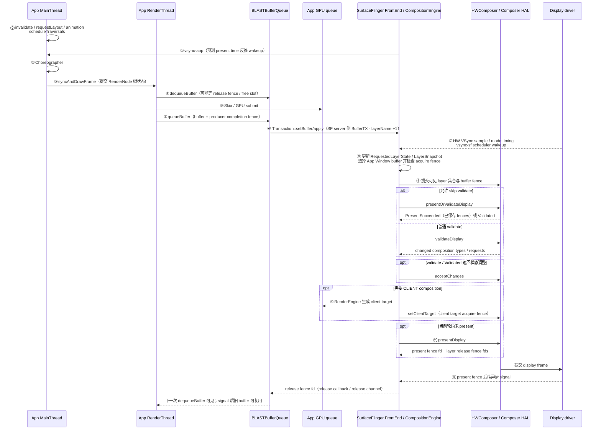

# Android Perfetto 系列 - App 出图类型 - AOSP 标准类型

这篇处理的是 **AOSP 标准 HWUI 页面在一帧里的完整出图过程**：页面状态由主线程整理，RenderThread 生成窗口 buffer，SurfaceFlinger、HWC 和显示设备完成合成与 present。

标准页面只有一个承载主体内容的 App Window surface，没有额外的独立内容 layer 或引擎帧循环。它适合用来建立 Perfetto 排查基线。读完这篇应当能回答两件事：

- 为什么它可以作为后续所有分叉类型的对照基线；
- 如何用调度、FrameTimeline、BufferQueue、SurfaceFlinger 和 HWC 证据判断瓶颈位置。

`SurfaceView`、`TextureView`、`WebView`、Flutter、Camera 和 Video 会改变 Producer、surface 或 layer 的组织方式。标准页面先把 `vsync-app`、`doFrame`、RenderThread、BLASTBufferQueue、SurfaceFlinger、HWC 与 present timing 放到同一条时间轴上，后续才能判断分叉发生在哪里。

<!--more-->

## 阅读导航

### 本文目录

- 阅读说明
- 1. 一帧完整流程：标准 HWUI 页面怎样到屏幕
- 显示链路图：标准 HWUI App Window
- 关键节点说明
- 2. 类型判定：什么 trace 算 AOSP 标准页面
- 3. 系列角色：为什么它是所有分叉的对照组
- 4. 普通列表滑动的一帧怎样经过这些节点
- 5. 第一轮排查：标准页面先看四个关口
- 6. Compose 分支：标准 App Window 中哪些工作变了
- 7. 为什么标准链适合做性能基线
- 8. 系统可调节点：能从 trace 证明什么
- 9. 源码入口：优先跟读哪里
- 10. 版本演进：Android 12 到 Android 17
- 11. Perfetto 证据链：按标准路径排查
- 12. 类型边界：和相邻类型分开
- 13. 最终判定：哪些信号足以归类
- 14. 判读边界
- 总结

### 系列文章目录

1. [Android Perfetto 系列 - App 出图类型 - 总览与识别方法](S01_rendering_types_overview.md)
2. [Android Perfetto 系列 - App 出图类型 - AOSP 标准类型](S02_aosp_standard_type.md)
3. [Android Perfetto 系列 - App 出图类型 - SurfaceView 类型](S03_surfaceview_type.md)
4. [Android Perfetto 系列 - App 出图类型 - TextureView 类型](S04_textureview_type.md)
5. [Android Perfetto 系列 - App 出图类型 - 混合出图类型](S05_mixed_rendering_type.md)
6. [Android Perfetto 系列 - App 出图类型 - 多窗口类型](S06_multi_window_type.md)
7. [Android Perfetto 系列 - App 出图类型 - Software / 离屏类型](S07_software_offscreen_type.md)
8. [Android Perfetto 系列 - App 出图类型 - Native Graphics 类型](S08_native_graphics_type.md)
9. [Android Perfetto 系列 - App 出图类型 - WebView 类型](S09_webview_type.md)
10. [Android Perfetto 系列 - App 出图类型 - Flutter 类型](S10_flutter_type.md)
11. [Android Perfetto 系列 - App 出图类型 - Camera 类型](S11_camera_type.md)
12. [Android Perfetto 系列 - App 出图类型 - Video Overlay / HWC 类型](S12_video_overlay_hwc_type.md)
13. [Android Perfetto 系列 - App 出图类型 - Game 类型](S13_game_type.md)
14. [Android Perfetto 系列 - App 出图类型 - React Native 类型](S14_react_native_type.md)

## 阅读说明

标准页面的判断问题很直接：主体内容是不是仍然由普通 View / Compose / HWUI 生产，并通过当前 App Window 这一层提交到系统。

平台源码固定到 Android 17 / API 37 的 `android-17.0.0_r1`，kernel 源码固定到 `android17-6.18-2026-06_r6`。framework、HWUI、SurfaceFlinger 与 HWC 的调用名按 platform tag 核查；cpuset、uclamp、schedutil 和 cpufreq 只按指定 kernel tag 说明可观察机制。Jetpack Compose 独立发布，不属于 platform tag，相关段落以当前官方文档为依据并明确版本边界。

类型判断围绕一条路径展开：`vsync-app` → `Choreographer#doFrame` → RenderThread → BLASTBufferQueue / `queueBuffer` → SurfaceFlinger → HWC → present timing。主体内容完整经过这条路径时按标准 HWUI 页面分析；出现独立 Producer、独立 layer 或其他引擎帧循环时，再切换到相应类型。

## 1. 一帧完整流程：标准 HWUI 页面怎样到屏幕


标准 HWUI 页面的一帧会经过下面 12 个阶段。这里描述的是主体 App Window；壁纸、状态栏、导航栏等系统 layer 仍会同时参与显示合成。

1. 页面因为输入、动画、`invalidate()`、`requestLayout()`、Insets 或窗口变化进入下一帧调度；Android 17 的 `ViewRootImpl.scheduleTraversals()` 注册 traversal VSync callback，`Choreographer` 用 `mFrameScheduled` 合并同一个 pending frame 的重复申请。
2. `vsync-app` 到来后，主线程进入 `Choreographer#doFrame()`，按 `INPUT → ANIMATION → INSETS_ANIMATION → TRAVERSAL → COMMIT` 处理这一帧。
3. `Traversal` 根据本帧脏标记决定是否执行 measure、layout 和 draw；硬件加速路径在 `performDraw()` 中通过 `ThreadedRenderer.draw()` 更新 RenderNode / DisplayList，并进入 UI 线程到 RenderThread 的同步边界。
4. UI 线程通过 `HardwareRenderer.syncAndDrawFrame()` / native `RenderProxy::syncAndDrawFrame()` 把 `DrawFrameTask` 投到 RenderThread；RenderThread 随后执行 `syncFrameState()`，同步主线程提交的树状态，并准备这一帧的 Skia / GPU 工作。
5. RenderThread 通过 `Surface` 从当前 App Window 的 BLAST BufferQueue Producer dequeue buffer；没有满足约束的 free slot，或返回 slot 的 release fence 尚未满足时，这一步可能等待。
6. RenderThread 通过 Skia pipeline 生成并提交 GPU 命令；随 buffer 一起提交的 producer completion fence 会在 Consumer 侧作为 acquire fence，表示 Consumer 何时可以安全读取这块 buffer，`queueBuffer()` 返回时 GPU 工作可能仍未完成。
7. RenderThread `queueBuffer()`，把本帧 buffer、producer completion fence 和帧号交给 `BLASTBufferQueue`。
8. App 进程内的 BLAST Consumer acquire `BufferItem`，调用 `Transaction::setBuffer()` 并 `apply()`。SurfaceFlinger server 将 buffer transaction 计入 pending 后，`BufferTX - <layerName>` counter 加一。
9. SurfaceFlinger 在 `vsync-sf` 节奏下 flush transaction。Android 17 FrontEnd 把更新合入 `RequestedLayerState`、构建 `LayerSnapshot`，再对目标 App Window layer latch；transaction readiness 和后续读取都要遵守 acquire fence，符合条件时允许 latch unsignaled buffer。
10. SurfaceFlinger 把本轮所有可见 layer 交给 HWC 做 composition strategy 协商：如果本轮可以 skip validate，先尝试 `presentOrValidateDisplay()`；PresentSucceeded 表示组合 HAL 调用走了 present 分支并返回 present / release fences，不表示 panel 已经显示；Validated 表示 validate 已在这次 HAL 调用里完成，后续继续 `getChangedCompositionTypes()` / requests / `acceptChanges()`；只有不能 skip validate 时，才先走 `validateDisplay()` slow path。
11. 如果存在 CLIENT layer，SurfaceFlinger / RenderEngine 先消费 layer 输入 fence 并生成 client target，再通过 `setClientTarget()` 把 client target 及其 output acquire fence 交给 HWC；随后用 `presentAndGetReleaseFences()` 收尾，如果前面尚未 present，则调用 `presentDisplay()`。
12. HWC 返回 per-display present fence 和 per-layer release fence；SurfaceFlinger 还会按 client/device composition 合并或替换 release 信息，再通过 release callback / channel 回传 Producer。Present fence 是显示栈时间锚点，不等于 panel 完成光学响应。

Perfetto 中先确认主体内容是否经过这 12 个阶段。独立 Producer、SurfaceTexture 采样、引擎帧循环、Camera HAL 或视频解码器出现后，线程名相似也不能继续套用标准页面结论。

### 显示链路图：标准 HWUI App Window

下面这张图完整画出普通 View / Compose 页面的标准 HWUI 路径。`⓪` 表示进入帧调度前的状态变化，①–⑫ 表示从 App VSync wakeup 到 present feedback 的固定观察节点。



### 关键节点说明

- **⓪ 调度前奏**：`invalidate()`、`requestLayout()`、动画或 Insets 变化只表示后续帧有工作。Android 17 的 `scheduleTraversals()` 注册 traversal VSync callback，`mFrameScheduled` 避免重复申请同一个 pending frame。
- **①–③ 主线程准备**：`vsync-app` 唤醒 App 后，MainThread 处理 Input / Animation / Insets Animation / Traversal / Commit，再通过 `syncAndDrawFrame()` 同步本帧 RenderNode 树状态。
- **④–⑥' App Window buffer 提交**：RenderThread 通过当前窗口的 BLAST BufferQueue Producer 执行 `dequeueBuffer()` / `queueBuffer()`；`BufferTX - <layerName>` 在 SF server 计入 pending buffer transaction 后变化，时间点晚于 App 侧 `queueBuffer()` 返回。
- **⑦–⑨ 系统采纳和 HWC 策略**：SurfaceFlinger 在 `vsync-sf` 节奏下 latch App Window layer；只有可 skip validate 时才尝试 `presentOrValidateDisplay()`。PresentSucceeded 表示 HAL 调用已走 present 分支，Validated 后继续读取 changed composition / requests 并 `acceptChanges()`。
- **⑩–⑫ fence 与 present**：device composition 时 layer acquire fence 交给 HWC；client composition 时 RenderEngine 消费 layer 输入 fence，`setClientTarget()` 附带 client target 的 acquire fence。Present fence 提供显示栈的 present 时间反馈；release fence 经 SF 回传后约束旧 buffer 的复用时机。

## 2. 类型判定：什么 trace 算 AOSP 标准页面

如果页面主体来自普通 View 或 Compose，并由当前 App Window 的 HWUI surface 提交，没有承载主体内容的独立 Surface、浏览器渲染管线、跨平台引擎帧循环、Camera HAL 或视频解码器 Producer，就属于本文的 **AOSP 标准类型**。

最常见的例子包括：

- 普通列表页、详情页、设置页；
- 以 RecyclerView、ConstraintLayout、`ComposeView` 等标准 UI 为主的页面；
- 没有独立视频 Surface、没有地图 / 相机预览 / 浏览器主体的常规业务页面。

这种类型不一定轻，也不等于不会卡。它只是说明：**这张页面的主体内容，还完整走在标准 HWUI 窗口主线上。**

## 3. 系列角色：为什么它是所有分叉的对照组

不同出图类型的差别可以落到同一个问题：

> **它是从标准 HWUI 窗口主线的哪一步开始不一样的？**

标准类型提供一条没有额外内容 Producer 的对照路径：

- `vsync-app` 还是按主线程帧节奏往前发；
- `Choreographer#doFrame` 还是按 `INPUT → ANIMATION → INSETS_ANIMATION → TRAVERSAL → COMMIT` 组织这一帧（`INSETS_ANIMATION` 在 Animation 之后、Traversal 之前）；
- 结果还是通过当前窗口的 `RenderThread`、`BLASTBufferQueue`、`queueBuffer` 往后交；
- SurfaceFlinger 看到的重点对象，还是当前 App Window 对应的 layer；
- HWC / `present fence` 这一侧也还是标准窗口的收尾语义。

所以它最适合作为对照。后续看到：

- `SurfaceView` 会新增独立 BufferQueue 和 layer，内容不再写入宿主 App Window buffer；
- `TextureView` 使用 SurfaceTexture 接收外部 buffer，再由宿主 HWUI 采样进 App Window；
- WebView / Flutter 由 Chromium 或 Flutter Engine 组织内容生产，Android 宿主还可能选择 App Window、SurfaceView、TextureView 或额外 overlay；
- Camera / Video 的 Producer 来自 HAL 或解码器，并可能使用独立 layer、sideband 或受保护显示路径。

标准页面就是 Android App 最常见、最完整、最容易对照的一条出图路径。

## 4. 普通列表滑动的一帧怎样经过这些节点

以手指拖动 RecyclerView 为例，主线程和显示系统会依次处理这些工作：

1. `ACTION_MOVE` 到达应用后，普通输入事件通过 InputChannel 异步处理；同一 VSync 周期内积累的 batched motion event 在 Choreographer Input callback 中消费和重采样。滚动容器根据最新触点更新偏移并请求 redraw，必要时还会触发布局。
2. `Choreographer#doFrame` 继续执行 Animation、Insets Animation 与 Traversal。RecyclerView 只重绘可复用 DisplayList，还是重新 bind / measure / layout item，取决于本帧滚动范围、item 状态和 layout request，不能从“列表在动”推断 Traversal 成本固定。
3. `ThreadedRenderer.draw()` 更新 root RenderNode 后进入 `syncAndDrawFrame()`。RenderThread 准备树、取得 App Window buffer、提交 Skia / GPU 工作并 `queueBuffer()`；App actual SurfaceFrame 的结束位置取 `max(gpu completion, buffer post)`，因此 UI 线程返回不等于 App frame 已完成。
4. BLAST 把 buffer 变成 transaction。`BufferTX - <layerName>` 增加后，SurfaceFlinger 才有对应的 pending buffer update；latch 时 counter 下降，本轮 display composition 才可能采用新列表画面。
5. HWC 为所有可见 layer 决定 composition type。Present fence 和 SF DisplayFrame 给出显示栈的 present timing；panel 扫描、像素响应和触摸到光子的完整延迟还需要 driver trace 或外部高速相机等证据。

同一段滑动可能在 UI、RenderThread、buffer backpressure 或 display 侧超时。按这五步对齐证据，比只找最长 slice 更容易区分根因。

## 5. 第一轮排查：标准页面先看四个关口

标准页面没有额外主体 Producer，排查时可以沿 App Window 的单条生产路径逐段排除。

### 关口 1：`doFrame` 中哪一段增加了成本

查看 UI 线程本帧执行了哪些 callback：

- Input 是否出现批量输入消费或业务回调耗时；
- Animation 是否持续超出本帧预算；
- Traversal 是否触发大范围 measure、layout 或 DisplayList 重录；
- Traversal 末尾的 `syncAndDrawFrame()` 是否在等待 RenderThread 完成状态同步；它位于 `CALLBACK_TRAVERSAL` 执行栈内，不是独立 callback 类型。

下面的调用骨架用于定位 `ViewRootImpl.scheduleTraversals()` 到 HWUI 入口。它是从 Android 17 源码抽出的结构示意，不是可编译 Java；条件分支和错误处理已省略。

```text
// Android 17 UI-thread call skeleton
ViewRootImpl.scheduleTraversals()
    if (!mTraversalScheduled) {
        mChoreographer.postVsyncCallback(
            Choreographer.CALLBACK_TRAVERSAL, mTraversalCallback)
        notifyRendererOfFramePending()
    }

Choreographer.scheduleFrameLocked(now)
    if (!mFrameScheduled) {
        scheduleVsyncLocked()
    }

Choreographer.doFrame(frameTimeNanos, frame, vsyncEventData)
    doCallbacks(CALLBACK_INPUT)
    doCallbacks(CALLBACK_ANIMATION)
    doCallbacks(CALLBACK_INSETS_ANIMATION)
    doCallbacks(CALLBACK_TRAVERSAL)
        TraversalCallback.onVsync(frameData)
            ViewRootImpl.doTraversal(frameData.getFrameTimeNanos())
    doCallbacks(CALLBACK_COMMIT)

ViewRootImpl.performTraversals(frameTimeNanos)
    // The real implementation conditionally calls performMeasure(),
    // 根据当前状态决定是否执行 performLayout() 与 performDraw()。
    performDraw()
        ThreadedRenderer.draw(view, attachInfo, callbacks)
            syncAndDrawFrame(frameInfo)
```

这条栈能证明主体窗口由 Choreographer 和 `ViewRootImpl` 驱动。measure、layout、draw 是否执行仍由本帧状态决定，不能把三者视为每帧固定成本。

### 关口 2：`RenderThread` 在执行还是等待

RenderThread slice 变长可能来自不同原因：

- `dequeueBuffer` 是否在等待可用 slot；
- CPU command submission 或 GPU 工作是否超出预算；
- buffer 已提交但系统没有及时采纳。

`syncAndDrawFrame()` 往后先把任务投到 RenderThread，并让 UI 线程等 RenderThread 完成本帧状态同步，不能直接当成“GPU 开画”标记。

下面的结构示意用于区分 UI 线程等待、RenderThread 执行和 buffer swap。它不是可编译 C++，省略了 frame callback、skip frame、fence wait 与错误处理。

```text
// Android 17 HWUI call skeleton
android_view_ThreadedRenderer_syncAndDrawFrame(...)
    RenderProxy::syncAndDrawFrame()
        DrawFrameTask::drawFrame()
            postAndWait()

// RenderThread side
DrawFrameTask::run()
    canUnblockUiThread = syncFrameState()
        CanvasContext::prepareTree()
    if (canUnblockUiThread)
        unblockUiThread()
    CanvasContext::draw()
        mRenderPipeline->getFrame()       // dequeueBuffer / acquire back buffer
        mRenderPipeline->draw(frame, ...)
        mRenderPipeline->swapBuffers(...) // queueBuffer with producer completion fence
    if (!canUnblockUiThread)
        unblockUiThread()
```

`postAndWait()` 会让 UI 线程等待 RenderThread；`syncFrameState()` 返回后是否提前 `unblockUiThread()` 取决于本帧状态。GPU 完成时间还要结合 GPU slice 或 fence，不能由 `DrawFrame` 的 CPU duration 直接推断。

#### `dequeueBuffer` 为什么会等：slot、BLAST 与 SF pending 要分层看

标准 App Window 下，RenderThread 通过 `Surface` 使用 App 进程内的 BLAST BufferQueue Producer。BLAST Consumer acquire slot 后，通过 `SurfaceControl.Transaction` 把 buffer update 送到 SF；SF 侧表现为 `BufferTX - <layerName>`、pending、latch、present / release 这一组信号。

BufferQueue 的主状态可以这样读：

| 状态 | 谁持有 | 含义 |
|------|--------|------|
| FREE | BufferQueue | 空闲，可被 Producer dequeue；仍可能带着上一轮 release fence |
| DEQUEUED | RenderThread / Producer | Producer 已取出，准备写入或正在写入 |
| QUEUED | BufferQueue / BLAST consumer | Producer 已提交 buffer，等待 Consumer acquire；内容可读 fence 可能尚未 signal |
| ACQUIRED | BLAST / BufferItemConsumer | Consumer 已 acquire，后续通过 transaction 进入 SF layer pending / latch 流程 |

`dequeueBuffer` 阻塞通常不是“只等上一帧那块 buffer 回来”。Producer 可以拿任何满足约束的 FREE slot；如果所有可 dequeue 的 slot 都被 DEQUEUED、QUEUED、ACQUIRED 或数量上限占住，才会等。这里要同时看：

- `maxDequeuedBufferCount`：Producer 同时持有的 DEQUEUED slot 是否到顶；
- `maxAcquiredBufferCount`：Consumer / BLAST 侧 ACQUIRED 上限是否到顶；
- QUEUED backlog：新 buffer 是否堆在 Consumer acquire 之前；
- release fence：旧 buffer 退回 FREE 后是否还要等显示硬件释放；
- SF pending / latch：buffer update 到 server 后是否被本轮采纳。

`dequeueBuffer` 长期偏长时，把 slot 状态、acquire / release fence、`BufferTX - <layerName>` 和 latch 放在同一时间轴里，再判断是哪一层没有及时归还可用 buffer。

第一段结构示意只保留 Producer 状态转换，用于确认何时等待 free slot、何时把 slot 标记为 QUEUED。

```text
// Android 17 BufferQueueProducer call skeleton
BufferQueueProducer::dequeueBuffer(...)
    waitForFreeSlotThenRelock()
        if (no slot satisfies the dequeue constraints) {
            if (mDequeueBufferCannotBlock || mAsyncMode)
                return WOULD_BLOCK;
            waitForBufferRelease(...);
        }
    mSlots[found].mBufferState.dequeue();

BufferQueueProducer::queueBuffer(slot, input)
    mSlots[slot].mBufferState.queue();
    item.mFence = input.acquireFence;
    frameAvailableListener->onFrameAvailable(item);
```

`dequeueBuffer()` 返回的 slot 可能同时带有 fence；Producer 必须在写入前遵守它。`queueBuffer()` 的 input fence 在 Consumer 侧成为 acquire fence。

第二段结构示意展示 BLAST 如何把 `BufferItem` 变成 buffer transaction，以及正常 release callback 与 stale-buffer fallback 的区别。

```text
// Android 17 BLASTBufferQueue call skeleton
BLASTBufferQueue::onFrameAvailable(...)
    acquireNextBufferLocked()
        Transaction t;
        t.setBuffer(surfaceControl, buffer, acquireFence, frameNumber, ...);
        t.setFrameTimelineInfo(...);
        t.apply();

BLASTBufferQueue::transactionCallback(...)
    updateFrameTimestamps(..., presentFence, previousReleaseFence, ...)
    for each stale submitted buffer
        releaseBufferCallbackLocked(
            callbackId, previousReleaseFence,
            currentMaxAcquiredBufferCount, fakeRelease=true)

BLASTBufferQueue::releaseBufferCallback(...)
    releaseBufferCallbackLocked(
        callbackId, releaseFence,
        currentMaxAcquiredBufferCount, fakeRelease=false)
        releaseBuffer(...)
            BLASTBufferItemConsumer::releaseBuffer(...)
```

正常路径由 SF release callback / release channel 归还 buffer。Transaction completed callback 中的 fake release 只处理已经被更新帧越过的 stale submitted buffer，不能把所有 release 都归因到 transaction callback。

### 关口 3：`queueBuffer` 之后系统有没有采纳

`queueBuffer` 之后按下列顺序确认系统是否采纳本帧：

- 先看有没有 `queueBuffer`；
- 再看对应 layer 的 `BufferTX - <layerName>` 是否增加；
- 再看这一帧有没有 latch；
- 再看 FrameTimeline actual present 与 present fence。

这些点必须使用同一 frame token、frame number 或邻近时间关系对齐。只看同名 counter 的一次跳变，可能把别的窗口或后续帧配到当前帧。

### 关口 4：系统显示出口怎么判断

App 生产侧按时完成后，继续检查 SurfaceFlinger actual timeline、composition type、HWC / DisplayHAL 与 present timing：

- 前面主线程和 `RenderThread` 都正常；
- `queueBuffer`、`BufferTX - <layerName>`、latch 均落在预期窗口；
- SF actual slice 或 present timing 仍然超出 expected timeline。

SurfaceFlinger actual slice 覆盖 SF 主线程以下的 Composer、DisplayHAL 到 on-screen update，不等于 SF 主线程纯 CPU 时间。结合 `SurfaceFlingerCpuDeadlineMissed`、`SurfaceFlingerGpuDeadlineMissed`、`DisplayHAL` 和 `PredictionError` 才能继续划分系统侧原因。

## 6. Compose 分支：标准 App Window 中哪些工作变了

Jetpack Compose 不会因为采用声明式 UI 就自动创建独立 surface。`ComposeView` / `AbstractComposeView` 仍属于 `ViewRootImpl` 管理的 View hierarchy，Android 端的 Compose 内容通过 HWUI 写入当前 App Window buffer。标准宿主下，`syncAndDrawFrame()` 之后仍经过 RenderThread、BLASTBufferQueue、SurfaceFlinger、HWC 与 present fence。

Compose 改变的是 App 侧生成绘制内容的方式。它独立发布，不能用 `android-17.0.0_r1` 推断 Compose Runtime 或 Compose Compiler 行为。这里按 Android Developers 当前文档中的三阶段模型、strong skipping 与 composition tracing 规则解释；分析具体工程时还要记录 Kotlin、Compose BOM 和 Compose Compiler plugin 版本。

### Compose 影响 1：Composition、Layout、Drawing 可以分别失效

Compose 把 UI 更新分成三个阶段：

1. **Composition**：执行需要重新运行的 `@Composable`，生成或更新 UI tree，回答“显示哪些节点”。
2. **Layout**：测量并放置 layout node，回答“节点多大、放在哪里”。测量和放置拥有各自的 restart scope；只改变 placement 的状态不一定重新 measure。
3. **Drawing**：遍历需要重绘的节点并向 Canvas 发出绘制操作，回答“这些节点怎样画”。只在 draw 阶段读取的状态可以只触发 redraw。

这三个阶段描述依赖关系，不表示每帧都会完整执行三遍。Compose 按状态读取位置记录 invalidation：某个 draw-only 状态变化时，可以跳过 composition 和 layout；UI tree 与尺寸都没变化时，也不应重跑整棵树。

Compose 的常规 layout 使用 single-pass measurement，每个 child 在一次测量过程中只能测量一次。Intrinsic measurement、`SubcomposeLayout`、`BoxWithConstraints`、Lazy layout 和 Lookahead 等机制会改变普通路径，不能用“每个节点只访问一次”解释这些场景。View 系统也不等于固定多次 measure；是否重复取决于父容器实现、layout request 与约束协商。

### Compose 影响 2：Strong skipping 改变了“不稳定参数”的判断

Kotlin 2.0.20 起，strong skipping 默认开启。官方规则可以压成两行：所有 restartable composable 都可被标记为 skippable；比较参数时，stable 参数使用对象相等性，unstable 参数使用实例相等性。`@NonSkippableComposable`、non-restartable composable 以及显式 compiler 配置仍会改变结果。

| 参数或函数状态 | Strong skipping 下的行为 | 分析边界 |
|----------------|--------------------------|----------|
| Restartable composable | 默认可跳过 | 函数体是否执行还取决于参数比较和 invalidation |
| Stable 参数 | 使用 `equals()` 比较新旧值 | `@Stable` 是契约，错误标注可让 UI 漏更新 |
| Unstable 参数 | 使用 `===` 比较实例 | 每次创建新集合会失去跳过机会；复用可变集合又可能绕过可观察状态 |
| Non-restartable / `@NonSkippableComposable` | 不按上述规则跳过 | 不能从参数稳定性单独推断执行次数 |

Perfetto 中 Composition slice 变长只能证明重组工作变多。根因需要结合 Compose compiler report、Layout Inspector 重组计数、状态读取位置和业务 trace marker；“参数 unstable”不能直接推出“每帧重组”。

### Compose 影响 3：Composition tracing 需要工程主动启用

系统 trace 默认不会列出每个 composable 函数。Android Developers 当前文档要求至少使用 Android Studio Flamingo、Compose UI 1.3.0、Compose Compiler 1.3.0 和 API 30 设备，并添加 `androidx.compose.runtime:runtime-tracing`。使用 Compose BOM 时依赖不必单独写版本；使用自定义 Perfetto 配置录制时还要包含 `track_event` data source。

启用后，trace 会记录 composable 源码位置信息与重组事件。具体 slice 名会随 Compose Runtime 版本变化，因此要先确认依赖、trace config 和源码信息，再搜索 `Recomposer`、composition、layout、drawing 与目标 composable 名。没有 composition tracing 时，仍可使用 `Choreographer#doFrame`、`performTraversals()`、`syncAndDrawFrame()` 和 RenderThread 判断窗口级成本，但不能把一段宿主 View 耗时归因到某个 composable。

### Compose 影响 4：互操作不会自动改变出图类型

| 页面结构 | 默认分类 | 需要改分类的条件 |
|----------|----------|------------------|
| View 页面嵌 `ComposeView` | 标准 HWUI | Compose 内容内部创建承载主体内容的独立 surface |
| Compose 页面嵌普通 `AndroidView` | 标准 HWUI | 被嵌 View 自己使用 SurfaceView、TextureView、WebView、Camera 或视频 surface |
| Compose 中嵌 `SurfaceView` | SurfaceView / 混合类型 | 独立 BufferQueue 与 layer 已经出现 |
| Compose 中嵌 `TextureView` | TextureView / 混合类型 | 外部 buffer 经 SurfaceTexture 被宿主 HWUI 采样 |
| Compose 页面主体是 WebView 或跨平台引擎 | 对应引擎类型 | 主体生产节奏与线程由 Chromium / Engine 控制 |

类型判断看 Producer、surface 和 layer，不看页面是否出现 `@Composable`。只要主体结果仍写入当前 App Window buffer，RenderThread 之后就按标准窗口证据分析。

### Compose 影响 5：View 与 Compose 的 trace 入口不同

| 维度 | View hierarchy | Compose hierarchy |
|------|----------------|-------------------|
| 状态到 UI | `invalidate()`、`requestLayout()`、属性更新 | Snapshot 状态失效通知与 Recomposer |
| 布局入口 | `measure()` / `layout()` | Compose measurement / placement restart scope |
| 绘制入口 | `draw()` / `onDraw()`、DisplayList 更新 | Compose drawing phase，经 Android owner 写入 HWUI |
| 专用工具 | Layout Inspector、`gfxinfo`、自定义 trace | Composition tracing、compiler report、重组计数 |
| HWUI 之后 | RenderThread → BLAST → SF → HWC | 同一条标准 App Window 路径 |

Compose 和 View 可以在同一帧里造成不同的 UI 线程成本，但 `queueBuffer` 之后的系统证据含义不变。若 Compose tracing 指向 composition，优化状态读取与跳过；若 UI 线程按时、RenderThread 或 SF 超时，就继续沿标准显示路径查，不要停在框架标签上。

## 7. 为什么标准链适合做性能基线

标准页面的优势是证据容易闭合，不代表它天然更快。目标 App Window 可以用同一组 token 和 layer name 关联下列阶段：

- `Choreographer#doFrame` 提供 UI 帧起点，callback 与 Traversal 暴露主线程成本。
- `syncAndDrawFrame()` 与 RenderThread `DrawFrame` 区分 UI 状态同步、绘制执行和 buffer 提交。
- `BufferTX - <layerName>` 与 latch 说明 buffer transaction 何时进入 SF、何时成为本轮合成输入。
- FrameTimeline 把 App SurfaceFrame 和 SF DisplayFrame 关联起来，并给出 deadline、present type 与 jank type。
- HWC / DisplayHAL 证据帮助区分 SF CPU、GPU composition 和显示后段。

这条证据链适合比较代码改动或系统策略，但比较条件必须一致：刷新率、分辨率、热状态、前后台状态、页面数据量、动画阶段和 trace config 都会改变预算或负载。单次滑动变顺不能证明调度、提频或 BufferQueue 参数发生了变化。

标准路径之外的页面仍可使用相同方法，只是要增加 Producer、surface 或 engine token。Camera、Video、WebView、Flutter 等类型不能只用 App Window 的 FrameTimeline 代表主体内容。

## 8. 系统可调节点：能从 trace 证明什么

AOSP 与 kernel 提供调度、性能提示、BufferQueue 和显示合成机制；设备厂商可以在这些机制之外加入策略。文章只能确认固定源码中存在的接口和算法。某台设备是否提高线程优先级、改变 uclamp、发出 PowerHAL hint 或调整显示策略，必须由该设备的 trace、配置或厂商源码证明。

### 节点 1：先区分执行时间和 runnable 等待

`Choreographer#doFrame` 或 `DrawFrame` 变长时，CPU slice 并不等于线程一直在执行。结合 `sched_wakeup`、`sched_switch` 和线程状态可以分成三类：

- **Running 时间长**：线程获得 CPU 后仍执行很久，优先检查函数调用、锁、IO、布局或绘制工作量。
- **Runnable 时间长**：线程已经可运行却迟迟没有上 CPU，检查 runqueue、优先级、cpuset、uclamp、CPU capacity 与系统竞争。
- **Sleeping / blocked 时间长**：线程等待 futex、Binder、buffer、fence 或其他资源，增加 CPU 频率通常不能解决等待源。

指定 kernel tag 中，`kernel/sched/core.c` 包含调度与 uclamp 主逻辑，`kernel/cgroup/cpuset.c` 管理 cpuset，`kernel/sched/cpufreq_schedutil.c` 根据调度利用率驱动 schedutil。Perfetto 只能记录当时状态；没有策略字段、affinity mask 或 cgroup 变化时，不能写成“绑核”“实时优先级”或厂商专有调度等级。

### 节点 2：ADPF 提供工作时长提示，不保证具体频率

`PerformanceHintManager.Session` 允许应用或系统组件报告目标工作时长和实际工作时长。Android 17 的 HWUI `CanvasContext` 通过 hint session wrapper 更新 workload target、上报 actual duration，并标记活跃的 functor threads。提示会交给 Power HAL / vendor 实现处理；API 契约不保证固定频率、固定 CPU 或每次都提升性能。

验证 ADPF 要同时找三类证据：session 创建与 `reportActualWorkDuration` / target update、Power HAL 或性能数据源中的 hint、随后发生的调度或频率变化。只看到 cpufreq 上升，无法证明是 ADPF 触发；只看到 hint，也无法证明 vendor 采取了动作。

### 节点 3：预取减少未来工作，但不能伪造下一帧状态

RecyclerView GapWorker、Compose lazy prefetch、图片解码预热和 shader / pipeline 缓存都可能把确定性工作移到 deadline 之外。它们减少未来帧的 bind、measure、upload 或 pipeline creation 成本，不改变 Choreographer 的 Input → Animation → Insets Animation → Traversal → Commit 顺序。

`OverScroller` 的位置由时间函数计算，业务或框架可以预取即将出现的 item；这不等于系统已经提交多帧 UI buffer。要证明预取有效，应在 trace 中看到 prefetch slice、目标 item 的 bind / measure 前移，以及随后的关键帧成本下降。没有这些证据时，不应推断“提前补帧”或“预生成后续画面”。

### 节点 4：Android 17 的 BLAST 深度由多个上限共同决定

标准 App Window 的 BufferQueue 位于应用进程。`setMaxDequeuedBufferCount()` 控制 Producer 同时持有的 DEQUEUED buffer 数；`BufferQueueConsumer::setMaxAcquiredBufferCount()` 控制 BLAST Consumer 的 ACQUIRED 上限；`setAsyncMode()` 影响总 slot 计算和 queued buffer 是否可丢弃。

Android 17 没有 `BLASTBufferQueue::setMaxAcquiredBufferCount()` 这个公开方法。BLAST 初始化时通过 SurfaceComposer service 查询 pacesetter display 的最大刷新率所需 acquired count，再调用内部 `BLASTBufferItemConsumer::setMaxAcquiredBufferCount()`。SF 的 release callback 还会携带当前刷新率对应的 acquired count；BLAST 对 EGL producer 可能暂存一部分已 release buffer，以降低当前刷新率低于设备最大刷新率时的延迟。

因此，“队列深度”不是一个独立整数。实际可用 slot 取决于 max dequeued、max acquired、async / non-blocking 模式、当前状态为 DEQUEUED / QUEUED / ACQUIRED 的数量、release fence 以及 BLAST pending release。看到 `dequeueBuffer` 变短，只能证明等待减少，不能证明系统扩大了队列。

### 节点 5：Buffer stuffing recovery 是 Android 17 的具体实现

Android 17 的 `Choreographer` 包含 buffer stuffing recovery。`BBQBufferQueueProducer::waitForBufferRelease()` 统计等待时长，`ViewRootImpl` / `ThreadedRenderer` 把回调接到 `Choreographer.onWaitForBufferRelease()`；等待超过半个 frame interval 后，Choreographer 才标记 stuffed 状态。后续 `doFrame()` 可以故意延迟一个 frame，让 queued buffer 数下降，并在恢复期间调整 animation frame time。`buffer_stuffing_multi_recovery` 控制同一段动画能否多次恢复；启用 `buffer_stuffing_recovery_threshold` 时，`MAX_BUFFER_STUFFING_DELAY_NS` 把累计主动延迟限制在 100 ms。两项都是可变 aconfig flag，设备取值需要从 trace/config 确认。

这套机制解决的是 buffer 已经排队过深造成的额外延迟，不是提高吞吐。Perfetto 可搜索 `Buffer stuffing recovery`、`buffer stuffed`、`Negative offset`，再与 `dequeueBuffer` wait、FrameTimeline `Buffer Stuffing` 和后续 queued count 对齐。看到主动 delay 时，不应把该帧直接归因成 CPU 不足。

### 节点 6：HWC 策略只能从实际 composition 结果判断

SurfaceFlinger 先准备 layer 属性，再由 HWC 返回 composition changes。Android 17 的 `HWComposer::getDeviceCompositionChanges()` 仅在本轮没有 client composition，且满足 earliest-present 条件时尝试 `presentOrValidate()`；否则调用 `validate()`。HWC 能否使用 overlay plane、支持某种 transform、format、dataspace、blend 或 protected content，取决于设备实现和当时资源。

判断 GPU / device composition 要看该帧的 composition type、client composition slice、FrameTimeline `GPU Composition`、HWC trace 或 dumpsys。页面功耗下降、SF slice 变短都不能单独证明某个 layer 使用了 overlay。

### 证据门槛：结论要和观测一一对应

| 想下的结论 | 至少需要的证据 | 不能单独作为证据 |
|------------|----------------|------------------|
| UI / RenderThread 调度等待下降 | 同场景的 runnable delay、线程状态、CPU 落点与优先级/cgroup 对比 | 单帧总时长变短 |
| 系统提高 CPU 能力 | uclamp/cpuset/affinity 或频率轨迹与目标线程时间重合，并排除 thermal 差异 | 线程偶尔跑到大核 |
| ADPF 产生效果 | HintSession 上报、vendor hint 响应、调度/频率变化三者时间相关 | 只有 `PerformanceHintManager` API 调用 |
| BufferQueue 深度改变 | slot / max dequeued / max acquired / async 配置或对应源码，加上排队与延迟变化 | `dequeueBuffer` 变短 |
| Buffer stuffing recovery 生效 | `Buffer stuffing recovery` trace、主动 frame delay、backlog 回落 | FrameTimeline 只显示 `Buffer Stuffing` |
| HWC 使用 device composition | per-layer composition type 或 HWC/FrameTimeline GPU composition 证据 | 功耗下降或 `present fence` 变早 |

这张表同样适用于 OEM 策略分析。AOSP 接口说明“系统可以做什么”，设备 trace 才能说明“这台设备在这次场景里做了什么”。

## 9. 源码入口：优先跟读哪里

Android 平台源码链接全部固定到 Android 17 / API 37 的 `android-17.0.0_r1`：

- [`Choreographer.java`](https://android.googlesource.com/platform/frameworks/base/+/android-17.0.0_r1/core/java/android/view/Choreographer.java)、[`ViewRootImpl.java`](https://android.googlesource.com/platform/frameworks/base/+/android-17.0.0_r1/core/java/android/view/ViewRootImpl.java) 与 [view flags](https://android.googlesource.com/platform/frameworks/base/+/android-17.0.0_r1/core/java/android/view/flags/view_flags.aconfig)：核对 VSync 申请、五类 callback、buffer stuffing recovery、相关 aconfig flag、`scheduleTraversals()` 与 `performTraversals()`。
- [`ThreadedRenderer.java`](https://android.googlesource.com/platform/frameworks/base/+/android-17.0.0_r1/core/java/android/view/ThreadedRenderer.java)、[`HardwareRenderer.java`](https://android.googlesource.com/platform/frameworks/base/+/android-17.0.0_r1/graphics/java/android/graphics/HardwareRenderer.java) 与 [HWUI JNI](https://android.googlesource.com/platform/frameworks/base/+/android-17.0.0_r1/libs/hwui/jni/android_graphics_HardwareRenderer.cpp)：核对 Java UI 线程怎样进入 `syncAndDrawFrame()`。
- [`RenderProxy.cpp`](https://android.googlesource.com/platform/frameworks/base/+/android-17.0.0_r1/libs/hwui/renderthread/RenderProxy.cpp)、[`DrawFrameTask.cpp`](https://android.googlesource.com/platform/frameworks/base/+/android-17.0.0_r1/libs/hwui/renderthread/DrawFrameTask.cpp)、[`CanvasContext.cpp`](https://android.googlesource.com/platform/frameworks/base/+/android-17.0.0_r1/libs/hwui/renderthread/CanvasContext.cpp) 与 [`HintSessionWrapper.cpp`](https://android.googlesource.com/platform/frameworks/base/+/android-17.0.0_r1/libs/hwui/renderthread/HintSessionWrapper.cpp)：核对 UI unblock、绘制、buffer duration 与 HWUI ADPF session。
- [`PerformanceHintManager.java`](https://android.googlesource.com/platform/frameworks/base/+/android-17.0.0_r1/core/java/android/os/PerformanceHintManager.java)：核对 target duration、actual duration 和 hint session 的 API 契约。
- [`BufferQueueProducer.cpp`](https://android.googlesource.com/platform/frameworks/native/+/android-17.0.0_r1/libs/gui/BufferQueueProducer.cpp)、[`BufferQueueConsumer.cpp`](https://android.googlesource.com/platform/frameworks/native/+/android-17.0.0_r1/libs/gui/BufferQueueConsumer.cpp) 与 [`BLASTBufferQueue.cpp`](https://android.googlesource.com/platform/frameworks/native/+/android-17.0.0_r1/libs/gui/BLASTBufferQueue.cpp)：核对 slot 状态、max dequeued/acquired、async mode、buffer transaction 与 release callback。
- [SurfaceFlinger FrontEnd](https://android.googlesource.com/platform/frameworks/native/+/android-17.0.0_r1/services/surfaceflinger/FrontEnd/)、[`Layer.cpp`](https://android.googlesource.com/platform/frameworks/native/+/android-17.0.0_r1/services/surfaceflinger/Layer.cpp) 与 [`SurfaceFlinger.cpp`](https://android.googlesource.com/platform/frameworks/native/+/android-17.0.0_r1/services/surfaceflinger/SurfaceFlinger.cpp)：核对请求状态、snapshot、`BufferTX`、transaction readiness、latch 与当前刷新率对应的 acquired count。
- [`HWComposer.cpp`](https://android.googlesource.com/platform/frameworks/native/+/android-17.0.0_r1/services/surfaceflinger/DisplayHardware/HWComposer.cpp) 与 [FrameTimeline](https://android.googlesource.com/platform/frameworks/native/+/android-17.0.0_r1/services/surfaceflinger/Scheduler/FrameTimeline.cpp)：核对 validate/present、release fence 和 SurfaceFrame / DisplayFrame。

Kernel 机制固定到 `android17-6.18-2026-06_r6`：

- [`kernel/sched/core.c`](https://android.googlesource.com/kernel/common/+/refs/tags/android17-6.18-2026-06_r6/kernel/sched/core.c)、[`kernel/cgroup/cpuset.c`](https://android.googlesource.com/kernel/common/+/refs/tags/android17-6.18-2026-06_r6/kernel/cgroup/cpuset.c)：核对调度、uclamp 与 cpuset 约束。
- [`kernel/sched/cpufreq_schedutil.c`](https://android.googlesource.com/kernel/common/+/refs/tags/android17-6.18-2026-06_r6/kernel/sched/cpufreq_schedutil.c)、[`drivers/cpufreq/cpufreq.c`](https://android.googlesource.com/kernel/common/+/refs/tags/android17-6.18-2026-06_r6/drivers/cpufreq/cpufreq.c)：核对调度利用率到 cpufreq policy 的入口。Vendor governor、Power HAL 与设备热策略不在这些文件中，仍需设备证据。

Compose 独立于 platform tag，使用官方文档确认版本相关行为：

- [Compose phases](https://developer.android.com/develop/ui/compose/phases)：确认 Composition、Layout、Drawing 与各阶段状态读取。
- [Strong skipping mode](https://developer.android.com/develop/ui/compose/performance/stability/strongskipping)：确认 Kotlin 2.0.20 默认值、restartable/skippable 与参数比较规则。
- [Composition tracing](https://developer.android.com/develop/ui/compose/tooling/tracing)：确认最低版本、`runtime-tracing` 依赖和 `track_event` 配置。
- [`ComposeView` API](https://developer.android.com/reference/kotlin/androidx/compose/ui/platform/ComposeView) 与 [View/Compose interoperability](https://developer.android.com/develop/ui/compose/migrate/interoperability-apis/compose-in-views)：确认宿主 View 与互操作边界。

Perfetto 的字段与 jank 分类以 [FrameTimeline 文档](https://perfetto.dev/docs/data-sources/frametimeline) 和 [PerfettoSQL standard library](https://perfetto.dev/docs/analysis/stdlib-docs) 为准。滚动文档用于解释 trace 数据，平台实现判断仍回到固定 AOSP tag。


## 10. 版本演进：Android 12 到 Android 17

标准 HWUI 页面的现代基线从 Android 12 开始。这里跟踪的是 `Choreographer → ViewRootImpl / Compose host → HWUI RenderThread → App Window BLAST → SurfaceFlinger → HWC`。某个版本新增 API，不一定改变这条 Producer 到 display 的拓扑；只有影响帧调度、buffer transaction、latch、composition 或可观察证据时，才需要改变排查方法。

| 平台 | 标准页面相关变化 | Review 与 Perfetto 影响 |
|---|---|---|
| Android 12 / API 31 | App Window 已使用 BLAST；FrameTimeline 从 Android 12 起可用；`PerformanceHintManager` 在 API 31 公开 | 标准页可以用 SurfaceFrame/DisplayFrame expected 与 actual 时间线；ADPF 只能当 hint 证据，不能当频率保证 |
| Android 13 / API 33 | SurfaceFlinger 默认支持 `AutoSingleLayer` latch unsignaled buffer | transaction latch 与 acquire fence signal 可以分离；仍需在 RenderEngine/HWC 读取前满足 fence |
| Android 14 / API 34 | 对标准 App Window，主链继续沿用 Android 12/13 的 Choreographer、HWUI、BLAST 与 SF/HWC 拓扑，没有需要更换分类方法的公开结构变化 | Android 14 标准页仍按同一条链排查；不要把 SurfaceView 的 alpha/lifecycle 变化套到普通 App Window |
| Android 15 / API 35 | Window 可请求 desired HDR headroom；target SDK 35 的系统 UI/insets 行为也可能改变布局工作量，但主体仍写入同一个 App Window | HDR 与 edge-to-edge 问题会改变状态、颜色或 Traversal 成本，不会自动把页面变成独立 Surface 类型 |
| Android 16 / API 36 | 标准 HWUI/BLAST 主拓扑继续沿用；本篇没有发现需要改写 12 阶段主流程的公开结构替换 | 跨版本对比应先保持刷新率、编译器、Compose、设备固件和应用代码一致，再归因到平台 |
| Android 17 / API 37 | 本文源码锚点：FrontEnd snapshot、现行 BLAST acquired-count 管理、buffer stuffing recovery、预测 present time 与 HWC skip-validate 流程 | 方法名和 flag 按 `android-17.0.0_r1` 解读；这些机制是否为 Android 17 首次引入，要另查历史 tag，不能从当前源码反推 |

### Android 12：BLAST、FrameTimeline 与 ADPF 基线

Android 12 已经具备本文标准页的三组核心能力。

第一，App Window 的 Producer 通过 `Surface` / BufferQueue 提交 buffer，应用进程内的 BLAST Consumer 把 `BufferItem` 转为 `SurfaceComposerClient::Transaction`。这使 buffer、frame number、dataspace、transform 和相关 transaction 状态沿 SurfaceControl 事务进入 SurfaceFlinger。`queueBuffer()`、BLAST acquire、SF server 收到 BufferTX 仍是不同时间点。

第二，FrameTimeline 提供 expected/actual `SurfaceFrame` 与 `DisplayFrame`。标准 App Window 通常是它覆盖最完整的场景，可以按 `surface_frame_token`、`display_frame_token`、`layer_name`、`jank_type` 和 `present_type` 对齐应用与显示帧。

第三，API 31 的 `PerformanceHintManager` 允许用 target duration 和 actual duration 向系统报告工作负载。它是 ADPF 契约的起点，不承诺线程固定迁核、CPU 固定频率或每次 hint 都产生可见调度变化。

### Android 13：latch unsignaled 改变“SF 在哪里等”

Android 13 起，`AutoSingleLayer` 成为官方文档描述的默认 latch unsignaled 模式。对于满足条件的单 layer 简单 buffer update，SurfaceFlinger 可以先让 transaction 通过 readiness，再在更靠近内容读取的位置遵守 acquire fence。

标准页的排查顺序因此要保留两次确认：

1. buffer transaction 是否已经被 SurfaceFlinger 采纳；
2. RenderEngine 或 HWC 使用该 buffer 前，acquire fence 是否按时 signal。

“SF 已 latch”不能证明 GPU 完成；“queueBuffer 时 fence 未 signal”也不能证明 transaction 必然错过本轮 latch。是否满足 simple update、单 layer、队列顺序和调度配置，要用该版本源码与 trace 判断。

### Android 14：分类方法保持稳定

Android 14 对标准 App Window 没有公开的 Producer/Consumer 拓扑换代。普通 View 与纯 Compose 仍由宿主 ViewRoot/HWUI 生成同一个 App Window buffer，SurfaceFlinger 仍按 layer transaction 与 HWC strategy 完成显示。

这一版在 SurfaceView 上增加任意 alpha 和公开 lifecycle 策略，但这些是独立 Surface 分支的行为。标准页面如果没有独立 buffer layer，就不应因为使用 Android 14 而套用 hole-punch、SurfaceHolder 或 SurfaceView Z-order 结论。

### Android 15：HDR 与布局策略不改变出图类型

API 35 的 `Window.setDesiredHdrHeadroom()` 为宿主窗口表达期望 HDR/SDR 比例。它影响显示策略输入，不改变“主体像素写入 App Window buffer”这一分类事实。请求能否实现还取决于 window color mode、buffer 格式/bit depth、dataspace、面板与 HWC/RenderEngine 能力。

target SDK 35 的 edge-to-edge 行为可能让 insets 处理、布局区域和遮挡关系发生变化，进而增加或转移 Traversal / Drawing 成本。它属于宿主 View 状态变化；除非页面另行创建独立 Surface，仍按标准类型分析。

### Android 16：主拓扑延续，控制实验更重要

Android 16 的标准 HWUI 页面继续沿用 Choreographer、ViewRootImpl、RenderThread、BLAST、SurfaceFlinger 和 HWC。没有影响本文分类的公开主拓扑替换时，版本对比应避免写成“升级系统导致渲染链改变”。

至少控制这些变量：设备/SoC 与 vendor image、刷新率和分辨率、应用构建与 profile、Kotlin/Compose 版本、热状态、Power HAL 策略、输入脚本和数据量。AOSP 主线相同不代表设备策略相同，反过来也不能把设备差异包装成 AOSP 架构差异。

### Android 17：本文的精确源码口径

Android 17 的标准页按这些当前实现解释：

- `Choreographer` 用 pending frame 状态合并 VSync 申请，并包含 buffer stuffing recovery 及相关 aconfig flag；
- HWUI `CanvasContext` / `HintSessionWrapper` 管理 RenderThread 绘制与 hint session 上报；
- BLAST 的 acquired buffer 上限、刷新率反馈和 release 缓存共同影响队列深度，源码没有公开的 `BLASTBufferQueue::setMaxAcquiredBufferCount()`；
- SurfaceFlinger FrontEnd 以 `RequestedLayerState` 和 `LayerSnapshot` 组织当前状态；
- HWC 只有满足条件时尝试 `presentOrValidateDisplay()`，`PresentSucceeded` 表示这次组合调用已 present 并保存 fences，不表示 panel 已完成扫描。

这些是 Android 17 Review 的当前事实，不自动等同于 Android 17 新增功能。文章描述“Android 17 的实现”时指固定 tag 中的代码；描述“从某版本开始”时必须有对应旧 tag 或公开 API 文档支持。

### Compose 版本必须单独记录

Jetpack Compose 不随 Android platform tag 发布。同一台 Android 14、15、16 或 17 设备，可以运行不同 Compose 运行时、compiler plugin 和 Kotlin 版本。Compose strong skipping 从 Kotlin 2.0.20 起默认开启，这个边界不能写成“Android 15/16/17 默认开启”。

做跨版本实验时，报告里至少记录：

- Android platform build / tag 与设备 vendor build；
- Kotlin 和 Compose compiler plugin 版本；
- Compose BOM 或 Runtime / UI 具体版本；
- 是否加入 `runtime-tracing` 以及 tracing 配置；
- release/profileable/debug 构建方式与 baseline profile 状态。

只有平台与 Jetpack 版本都固定，Composition、Layout、Drawing 的 slice 差异才有可比性。

### 固定版本来源

- [Android 12 `BLASTBufferQueue.cpp`](https://android.googlesource.com/platform/frameworks/native/+/refs/tags/android-12.0.0_r1/libs/gui/BLASTBufferQueue.cpp)、[FrameTimeline](https://perfetto.dev/docs/data-sources/frametimeline)、[`PerformanceHintManager`](https://developer.android.com/reference/android/os/PerformanceHintManager)：确认 Android 12 基线；
- [Android 13 unsignaled buffer latch](https://source.android.com/docs/core/graphics/unsignaled-buffer-latch)：确认默认模式与限制；
- [Android 14 `ViewRootImpl.java`](https://android.googlesource.com/platform/frameworks/base/+/refs/tags/android-14.0.0_r1/core/java/android/view/ViewRootImpl.java) 与 [`SurfaceView` API](https://developer.android.com/reference/android/view/SurfaceView)：分开核对标准窗口主线和独立 Surface 分支；
- [API 35 `Window.setDesiredHdrHeadroom()`](https://developer.android.com/reference/android/view/Window#setDesiredHdrHeadroom%28float%29) 与 [edge-to-edge enforcement](https://developer.android.com/develop/ui/views/layout/edge-to-edge)：确认 Android 15 行为边界；
- [Android 16 `ViewRootImpl.java`](https://android.googlesource.com/platform/frameworks/base/+/refs/tags/android-16.0.0_r1/core/java/android/view/ViewRootImpl.java)：确认标准窗口拓扑延续；
- [Android 17 `Choreographer.java`](https://android.googlesource.com/platform/frameworks/base/+/refs/tags/android-17.0.0_r1/core/java/android/view/Choreographer.java)、[BLAST](https://android.googlesource.com/platform/frameworks/native/+/refs/tags/android-17.0.0_r1/libs/gui/BLASTBufferQueue.cpp) 与 [SurfaceFlinger FrontEnd](https://android.googlesource.com/platform/frameworks/native/+/refs/tags/android-17.0.0_r1/services/surfaceflinger/FrontEnd/)：确认本文当前调用名和 flag。


## 11. Perfetto 证据链：按标准路径排查

标准 App Window 的证据按 Producer 到 display 的方向排列。先确认目标进程与 layer，再沿同一 frame token 检查 UI、RenderThread、buffer transaction、latch 和 present。

| 步骤 | 要确认的事 | 常用信号 |
|------|------------|----------|
| App 收帧 | 目标进程是否正常接到 `vsync-app` | `Choreographer#doFrame`、FrameTimeline app frame |
| 主线程阶段 | 哪个 callback 或 Traversal 子段先膨胀 | `INPUT`、`ANIMATION`、`INSETS_ANIMATION`、`TRAVERSAL`、`COMMIT`，以及 `performTraversals()` / `performDraw()` |
| UI 到 RT | Traversal 末尾交给 RenderThread 是否卡住 | `syncAndDrawFrame()`、`DrawFrameTask`、UI unblock |
| RT 到 BufferQueue | 是绘制执行慢，还是拿 buffer / 交 buffer 慢 | `DrawFrame`、`dequeueBuffer`、`queueBuffer`、`QueueBufferDuration` |
| App 到 SF | buffer update 是否进入系统侧并被采纳 | `BufferTX - <layerName>`、SF transaction、latch |
| 系统出口 | 合成和 present 是否延迟 | SF actual timeline、composition type、HWC / DisplayHAL、present / release fence |

### 证据 1：先确认问题仍在标准链

1. 用进程名、`upid` 和 layer name 锁定目标 App Window，避免把 SystemUI 或另一个 surface 的帧混进来。
2. 查看 `Choreographer#doFrame` 中 Input、Animation、Insets Animation、Traversal 与 `syncAndDrawFrame()`。
3. 查看 RenderThread 的 `DrawFrame`、`dequeueBuffer`、GPU 工作和 `queueBuffer`。
4. 对齐 `BufferTX - <layerName>`、transaction、latch 与 App SurfaceFrame。
5. 使用 SF DisplayFrame、composition type、HWC / DisplayHAL 和 present timing 判断显示出口。

### 证据 2：再按主线程和 RenderThread 分工

- `main`
  - 看标准窗口这一帧的 Input / Animation / Traversal 有没有先慢下来。
- `RenderThread`
  - 看当前窗口内容是不是按时生产出来。
- `SurfaceFlinger`
  - 看系统这一轮有没有把当前窗口正常采纳。

### 证据 3：用关键切片定位阶段

- `Choreographer#doFrame`（Perfetto 中搜索这个 slice 名即可定位帧起点）
- `DrawFrame`（RenderThread 上的核心 slice，覆盖 `DrawFrameTask::run()` / `CanvasContext::draw()` 的执行区间；UI 线程上的 `syncAndDrawFrame()` 只是触发它的入口，不是同一段时间）
- `queueBuffer`
- `BufferTX - <layerName>`
- SF 侧 transaction / latch / FrameTimeline
- `present fence` 相关信号

### 证据 4：FrameTimeline 要分开看预期和实际

FrameTimeline 是判断标准链有没有 jank 的主要入口。比较 deadline 时使用完整区间：

- expected end = `expected_frame_timeline_slice.ts + expected_frame_timeline_slice.dur`；
- actual end = `actual_frame_timeline_slice.ts + actual_frame_timeline_slice.dur`；
- overrun = actual end - expected end。

App 侧和 SF / Display 侧的 token 要分开看。App `SurfaceFrame` 使用 `surface_frame_token` 关联应用工作和 layer 提交；SF / Display 侧使用 `display_frame_token` 表示合成后的显示帧。一帧 DisplayFrame 可以包含多个进程的 SurfaceFrame，两种 token 不能合并成一个“全程 token”。

`jank_type` 用于初步分类，不能单独当根因。`Buffer Stuffing` 表示排队帧增加并带来额外延迟；继续核对 `present_type`、`on_time_finish`、`BufferTX - <layerName>`、latch、`dequeueBuffer` wait、release fence 和 recovery trace，才能说明积压怎样形成、怎样消退。

下面的 PerfettoSQL 把目标 App 的 actual SurfaceFrame 与 expected SurfaceFrame 按 token 对齐，并计算结束时间差。`ts`、`dur` 和计算结果的单位都是纳秒；替换包名后仍要用 `layer_name` 过滤目标窗口。

```sql
WITH app_actual AS (
  SELECT
    a.*,
    p.name AS process_name
  FROM actual_frame_timeline_slice AS a
  LEFT JOIN process AS p USING (upid)
  WHERE a.surface_frame_token != 0
),
app_expected AS (
  SELECT
    upid,
    surface_frame_token,
    ts AS expected_ts,
    dur AS expected_dur
  FROM expected_frame_timeline_slice
  WHERE surface_frame_token != 0
)
SELECT
  a.surface_frame_token,
  a.display_frame_token,
  a.ts AS actual_ts,
  a.dur AS actual_dur,
  e.expected_ts,
  e.expected_dur,
  (a.ts + a.dur) - (e.expected_ts + e.expected_dur) AS overrun_ns,
  a.jank_type,
  a.present_type,
  a.on_time_finish,
  a.layer_name
FROM app_actual AS a
LEFT JOIN app_expected AS e
  ON a.upid = e.upid
  AND a.surface_frame_token = e.surface_frame_token
WHERE a.process_name = 'com.example.app'
  AND a.layer_name GLOB '*com.example.app*'
ORDER BY a.ts;
```

`overrun_ns > 0` 说明 actual end 晚于 expected end，但仍需结合 `jank_type` 和线程轨迹判断原因。相同 token 出现多个 layer 记录时，按目标 `layer_name` 过滤或在统计前去重。

### 证据 5：按顺序复原一帧

- 主线程：确认帧起点与 UI 状态准备。
- RenderThread：确认状态同步、绘制、buffer 获取与提交。
- BLAST / SF：对齐 `queueBuffer`、`BufferTX - <layerName>`、transaction 与 latch。
- DisplayFrame：确认 composition、HWC / DisplayHAL 与 present。

如果这一整条链都能对上，而且页面又没有明显独立 `Surface`、浏览器内核、引擎主体或硬件 Producer，那它大概率就是标准类型。

## 12. 类型边界：和相邻类型分开

### 和 `SurfaceView` 的区别

`SurfaceView` 拥有独立 BufferQueue 和 SurfaceControl layer。它可以位于同一窗口层级中，但内容 buffer 不写入宿主 App Window；标准类型的主体内容只写入 App Window buffer。

### 和 `TextureView` 的区别

`TextureView` 通过 SurfaceTexture 接收外部 Producer 的 buffer，再由宿主 HWUI 将其作为纹理采样进 App Window。SurfaceFlinger 通常只接收合成后的宿主窗口 buffer；标准类型没有这条额外 SurfaceTexture 输入。

### 和 WebView / Flutter 的区别

WebView 与 Flutter 的显示出口仍可能落到 App Window 或 Android surface，但内容生产由 Chromium 渲染管线或 Flutter Engine 组织。判定时要加入引擎线程、raster / compositor 线程和额外 surface，不能只看宿主 `ViewRootImpl`。

## 13. 最终判定：哪些信号足以归类

| 看到的现象 | 先按哪类看 | 关键证据 |
|------------|------------|----------|
| 普通 View / 纯 Compose / ComposeView 页面 | S02 | 主体内容落在当前 App Window layer，`ViewRootImpl → RenderThread → BLASTBufferQueue` 主线完整 |
| Compose 里嵌普通 `AndroidView` | 通常仍是 S02 | 没有独立 Surface，外部 View 只是宿主 Traversal 里的一个子树 |
| 页面主体使用 `SurfaceView`、地图、相机预览、视频 Surface | 转 S03 / S11 / S12 | layer tree 出现独立 child layer 或硬件 Producer，主体内容不再只在 App Window |
| 页面主体使用 `TextureView` 或 SurfaceTexture 输入 | 转 S04 | SF 通常只看到宿主窗口，外部 buffer 在宿主 GPU 中采样再提交 |
| WebView / Flutter 主体内容占页面核心 | 转 S09 / S10 | 需要加入 Chromium / Flutter Engine 线程和 surface；只看 Android 宿主路径不足以解释生产成本 |
| 只看到 `queueBuffer` 按时发生 | 证据不足 | 继续看 `BufferTX - <layerName>`、latch、present / release fence 和 FrameTimeline actual slice |

## 14. 判读边界

### Compose 页面仍可能属于标准类型

纯 Compose 或嵌入普通 `AndroidView` 的页面仍可只使用当前 App Window surface。是否属于标准类型由 Producer、surface 和 layer 决定，UI 框架名称不是分类证据。

### RenderThread duration 不能代替 GPU duration

RenderThread 可能在等待 free slot、release fence、UI 同步或其他 CPU 工作。GPU 是否超时要看 GPU slice、fence、FrameTimeline 与 command submission，不能用一条 CPU slice 代替。

### `BufferTX` 高只说明 pending buffer transaction 积压

`BufferTX - <layerName>` 高表示 pending buffer transaction 没有及时 latch 或 drop。Acquire fence、transaction barrier、backpressure、SF 调度和 display 回压都可能造成积压，需要继续对齐相邻证据。

### `queueBuffer` 按时只覆盖 Producer 提交点

`queueBuffer` 返回只说明 Producer 完成 CPU 侧提交。GPU 可能继续写 buffer，BLAST transaction 尚未到 SF，本帧也可能没有赶上 latch 或 present。完整判断至少需要 `BufferTX - <layerName>`、latch、FrameTimeline actual slice 与 present timing。

## 总结

标准 AOSP 页面由 `ViewRootImpl` / Compose host 准备 UI 状态，RenderThread 生成 App Window buffer，BLAST 把 buffer 变成 SurfaceControl transaction，SurfaceFlinger 与 HWC 完成合成和 present。

分析时只保留三个问题：主体 Producer 是谁，内容写入哪个 surface，SurfaceFlinger 最终看到哪些 layer。确认属于标准类型后，再沿 UI thread → RenderThread → BLAST → SF → HWC 的顺序定位超时阶段。
