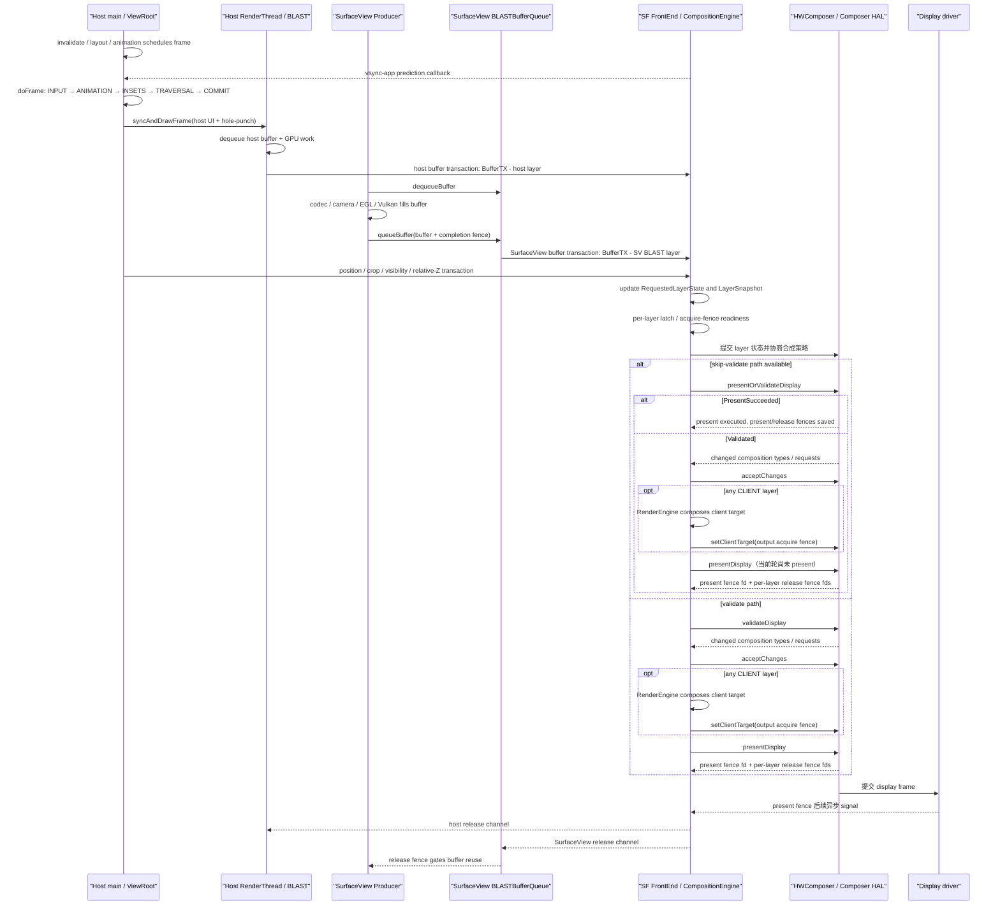

# Android Perfetto 系列 - App 出图类型 - SurfaceView 类型

`SurfaceView` 把一块可见内容交给独立 `Surface`。宿主窗口继续绘制按钮、字幕、遮罩和其它 View，视频、相机预览、地图或游戏画面则由另一套 Producer 直接向独立 BufferQueue 提交 buffer。两路内容到 SurfaceFlinger 才组成最终画面。

分析这类 trace，先把“宿主窗口帧”和“SurfaceView 内容帧”拆开。两者可能由不同进程、不同线程、不同帧率驱动，也各自持有 buffer、fence 和 transaction 状态。只看应用主线程或宿主 `RenderThread`，无法解释画面主体的完整链路。

<!--more-->

## 阅读导航

### 本文目录

- 阅读说明
- 1. 一帧完整流程：两条生产线怎样到达屏幕
- 2. 类型判定：什么证据能确认 SurfaceView
- 3. 形成原因：独立 Surface 解决了什么问题
- 4. 系统结构：宿主、容器层和 BLAST 层
- 5. 版本演进：Android 12 到 Android 17
- 6. 生命周期：Producer 什么时候可以使用 Surface
- 7. 起跑节奏：宿主帧和内容帧由谁驱动
- 8. 汇合过程：buffer、几何、fence 和 HWC
- 9. 源码入口：Android 17 应该跟读哪里
- 10. Perfetto 证据链：怎样复原一帧
- 11. 类型边界：与标准窗口、TextureView 和混合出图区分
- 12. 故障模式：从现象回到责任对象
- 总结

### 系列文章目录

1. [Android Perfetto 系列 - App 出图类型 - 总览与识别方法](S01_rendering_types_overview.md)
2. [Android Perfetto 系列 - App 出图类型 - AOSP 标准类型](S02_aosp_standard_type.md)
3. [Android Perfetto 系列 - App 出图类型 - SurfaceView 类型](S03_surfaceview_type.md)
4. [Android Perfetto 系列 - App 出图类型 - TextureView 类型](S04_textureview_type.md)
5. [Android Perfetto 系列 - App 出图类型 - 混合出图类型](S05_mixed_rendering_type.md)
6. [Android Perfetto 系列 - App 出图类型 - 多窗口类型](S06_multi_window_type.md)
7. [Android Perfetto 系列 - App 出图类型 - Software / 离屏类型](S07_software_offscreen_type.md)
8. [Android Perfetto 系列 - App 出图类型 - Native Graphics 类型](S08_native_graphics_type.md)
9. [Android Perfetto 系列 - App 出图类型 - WebView 类型](S09_webview_type.md)
10. [Android Perfetto 系列 - App 出图类型 - Flutter 类型](S10_flutter_type.md)
11. [Android Perfetto 系列 - App 出图类型 - Camera 类型](S11_camera_type.md)
12. [Android Perfetto 系列 - App 出图类型 - Video Overlay / HWC 类型](S12_video_overlay_hwc_type.md)
13. [Android Perfetto 系列 - App 出图类型 - Game 类型](S13_game_type.md)
14. [Android Perfetto 系列 - App 出图类型 - React Native 类型](S14_react_native_type.md)

## 阅读说明

本文的平台源码固定到 Android 17 / API 37 的 `android-17.0.0_r1`，kernel 源码固定到 `android17-6.18-2026-06_r6`。`SurfaceView`、BLAST、SurfaceFlinger 和 HWC 的调用名按平台 tag 核查；dma-fence 与 sync file 的底层语义按指定 kernel tag 核查。厂商 codec、camera HAL、gralloc、DPU 和 Composer HAL 的实现不在 AOSP 公共源码里，涉及这些模块时必须结合目标设备 trace 与 dump。

版本演进以 Android 12 为起点。更早版本只保留一条仍影响当前 API 解释的兼容信息：Android 官方文档说明，从 Android 7.0 起，`SurfaceView` 的窗口位置会与 View 层级渲染同步更新；旧设备上的异步位置伪影不属于本文 Android 12 之后的主链路。

文中的“SurfaceView layer”是便于分析的统称。Android 17 的应用进程内并非只有一个 `SurfaceControl`：`SurfaceView` 会维护容器层、BLAST buffer layer 和按条件显隐的背景 color layer。SurfaceFlinger FrontEnd 再把 transaction 状态整理成 `RequestedLayerState` 与 `LayerSnapshot`，不能用早期单个 `Layer` 对象的模型解释全部细节。

## 1. 一帧完整流程：两条生产线怎样到达屏幕

以“宿主控制条覆盖在视频 SurfaceView 上”为例，一次屏幕更新包含下面几组工作：

1. 宿主窗口因为输入、动画、布局或重绘请求安排下一帧。`Choreographer` 在没有 pending frame 时请求 `vsync-app`，随后主线程进入 `doFrame()`。
2. 主线程依次处理 `INPUT → ANIMATION → INSETS_ANIMATION → TRAVERSAL → COMMIT`。Traversal 更新普通 View 树，也计算 `SurfaceView` 的位置、尺寸、裁剪、可见性和相对 Z-order。
3. 宿主窗口通过 `ThreadedRenderer.syncAndDrawFrame()` 把绘制状态交给 RenderThread。RenderThread 从宿主窗口的 BLAST 队列取得 buffer，绘制控制条、字幕、遮罩以及默认 Z-below `SurfaceView` 对应的 hole-punch 区域。
4. 独立 Producer 按自己的节奏生成内容。它可能是应用内 EGL/Vulkan 线程，也可能是 codec、camera provider/HAL 或厂商服务参与的跨进程流水线。
5. Producer 从 `SurfaceView` 暴露的 `Surface` 取得可写 buffer，填充后提交 buffer 和完成 fence。这个完成 fence 在 Consumer 一侧成为读取该 buffer 的 acquire fence。
6. Android 17 的 `SurfaceView` 用 `BLASTBufferQueue` 把新 buffer 组织成针对 BLAST layer 的 transaction。与下一块内容 buffer 绑定的外部 transaction，也可以按 frame number 暂存后合并。
7. 宿主几何更新由 `RenderNode.PositionUpdateListener` 生成 `SurfaceControl.Transaction`，再通过 `ViewRootImpl.mergeWithNextTransaction()` 与宿主目标帧合并。UI 线程上的其它 SurfaceView 状态通常通过 `applyTransactionOnDraw()` 随 ViewRoot 下一次 draw transaction 提交。
8. SurfaceFlinger 接收宿主窗口和 SurfaceView 子层的 transaction。FrontEnd 更新 layer 状态和 snapshot；进入合成前，各 buffer layer 分别检查新 buffer、几何状态与 acquire fence 条件。
9. 某个 layer 没有新 buffer 时，可以沿用上次已合成内容。存在新 buffer 但同步条件未满足时，可能推迟采纳；不能据此推断另一条 layer 也会一起等待。
10. CompositionEngine 与 HWC 为每个 layer 协商 composition type。允许 skip validate 时先调用 `presentOrValidateDisplay()`；否则调用 `validateDisplay()`。满足设备能力和保护要求的 SurfaceView layer 可能走 device composition，普通 layer 不满足条件时可能被改为 client composition。
11. `presentOrValidateDisplay()` 返回 `PresentSucceeded` 时，这次 HAL 调用已经执行 present 并保存 fences。返回 `Validated` 或走普通 validate 路径时，SurfaceFlinger 读取 composition changes；若存在 CLIENT layer，RenderEngine 生成 client target，SurfaceFlinger 调用 `setClientTarget()`，随后才用 `presentAndGetReleaseFences()` 收尾。
12. 两条 present 路径最终都得到 present fence 与各 layer 的 release fence。fence fd 返回时通常尚未 signal；present fence 之后的 signal 是 Android 显示栈可观察的 present 边界，不等于面板扫描、光学响应或用户感知完成。release fence 则控制旧 buffer 何时能被对应 Producer 安全复用。

### 显示链路图

这张图把宿主窗口、SurfaceView 内容层和显示合成放在同一条时间线上，用来标出两条生产线各自的提交点与汇合点。



图里有三个容易混淆的边界：

- `PresentSucceeded` 表示合并的 Composer HAL 调用走了 present 分支，并把 present/release fences 保存下来；它不表示面板已经完成扫描。
- `BufferTX - <layerName>` 是按 layer 区分的 buffer transaction 计数或轨迹。宿主和 SurfaceView 应分别观察，不能把两条 counter 当成同一队列。
- View 树只负责宿主 buffer 和 SurfaceView 的管理状态。独立内容 buffer 不会先画进宿主 buffer 再交给 SurfaceFlinger。

## 2. 类型判定：什么证据能确认 SurfaceView

一个页面包含视频或相机预览，不足以证明它使用 `SurfaceView`。MediaCodec、Camera、WebView、游戏引擎都可以把内容接到不同类型的输出目标。判定应建立在 layer、BufferQueue 和 Producer 三类证据上。

### 最小证据集

1. **宿主窗口仍有独立输出**：应用主线程和 RenderThread 继续生成宿主窗口帧，SurfaceFlinger 中存在宿主 App Window layer。
2. **主体内容拥有独立 buffer layer**：layer tree 或 trace 中能找到与 SurfaceView 对应的子层，并看到它自己的 buffer 更新。
3. **两条 buffer 节奏可分离**：宿主窗口与主体内容的 `queueBuffer`、`BufferTX - <layerName>`、acquire/release fence 时序并不完全一致。
4. **几何由 SurfaceControl 管理**：移动、裁剪、显隐或 Z-order 变化体现为 SurfaceView 子树的 transaction，而不是只体现为宿主 HWUI 重绘。

### 仅凭这些信号不能定型

- 看到 `Surface`、EGL swap 或 Vulkan present：普通窗口和 TextureView 也会使用 Surface/BufferQueue。
- 看到 MediaCodec 或 camera 线程：它说明存在媒体 Producer，不说明最终 Consumer 是 SurfaceView。
- 看到 HWC overlay：普通窗口 layer 也可能走 device composition；SurfaceView 也可能因为设备约束走 client composition。
- 看到宿主主线程很空：主体可能独立生产，但也可能只是页面静止。

确认类型后，再回答三个问题：主体 buffer 在哪里生产、几何 transaction 由谁提交、两者在哪一轮 SurfaceFlinger 合成里相遇。

## 3. 形成原因：独立 Surface 解决了什么问题

`SurfaceView` 的价值来自“独立 buffer stream”，不是控件名称。

视频解码器、Camera HAL、EGL/Vulkan 渲染器通常已经能直接生成可显示 buffer。如果先把这些 buffer 采样进宿主 View 树，再由宿主窗口重画，会增加一次纹理采样与合成约束，还会把主体内容的更新节奏绑到宿主 HWUI 帧。独立 Surface 允许 Producer 直接把 buffer 提交给 SurfaceFlinger，并让 HWC 按 layer 评估硬件合成能力。

这条路径适合以下情况：

- 主体内容尺寸大、更新频繁，且已有独立 Producer；
- 视频或相机内容需要保留自己的帧率、色彩空间、HDR 或 protected 属性；
- 设备可能用 overlay plane、scaler 或其它 display hardware 直接处理该 layer；
- 宿主 UI 更新频率与主体内容不同，希望两者各自推进。

代价同样明确：

- 生命周期不再等同于 Activity 生命周期；
- 主体内容不在宿主 HWUI buffer 内，复杂 View 变换、shader、任意混合与截图语义需要重新判断；
- 宿主 hole-punch、SurfaceView 几何和内容 buffer 分属不同状态源，错误同步会出现一帧错位；
- 多个独立 layer 会增加 HWC strategy 的约束，overlay plane 也不是无限资源。

选择 `SurfaceView` 时，应把“少一次宿主采样的机会”和“多一套独立生命周期及同步关系”一起评估。

## 4. 系统结构：宿主、容器层和 BLAST 层

### 4.1 Android 17 的对象关系

Android 17 的 `SurfaceView.createBlastSurfaceControls()` 会维护三类 `SurfaceControl`：

- `mSurfaceControl`：container layer，挂到 `ViewRootImpl.updateAndGetBoundsLayer()` 返回的 bounds layer 下，承载位置、裁剪、相对层级等管理状态；
- `mBlastSurfaceControl`：container 的 child BLAST layer，接收 Producer 提交的内容 buffer；
- `mBackgroundControl`：创建在 container 下的 color layer，在默认 Z-below、内容被声明为 opaque 等条件满足时显示。

对应关系可以写成：

```text
ViewRoot bounds layer
└── SurfaceView container: mSurfaceControl
    ├── content BLAST layer: mBlastSurfaceControl
    └── background color layer: mBackgroundControl
```

这段结构用于读 layer tree。几何状态主要落在 container，内容 buffer 落在 BLAST child；分析时如果只按名字找到 container，却没有继续找到实际携带 buffer 的 child，会把“几何已更新”误写成“内容已提交”。

`BLASTBufferQueue` 由应用进程内的 `SurfaceView` 创建并更新，`SurfaceHolder.getSurface()` 暴露的是 Producer 侧 `Surface`。Producer 可以在同进程，也可以通过 Binder 把 `IGraphicBufferProducer` 能力交给 codec 或 camera 流水线。不能用“SurfaceView 的 Java 对象在应用进程”推出“buffer 填充一定发生在应用进程”。

### 4.2 默认 Z-below 与 hole-punch

默认 composition order 为负，SurfaceView container 位于宿主窗口下方。宿主窗口必须在对应区域留下可透出的部分，下面的内容 layer 才能显示。

Android 17 源码里的关键行为是：

- `gatherTransparentRegion()` 在 SurfaceView 位于宿主下方且绘制已经完成时，参与收集透明区域；
- `draw()` 或 `dispatchDraw()` 根据 `PFLAG_SKIP_DRAW` 分工调用 `clearSurfaceViewPort()`；
- `clearSurfaceViewPort()` 使用 `Canvas.punchHole()`，并结合 View bounds、clip bounds、corner radius 与 alpha；
- `mDrawFinished` 为 false 或 SurfaceView 位于宿主上方时，不走这套默认 hole-punch 条件。

所以，“SurfaceView 挖洞”不是一条固定的 `PorterDuff.Mode.CLEAR` 调用，也不是 SurfaceFlinger 自动在宿主 buffer 上删像素。它是宿主 View 绘制、透明区域和 SurfaceControl 层级共同形成的显示结果。

### 4.3 composition order 与 alpha

Android 17 可用 `setCompositionOrder(int)` 明确控制相对顺序：

| order | 相对宿主窗口 | alpha 落点 | 常见效果 |
|---|---|---|---|
| `< 0` | 宿主窗口下方 | 作用于 hole-punch，不直接调制 Surface 内容 | 宿主按钮、字幕可覆盖在主体内容上 |
| `>= 0` | 宿主窗口上方 | 直接作用于 Surface 内容 | 主体会盖住宿主窗口中重叠的 View |

order 越大，SurfaceView peer 之间的层级越高；相同 order 的相对顺序未定义。旧入口 `setZOrderMediaOverlay()` 与 `setZOrderOnTop()` 在 Android 17 源码里已标记 deprecated，并由 feature flag 管理 API 暴露。面向 API 36 及以上的新代码应优先评估 `setCompositionOrder()`；兼容旧 target 或旧平台时仍需按公开 SDK 可用性处理。

Android 14 起支持任意 alpha，但 Z-below 和 Z-above 的实现语义不同。默认 Z-below 时，半透明值调制的是 hole-punch；两个相互覆盖的 Z-below SurfaceView 不保证得到普通 View 那样的正确混合。复杂交叉透明、任意 shader mask 或把 Surface 内容当普通纹理参与宿主效果时，`TextureView` 往往更符合所需语义。

### 4.4 几何状态与内容状态分开

SurfaceView 的位置、缩放、crop、显隐、圆角和相对 Z-order 属于 `SurfaceControl.Transaction` 状态；视频帧、预览帧或游戏帧属于 BLAST layer 的 buffer 状态。两类状态可以在同一次 SurfaceFlinger transaction 中生效，也可能来自不同提交时刻。

Android 17 的硬件加速路径使用 `RenderNode.PositionUpdateListener` 从 RenderThread 获得 frame number 和最终位置。`applyOrMergeTransaction()` 再调用 `ViewRootImpl.mergeWithNextTransaction(transaction, frameNumber)`，把位置 transaction 与宿主目标帧合并。UI 线程触发的其它更新可通过 `ViewRootImpl.applyTransactionOnDraw()` 随下一次 draw 提交。

需要绑定到 SurfaceView 下一块内容 buffer 的 transaction，使用公开的 `applyTransactionToFrame()`。源码以 `mBlastBufferQueue.getLastAcquiredFrameNum() + 1` 计算目标 frame number，再调用 `mergeWithNextTransaction()`。公开 API 文档也规定了边界：连续渲染时无法严格定义它会绑定哪一帧；调用后没有新内容帧时，该 transaction 也可能不生效。它不是一个“立即显示下一帧”的阻塞承诺。

## 5. 版本演进：Android 12 到 Android 17

SurfaceView 的现代分析基线从 Android 12 开始。这个版本已经使用 `BLASTBufferQueue` 和 parent-child `SurfaceControl` 结构，适合与当前 trace 对照。每一版是否需要改变排查方法，取决于本文关注的对象：buffer 提交、生命周期、alpha、HDR、层级或视觉效果。

| 平台 | 与 SurfaceView 相关的关键变化 | 对 trace / 代码 Review 的影响 |
|---|---|---|
| Android 12 / API 31 | `SurfaceView` 已接入 `BLASTBufferQueue`；container、BLAST child、background layer 组成现代主线，几何 transaction 可与 ViewRoot 帧合并 | 从此应分别看 container 几何与 BLAST child buffer；旧式独立窗口模型不再适合作为主解释 |
| Android 13 / API 33 | 主体仍沿用 Android 12 的 BLAST 与 RenderNode 位置同步结构，没有需要改写本文主链路的公开 SurfaceView 架构变化 | 不应因为系统版本从 12 升到 13 就假设队列或 layer 拓扑改变；仍以设备 layer tree 和源码 tag 为证据 |
| Android 14 / API 34 | 支持任意 alpha；新增 `setSurfaceLifecycle()` 及 visibility/attachment 生命周期策略 | 半透明问题要区分 Z-below hole-punch 与 Z-above Surface alpha；Surface 是否在不可见期间保留，开始有公开策略可配置 |
| Android 15 / API 35 | 新增 `setDesiredHdrHeadroom()` | HDR SurfaceView 可独立表达所需 HDR/SDR headroom；最终可用范围仍受面板、环境、bit depth 和系统策略限制 |
| Android 16 / API 36 | 新增 `setCompositionOrder()` / `getCompositionOrder()`；公开层级控制从两个布尔式旧 API 扩展为整数 order | 多 SurfaceView 的相对层级可表达得更清楚；相同 order 仍未定义，迁移时不能机械替换而忽略正负值语义 |
| Android 17 / API 37 | 新增 `setBlurRegions()` / `getBlurRegions()`；当前源码把 blur region 与 RenderThread 位置、缩放、crop 一起换算，并维持 container + BLAST + background 结构 | blur 坐标相对 SurfaceView bounds，尺寸变化后需要更新；trace 仍要把视觉 blur transaction 与内容 buffer 分开 |

### Android 12：BLAST 成为分析起点

Android 12 tag 的 `SurfaceView.java` 已经导入并创建 `BLASTBufferQueue`，构造 BLAST layer，并通过 `ViewRootImpl.mergeWithNextTransaction()` 合并 RenderThread 位置 transaction。这里确立了当前最重要的两个边界：内容 buffer 归 BLAST child，位置与裁剪归 SurfaceControl transaction。

因此，Android 12 之后看到 SurfaceView 卡顿，不能只问“应用有没有 `queueBuffer()`”。还要看目标 child layer 是否获得新 buffer、对应 acquire fence 是否 ready、container 几何是否在同一显示周期生效。

### Android 13：主链路延续

Android 13 没有引入需要重画本文链路图的公开 SurfaceView 架构变化。这个结论很重要：版本演进不等于每个大版本都必须出现一条新机制。排查 Android 13 时，仍以 BLAST、RenderNode 位置同步、SurfaceHolder 生命周期和 HWC composition 为主。

如果 Android 12 与 13 设备表现不同，优先核对厂商 Composer HAL、gralloc、codec/camera pipeline、刷新率策略及 backport，而不是先假设 AOSP SurfaceView 主结构换代。

### Android 14：alpha 和生命周期成为公开能力

Android 14 的两个变化会直接改变应用行为。

第一，SurfaceView 支持任意 alpha。Z-above 时 alpha 直接作用于 Surface 内容；Z-below 时 alpha 作用于 hole-punch。两种情况在视觉上可能相近，在合成对象和重叠语义上并不相同。

第二，`setSurfaceLifecycle()` 提供三种常量：默认策略、跟随 visibility、跟随 attachment。默认策略等同于跟随 visibility。选择 attachment 策略可以让 SurfaceView 暂时不可见时仍保留 Surface，减少重建，但也会延长 buffer、Producer 连接和相关资源的生命周期。Review 时应检查业务是否同步停止不需要的生产工作。

### Android 15：SurfaceView 独立表达 HDR headroom

`setDesiredHdrHeadroom(float)` 用 HDR 白点相对 SDR 白点的比例表达期望值。`0.0f` 表示交给系统自动选择，合法非零值从 `1.0f` 开始。它是 SurfaceView 自己的请求，不应拿 Window 的 headroom 设置替代。

该 API 表达的是期望，不是硬件保证。分析 HDR 偏暗、亮度跳变或 composition type 变化时，要同时看 Surface dataspace、buffer bit depth、显示能力、系统亮度/环境策略与 HWC 支持。

### Android 16：整数 composition order

`setCompositionOrder(int)` 将“宿主上方或下方”与“多个 SurfaceView 之间谁更高”放到同一个整数模型里。负数位于宿主下方，非负数位于宿主上方，数值更大的 peer 位于更高层；相同数值的 peer 顺序未定义。

旧代码常把 `setZOrderMediaOverlay(true)` 理解成“到最上层”。它只是在仍低于宿主窗口的 SurfaceView 之间选择较高 sublayer。迁移到 composition order 时，应先写出需要的完整相对关系，再分配值。

### Android 17：blur region 与当前实现锚点

`setBlurRegions(Collection<BlurRegion>)` 在 API 37 公开。区域坐标相对 SurfaceView bounds；SurfaceView 尺寸改变后，调用方应更新区域。Android 17 源码在 RenderThread 位置回调里按 window offset、View scale 与 surface-to-node scale 更新 blur 和 crop，说明 blur 的正确位置依赖几何状态，而非内容 Producer 自己处理。

Android 17 当前 layer 树仍以 container、BLAST child 和 background color layer 为核心。文章后续所有类名、方法名和 transaction 边界均以 `android-17.0.0_r1` 为准。

### 旧版本兼容注

官方 `SurfaceView` 类文档至今仍提示：Android 7.0 之前，SurfaceView 位置相对 View 渲染可能异步，平移和缩放可能产生伪影。这个说明用于解释仍需支持古老设备的兼容问题，不进入 Android 12—17 的主时间线，也不能拿来解释现代 BLAST 设备上的每一次几何错位。

## 6. 生命周期：Producer 什么时候可以使用 Surface

Activity 可见、View 已创建和底层 `Surface` 有效是三个不同状态。Producer 能否提交 buffer，应以 `SurfaceHolder.Callback` 为准。

官方契约给出的硬边界是：

- `surfaceCreated()` 在 Surface 创建后调用，业务可以启动或连接渲染 Producer；
- `surfaceChanged()` 在格式或尺寸发生结构变化后调用，并且在 `surfaceCreated()` 之后至少调用一次；
- `surfaceDestroyed()` 在 Surface 销毁前调用。回调返回后，任何线程都不应再访问该 Surface；若渲染线程直接使用它，必须在回调返回前确保线程停止触碰 Surface。

这些回调运行在 SurfaceView 所在 window 的线程，通常是应用主线程。若 Producer 在工作线程或远端服务，回调必须与生产状态同步，不能只把 `Surface` 引用设为 null 就返回。

下面是生命周期顺序的应用侧骨架。`FrameProducer` 是应用自有接口，用来强调所有权，Android SDK 中没有这个类型。

```kotlin
private interface FrameProducer {
    fun attach(surface: Surface)
    fun resize(width: Int, height: Int, format: Int)
    fun detachAndWaitUntilIdle()
}

surfaceView.holder.addCallback(object : SurfaceHolder.Callback {
    override fun surfaceCreated(holder: SurfaceHolder) {
        frameProducer.attach(holder.surface)
    }

    override fun surfaceChanged(
        holder: SurfaceHolder,
        format: Int,
        width: Int,
        height: Int,
    ) {
        frameProducer.resize(width, height, format)
    }

    override fun surfaceDestroyed(holder: SurfaceHolder) {
        frameProducer.detachAndWaitUntilIdle()
    }
})
```

这段代码用应用自有接口表达 `surfaceDestroyed()` 的同步语义。对 EGL/Vulkan 线程，需要停止 swap/present 并释放或切换 native window；对 MediaCodec，需要停止向旧 output Surface 渲染或切换输出；对 Camera，需要完成 session/output configuration 的撤销。具体 API 因 Producer 而异。

### Android 17 内部怎样创建 Surface

下面是源码职责的概念骨架，不是可编译 Java，也省略了 flag、错误恢复、回调和锁。

```text
SurfaceView.updateSurface()
  determine visibility / size / format / parent / lifecycle changes
  createBlastSurfaceControls() when controls are absent
    create container SurfaceControl under ViewRoot bounds layer
    create BLAST child SurfaceControl under container
    create background color layer under container
    create or recreate BLASTBufferQueue
    update BLASTBufferQueue with child, width, height, format
  copySurface()
    mSurface.copyFrom(mBlastBufferQueue)
  apply or merge geometry transaction
  dispatch surfaceCreated / surfaceChanged / surfaceRedrawNeeded
```

这份骨架用于定位 `updateSurface()` 的职责。创建 BLAST 对象、更新 Java `Surface`、提交几何和派发生命周期回调都在同一大方法周围完成，但它们不是同一时刻完成的单个原子操作。trace 中要按实际 transaction、Producer connect 与首个 buffer 分开对齐。

### 常见生命周期错误

- 用 `onResume()` 直接判断 Surface 一定可用：Activity 已恢复时，Surface 回调可能尚未到来。
- 用 `onPause()` 判断 Surface 一定销毁：Android 14 的 attachment 生命周期策略可能保留 Surface。
- `surfaceDestroyed()` 只发异步 stop 消息后立即返回：渲染线程可能继续向即将失效的 Surface 提交。
- 尺寸变化只更新 View，不通知 Producer：Producer buffer 尺寸、container crop 和显示缩放可能暂时不一致。
- 重建后继续复用旧 EGLSurface、ANativeWindow 或 codec output 引用：Java `Surface` 对象外观相似，不代表 native producer connection 未变化。

## 7. 起跑节奏：宿主帧和内容帧由谁驱动

### 7.1 宿主窗口

宿主窗口通常由 `Choreographer` 的 `vsync-app` 预测回调驱动。输入改变控制条位置、动画更新遮罩、Traversal 重新布局 SurfaceView，都会形成宿主帧。宿主 HWUI buffer 包含普通 View 和 hole-punch 结果，不包含 SurfaceView 的主体像素。

宿主窗口慢时，可能出现：

- 控制条、字幕或按钮晚更新；
- SurfaceView container 的位置/crop transaction 晚提交；
- 默认 Z-below 的 hole-punch 仍处于旧位置；
- 宿主 buffer 与已经到达的新内容帧在一轮合成中错位。

### 7.2 独立 Producer

内容 Producer 不必等待宿主 `doFrame()`：

| 内容来源 | 可能参与生产的进程 / 线程 | 优先观察 |
|---|---|---|
| MediaCodec / Codec2 | 应用控制线程、`media.codec` / `media.swcodec`、Codec2 vendor service、厂商组件 | output buffer 时间、render timestamp、目标 Surface 的 queue、protected/HDR 属性 |
| Camera 预览 | 应用 camera 线程、`cameraserver`、camera provider/HAL、厂商进程 | capture result、preview stream、HAL fence、目标 Surface queue |
| EGL / Vulkan / 游戏引擎 | 应用或引擎进程内的渲染线程，GPU driver 工作队列 | CPU frame、EGL swap/Vulkan present、GPU completion fence、queue backpressure |

表中列的是常见位置，不是进程名契约。不同设备会采用不同 codec service、camera provider 和 vendor 进程。确认 Producer 的可靠方法是沿目标 BufferQueue 的 connect、dequeue、queue 与 fence 回溯，而不是按进程名猜测。

### 7.3 帧率不一致是正常状态

宿主可能运行在 60、90 或 120 Hz，视频可能是 24/30 fps，相机节奏受 sensor exposure 和 stream configuration 影响，游戏还会受 frame pacing 与 GPU 负载影响。SurfaceFlinger 每轮显示可以复用某个 layer 的上一块 buffer，所以“宿主有新帧、视频没有新帧”本身不是故障。

需要排查的是：

- 新内容帧是否在期望显示时间前进入 SurfaceFlinger；
- 复用旧 buffer 是内容帧率设计，还是 Producer 迟到；
- 宿主几何和 hole-punch 是否对应当前要显示的内容；
- HWC strategy 是否因为 layer 条件变化产生额外 client composition 或拒绝 protected 路径。

## 8. 汇合过程：buffer、几何、fence 和 HWC

### 8.1 两套 BufferQueue 不共享背压

宿主窗口与 SurfaceView 内容各自有队列和 release channel。宿主 RenderThread 在 `dequeueBuffer()` 等待，说明宿主队列暂时没有可写 slot；它不能证明 SurfaceView 内容队列也堵塞。反过来，codec 或游戏 Producer 被独立队列背压时，宿主按钮仍可能流畅更新。

Producer/Consumer 的通用循环如下。这是概念模型，不代表 MediaCodec、Camera、EGL 和 Vulkan 使用相同 API 名。

```text
Producer                               Consumer / SurfaceFlinger side
dequeueBuffer()  <--- free slot
fill buffer
queueBuffer(buffer, completion fence) ---> acquireBuffer()
                                         wait before reading when required
                                         composite / present
dequeue or reuse waits <--- releaseBuffer(release fence)
```

BufferQueue 传递 buffer handle，不复制整块像素。队列长度、可 dequeue 数量和丢帧模式由 Producer、Consumer 和配置共同决定，不能用固定的“三缓冲”假设解释所有 SurfaceView。

### 8.2 BLAST 怎样把 buffer 变成 transaction

Android 17 的 `BLASTBufferQueue::acquireNextBufferLocked()` 从 Consumer 侧取得 `BufferItem`，把 buffer、acquire fence、frame number、dataspace、HDR metadata、crop、transform 等状态写入 `SurfaceComposerClient::Transaction`。trace 中的 buffer transaction 对应这一类提交，但具体 slice/counter 名会随 tracing 配置和实现变化。

`mergeWithNextTransaction()` 按 frame number 保存外部 transaction；取得对应 buffer 后，`mergePendingTransactions()` 把它并入 buffer transaction。这个机制能把调用方指定的 SurfaceControl 状态与某块内容 buffer 放进同一 transaction 边界，但不能让外部 Producer 提前生成 buffer。

### 8.3 acquire fence：提交不等于可读

Producer 把 GPU、codec、camera 或 blitter 的完成 fence 随 buffer 提交。站在 SurfaceFlinger 这一侧，该 fence 是 acquire fence：在硬件写入完成前，Consumer 不能安全读取 buffer。

普通路径会在满足 transaction/latch 规则的前提下等待 fence ready。Android 还存在 latch unsignaled buffer 的优化：当设备配置与 transaction 条件允许时，SurfaceFlinger 可以先采纳 buffer 状态，把实际 fence wait 推迟到更接近合成读取的位置。这个优化没有消除依赖，也不适用于所有 transaction；看到“已 latch”不能直接写成“GPU/codec 已完成”。

kernel 侧，sync file 把一个 fence 作为 fd 暴露给用户空间，dma-fence 表示跨驱动/硬件工作的依赖。Perfetto 的 `sync_wait`、fence timeline 或驱动事件只能说明等待关系的一部分；要定位 fence 由谁创建，仍需结合 Producer、GPU、codec、camera 与 HWC 轨迹。

### 8.4 几何与 buffer 的三种对齐方式

1. **与宿主帧对齐**：RenderThread 位置回调携带宿主 frame number，`ViewRootImpl.mergeWithNextTransaction()` 合并 container 的位置、scale、crop、show/hide。
2. **与 ViewRoot 下一次 draw 对齐**：UI 线程更新通过 `applyTransactionOnDraw()` 合并到 ViewRoot draw transaction。
3. **与 SurfaceView 下一块内容 buffer 对齐**：`applyTransactionToFrame()` 把外部 transaction 交给 SurfaceView 的 BLAST 队列。

三者服务的目标不同。移动 SurfaceView 时，位置通常应跟宿主渲染帧；修改一个必须与新视频帧同时生效的 child SurfaceControl 状态时，才需要考虑内容 frame transaction。把所有 transaction 都强行绑到内容下一帧，可能在低帧率视频或 Producer 停止时延迟生效。

### 8.5 SurfaceFlinger 的 layer 状态

Android 17 不宜再用下面这种旧式伪调用栈描述：`SurfaceFlinger::commit()` 逐个调用 `Layer::latchBuffer()`，随后直接进入 `composite()`。当前 FrontEnd 会先消费 transactions，更新 `RequestedLayerState`，生成或更新 `LayerSnapshot`；后续再由 composition/latch 相关阶段处理 buffer 与 output 状态。

用于读 trace 的职责骨架如下：

```text
SurfaceFlinger transaction processing
  receive host and SurfaceView transactions
  update RequestedLayerState
  update LayerSnapshot / hierarchy / visibility
  逐个 buffer layer 判断可用性与 latch 状态

CompositionEngine / Output
  build visible layer list for display
  negotiate HWC composition strategy
  run RenderEngine for CLIENT layers when needed
  present and collect present / release fences
```

该骨架解释了为什么同一 SurfaceView container 的几何 transaction 与 BLAST child 的 buffer transaction 要分别观察。FrontEnd 已接收新几何时，buffer layer 仍可能沿用旧内容；也可能新内容到达，而宿主 hole-punch 或 container 几何还未更新。

### 8.6 HWC：独立 layer 只是获得单独评估机会

SurfaceView 经常用于视频和相机，因此容易走 device composition，但“SurfaceView 必定 overlay”是错误结论。HWC 会结合整屏 layer 集合与设备能力判断：

- buffer format、modifier、usage 与 dataspace；
- crop、缩放、旋转、alpha 与 blending；
- HDR metadata、目标颜色模式与显示能力；
- protected/secure 要求；
- 可用 plane、bandwidth、scaler 及厂商限制；
- 其它 layer 同时占用的资源。

普通非 protected layer 不满足 device composition 条件时，可以被改为 CLIENT，由 RenderEngine 合成进 client target。protected buffer 必须保持硬件保护链路；公共 AOSP 文档以 protected overlay 路径解释 DRM 视频，设备若无法建立合规路径，常见结果是黑屏、拒绝显示或播放失败，不能把它当普通 RGBA layer 随意回退到非保护 GPU 合成。

Android 17 的 `HWComposer::getDeviceCompositionChanges()` 支持两类流程：允许 skip validate 时调用 `presentOrValidateDisplay()`；返回 `PresentSucceeded` 代表这次组合调用已执行 present 并保存 fences，返回 `Validated` 才继续读取 changed composition/requests 并接受变化。不允许 skip validate 时走 `validateDisplay()`。无论哪条路径，不能从函数名推断 panel 已经完成扫描。

### 8.7 present fence 与 release fence

- **present fence**：描述本次 display present 工作的完成边界，signal 时间用于 Android 显示栈时序和调度反馈；它不是光学测量。
- **per-layer release fence**：描述 HWC 不再读取对应 layer buffer 的时间；SurfaceFlinger/BLAST/BufferQueue 把它送回各自 Producer，用于安全复用。
- **client target fence**：RenderEngine 输出 client target 后，交给 HWC 的 acquire fence；它与某个 SurfaceView 原始 buffer 的 acquire/release fence 不是同一个对象。

宿主和 SurfaceView 各有 release channel。若 SurfaceView Producer 等 release fence，先找对应 child layer；不要拿宿主窗口的 release 轨迹解释独立队列背压。

## 9. 源码入口：Android 17 应该跟读哪里

### Platform：`android-17.0.0_r1`

| 核查点 | 一手来源 | 用来确认什么 |
|---|---|---|
| SurfaceView 公开语义 | [Android `SurfaceView` reference](https://developer.android.com/reference/android/view/SurfaceView) | Android 14 alpha/lifecycle、Android 15 HDR headroom、Android 16 composition order、Android 17 blur region 的公开契约 |
| 生命周期回调 | [Android `SurfaceHolder.Callback` reference](https://developer.android.com/reference/android/view/SurfaceHolder.Callback) | Surface 有效区间、线程停止责任、尺寸/格式变化语义 |
| Android 17 SurfaceView 实现 | [AOSP `SurfaceView.java`](https://android.googlesource.com/platform/frameworks/base/+/refs/tags/android-17.0.0_r1/core/java/android/view/SurfaceView.java) | hole-punch、container/BLAST/background 创建、生命周期、位置回调、transaction 合并、blur |
| BLAST transaction | [AOSP `BLASTBufferQueue.cpp`](https://android.googlesource.com/platform/frameworks/native/+/refs/tags/android-17.0.0_r1/libs/gui/BLASTBufferQueue.cpp) | `acquireNextBufferLocked()`、`mergeWithNextTransaction()`、`mergePendingTransactions()`、release callback |
| Transaction 数据模型 | [AOSP `SurfaceComposerClient.cpp`](https://android.googlesource.com/platform/frameworks/native/+/refs/tags/android-17.0.0_r1/libs/gui/SurfaceComposerClient.cpp) | Java/native transaction 最终承载的 layer 状态与 buffer 状态 |
| SurfaceFlinger FrontEnd | [AOSP `SurfaceFlinger.cpp`](https://android.googlesource.com/platform/frameworks/native/+/refs/tags/android-17.0.0_r1/services/surfaceflinger/SurfaceFlinger.cpp)、[AOSP FrontEnd](https://android.googlesource.com/platform/frameworks/native/+/refs/tags/android-17.0.0_r1/services/surfaceflinger/FrontEnd/) | transaction 消费、RequestedLayerState、LayerSnapshot 与 hierarchy 更新 |
| HWC strategy / present | [AOSP `HWComposer.cpp`](https://android.googlesource.com/platform/frameworks/native/+/refs/tags/android-17.0.0_r1/services/surfaceflinger/DisplayHardware/HWComposer.cpp)、[HWC composition operations](https://source.android.com/docs/core/graphics/implement-hwc#display_comp_ops) | validate、presentOrValidate、client target、present/release fence |
| BufferQueue / protected buffer | [AOSP BufferQueue and Gralloc](https://source.android.com/docs/core/graphics/arch-bq-gralloc) | Producer/Consumer 循环、handle 传递、SurfaceView 视频队列、保护路径 |
| FrameTimeline 支持边界 | [Perfetto FrameTimeline](https://perfetto.dev/docs/data-sources/frametimeline) | SurfaceView 当前不受完整支持，不能只靠 app FrameTimeline 还原主体内容 |

`SurfaceView.java` 建议按这个顺序阅读：

1. 类注释：默认 Z-below、hole-punch、回调线程、Android 7 兼容注、Android 14 alpha；
2. `gatherTransparentRegion()`、`draw()`、`dispatchDraw()`、`clearSurfaceViewPort()`：宿主怎样露出下方内容；
3. `updateSurface()` 与 `performSurfaceTransaction()`：什么状态变化触发创建、更新和回调；
4. `createBlastSurfaceControls()`：三类 SurfaceControl 与 BLASTBufferQueue；
5. `SurfaceViewPositionUpdateListener` 与 `applyOrMergeTransaction()`：RenderThread 几何怎样绑定宿主 frame number；
6. `applyTransactionToFrame()`：内容下一帧 transaction 的公开边界。

### Kernel：`android17-6.18-2026-06_r6`

本文进入 kernel 的部分只用于解释 fence fd 和驱动同步原语：

- [`drivers/dma-buf/sync_file.c`](https://android.googlesource.com/kernel/common/+/refs/tags/android17-6.18-2026-06_r6/drivers/dma-buf/sync_file.c)：sync file 如何把 fence 暴露为 fd；
- [`drivers/dma-buf/dma-fence.c`](https://android.googlesource.com/kernel/common/+/refs/tags/android17-6.18-2026-06_r6/drivers/dma-buf/dma-fence.c)：dma-fence 的 signal、callback 与 wait 基础语义。

这两个文件不能解释某台设备的 codec、GPU、camera 或 DPU 为什么在某时刻 signal。创建 fence 的具体驱动、vendor HAL 与硬件队列仍需设备源码或 trace。

### 版本演进的一手锚点

- [Android 12 `SurfaceView.java`](https://android.googlesource.com/platform/frameworks/base/+/refs/tags/android-12.0.0_r1/core/java/android/view/SurfaceView.java)：BLAST 基线；
- [Android 13 `SurfaceView.java`](https://android.googlesource.com/platform/frameworks/base/+/refs/tags/android-13.0.0_r1/core/java/android/view/SurfaceView.java)：主链路延续；
- [Android 14 `SurfaceView.java`](https://android.googlesource.com/platform/frameworks/base/+/refs/tags/android-14.0.0_r1/core/java/android/view/SurfaceView.java)：alpha 与 lifecycle；
- [Android 15 `SurfaceView.java`](https://android.googlesource.com/platform/frameworks/base/+/refs/tags/android-15.0.0_r1/core/java/android/view/SurfaceView.java)：HDR headroom；
- [Android 16 `SurfaceView.java`](https://android.googlesource.com/platform/frameworks/base/+/refs/tags/android-16.0.0_r1/core/java/android/view/SurfaceView.java)：composition order；
- [Android 17 `SurfaceView.java`](https://android.googlesource.com/platform/frameworks/base/+/refs/tags/android-17.0.0_r1/core/java/android/view/SurfaceView.java)：blur region 与本文当前实现。

## 10. Perfetto 证据链：怎样复原一帧

### 10.1 采集前先确认数据源

至少需要能够观察：

- app `gfx` / `view` atrace 与调度；
- SurfaceFlinger、layer、transactions、FrameTimeline；
- ftrace 中的 sched、fence/sync 相关事件；
- GPU、camera、codec、binder 或 vendor 数据源，按故障场景增加；
- HWC composition type 或 layer trace，设备支持时开启。

Perfetto 官方 FrameTimeline 文档明确写着 SurfaceView 当前不受完整支持。因此，不能把“SurfaceView 没有独立 app FrameTimeline slice”当成没有新内容帧。SurfaceView 主体应优先用 layer trace、目标 BufferQueue/BLAST、Producer queue、acquire fence、SurfaceFlinger latch 与 present 证据复原；宿主窗口和 SurfaceFlinger 的 FrameTimeline 仍有参考价值。

### 10.2 第一步：建立 layer 身份表

先从 layer tree 或 trace packet 记录这些对象：

| 对象 | 应记录字段 | 目的 |
|---|---|---|
| 宿主 App Window layer | layer id、name、parent、buffer layer id | 对齐宿主 HWUI buffer 与 SurfaceFlinger 状态 |
| SurfaceView container | layer id、name、parent、relative-Z、crop/position | 对齐 View 几何和层级 |
| SurfaceView BLAST child | layer id、name、parent、buffer size、dataspace、composition type | 对齐主体内容 buffer |
| background / embedded child | layer id、parent、visible region | 避免把辅助层当主体 buffer |

Android 17 `SurfaceView.setTag()` 生成的 Java tag 形如 `SV[<identityHash> <windowShortName>]`，`createBlastSurfaceControls()` 再用传入 name 和 `name + "(BLAST)"` 创建 layer。最终 trace 名还可能带 SurfaceFlinger 分配的序号或事务前缀。不要依赖一条硬编码的 `SurfaceView[package/activity]#id` 正则；用 parent-child 关系、buffer 属性和 Producer 连接共同确认。

### 10.3 第二步：把两条生产线分组

宿主组关注：

- `Choreographer#doFrame` 及 Input/Animation/Traversal；
- `syncAndDrawFrame`、RenderThread、GPU work；
- 宿主 BLAST `dequeueBuffer` / queue 与 `BufferTX - <hostLayerName>`；
- SurfaceView position/crop transaction 和宿主 hole-punch 对应的 draw。

主体组关注：

- Producer 的工作线程或服务；
- 目标 Surface 的 connect/dequeue/queue；
- BLAST child 的 `BufferTX - <surfaceViewLayerName>`；
- buffer acquire fence、frame number、dataspace、transform、crop；
- 对应 layer 的 release fence 回传。

两组的时间轴不要用“同一列第 N 帧”机械配对。视频 30 fps、宿主 120 Hz 时，多个宿主帧复用同一个视频 buffer 是正常行为。应用应使用 frame number、transaction id、layer id、fence 和目标 present 周期建立关系。

### 10.4 第三步：检查几何与内容是否同周期生效

发生滑动、旋转、resize、进入画中画前后，记录：

1. 宿主 Traversal 何时计算出新 bounds；
2. `PositionUpdateListener` 对应的 frame number；
3. container position/matrix/crop transaction 何时进入 SurfaceFlinger；
4. hole-punch 所在宿主 buffer 何时提交；
5. BLAST child 新 buffer 何时到达、acquire fence 何时 signal；
6. 哪个 display present 同时采用了新宿主 buffer、新几何和新内容。

三者不齐时，画面可能出现不同组合：

- 新 hole-punch + 旧 container 几何：露出错误区域；
- 新 container 几何 + 旧内容 buffer：内容位置正确但画面时刻旧；
- 新内容 + 旧宿主遮罩：视频已更新，控制层仍是上一帧；
- 新几何 transaction 等下一块低帧率内容 buffer：整体位置变化延迟。

### 10.5 第四步：解释 fence wait

看到 fence wait 时依次确认：

1. 等待发生在哪个进程、线程和 layer；
2. fence 是该 buffer 的 acquire、client target acquire、HWC release，还是 present fence；
3. 上游可能是 GPU、codec、camera、blitter、RenderEngine 还是 display；
4. wait 是否越过目标 deadline；
5. 同一期间 CPU 线程是 running、runnable 还是 blocked。

“等待 fence”只描述依赖，没有自动给出责任模块。GPU completion fence 迟到与 HWC release fence 迟到都会让 Producer 后续受阻，但修复方向完全不同。

### 10.6 第五步：检查 HWC strategy

对每个 display frame，记录 SurfaceView BLAST child 的 composition type。发生 DEVICE→CLIENT、CLIENT→DEVICE、protected layer 消失或 client target 成本突增时，对照以下状态变化：

- alpha、crop、rotation、scale；
- dataspace、HDR metadata、buffer format/usage；
- 同屏 layer 数量与其它 overlay 占用；
- secure/protected flag 与外接显示状态；
- display mode、refresh rate 与分辨率；
- vendor Composer/HWC error 或 fallback 日志。

composition type 变化是结果。没有 vendor capability 和整屏 layer 条件，不能仅凭 YUV/RGBA 或 SurfaceView 类型断定原因。

### 10.7 一次可复用的排查顺序

1. 用 layer tree 证明宿主、container、BLAST child 的关系；
2. 用 SurfaceHolder 回调和 Producer connect 确认生命周期；
3. 分别标出宿主 buffer 与主体 buffer 的提交；
4. 对齐 container 几何、宿主 hole-punch 和主体 buffer；
5. 识别 acquire/release/present fence 的所有者；
6. 检查 SurfaceFlinger 是否复用旧 buffer 或推迟 transaction；
7. 检查 HWC composition type 和 client target；
8. 把目标 display present 与用户看到的异常帧对应起来。

这个顺序能避免两个高频错误：把宿主 RenderThread 的耗时当成视频/相机 Producer 耗时，以及把 SurfaceView 的独立队列背压归因到宿主窗口 buffer。

## 11. 类型边界：与标准窗口、TextureView 和混合出图区分

### 11.1 与标准窗口

标准 HWUI 窗口的主要可见内容被绘制进宿主 App Window buffer，SurfaceFlinger 主要接收该窗口的 buffer layer。SurfaceView 页面仍有宿主窗口，但主体内容另有 BLAST child buffer layer。

区分点不是“有没有 RenderThread”，因为 SurfaceView 页面同样有宿主 RenderThread；区分点是主体像素是否进入宿主最终 buffer。

### 11.2 与 TextureView

TextureView 的 Producer 也向 BufferQueue 交 buffer，但应用侧 `SurfaceTexture`/GL consumer 将其作为纹理交给宿主 HWUI 绘制。最终显示的主体像素进入宿主窗口 buffer，SurfaceFlinger 通常不把它当一个独立可见 SurfaceView child layer。

这带来两组差异：

| 维度 | SurfaceView | TextureView |
|---|---|---|
| 最终可见 layer | 主体是独立 buffer layer | 主体通常进入宿主窗口 layer |
| 变换与混合 | 受 SurfaceControl、Z-order 和 hole-punch 语义约束 | 可作为 View/纹理参与宿主变换与 alpha |
| 额外采样 | 有机会避免宿主再次采样 | 通常需要宿主对纹理采样并绘制 |
| HWC 机会 | 主体可被独立评估 DEVICE/CLIENT | HWC 主要看到合成后的宿主窗口 |
| trace 重点 | 两套 buffer + 几何同步 | Producer buffer + 宿主消费/绘制 |

### 11.3 与混合出图

一个页面可以同时包含多个 SurfaceView、TextureView、WebView、普通 HWUI、弹窗或嵌入式 SurfaceControlViewHost。只要存在 SurfaceView，仍可用本文方法分析它的独立子树；但整页性能不能归结为单个 SurfaceView 类型。

混合出图需要给每个可见 layer 建立生产者、消费者、几何所有者和合成方式映射。某个视频 layer 走 DEVICE，不代表同屏 WebView、模糊遮罩或窗口动画也走 DEVICE。

### 11.4 与 Camera、Video Overlay、Game 文章的关系

Camera、视频和游戏是业务/Producer 类型，SurfaceView 是承载方式。Camera 可以输出到 SurfaceView、TextureView 或 ImageReader；游戏可以使用普通窗口 Surface，也可以嵌入 SurfaceView；视频是否最终得到 overlay 由 HWC strategy 决定。

因此，看到 Camera 或 MediaCodec 不能直接把问题定为 SurfaceView，看到 SurfaceView 也不能直接把问题定为 overlay。先确认承载拓扑，再进入对应 Producer 的专项链路。

## 12. 故障模式：从现象回到责任对象

| 现象 | 首要假设 | 必查证据 | 不应直接下的结论 |
|---|---|---|---|
| 控制条卡，视频流畅 | 宿主 main/RenderThread/宿主 buffer 慢 | doFrame、Traversal、host BufferTX、host GPU | codec 正常就说明整页正常 |
| 视频卡，按钮流畅 | 内容 Producer、独立队列或 acquire fence 迟到 | producer queue、SV BufferTX、codec/camera/GPU fence | 宿主 main 空闲所以系统没有问题 |
| 滑动时视频错位一帧 | container 几何、hole-punch 与内容 buffer 未对齐 | PositionUpdateListener frame number、host buffer、SV child latch | Android 7 以前的异步窗口问题在现代设备复现 |
| 首帧黑屏 | 生命周期、Producer connect、首 buffer、background/visibility | surfaceCreated/Changed、connect、first queue、show transaction | `surfaceCreated()` 到了就一定已有可显示帧 |
| 前后台切换后旧帧或崩溃 | 旧 Surface 仍被线程访问或 Producer 切换不完整 | surfaceDestroyed 返回前后的 queue、EGL/codec/camera 状态 | Activity 生命周期能替代 Surface 生命周期 |
| protected 视频黑屏 | 保护链路或外接显示能力不满足 | protected/secure flag、HWC composition、HDCP/display 状态、vendor error | 让普通 GPU client composition 回退即可 |
| 功耗突然升高 | DEVICE→CLIENT 或 client target 面积/帧率增加 | per-layer composition type、RenderEngine、GPU、display mode | SurfaceView 天生低功耗 |
| Producer `dequeueBuffer()` 长 | 独立队列没有可复用 slot 或 release fence 未回 | 对应 layer release fence、queued/acquired 状态 | 一定是 CPU 调度慢 |
| alpha 动画重叠异常 | Z-below alpha 调制 hole-punch，或多个 peer order 关系不完整 | composition order、host hole-punch、layer alpha | SurfaceView alpha 等同普通 View alpha |
| blur 区域偏移 | API 37 blur 坐标未随 bounds 更新，或几何 transaction 未同步 | blur region、SurfaceView bounds、scale/crop、position callback | Producer buffer 自己画错了 blur |

### Review 时必须回答的十个问题

1. 主体内容是否落在独立 BLAST child layer？
2. 谁持有 Producer，buffer 填充发生在哪个线程或服务？
3. `Surface` 的有效期由哪套 callback 和 lifecycle strategy 控制？
4. 宿主窗口 buffer 包含哪些 UI，hole-punch 在哪里形成？
5. SurfaceView container 的 parent、crop、position 和 composition order 是什么？
6. 新几何跟宿主 frame 对齐，还是被绑定到下一块内容 buffer？
7. acquire fence、release fence 和 present fence 分别属于谁？
8. SurfaceFlinger 本轮采用新 buffer 还是复用旧 buffer？
9. HWC 把主体 layer 判为 DEVICE 还是 CLIENT，变化前后有哪些 layer 条件不同？
10. 用户看到的异常对应哪个 display present，而不是哪个 CPU slice 的结束？

这十个问题都有 trace 或源码答案后，SurfaceView 问题才能从“画面像是慢一帧”收敛到可修复的责任边界。

## 总结

SurfaceView 页面的核心结构是两条独立生产线：宿主窗口由 Choreographer、主线程和 RenderThread 生成普通 View buffer；主体内容由 codec、camera、EGL/Vulkan 或其它 Producer 向 SurfaceView 的独立 BLAST layer 提交 buffer。SurfaceFlinger 依据每个 layer 的 transaction、snapshot、buffer 和 fence 状态完成组合，HWC 再决定 DEVICE 或 CLIENT composition。

Android 17 的分析要分清 container 几何、BLAST child buffer、宿主 hole-punch 和 HWC composition 四个对象。生命周期以 `SurfaceHolder.Callback` 为边界，几何同步要区分宿主 frame transaction 与内容下一帧 transaction，fence fd 返回也不代表 fence 已 signal。Perfetto 的 FrameTimeline 对 SurfaceView 主体不提供完整支持，layer/BufferQueue/Producer/fence 证据必须补齐。

版本上，Android 12 是现代 BLAST 基线；Android 14 增加 alpha 与 lifecycle，Android 15 增加 HDR headroom，Android 16 增加 composition order，Android 17 增加 blur region。面对任一版本，先用该版本 tag 和设备 layer tree 确认对象，再用同一条证据链复原异常帧。
