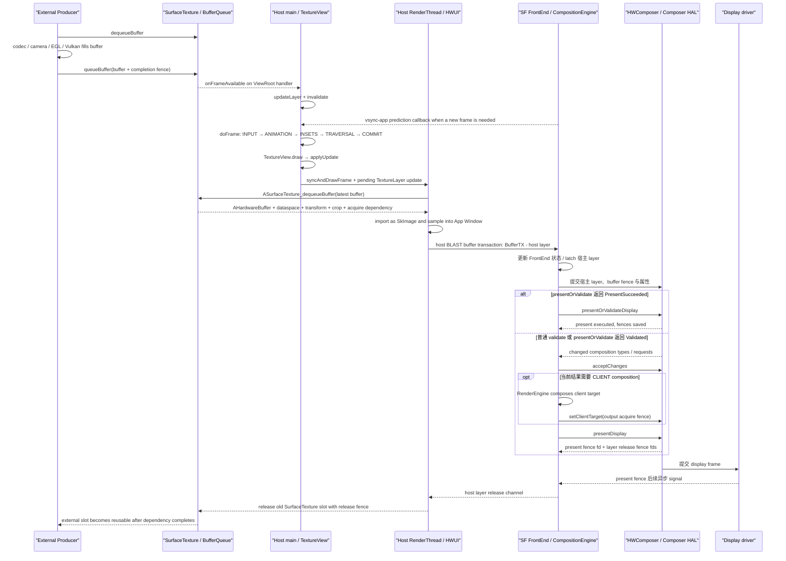

# Android Perfetto 系列 - App 出图类型 - TextureView 类型

`TextureView` 接收外部 Producer 的 buffer，但不会把这条 buffer stream 直接交给 SurfaceFlinger 显示。宿主 RenderThread 先消费 `SurfaceTexture` 中的最新 buffer，把它当纹理采样进 App Window buffer；SurfaceFlinger 最终看到的是宿主窗口 layer。

这条路径有两次生产：外部 Producer 生成内容 buffer，宿主 HWUI 再生成窗口 buffer。任意一次迟到、fence 等待或队列背压，都可能让用户看到旧内容或整窗晚一帧。

<!--more-->

## 阅读导航

### 本文目录

- 阅读说明
- 1. 一帧完整流程：外部 buffer 怎样进入宿主窗口
- 2. 类型判定：怎样证明页面使用 TextureView 路径
- 3. 选择原因：为什么接受一次宿主采样
- 4. 系统结构：SurfaceTexture、TextureLayer 与 App Window
- 5. 生命周期：SurfaceTexture 的可用期和所有权
- 6. 调度与消费：onFrameAvailable 怎样触发宿主帧
- 7. 版本演进：Android 12 到 Android 17
- 8. 同步与成本：两套队列、三类 fence、一次宿主 GPU 采样
- 9. 源码入口：Android 17 应该跟读哪里
- 10. Perfetto 证据链：按两次生产复原一帧
- 11. 类型边界与故障模式
- 总结

### 系列文章目录

1. [Android Perfetto 系列 - App 出图类型 - 总览与识别方法](S01_rendering_types_overview.md)
2. [Android Perfetto 系列 - App 出图类型 - AOSP 标准类型](S02_aosp_standard_type.md)
3. [Android Perfetto 系列 - App 出图类型 - SurfaceView 类型](S03_surfaceview_type.md)
4. [Android Perfetto 系列 - App 出图类型 - TextureView 类型](S04_textureview_type.md)
5. [Android Perfetto 系列 - App 出图类型 - 混合出图类型](S05_mixed_rendering_type.md)
6. [Android Perfetto 系列 - App 出图类型 - 多窗口类型](S06_multi_window_type.md)
7. [Android Perfetto 系列 - App 出图类型 - Software / 离屏类型](S07_software_offscreen_type.md)
8. [Android Perfetto 系列 - App 出图类型 - Native Graphics 类型](S08_native_graphics_type.md)
9. [Android Perfetto 系列 - App 出图类型 - WebView 类型](S09_webview_type.md)
10. [Android Perfetto 系列 - App 出图类型 - Flutter 类型](S10_flutter_type.md)
11. [Android Perfetto 系列 - App 出图类型 - Camera 类型](S11_camera_type.md)
12. [Android Perfetto 系列 - App 出图类型 - Video Overlay / HWC 类型](S12_video_overlay_hwc_type.md)
13. [Android Perfetto 系列 - App 出图类型 - Game 类型](S13_game_type.md)
14. [Android Perfetto 系列 - App 出图类型 - React Native 类型](S14_react_native_type.md)

## 阅读说明

平台源码固定到 Android 17 / API 37 的 `android-17.0.0_r1`，kernel 源码固定到 `android17-6.18-2026-06_r6`。`TextureView`、`SurfaceTexture`、HWUI `TextureLayer` / `DeferredLayerUpdater`、宿主 BLAST、SurfaceFlinger 与 HWC 的类名和调用名按平台 tag 核查；sync file 与 dma-fence 的底层语义按指定 kernel tag 核查。

MediaCodec、Camera、Web/地图引擎、GPU driver、gralloc 与 vendor Composer 的具体实现会因设备而变。正文只把 AOSP 能确认的 Consumer 和宿主显示边界固定下来，Producer 所在进程、buffer format、硬件等待与颜色处理必须用目标设备证据确认。

版本演进以 Android 12 为起点。Android 12 的 HWUI 已经使用 `ASurfaceTexture_dequeueBuffer()`、`AHardwareBuffer` 和 `SkImage` 消费 TextureView 内容，所以不能把这条路径写成 Android 17 新增；Android 17 是本文当前源码锚点。

## 1. 一帧完整流程：外部 buffer 怎样进入宿主窗口

以 Camera 预览 TextureView 上叠加普通 View 对焦框为例，一次可见更新包括下面 12 步：

1. Camera、codec、EGL/Vulkan 或其它外部 Producer 按自己的节奏取得可写 buffer。
2. Producer 填充内容，并把 buffer 与完成 fence 提交给 `SurfaceTexture` 背后的 BufferQueue。完成 fence 在应用侧 Consumer 看来是 acquire fence。
3. BufferQueue 通知 `SurfaceTexture.OnFrameAvailableListener`。Android 17 的 `TextureView` 把 listener 投递到 `mAttachInfo.mHandler`，也就是宿主 ViewRoot 所在线程。
4. listener 调用 `updateLayer()` 和 `invalidate()`。前者设置 TextureLayer 待更新标记，后者把宿主 View 标脏；已有 traversal/frame 时请求会被合并，没有 pending frame 时才继续申请新的 `vsync-app`。
5. 宿主主线程进入 `Choreographer#doFrame()`，按 `INPUT → ANIMATION → INSETS_ANIMATION → TRAVERSAL → COMMIT` 整理 View 树。
6. `TextureView.draw()` 在硬件加速 Canvas 上调用 `applyUpdate()`。它执行 `TextureLayer.prepare()`、`TextureLayer.updateSurfaceTexture()`，并由 `HardwareRenderer.pushLayerUpdate()` 把 native updater 放进 RenderThread 的 pending layer updates。
7. `onSurfaceTextureUpdated()` 在这次 UI 线程 `applyUpdate()` 之后调用。此时只完成了更新请求记录，RenderThread 尚不一定已经取得新 buffer。
8. UI 线程通过 `syncAndDrawFrame()` 把宿主树状态交给 RenderThread。`DrawFrameTask::syncFrameState()` 先处理 pending layer updates；`DeferredLayerUpdater::apply()` 调用 `ASurfaceTexture_dequeueBuffer()` 取得最新 `AHardwareBuffer`、dataspace、transform、crop、HDR metadata 与 fence 信息。
9. Android 17 源码明确让 `ASurfaceTexture_dequeueBuffer()` 丢弃除最新一帧外的 pending frame。RenderThread 将取得的 buffer 转为 Skia 可采样 `SkImage`，再把 TextureView 内容、对焦框和其它 View 一起画进 App Window buffer。
10. 宿主 RenderThread 将窗口 buffer 和自己的完成 fence 提交给 App Window BLAST。SurfaceFlinger server 收到的是宿主 layer 的 buffer transaction，TextureView 输入流没有成为一个独立可见 SF layer。
11. SurfaceFlinger 对宿主 layer 完成 transaction readiness、snapshot/latch 与 composition 准备。HWC 只能对整个宿主 layer 选择 DEVICE 或 CLIENT，不能把已栅格化进窗口 buffer 的 TextureView 区域单独交给 overlay plane。
12. validate/present 流程产生 present fence 和宿主 layer release fence。外部 SurfaceTexture 队列还有自己的 release fence 与 slot 回收；两套 release channel 分别约束外部 Producer 和宿主窗口 Producer。

### 显示链路图

这张图用来区分外部 Producer 的首次提交、宿主 HWUI 的纹理消费和 App Window 的第二次提交。



图里有两个“提交完成”都不等于用户可见：外部 `queueBuffer()` 只把内容交到应用进程内的 SurfaceTexture Consumer；宿主 `queueBuffer()` 只把最终窗口内容交给 BLAST/SF。用户可见结果还取决于 acquire fence、宿主 GPU、SF/HWC 与 display present。

`PresentSucceeded` 表示合并 HAL 调用已走 present 分支并保存 fences，不能再把后面的 `presentAndGetReleaseFences()` 画成必经调用，也不能写成 panel 已扫描完成。

## 2. 类型判定：怎样证明页面使用 TextureView 路径

视频、相机或 EGL 输出不等于 TextureView。定型至少需要以下证据：

1. 外部 Producer 的目标是 `SurfaceTexture` / 由它创建的 `Surface`；
2. SurfaceTexture Consumer 位于应用 HWUI 路径，能找到 `TextureView`、`TextureLayer`、pending layer update 或 `DeferredLayerUpdater` 相关状态；
3. SurfaceFlinger layer tree 没有与这条输入流对应的独立可见 buffer layer，主体像素最终出现在宿主 App Window buffer；
4. 新外部帧通过 `onFrameAvailable → updateLayer/invalidate → 宿主 frame` 影响显示；
5. 宿主 RenderThread/GPU 对外部 buffer 进行采样，再提交宿主 BLAST buffer。

下面这些信号不能单独定型：

- `SurfaceTexture` 类名：应用也可以自己用 GLConsumer 消费，不一定交给 TextureView；
- EGL swap、MediaCodec 或 camera service：它们只证明存在 Producer；
- 只有宿主 App Window layer：普通 HWUI 页面同样只有这个主体 layer；
- 宿主 GPU 较忙：普通阴影、模糊、图片和 Compose 绘制也会增加 GPU 成本。

可靠判断要同时连接外部 queue、TextureView listener/HWUI consumer 和宿主窗口提交。

## 3. 选择原因：为什么接受一次宿主采样

TextureView 的优势是内容进入宿主 View 合成语义：

- 可以使用普通 View 的 alpha、rotation、scale、translation 与 transition；
- 可以被父 View 裁剪，并与兄弟 View 按常规绘制顺序混合；
- `setTransform(Matrix)` 可以调整内容在 TextureView bounds 内的采样变换；
- 截取宿主窗口、做统一视觉效果或复杂转场时，内容已经位于宿主栅格化结果中。

代价是多一个 Consumer 和一次宿主采样：

- 外部 buffer 先进入 SurfaceTexture 队列，宿主帧到来后才被消费；
- 高分辨率内容会增加宿主 GPU 采样与内存带宽；
- format/dataspace 需要的颜色处理、缩放、alpha 与裁剪都落入宿主 GPU 路径；
- HWC 看不到 TextureView 区域的独立 layer，无法单独为它分配 overlay；
- protected 内容通常不能由普通 HWUI 上下文读取，播放器和相机安全场景往往要求独立受保护 Surface 路径。

### 选择边界

下面的判断树用于决定内容应保留在宿主窗口中，还是改用独立 Surface 承载。

```text
内容需要普通 View 级的复杂变换或交叉混合？
├── 是：评估 TextureView，并测量宿主 GPU、延迟与内存带宽
└── 否：继续判断是否需要独立 Surface
    ├── 需要低复制/overlay/protected 路径：优先评估 SurfaceView
    └── 生产内容本来就在宿主 HWUI：保留普通 View / Compose
```

这不是固定性能排名。小尺寸、低帧率 TextureView 的额外成本可能很低；复杂多 layer 页面中的 SurfaceView 也可能因 HWC 资源不足回到 client composition。选择应基于目标分辨率、帧率、视觉效果、保护要求和设备组合能力。

## 4. 系统结构：SurfaceTexture、TextureLayer 与 App Window

### 4.1 两套 Producer/Consumer

TextureView 页面至少存在两套 buffer 周转：

```text
External Producer
  → SurfaceTexture BufferQueue
  → app-process HWUI Consumer / DeferredLayerUpdater
  → GPU texture sampling
  → App Window buffer Producer
  → host BLASTBufferQueue
  → SurfaceFlinger Consumer / HWC
```

第一套队列的 Consumer 在应用进程，第二套队列的 Consumer 面向 SurfaceFlinger 显示链。两套队列拥有各自的 slot、acquire/release fence 与背压，不能用宿主 `BufferTX` 推断外部 SurfaceTexture 队列深度。

### 4.2 Java 与 native 对象

Android 17 的主要对象关系是：

- `TextureView`：View 生命周期、listener、dirty 标记、transform、opaque 与绘制入口；
- `SurfaceTexture`：向 Producer 暴露 BufferQueue producer 端，并承载 frame-available 通知；
- `TextureLayer`：Java HWUI layer，调用 native `DeferredLayerUpdater`，通过 `HardwareRenderer.pushLayerUpdate()` 进入 RenderThread；
- `DeferredLayerUpdater`：RenderThread 侧取得最新 `AHardwareBuffer`，创建/更新 `SkImage`，保存 crop、transform、dataspace 和 HDR 信息；
- App Window `Surface` / BLAST：接收宿主 HWUI 最终 buffer，并把它提交给 SurfaceFlinger。

HWUI 内部的 `TextureLayer` 不是 SurfaceFlinger layer。两者都使用“layer”一词，但一个是应用内渲染对象，一个是系统合成对象。trace Review 必须写出对象所属进程和消费者。

### 4.3 硬件加速是前提

Android `TextureView` 类契约明确规定：只能用于硬件加速窗口；软件渲染时不绘制内容。Android 17 的 `onAttachedToWindow()` 会在未开启硬件加速时记录 warning，`draw()` 也只在 `canvas.isHardwareAccelerated()` 时创建和绘制 `TextureLayer`。

这条约束与“外部 Producer 能否继续 queue”无关。Producer 可能仍在输出，TextureView 却因为宿主不是硬件加速窗口而没有可见结果。黑屏排查应同时看窗口硬件加速、SurfaceTexture 生命周期和 Producer 状态。

### 4.4 opaque 与 transform

TextureView 默认假设内容 opaque。调用 `setOpaque(false)` 会改变 HWUI layer 的 blending 语义，可能增加混合成本；它不会自动让 Producer buffer 具有正确 alpha。

`setTransform(Matrix)` 只改变 SurfaceTexture 内容在 TextureView bounds 内的采样变换，不改变 View 的 layout bounds 与触摸命中区域。预览方向、镜像、center-crop 与触摸坐标映射需要使用同一套变换关系，否则画面和交互会错位。

## 5. 生命周期：SurfaceTexture 的可用期和所有权

`TextureView.SurfaceTextureListener` 是应用可依赖的生命周期边界：

| 回调 | 精确含义 | 应用责任 |
|---|---|---|
| `onSurfaceTextureAvailable()` | TextureView 已有可用 SurfaceTexture 和当前尺寸 | 创建 `Surface`，连接单一 Producer；保存并管理 `Surface` 的 release |
| `onSurfaceTextureSizeChanged()` | TextureView 尺寸改变，默认 buffer size 已更新 | 更新 Producer 输出尺寸、viewport 或采样变换；避免无意的大比例缩放 |
| `onSurfaceTextureUpdated()` | UI 线程的 `applyUpdate()` 已调用 `TextureLayer.updateSurfaceTexture()` | 只能当更新请求通知，不能证明 RenderThread 已 acquire、GPU 已采样或用户已看到 |
| `onSurfaceTextureDestroyed()` | TextureView 即将放弃当前 SurfaceTexture | 返回 true 由 TextureView release；返回 false 表示调用方接管，之后必须自行 release |

Android 类文档还规定同一 TextureView 同时只能有一个 Producer。Camera preview 和 `lockCanvas()` 不能并发写同一个 SurfaceTexture。

### 所有权容易出错的两个入口

1. `setSurfaceTexture(newTexture)` 会立即 release 旧 SurfaceTexture，不调用旧对象的 `onSurfaceTextureDestroyed()`；传入的新对象也不会触发 `onSurfaceTextureAvailable()`。调用前，新对象必须与所有 GL 上下文 detach。
2. `onSurfaceTextureDestroyed()` 返回 false 后，TextureView 不会 release。调用方若既不复用也不 release，会保留 BufferQueue、GraphicBuffer 和 native 资源。

下面是应用自有 Producer 的生命周期骨架。`FrameProducer` 不是 Android SDK 类型。

```kotlin
private interface FrameProducer {
    fun attach(surface: Surface, width: Int, height: Int)
    fun resize(width: Int, height: Int)
    fun detachAndWaitUntilIdle()
}

private var producerSurface: Surface? = null

textureView.surfaceTextureListener = object : TextureView.SurfaceTextureListener {
    override fun onSurfaceTextureAvailable(st: SurfaceTexture, width: Int, height: Int) {
        producerSurface = Surface(st).also { frameProducer.attach(it, width, height) }
    }

    override fun onSurfaceTextureSizeChanged(st: SurfaceTexture, width: Int, height: Int) {
        frameProducer.resize(width, height)
    }

    override fun onSurfaceTextureUpdated(st: SurfaceTexture) = Unit

    override fun onSurfaceTextureDestroyed(st: SurfaceTexture): Boolean {
        frameProducer.detachAndWaitUntilIdle()
        producerSurface?.release()
        producerSurface = null
        return true
    }
}
```

这段代码强调两个等待边界：Producer 停止触碰旧目标后，`onSurfaceTextureDestroyed()` 才返回；应用创建的 `Surface` 由应用 release。MediaCodec、Camera、EGL/Vulkan 的停止与切换 API 不同，需要按实际 Producer 实现。

### visibility 与 detach

Android 17 的 `onVisibilityChanged()` 在 TextureView 不可见时移除 `OnFrameAvailableListener`，减少无意义的宿主更新；恢复可见时重新注册 listener，并调用 `updateLayerAndInvalidate()`。View detach 时会销毁 hardware layer，并按 listener 返回值处理 SurfaceTexture。

所以，不可见期间 Producer 继续 queue 并不保证宿主消费；恢复后可能直接取队列中的最新 buffer。Tab 切换、RecyclerView 复用和前后台切换出现旧帧时，要把 listener 是否注册、Producer 是否继续、SurfaceTexture 是否被替换一起检查。

## 6. 调度与消费：onFrameAvailable 怎样触发宿主帧

### 6.1 frame-available 回调

`TextureView.getTextureLayer()` 创建或绑定 SurfaceTexture 后执行：

```text
SurfaceTexture.setOnFrameAvailableListener(mUpdateListener, mAttachInfo.mHandler)

mUpdateListener.onFrameAvailable(surfaceTexture)
  updateLayer()   // set mUpdateLayer = true
  invalidate()    // mark host View dirty
```

这份概念骨架直接对应 Android 17 `TextureView.java`。handler 决定回调进入宿主 ViewRoot 线程；回调不是 RenderThread acquire，也不是独立 VSync。

### 6.2 invalidate 的合并规则

`invalidate()` 会把 dirty region 送到 ViewRoot。若 traversal 已安排或当前正在绘制，更新可能并入已有宿主帧；没有 pending frame 时，`scheduleTraversals()` 注册 traversal VSync callback，`Choreographer` 再申请下一次 VSync。

因此，外部 `queueBuffer()` 到可见帧有三种常见时序：

- **赶上已排宿主帧的 TextureLayer acquire**：当前帧采到新 buffer；
- **回调并入当前 traversal，但到达晚于 RenderThread acquire**：本轮仍采旧 buffer，下一轮才更新；
- **宿主没有 pending frame**：回调触发新的宿主帧请求，至少还要经过一次 app frame 和窗口提交。

不能把每个 `onFrameAvailable()` 与一个独立 `vsync-app` 一一对应，也不能仅凭 Producer swap 在主线程 `doFrame` 之前就断言一定赶上当前帧。关键截止点是 RenderThread 处理该 TextureLayer pending update 的时刻。

### 6.3 UI 更新与 RenderThread acquire 分开

Android 17 的职责骨架如下；这是源码结构示意，不是可编译调用栈。

```text
UI thread
TextureView.draw(hardwareAcceleratedCanvas)
  getTextureLayer()
  applyUpdate()
    TextureLayer.prepare(width, height, opaque)
    TextureLayer.updateSurfaceTexture()
      HardwareRenderer.pushLayerUpdate(layer)
    listener.onSurfaceTextureUpdated(surfaceTexture)
  recordingCanvas.drawTextureLayer(layer)

RenderThread
DrawFrameTask::syncFrameState()
  apply pending layer updates
    DeferredLayerUpdater::apply()
      ASurfaceTexture_dequeueBuffer(...)
      discard older pending frames, keep latest
      import AHardwareBuffer and update SkImage
  CanvasContext::prepareTree()
CanvasContext::draw()
  sample TextureLayer into App Window buffer
```

`onSurfaceTextureUpdated()` 的名字很容易造成误判。它发生在 UI 线程提交 layer update 之后，早于 RenderThread 的实际 acquire；不能用它测量外部帧到显示的完成时间。

## 7. 版本演进：Android 12 到 Android 17

| 平台 | TextureView/HWUI 相关变化 | 对 trace 与 Review 的影响 |
|---|---|---|
| Android 12 / API 31 | `DeferredLayerUpdater` 已使用 `ASurfaceTexture_dequeueBuffer()`、`AHardwareBuffer`、`SkImage`，并取得 SurfaceTexture Consumer ownership | Android 12 已不能只用旧 `updateTexImage()` 调用名解释 HWUI TextureView；消费点在 RenderThread pending layer update |
| Android 13 / API 33 | `DeferredLayerUpdater` 增加 CTA-861.3 / SMPTE 2086 HDR metadata 读取，并把最大 luminance 信息交给 HWUI layer | HDR TextureView 除 dataspace 外还要看 metadata；最终 tone/color 结果仍取决于 Skia、display 与设备能力 |
| Android 14 / API 34 | 本文跟踪的 listener→TextureLayer→DeferredLayerUpdater→App Window 主拓扑延续，没有需要改画主流程的公开结构变化 | 不应把 SurfaceView 在 API 34 的 alpha/lifecycle 新规则套给 TextureView |
| Android 15 / API 35 | `TextureView` 源码加入受 `toolkitSetFrameRateReadOnly` flag 控制的 `SurfaceTexture.OnSetFrameRateListener`，把输入流 frame-rate 请求转成 View requested frame rate | 这是 frame-rate hint 桥接，不是强制切换显示刷新率；必须确认 flag、Producer 请求、窗口和系统刷新率策略 |
| Android 16 / API 36 | Android 15 的 frame-rate bridge 与既有 AHardwareBuffer/SkImage 消费路径继续存在，核心拓扑不变 | 跨版本差异优先排查设备刷新率策略、GPU backend、vendor driver 与应用版本 |
| Android 17 / API 37 | 本文当前锚点延续上述结构；`DeferredLayerUpdater` 处理 crop、transform、dataspace、HDR metadata 与每个 slot 的 SkImage 缓存 | 所有方法名按 `android-17.0.0_r1` 核查；当前存在的机制不能自动写成 Android 17 首次引入 |

### Android 12：当前消费模型已经成立

Android 12 的 `DeferredLayerUpdater::apply()` 已调用 `ASurfaceTexture_dequeueBuffer()`，取得 `AHardwareBuffer` 后创建 Skia image，并在需要时等待/生成 fence。旧文章常把 TextureView 的每帧消费写成 `SurfaceTexture.updateTexImage()`；该方法仍是公开 SurfaceTexture/GLConsumer 语义的一部分，但不是 Android 12—17 HWUI TextureView 主路径的准确源码落点。

### Android 13：HDR metadata 进入 HWUI layer

Android 13 tag 相比 Android 12 增加 HDR10 SMPTE 2086 与 CTA-861.3 metadata 的读取，计算内容最大 luminance 并更新 layer。Review HDR 视频或相机预览时，不能只看 `PixelFormat` 或“是否 TextureView”；要同时看 AHardwareBuffer format、dataspace、metadata、宿主窗口颜色策略和最终 composition。

### Android 14：拓扑稳定

Android 14 没有改变本文的两套队列关系：外部 SurfaceTexture 仍由应用 HWUI 消费，宿主 App Window 仍通过 BLAST 进入 SurfaceFlinger。版本变化若只出现在 SurfaceView API，不能迁移成 TextureView 结论。

### Android 15：frame-rate 请求向 View 体系传递

在 flag 开启时，TextureView 为 SurfaceTexture 注册 `OnSetFrameRateListener`。Producer 对 native window 的 frame-rate 请求可以更新 TextureView 的 requested frame rate 与 compatibility。系统随后如何选择 display mode，还要结合窗口、其它 layer、FrameRateOverride 与刷新率策略；这条 listener 不保证 24 fps 内容一定切到 24/48/120 Hz。

### Android 16：主线延续

Android 16 的 TextureView 继续使用相同的应用内 Consumer 和宿主再提交路径。没有结构替换时，跨版本性能变化更可能来自应用构建、Producer cadence、Skia backend、GPU driver、刷新率策略或 vendor backport。结论仍需 trace 证据。

### Android 17：当前实现

Android 17 的 `DeferredLayerUpdater` 按 slot 复用 `SkImage` 包装；buffer、dataspace 或内容变化时更新 image，处理当前 crop、window transform 与 HDR 最大 luminance。`ASurfaceTexture_dequeueBuffer()` 仍保留“丢弃除最新一帧外的 pending frame”注释。

TextureView 会优先显示最新可用内容，但“丢弃旧 pending frame”不等于端到端低延迟：Producer 迟到、listener 排队、宿主错过 acquire、宿主 GPU 过载或窗口 BLAST 背压仍会增加延迟。

### 固定版本来源

- [Android 12 `DeferredLayerUpdater.cpp`](https://android.googlesource.com/platform/frameworks/base/+/refs/tags/android-12.0.0_r1/libs/hwui/DeferredLayerUpdater.cpp)：确认 AHardwareBuffer/SkImage 消费基线；
- [Android 13 `DeferredLayerUpdater.cpp`](https://android.googlesource.com/platform/frameworks/base/+/refs/tags/android-13.0.0_r1/libs/hwui/DeferredLayerUpdater.cpp)：确认 HDR metadata 处理；
- [Android 14 `TextureView.java`](https://android.googlesource.com/platform/frameworks/base/+/refs/tags/android-14.0.0_r1/core/java/android/view/TextureView.java)：确认 listener、生命周期和宿主更新拓扑；
- [Android 15 `TextureView.java`](https://android.googlesource.com/platform/frameworks/base/+/refs/tags/android-15.0.0_r1/core/java/android/view/TextureView.java)：确认 gated frame-rate listener；
- [Android 16 `DeferredLayerUpdater.cpp`](https://android.googlesource.com/platform/frameworks/base/+/refs/tags/android-16.0.0_r1/libs/hwui/DeferredLayerUpdater.cpp)：确认主消费路径延续；
- [Android 17 `TextureView.java`](https://android.googlesource.com/platform/frameworks/base/+/refs/tags/android-17.0.0_r1/core/java/android/view/TextureView.java) 与 [`DeferredLayerUpdater.cpp`](https://android.googlesource.com/platform/frameworks/base/+/refs/tags/android-17.0.0_r1/libs/hwui/DeferredLayerUpdater.cpp)：确认本文当前实现。

## 8. 同步与成本：两套队列、三类 fence、一次宿主 GPU 采样

### 8.1 外部 acquire fence

Producer 随 buffer 提交完成 fence。HWUI Consumer 在安全读取前必须遵守依赖；来源可能是 GPU、codec、camera、blitter 或其它硬件。等待可能体现在 CPU `sync_wait`、RenderThread fence wait、GPU-side wait 或 driver queue，不能只用一条 RenderThread slice 判断来源。

### 8.2 SurfaceTexture release fence

HWUI 不再使用旧输入 buffer 后，将 release fence 与 slot 归还 SurfaceTexture BufferQueue。Producer 后续 `dequeueBuffer()`、EGL swap 或 codec/camera output 可能因没有可复用 slot 而等待。

外部队列背压的证据是目标 SurfaceTexture 队列状态、Producer dequeue、对应 release fence 和消费 cadence；宿主 App Window 的 `BufferTX` 不足以说明这条队列堵塞。

### 8.3 宿主窗口 acquire/release fence

宿主 GPU 将 TextureView 与其它 View 画入 App Window buffer，并向宿主 BLAST 提交完成 fence。SurfaceFlinger/HWC 使用窗口 buffer 前遵守这条 acquire dependency；HWC 完成读取后返回宿主 release fence。

同一帧可能先在外部 acquire fence 上等待，又在宿主 GPU 执行和宿主窗口 release channel 上受限。把所有 fence 都写成“GPU fence”会丢失队列所有权。

### 8.4 present fence

present fence 是 display present 的时间反馈，不属于某个 TextureView 输入 slot。它的 signal 是 Android 显示栈边界，不等于面板光学响应或用户视觉感知。

### 8.5 宿主 GPU 采样成本

外部 buffer 通常通过 AHardwareBuffer import 形成 GPU 可采样 image，避免 CPU 把整帧像素再复制一遍。但“零 CPU 像素拷贝”不等于零成本，仍可能包含：

- 外部 image import、缓存/所有权与 fence 处理；
- 缩放和过滤；
- format/dataspace 对应的颜色转换；
- alpha、blend、clip、rotation 和 transform；
- 高分辨率输入带来的采样带宽；
- 宿主 App Window 的完整 GPU render pass 与最终 buffer 写入。

不能固定写成“每帧上传 YUV 纹理”。实际 buffer 可能以 external format、multi-planar image 或 driver 支持形式被采样；是否发生 YUV→RGB、在何处发生以及代价多少，取决于 format、dataspace、Skia backend 和 driver。

### 8.6 HWC 只看最终宿主 layer

TextureView 内容已进入 App Window buffer，HWC 无法把其中一个矩形区域重新拆成独立 video overlay。宿主 layer 本身仍可能走 DEVICE，也可能与其它 layer 一起进入 CLIENT；这不等于 TextureView 获得独立 overlay。

protected buffer 通常要求端到端硬件保护路径。普通 HWUI TextureView Consumer 需要读取并采样输入，不适合承载无法被非保护上下文读取的 DRM buffer。实际播放器常拒绝选择 TextureView、输出黑屏或改用 secure SurfaceView；最终行为由 DRM、codec、gralloc 和设备能力决定。

## 9. 源码入口：Android 17 应该跟读哪里

### Platform：`android-17.0.0_r1`

| 核查点 | 一手来源 | 用来确认什么 |
|---|---|---|
| TextureView 契约与实现 | [AOSP `TextureView.java`](https://android.googlesource.com/platform/frameworks/base/+/refs/tags/android-17.0.0_r1/core/java/android/view/TextureView.java)、[SDK reference](https://developer.android.com/reference/android/view/TextureView) | 硬件加速、listener、所有权、draw/applyUpdate、frame available、visibility |
| SurfaceTexture 公共语义 | [AOSP `SurfaceTexture.java`](https://android.googlesource.com/platform/frameworks/base/+/refs/tags/android-17.0.0_r1/graphics/java/android/graphics/SurfaceTexture.java)、[SDK reference](https://developer.android.com/reference/android/graphics/SurfaceTexture) | Producer/Consumer、frame callback、公开 `updateTexImage()` 与 release 语义 |
| Java HWUI layer | [AOSP `TextureLayer.java`](https://android.googlesource.com/platform/frameworks/base/+/refs/tags/android-17.0.0_r1/graphics/java/android/graphics/TextureLayer.java) | native updater、`pushLayerUpdate()`、paint/transform/SurfaceTexture 绑定 |
| RenderThread Consumer | [AOSP `DeferredLayerUpdater.cpp`](https://android.googlesource.com/platform/frameworks/base/+/refs/tags/android-17.0.0_r1/libs/hwui/DeferredLayerUpdater.cpp) | dequeue latest AHardwareBuffer、fence callback、SkImage、crop/transform/dataspace/HDR |
| 宿主 HWUI frame | [AOSP `DrawFrameTask.cpp`](https://android.googlesource.com/platform/frameworks/base/+/refs/tags/android-17.0.0_r1/libs/hwui/renderthread/DrawFrameTask.cpp)、[`CanvasContext.cpp`](https://android.googlesource.com/platform/frameworks/base/+/refs/tags/android-17.0.0_r1/libs/hwui/renderthread/CanvasContext.cpp) | pending layer update、prepareTree、draw 与 App Window swap |
| 宿主调度 | [AOSP `ViewRootImpl.java`](https://android.googlesource.com/platform/frameworks/base/+/refs/tags/android-17.0.0_r1/core/java/android/view/ViewRootImpl.java)、[`Choreographer.java`](https://android.googlesource.com/platform/frameworks/base/+/refs/tags/android-17.0.0_r1/core/java/android/view/Choreographer.java) | invalidate、traversal 去重、VSync 请求与五类 callback |
| 外部 BufferQueue | [AOSP `BufferQueueProducer.cpp`](https://android.googlesource.com/platform/frameworks/native/+/refs/tags/android-17.0.0_r1/libs/gui/BufferQueueProducer.cpp)、[`BufferQueueConsumer.cpp`](https://android.googlesource.com/platform/frameworks/native/+/refs/tags/android-17.0.0_r1/libs/gui/BufferQueueConsumer.cpp) | slot、dequeue/queue/acquire/release 与 backpressure |
| 宿主 BLAST/SF/HWC | [AOSP `BLASTBufferQueue.cpp`](https://android.googlesource.com/platform/frameworks/native/+/refs/tags/android-17.0.0_r1/libs/gui/BLASTBufferQueue.cpp)、[SurfaceFlinger FrontEnd](https://android.googlesource.com/platform/frameworks/native/+/refs/tags/android-17.0.0_r1/services/surfaceflinger/FrontEnd/)、[`HWComposer.cpp`](https://android.googlesource.com/platform/frameworks/native/+/refs/tags/android-17.0.0_r1/services/surfaceflinger/DisplayHardware/HWComposer.cpp) | 宿主 buffer transaction、snapshot/latch、validate/present 与 fences |
| 宿主帧时间线 | [Perfetto FrameTimeline](https://perfetto.dev/docs/data-sources/frametimeline) | 宿主 SurfaceFrame、DisplayFrame、expected/actual、token 与 jank 字段 |

旧版或应用自管 GLConsumer 场景可参考 [AOSP `GLConsumer.cpp`](https://android.googlesource.com/platform/frameworks/native/+/refs/tags/android-17.0.0_r1/libs/gui/GLConsumer.cpp)。它解释 `updateTexImage()`、external texture 与 acquire/release 语义，但不能替代 Android 17 HWUI `DeferredLayerUpdater` 的实际调用名。

### Kernel：`android17-6.18-2026-06_r6`

- [`drivers/dma-buf/sync_file.c`](https://android.googlesource.com/kernel/common/+/refs/tags/android17-6.18-2026-06_r6/drivers/dma-buf/sync_file.c)：fence 作为 fd 的用户空间接口；
- [`drivers/dma-buf/dma-fence.c`](https://android.googlesource.com/kernel/common/+/refs/tags/android17-6.18-2026-06_r6/drivers/dma-buf/dma-fence.c)：signal、callback、wait 的同步原语。

这些文件不能说明某台设备的 GPU/codec/camera fence 为什么迟到。具体创建者仍需结合驱动、vendor service 与硬件轨迹。

## 10. Perfetto 证据链：按两次生产复原一帧

### 10.1 建立对象表

采集后先记录：

| 对象 | 身份字段 | 主要时间点 |
|---|---|---|
| 外部 Producer | 进程/线程、目标 Surface/BufferQueue、buffer frame | dequeue、开始/结束填充、queue、completion fence |
| SurfaceTexture 队列 | producer/consumer、slot、queued/acquired | frame available、acquire latest、release old slot |
| TextureView / TextureLayer | ViewRoot、handler、layer updater | listener、invalidate、applyUpdate、pending layer update |
| 宿主 App Window | layer name/id、BLAST queue | doFrame、DrawFrame、host queue、BufferTX、latch |
| DisplayFrame | display token、composition、present | validate、client target、present/release fence |

SurfaceFlinger layer tree 通常只有宿主 App Window 可见 layer，不能用它直接找 SurfaceTexture 输入 slot。第一套队列要从应用/Producer trace、BufferQueue 名、SurfaceTexture 回调或业务 instrumentation 回溯。

### 10.2 对齐外部 Producer

先回答：

- Producer 在哪个进程/线程生成该 frame；
- `dequeueBuffer()` 是否因 slot/release fence 等待；
- 填充完成 fence 由 GPU、codec、camera 还是其它硬件产生；
- `queueBuffer()` 与目标显示 timestamp 是否合理；
- frame-available callback 何时进入宿主 handler。

MediaCodec 和 Camera 的工作可能跨应用、系统服务、provider/HAL 与 vendor 组件，不能固定写成某个单一进程。沿目标 BufferQueue 与 fence 找责任对象比按线程名猜测可靠。

### 10.3 对齐宿主消费截止点

把这些时间放到同一轴上：

1. 外部 `queueBuffer()`；
2. `onFrameAvailable()`；
3. `invalidate()` / `scheduleTraversals()`；
4. 宿主 `Choreographer#doFrame()`；
5. UI `TextureView#draw/applyUpdate`；
6. RenderThread `syncFrameState` / pending layer apply；
7. `ASurfaceTexture_dequeueBuffer()` 对应的最新 frame；
8. 宿主 GPU draw 与 host `queueBuffer()`。

如果 callback 早到但 acquire 仍取到旧 frame，检查 pending update 是否进入该 RenderThread frame、目标 buffer acquire fence 是否可用以及 trace 对象是否配错。如果 callback 到得晚于 layer apply，等待下一宿主帧是符合实现的结果。

### 10.4 分开两套背压

| 等待位置 | 所属队列 | 常见上游 |
|---|---|---|
| 外部 Producer `dequeueBuffer` / swap | SurfaceTexture 队列 | HWUI 消费慢、旧 slot release fence 未完成、Producer 过快 |
| RenderThread acquire/fence wait | SurfaceTexture 队列 | 外部 buffer 尚未完成、driver import/ownership 等待 |
| 宿主 RenderThread `dequeueBuffer` | App Window BLAST 队列 | SF/HWC 尚未释放 host buffer、buffer stuffing、display backpressure |
| SF/HWC 等宿主 acquire fence | App Window BLAST 队列 | 宿主 GPU 未完成 TextureView+UI 绘制 |

同一帧可同时命中两套背压。报告中要写目标队列和 layer 名，不能只写“卡在 dequeueBuffer”。

### 10.5 FrameTimeline 的用法

FrameTimeline 主要覆盖宿主 App Window 和 SurfaceFlinger display frame。它能回答宿主帧是否按 expected timeline 完成、是否 late present、是否发生 buffer stuffing；它通常不能直接给出外部 SurfaceTexture 输入 frame 的完整 expected/actual slice。

用 `surface_frame_token` 对齐宿主 App Window，用 `display_frame_token` 对齐最终显示；外部 frame 通过 BufferQueue frame number、timestamp、callback 和 fence 另行关联。宿主 FrameTimeline late 可能来自宿主 UI，也可能是外部 acquire 或采样成本，不能只凭 `jank_type` 归因。

### 10.6 HWC 与 present

确认宿主 layer 是 DEVICE 还是 CLIENT，并检查其它系统 layer、client target 和 display mode。TextureView 内容没有独立 composition type；若工具显示宿主 layer DEVICE，只说明整块已渲染窗口由 HWC 作为一个 layer 处理，不说明视频区域直接 overlay。

present fence 只收束 Android 显示栈。需要证明相机 preview 到光学显示、触摸到光子或 panel scanout，还要额外的 sensor/display/光学测量证据。

### 10.7 可复用排查顺序

1. 证明目标是 TextureView，而非 SurfaceView 或应用自管 SurfaceTexture；
2. 找到外部 Producer 与第一套 BufferQueue；
3. 对齐 queue→frame available→invalidate；
4. 找到 UI applyUpdate 与 RenderThread acquire；
5. 检查外部 acquire/release fence 与 slot；
6. 检查宿主 GPU 采样和 host queue；
7. 对齐宿主 `BufferTX - <layerName>`、latch、composition 与 present；
8. 用目标显示帧验证用户看到的是新输入还是复用内容。

## 11. 类型边界与故障模式

### 11.1 TextureView 与 SurfaceView

| 维度 | TextureView | SurfaceView |
|---|---|---|
| 外部 stream Consumer | 应用 HWUI / DeferredLayerUpdater | SurfaceFlinger 可见的独立 BLAST layer 路径 |
| 最终可见 layer | 主体像素进入宿主 App Window | 主体保持独立 buffer layer |
| View 变换 | 可按普通 View 语义采样、混合、裁剪 | 依赖 SurfaceControl 几何、composition order 与 hole-punch |
| HWC | 无法单独评估 TextureView 区域 | 可对独立 layer 评估 DEVICE/CLIENT |
| protected content | 普通 HWUI 采样通常不适用 | 可建立 secure/protected 独立路径 |
| 队列 | 外部队列 + 宿主窗口队列 | SurfaceView 内容队列 + 宿主窗口队列，两者在 SF 组合 |

SurfaceView 不等于必定更快，TextureView 也不等于必定多一整帧。差异是结构：TextureView 必须经过宿主 acquire/采样/再提交；是否跨过额外 VSync 取决于时序和负载。

### 11.2 TextureView 与普通 HWUI

普通 ImageView/Compose 图片的资源准备可能也有异步解码和 GPU upload，但它们不一定存在持续的外部 SurfaceTexture Producer。TextureView 定型需要找到第一套 BufferQueue 和 frame-available 回流。

### 11.3 TextureView 与 WebView/Flutter

WebView、Flutter 或其它引擎可能选择 TextureView 作为某个宿主/PlatformView 输出，也可能使用 SurfaceView、普通 App Window、SurfaceControl 嵌入或其它组合。框架名不能替代 layer/BufferQueue 拓扑。先确认最终承载方式，再进入引擎线程分析。

### 11.4 故障模式

| 现象 | 首要检查 | 不应直接下的结论 |
|---|---|---|
| Producer 已 queue，画面仍旧 | callback、宿主 frame、RT acquire、取得的 frame number | Producer queue 等于用户可见 |
| 宿主 `DrawFrame` 变长 | 外部 fence wait、image import、采样/缩放、其它 View/GPU 工作 | TextureView shader 一定慢 |
| Producer swap/dequeue 变长 | SurfaceTexture slot 与 release fence、HWUI 消费 cadence | Producer CPU 计算慢 |
| 宿主 FrameTimeline late | 外部到达、RT acquire、宿主 UI/GPU、host BLAST、SF/HWC | 一定是 main thread |
| 预览跳帧但延迟较低 | `ASurfaceTexture_dequeueBuffer()` 是否丢弃旧 pending frame、Producer cadence | BufferQueue 数据损坏 |
| TextureView 黑屏 | 硬件加速、SurfaceTexture 生命周期、Producer connect、protected 属性 | SF 没有独立 TextureView layer 是 bug |
| 前后台恢复后卡旧帧 | visibility listener、SurfaceTexture 是否替换、Producer 是否重连 | Activity resumed 就应立即有新帧 |
| 视频功耗高于 SurfaceView | 宿主 GPU 采样、分辨率/缩放、HWC 无独立 overlay、刷新率 | 所有设备上 TextureView 都固定更耗电 |
| HDR 颜色/亮度异常 | format、dataspace、HDR metadata、宿主 window 与 display policy | 只看 API 版本或只看 metadata |
| 触摸与预览坐标错位 | View layout matrix、TextureView transform、Producer crop/rotation | Camera HAL 坐标一定错误 |

### Review 清单

1. TextureView 是否运行在硬件加速窗口？
2. 谁创建 SurfaceTexture，谁创建和 release `Surface`？
3. `onSurfaceTextureDestroyed()` 返回值与资源所有权是否一致？
4. 同一时刻是否只有一个 Producer？
5. Producer buffer 尺寸、format、dataspace 与 View bounds 是否匹配？
6. `onFrameAvailable()` 投递到哪个 looper，是否被主线程工作延迟？
7. 外部 frame 是否赶上目标 RenderThread layer apply？
8. 三类 fence 分别属于外部输入、宿主窗口还是 display present？
9. HWC 看到的是哪个宿主 layer，是否有人误称为 TextureView overlay？
10. Android/Jetpack/vendor 版本是否固定，版本变化是否有对应源码或 trace 证据？

## 总结

TextureView 把外部 buffer stream 交给应用内 HWUI Consumer。`onFrameAvailable()` 只触发 `updateLayer()` 与宿主 `invalidate()`；UI `applyUpdate()` 只记录 TextureLayer 更新；RenderThread 才在 `DeferredLayerUpdater::apply()` 里取得最新 `AHardwareBuffer`，将它作为 `SkImage` 采样进 App Window。SurfaceFlinger 最终只接收宿主窗口 buffer。

排查时必须保留两套 BufferQueue 和三类同步：外部 SurfaceTexture acquire/release、宿主窗口 acquire/release、display present。外部 queue 按时不代表宿主已经采样，宿主 FrameTimeline late 也不自动证明问题来自主线程。

版本上，Android 12 已是 AHardwareBuffer/SkImage 消费基线，Android 13 加入 HDR metadata，Android 15 增加受 flag 控制的 frame-rate 请求桥接，Android 16 延续该主线，Android 17 是本文当前实现。所有“从某版本开始”的结论都应由对应 tag 或公开 API 文档支持。
