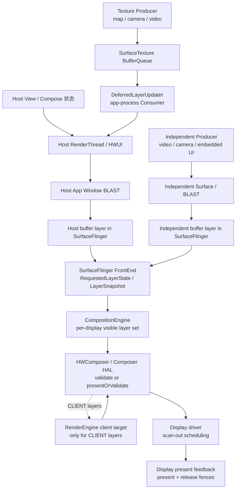
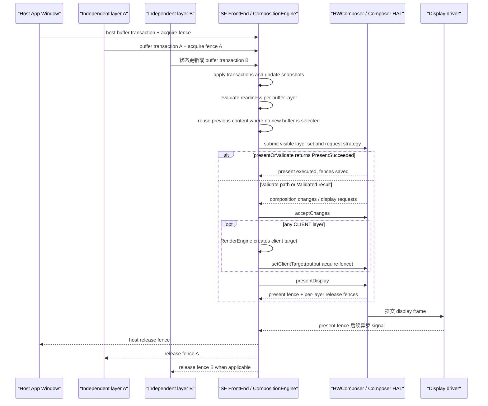

# Android Perfetto 系列 - App 出图类型 - 混合出图类型

混合出图页面同时使用两种以上的内容生产与显示方式。宿主 HWUI、`TextureView` 输入流、`SurfaceView`、嵌入式 `SurfaceControlViewHost`、视频或相机 Producer 可能出现在同一屏，任意两路都能采用不同帧率、队列和同步规则。

Perfetto 分析的难点不在“layer 数量多”，而在每个可见对象由谁生产、在哪里被消费、几何由谁控制、当前 display frame 使用了哪一块 buffer。本文给出一套按对象建表、再按显示周期复原画面的办法。

<!--more-->

## 阅读导航

### 本文目录

- 阅读说明
- 1. 一帧完整流程：多路内容怎样形成一个 DisplayFrame
- 2. 类型判定：哪些页面属于混合出图
- 3. 三种拓扑：宿主回流、独立 layer 与两者并存
- 4. 对象清单：Producer、Consumer、几何和帧节奏
- 5. 生命周期与模式切换：黑屏和旧帧的第一检查点
- 6. 同步规则：原子 Transaction、SurfaceSyncGroup 与 fence
- 7. SurfaceFlinger：多路状态怎样进入本轮合成
- 8. HWC：整屏 layer 集合怎样改变合成成本
- 9. 版本演进：Android 12 到 Android 17
- 10. 源码入口：Android 17 应该跟读哪里
- 11. Perfetto 证据链：按对象复原一次混合显示
- 12. 类型边界与故障模式
- 总结

### 系列文章目录

1. [Android Perfetto 系列 - App 出图类型 - 总览与识别方法](S01_rendering_types_overview.md)
2. [Android Perfetto 系列 - App 出图类型 - AOSP 标准类型](S02_aosp_standard_type.md)
3. [Android Perfetto 系列 - App 出图类型 - SurfaceView 类型](S03_surfaceview_type.md)
4. [Android Perfetto 系列 - App 出图类型 - TextureView 类型](S04_textureview_type.md)
5. [Android Perfetto 系列 - App 出图类型 - 混合出图类型](S05_mixed_rendering_type.md)
6. [Android Perfetto 系列 - App 出图类型 - 多窗口类型](S06_multi_window_type.md)
7. [Android Perfetto 系列 - App 出图类型 - Software / 离屏类型](S07_software_offscreen_type.md)
8. [Android Perfetto 系列 - App 出图类型 - Native Graphics 类型](S08_native_graphics_type.md)
9. [Android Perfetto 系列 - App 出图类型 - WebView 类型](S09_webview_type.md)
10. [Android Perfetto 系列 - App 出图类型 - Flutter 类型](S10_flutter_type.md)
11. [Android Perfetto 系列 - App 出图类型 - Camera 类型](S11_camera_type.md)
12. [Android Perfetto 系列 - App 出图类型 - Video Overlay / HWC 类型](S12_video_overlay_hwc_type.md)
13. [Android Perfetto 系列 - App 出图类型 - Game 类型](S13_game_type.md)
14. [Android Perfetto 系列 - App 出图类型 - React Native 类型](S14_react_native_type.md)

## 阅读说明

平台源码固定到 Android 17 / API 37 的 `android-17.0.0_r1`，kernel 源码固定到 `android17-6.18-2026-06_r6`。View/HWUI、`SurfaceView`、`TextureView`、BLAST、SurfaceFlinger FrontEnd、CompositionEngine 和 HWC 的名称按平台 tag 核查；sync file 与 dma-fence 按指定 kernel tag 核查。

Camera、codec、Web/地图引擎、Flutter、游戏和厂商 Composer 可能改变 Producer 进程、buffer format 与 layer 拓扑。AOSP 只能证明公共接口和系统合成行为。目标应用采用哪种承载模式，必须从当前 layer tree、BufferQueue、应用配置和 trace 得出。

“混合出图”是本文的分析分类，不是 Android framework 中的类或窗口类型。页面只要存在两条以上可区分的内容生产路径，并且它们共同影响同一个最终画面，就需要使用本文的方法；SurfaceFlinger 是否看到多个独立 layer，要继续按拓扑分类。

## 1. 一帧完整流程：多路内容怎样形成一个 DisplayFrame

以“宿主控制层 + TextureView 地图 + SurfaceView 视频”为例，一次显示更新包含下面这些工作：

1. 宿主窗口因输入、动画、布局或重绘请求安排下一帧。`Choreographer` 在没有 pending frame 时请求新的 `vsync-app`，主线程随后处理 Input、Animation、Insets、Traversal 和 Commit。
2. 地图 Producer 把 buffer 提交给 `TextureView` 的 `SurfaceTexture`。`onFrameAvailable()` 在宿主 ViewRoot 线程调用 `updateLayer()` 与 `invalidate()`，该请求可能并入已经安排的宿主帧。
3. 宿主 `TextureView.draw()` 记录 `TextureLayer` 更新；RenderThread 在 `DeferredLayerUpdater::apply()` 中取得最新地图 buffer，将它采样进宿主 App Window。
4. 宿主 RenderThread 同时绘制按钮、遮罩和其它 View，再通过宿主 BLAST 提交 App Window buffer。TextureView 地图此时已经包含在宿主 buffer 中。
5. 视频 Producer 按解码节奏向 SurfaceView 的独立 Surface 提交 buffer。SurfaceView BLAST child 保留独立 buffer layer，不经过宿主 GPU 采样。
6. SurfaceView 的位置、crop、visibility 与相对 Z-order 由 `SurfaceControl.Transaction` 管理。默认 Z-below 场景还依赖宿主窗口中的 hole-punch。
7. SurfaceFlinger 接收宿主窗口与视频 child 的 transaction。宿主 buffer 携带当前宿主 UI 和本轮采到的地图内容；视频 child 携带它自己的 buffer、dataspace 与 acquire fence。
8. FrontEnd 更新 `RequestedLayerState` 和 `LayerSnapshot`。每个 buffer layer 分别判断 transaction readiness、buffer readiness 与 fence 条件；未更新的 layer 可以继续使用上次内容。
9. 如果业务要求多个 SurfaceControl 状态原子生效，它们应放进同一 Transaction。需要等待多个受控 Surface 产出后一起应用时，可使用 `SurfaceSyncGroup`；没有加入同步组的独立 Producer 不会被自动纳入。
10. CompositionEngine 生成本次 display 的可见 layer 集合，HWC 返回 DEVICE/CLIENT changes 与 display requests。任何 CLIENT layer 都会进入 RenderEngine client target。
11. 允许 skip validate 时，`presentOrValidateDisplay()` 可能直接返回 `PresentSucceeded`；此时 present 已执行并保存 fences。其它分支在接受 changes、设置 client target 后调用 `presentAndGetReleaseFences()`。
12. 本次 display 得到一份 present fence 和多份 per-layer release fence。present fence 描述 display present 边界；release fence 分别回到宿主与独立 Producer，控制旧 buffer 复用。

### 总体拓扑

这张图用于确认每条内容在哪里进入最终画面。拿 trace 对照时，重点找三个中转点：SurfaceTexture Consumer、宿主 BLAST、独立 Surface BLAST。



Texture 输入流在宿主 RenderThread 中结束第一套 BufferQueue 周转，随后变成宿主窗口像素。独立 Surface 保持单独的 SF buffer layer。混合页可能只有前一种，也可能同时存在两种。

### 多 layer 显示周期

下面的时序图只画 SurfaceFlinger 可见的宿主 layer 和两个独立 layer。每条 Producer 有自己的提交与 release channel。



一个 display frame 可以组合“新宿主 + 旧视频”或“旧宿主 + 新视频”。这种组合在系统层面可能合法，业务层面却可能出现遮罩、字幕、位置或内容时刻不一致。分析目标是找出哪一组状态进入了目标 present。

## 2. 类型判定：哪些页面属于混合出图

页面需要满足两个条件：

- 存在两条以上能区分 Producer 或 Consumer 的内容路径；
- 这些路径共同影响同一屏的最终可见结果。

### 常见组合

| 页面组合 | SurfaceFlinger 侧形态 | 分析入口 |
|---|---|---|
| 普通 View + TextureView | 通常只有宿主 App Window 主体 layer | 外部 queue、SurfaceTexture acquire、宿主 GPU 与 host BLAST |
| 普通 View + SurfaceView | 宿主 layer + SurfaceView container/BLAST child | 宿主帧、SurfaceView buffer、几何/hole-punch、per-layer latch |
| TextureView + SurfaceView | Texture 内容进入宿主，另有独立 SurfaceView layer | 两套输入队列、宿主采样、独立 layer、HWC |
| 多个 SurfaceView / SurfaceControl | 宿主 + 多个独立 layer | layer parent/Z-order、每路 BufferTX、同步组与 composition type |
| SurfaceControlViewHost 嵌入 | 宿主层级中存在跨进程 child hierarchy | SurfacePackage、AttachedSurfaceControl、sync group、输入与可见性 |
| WebView / Flutter / 游戏 + 原生 Surface | 取决于引擎选择的承载模式 | 先确认实际 layer/BufferQueue 拓扑，再加入引擎线程 |

只看到多个线程、多个 `queueBuffer()` 或多个 SF layer 还不够。SystemUI、壁纸、输入法和导航栏本来就会参与同一 display；本文分类关注目标页面内部由应用或嵌入内容引入的多路生产关系。

## 3. 三种拓扑：宿主回流、独立 layer 与两者并存

### 3.1 宿主回流型

外部 Producer 把 buffer 交给 `SurfaceTexture`，应用内 HWUI Consumer 取得最新内容，再画进宿主窗口。SurfaceFlinger 不会得到与该输入流一一对应的独立可见 layer。

这类页面的不同步通常发生在外部 queue 与宿主 acquire 之间：新 buffer 已到 SurfaceTexture，宿主却错过本轮 `DeferredLayerUpdater::apply()`；或者宿主取得新 buffer 后，GPU 采样和 host BLAST 提交超时。

### 3.2 独立 layer 型

`SurfaceView`、应用自管 `SurfaceControl` 或嵌入式 Surface hierarchy 以独立 layer 进入 SurfaceFlinger。宿主和独立内容各自提交，SurfaceFlinger/HWC 决定本次 display 使用哪些 buffer 和状态。

这类页面需要同时观察 buffer layer 与它的管理层。以 Android 17 SurfaceView 为例，container 承载几何，BLAST child 承载内容 buffer，背景 color layer 按条件显隐。只观察 container 的 position transaction，无法证明视频 buffer 已更新。

### 3.3 组合型

页面既有 Texture 回流，也有独立 layer。宿主 buffer 本身已经是多路输入的结果，SurfaceFlinger 又把它与独立内容组合。此时至少有三次截止：

1. 外部 Texture buffer 是否赶上宿主 RenderThread acquire；
2. 宿主 App Window 是否赶上目标 SF display frame；
3. 独立 layer 的新 buffer 与几何是否同时进入该 display frame。

报告若只写“宿主 late”或“视频 late”，信息不足。需要写清目标 present 使用的宿主 buffer、宿主内部采到的 Texture frame、独立 layer buffer 和几何状态。

## 4. 对象清单：Producer、Consumer、几何和帧节奏

混合页面开始分析前，给每个对象填一行：

| 字段 | 要记录的内容 | 证据来源 |
|---|---|---|
| 内容对象 | 视频、预览、地图、控制层、嵌入式 UI | 页面结构、layer name、业务配置 |
| Producer | 应用线程、codec、camera provider/HAL、引擎或远端进程 | BufferQueue connect、queue 调用、进程/线程轨迹 |
| Consumer | HWUI SurfaceTexture Consumer、BLAST/SF、ImageReader 或其它模块 | layer tree、BufferQueue 名、源码路径 |
| 最终 SF layer | 宿主 App Window、独立 BLAST child、color/effect layer | SurfaceFlinger layer trace/dump |
| 几何所有者 | ViewRoot、SurfaceView container、应用 Transaction、远端 host | transaction、parent、crop、matrix、relative-Z |
| 帧节奏 | `vsync-app`、视频 timestamp、sensor cadence、引擎 VSync | Choreographer、Producer timestamp、业务 trace |
| acquire/release | fence 所属 buffer 和队列 | fence fd、sync wait、release callback、driver trace |
| 同步约束 | 同一 Transaction、SurfaceSyncGroup、frame number、desired present | API 调用、transaction id、sync trace |

表格填不完整时，不适合开始归因。比如“Camera 预览卡”缺少承载对象，就无法判断 Consumer 在 HWUI、SurfaceFlinger 还是 ImageReader。

### Producer 进程不能靠固定名单判断

MediaCodec、Codec2 与 Camera 流水线可能跨应用进程、系统服务、provider/HAL 和 vendor 进程。游戏、地图和浏览器也可能把工作拆到多个线程或进程。可靠做法是从目标 BufferQueue 的 producer connection、queue 调用和完成 fence 回溯，进程名只用于缩小范围。

## 5. 生命周期与模式切换：黑屏和旧帧的第一检查点

混合页的 layer 拓扑会在运行中变化。播放器从 TextureView 切到 SurfaceView、Camera preview 重建 output、WebView 进入全屏视频、嵌入式 hierarchy reparent，都会让原有 trace 对象失效。

| 对象 | 有效期信号 | 常见失败 |
|---|---|---|
| SurfaceView | `surfaceCreated/Changed/Destroyed`、API 34 lifecycle 策略 | Producer 继续写旧 Surface、首 buffer 晚、container 已显示但 BLAST child 无内容 |
| TextureView | `onSurfaceTextureAvailable/Destroyed`、visibility listener、`setSurfaceTexture()` 所有权 | listener 被移除、旧对象泄漏、Producer 已换目标但分析仍跟旧队列 |
| SurfaceControlViewHost | SurfacePackage attach/clear/reparent、远端 binder 生命周期 | child hierarchy 已断开、同步组等待的对象退出 |
| Media/Camera output | session/output configuration、codec surface switch、secure 属性 | 切换期间无 buffer、旧 buffer 被保留、保护能力不匹配 |
| App Window | attach/detach、relayout、window surface replacement | 宿主 layer id、BLAST queue 和 FrameTimeline token 改变 |

检查黑屏时，按“对象是否存在 → Producer 是否连接 → 首 buffer 是否提交 → acquire fence 是否完成 → layer 是否可见 → HWC 是否接受”逐项确认。只看到 View 已 attach 或 `surfaceCreated()` 已回调，不能证明已有可显示 buffer。

### 拓扑切换要重新建表

模式切换前后的同名 layer 可能拥有不同 layer id、BufferQueue、Producer 和安全属性。Perfetto 时间范围跨越切换点时，应拆成两段分析；不要把旧队列的 release fence 与新 layer 的 `BufferTX` 配对。

## 6. 同步规则：原子 Transaction、SurfaceSyncGroup 与 fence

### 6.1 同一 Transaction 解决状态原子应用

`SurfaceControl.Transaction` 可以同时更新多个 SurfaceControl，并由 `apply()` 原子提交。position、crop、alpha、layer、reparent 和通过公开 `setBuffer()` 提交的 HardwareBuffer 都可以属于同一笔 Transaction。

原子提交只覆盖已经加入该 Transaction 的状态。Camera、codec 或游戏 Producer 之后向另一个 BufferQueue 提交的“下一帧”不会自动加入。业务要同步“新几何 + 新内容”，必须掌握对应 buffer transaction，或使用能等待目标 Surface 产出的同步机制。

下面的概念模型区分 Transaction 内状态和外部 Producer。它不是可编译 Java。

```text
one SurfaceControl.Transaction
  setPosition(surfaceA)
  setCrop(surfaceA)
  setAlpha(surfaceB)
  optional setBuffer(surfaceC, hardwareBuffer, acquireFence)
  apply atomically

external Producer queueBuffer(surfaceB)
  separate BufferQueue event
  not included unless framework/application explicitly coordinates it
```

这一区别解释了一个常见现象：两个 container 的几何同帧生效，某个 child 仍沿用旧 buffer。Transaction 没有丢状态，外部 buffer 不属于那笔提交。

### 6.2 SurfaceSyncGroup 等待多个受控 Surface

API 34 的 `SurfaceSyncGroup` 用来收集多个 Surface 的同步结果，支持 `AttachedSurfaceControl`、`SurfaceControlViewHost.SurfacePackage` 和附加 Transaction，也能跨进程协调。组被 `markSyncReady()` 后，要等 child sync group 完成，系统才应用最终合并 Transaction。

`SurfaceSyncGroup` 只协调加入组的对象。一个不受控制的 MediaCodec、Camera HAL 或引擎 Producer 若没有通过目标 Surface 的同步回调进入组，系统不能替业务预测它何时生成逻辑上的下一帧。

下面是公开 API 的职责形状，不是可直接复制的业务代码；各对象的获取和线程要求已省略。

```text
SurfaceSyncGroup("mixed-frame")
  add(attachedSurfaceControl, updateRunnable)
  add(surfacePackage, updateRunnable)
  addTransaction(extraSurfaceControlTransaction)
  markSyncReady()

group completes
  after registered child surfaces provide their sync transactions
  then applies the merged transaction
```

实际使用时，`add(AttachedSurfaceControl, ...)` 必须在创建该 UI 元素的线程调用，通常是主线程；runnable 在渲染暂停后执行，用于让下一帧变化进入同步组。

### 6.3 Transaction committed 与 completed

- API 33 `addTransactionCommittedListener()`：transaction 已应用，更新已经 ready to be presented；它不等于 display 已 present。
- API 35 `addTransactionCompletedListener()`：transaction 已 presented 后回调，返回 `TransactionStats`；它仍是 Android 显示栈事件，不是 panel 光学完成测量。

两个 listener 适合定位 transaction 生命周期，不能替代 Producer buffer fence 和 display present fence。

### 6.4 desired present time 与 frame timeline

API 35 `setDesiredPresentTimeNanos()` 请求 transaction 在指定单调时钟时间或之后显示。官方契约明确规定：即使请求更早时间，所有 acquire fence signal 前也不能 present。

API 35 `setFrameTimeline(vsyncId)` 把 Choreographer FrameTimeline 的 VSync id 交给 SurfaceFlinger，使 transaction 选择相应 expected presentation time。无效或过期 id 会被忽略。这两项是调度信息，不会生成 buffer，也不会消除 fence wait。

### 6.5 acquire、release 与 present fence

| fence | 粒度 | 回答的问题 |
|---|---|---|
| acquire fence | 每块输入 buffer | Producer 何时完成写入，Consumer 何时可安全读取 |
| release fence | 每个被消费的 layer/buffer | Consumer/HWC 何时不再读取，旧 buffer 何时可复用 |
| present fence | 每个 display present | 本次 display present 工作何时到达显示栈完成边界 |

TextureView 回流还会多一套 SurfaceTexture acquire/release；宿主 App Window 另有 BLAST acquire/release。报告中每个 fence 都要标明队列、layer 和方向。

### 6.6 AutoSingleLayer 不能同步混合页面

Android 13 的 `AutoSingleLayer` 允许 SurfaceFlinger 在“本帧只有单个 layer 的简单 buffer update、没有几何变化或 sync transaction”等条件下 latch unsignaled buffer，把等待推迟到读取阶段。

官方文档明确排除跨 layer、geometry changes 和 sync transactions。混合页面正好常包含这些条件，因此 `AutoSingleLayer` 不能用来解释或修复多 Surface 一致性。它只可能作用于某次满足单 layer 条件的独立更新。

## 7. SurfaceFlinger：多路状态怎样进入本轮合成

### 7.1 Android 17 FrontEnd 对象

Android 17 收到 transaction 后，FrontEnd 将请求合入 `RequestedLayerState`，通过 `LayerLifecycleManager` 管理 layer 生命周期，再由 `LayerSnapshotBuilder` 生成当前 hierarchy、可见性、几何和效果快照。buffer layer 的 readiness/latch 还要结合 buffer transaction 与 fence。

旧资料常把流程写成 `SurfaceFlinger::commit()` 里循环调用每个 `Layer::latchBuffer()`。这种骨架无法表达 Android 17 的 FrontEnd 状态和 snapshot，也容易把 container 状态与 child buffer 混成一个对象。

下面是 Android 17 的职责示意，不是源码调用栈。

```text
SurfaceFlinger transaction processing
  collect and flush pending transactions
  update RequestedLayerState
  process layer lifecycle and hierarchy
  build/update LayerSnapshot
  evaluate buffer transaction readiness per buffer layer

Composition preparation
  choose current buffer or retained previous content per layer
  build visible layer list for each display
  将 layer 状态与 fences 交给 CompositionEngine / HWC
```

这份示意把“状态已经进入 snapshot”和“新 buffer 已被当前 display 使用”分开。判断某个对象是否更新，需要同时看状态 transaction、buffer transaction、latch/selection 与目标 present。

### 7.2 没有新 buffer 时可以保留旧内容

某个 layer 没有新 buffer，不要求整个 display 等待。只要本轮有其它状态或内容需要更新，CompositionEngine 可以继续使用该 layer 已选中的上次内容。视频低帧率、宿主高刷新率时，这种复用是正常状态。

业务看到的新旧不一致来自逻辑关联：字幕与视频、遮罩与预览、地图与标记原本应属于同一业务时刻，却由不同队列在不同 display frame 更新。系统无法从像素内容推断这种关系，需要应用明确同步或接受复用。

### 7.3 transaction readiness 不等于 fence 已消失

SurfaceFlinger 可能因为 sync group、barrier、desired present、acquire fence 或其它 transaction 条件推迟一笔更新。符合 latch-unsignaled 条件时，fence wait 可以后移；HWC 或 RenderEngine 读取 buffer 前仍要遵守依赖。

Perfetto 中看到 transaction 已提交、`BufferTX - <layerName>` 增加或状态 snapshot 已更新，都不能单独证明目标 display 已使用新 buffer。

## 8. HWC：整屏 layer 集合怎样改变合成成本

HWC 每轮评估整个可见 layer 集合。SurfaceView、视频、相机、宿主窗口、系统栏、壁纸、圆角、dim、color transform 都可能影响最终 strategy。

### 8.1 影响 DEVICE/CLIENT 的条件

- buffer format、modifier、dataspace 与 HDR metadata；
- protected/secure usage 与目标 display 的保护能力；
- source crop、destination frame、scale、rotation、alpha 和 blend；
- overlay plane、scaler、bandwidth 及厂商硬件限制；
- 同屏其它 layer 对相同资源的占用；
- display mode、color mode 与全局 color transform。

YUV、SurfaceView 或视频标签都不能保证 DEVICE composition。HWC 根据当前整屏条件返回 changes。普通 layer 不满足硬件条件时可进入 CLIENT；protected layer 必须保持受保护路径，不能交给普通非保护 RenderEngine 读取。

### 8.2 layer 增加与成本没有固定线性关系

新增独立 layer 可能让视频直接走 overlay，减少宿主 GPU 采样；也可能占满 plane，让另一个大面积 layer 回到 CLIENT。一个透明遮罩、复杂 transform 或颜色要求也可能改变整屏策略。

比较前后两帧时，应记录每个可见 layer 的 composition type、client target 面积/GPU 时长、display mode 和 layer 属性变化。只比较 layer 数或总 GPU busy，无法解释 strategy 为什么变化。

### 8.3 presentOrValidate 分支

Android 17 的 `HWComposer::getDeviceCompositionChanges()` 只在满足 skip-validate 条件时尝试 `presentOrValidateDisplay()`：

- `PresentSucceeded`：组合调用已经执行 present，present/release fences 已保存；
- `Validated`：validate 已完成，SurfaceFlinger 继续读取 composition changes/requests 并 `acceptChanges()`；
- 不允许 skip validate：调用 `validateDisplay()`，随后处理 changes。

存在 CLIENT layer 时，RenderEngine 消费各 layer 输入 fence 并生成 client target，`setClientTarget()` 携带 client target output acquire fence。尚未 present 的分支再调用 `presentAndGetReleaseFences()`。

## 9. 版本演进：Android 12 到 Android 17

| 平台 | 混合出图相关变化 | 对 Review 的影响 |
|---|---|---|
| Android 12 / API 31 | BLAST 与 FrameTimeline 构成现代窗口/Surface 基线 | 可按宿主 SurfaceFrame、SF DisplayFrame、layer/BufferTX 复原多路显示；独立 Surface 的 app timeline 覆盖仍需验证 |
| Android 13 / API 33 | HWC HAL 转向 AIDL；`AutoSingleLayer` 默认启用；公开 Transaction committed listener 与 `setBuffer()` | HWC binder/trace 入口可能变化；latch unsignaled 明确不适用跨 layer 同步；应用可直接提交 HardwareBuffer 与 fence |
| Android 14 / API 34 | `SurfaceSyncGroup`、SurfaceView lifecycle 策略与任意 alpha；Transaction extended-range brightness | 跨进程受控 Surface 可加入同步组；SurfaceView 的保留/销毁和半透明行为改变混合页边界 |
| Android 15 / API 35 | desired present time、`setFrameTimeline()`、Transaction completed listener、desired HDR headroom | 应用可提供更明确的调度和完成回调；fence 与设备能力仍决定能否按目标显示 |
| Android 16 / API 36 | SurfaceView `compositionOrder` 公开，嵌入/多 Surface 的整数相对层级更易表达 | 负值位于宿主下方，非负值位于宿主上方；相同 order 的 peer 顺序未定义 |
| Android 17 / API 37 | SurfaceView blur region 公开；本文固定到当前 FrontEnd snapshot、BLAST 与 HWC 流程 | blur、crop、transform 与位置要一起检查；当前代码存在不等于 Android 17 首次引入 |

### Android 12：现代基线

Android 12 已经使用 BLAST 组织 App Window 与 SurfaceView buffer transaction，FrameTimeline 也从 Android 12 起提供应用与 SurfaceFlinger expected/actual frame。混合页仍不能只靠一条 FrameTimeline：SurfaceView 等独立 stream 可能没有完整 app slice，TextureView 输入 frame 也要从第一套 BufferQueue 回溯。

### Android 13：两个容易混淆的变化

HWC HAL 从 Android 13 起以 AIDL 定义，旧 HIDL composer 版本被标记 deprecated。这个变化影响 HAL 接口和 vendor 实现，不改变 SF 仍需协商 DEVICE/CLIENT 的职责。

`AutoSingleLayer` 同样在 Android 13 成为默认配置，但官方限制正是“单 layer 简单 buffer update”。多 layer geometry/sync 场景不能借它绕过原子同步。

API 33 还公开 `SurfaceControl.Transaction.setBuffer()` 与 committed listener。`setBuffer()` 要求 HardwareBuffer 具备 composer overlay 与 GPU sampled image usage，因为系统可能选择硬件或 GPU 合成。

### Android 14：SurfaceSyncGroup 成为公开 API

`SurfaceSyncGroup` 可以收集 AttachedSurfaceControl、SurfacePackage 与附加 Transaction，等待子同步结果后应用合并 Transaction。它为跨进程嵌入式 UI 和多 Surface 提供公开协调工具。

同一版本的 SurfaceView 支持任意 alpha 并可选择跟随 visibility 或 attachment 的 Surface 生命周期。混合页面前后台、列表复用和半透明叠加的行为要按 API 34 规则检查。

### Android 15：调度目标与完成回调

API 35 增加 desired present time、transaction frame timeline 和 completed listener。三者分别表达期望显示时间、目标 VSync timeline 与 presented 后回调，不能互相替代。

Window、SurfaceView 和 SurfaceControl 还可表达 desired HDR headroom。该值是期望比例，最终范围受 buffer、display、环境和系统策略限制。

### Android 16：composition order

`SurfaceView.setCompositionOrder(int)` 公开后，多 SurfaceView 不必只依赖 `setZOrderOnTop()` 与 `setZOrderMediaOverlay()` 两个布尔入口。整数正负决定相对宿主上下，数值决定 peer 高低；相同数值顺序未定义。

### Android 17：本文当前对象

Android 17 的 SurfaceView 增加 blur region API；SurfaceFlinger 使用 FrontEnd 状态/snapshot，HWC 支持 present-or-validate 快路径，BLAST 继续处理 buffer transaction 与 release callback。本文所有调用名按固定 tag 解释，版本首引另由 API level 或历史 tag 证明。

### 固定版本来源

- [Android 12 `BLASTBufferQueue.cpp`](https://android.googlesource.com/platform/frameworks/native/+/refs/tags/android-12.0.0_r1/libs/gui/BLASTBufferQueue.cpp)、[Perfetto FrameTimeline](https://perfetto.dev/docs/data-sources/frametimeline)：确认现代基线；
- [Android 13 release notes](https://source.android.com/docs/whatsnew/android-13-release)、[AutoSingleLayer](https://source.android.com/docs/core/graphics/unsignaled-buffer-latch)、[API 33 Transaction](https://developer.android.com/reference/android/view/SurfaceControl.Transaction)：确认 HWC AIDL、latch 限制与公开 buffer API；
- [API 34 `SurfaceSyncGroup`](https://developer.android.com/reference/android/window/SurfaceSyncGroup)、[SurfaceView reference](https://developer.android.com/reference/android/view/SurfaceView)：确认同步组、lifecycle 与 alpha；
- [API 35 Transaction](https://developer.android.com/reference/android/view/SurfaceControl.Transaction)：确认 desired present、frame timeline、completed listener 与 HDR headroom；
- [Android 16 `SurfaceView.java`](https://android.googlesource.com/platform/frameworks/base/+/refs/tags/android-16.0.0_r1/core/java/android/view/SurfaceView.java)：确认 composition order；
- [Android 17 FrontEnd](https://android.googlesource.com/platform/frameworks/native/+/refs/tags/android-17.0.0_r1/services/surfaceflinger/FrontEnd/)、[`SurfaceView.java`](https://android.googlesource.com/platform/frameworks/base/+/refs/tags/android-17.0.0_r1/core/java/android/view/SurfaceView.java)：确认本文当前实现。

## 10. 源码入口：Android 17 应该跟读哪里

### Platform：`android-17.0.0_r1`

| 核查点 | 一手来源 | 用来确认什么 |
|---|---|---|
| 宿主帧 | [AOSP `ViewRootImpl.java`](https://android.googlesource.com/platform/frameworks/base/+/refs/tags/android-17.0.0_r1/core/java/android/view/ViewRootImpl.java)、[`Choreographer.java`](https://android.googlesource.com/platform/frameworks/base/+/refs/tags/android-17.0.0_r1/core/java/android/view/Choreographer.java) | traversal/VSync 去重、宿主绘制与 window transaction |
| HWUI / Texture 回流 | [AOSP `DeferredLayerUpdater.cpp`](https://android.googlesource.com/platform/frameworks/base/+/refs/tags/android-17.0.0_r1/libs/hwui/DeferredLayerUpdater.cpp)、[`DrawFrameTask.cpp`](https://android.googlesource.com/platform/frameworks/base/+/refs/tags/android-17.0.0_r1/libs/hwui/renderthread/DrawFrameTask.cpp) | SurfaceTexture Consumer、AHardwareBuffer/SkImage、宿主 pending layer update |
| SurfaceView / BLAST | [AOSP `SurfaceView.java`](https://android.googlesource.com/platform/frameworks/base/+/refs/tags/android-17.0.0_r1/core/java/android/view/SurfaceView.java)、[`BLASTBufferQueue.cpp`](https://android.googlesource.com/platform/frameworks/native/+/refs/tags/android-17.0.0_r1/libs/gui/BLASTBufferQueue.cpp) | container/BLAST child、几何、buffer transaction、frame-number merge |
| Transaction API | [AOSP `SurfaceControl.java`](https://android.googlesource.com/platform/frameworks/base/+/refs/tags/android-17.0.0_r1/core/java/android/view/SurfaceControl.java)、[`SurfaceComposerClient.cpp`](https://android.googlesource.com/platform/frameworks/native/+/refs/tags/android-17.0.0_r1/libs/gui/SurfaceComposerClient.cpp) | multi-Surface 状态、buffer/fence、listeners、desired present、frame timeline |
| 跨 Surface 同步 | [AOSP `SurfaceSyncGroup.java`](https://android.googlesource.com/platform/frameworks/base/+/refs/tags/android-17.0.0_r1/core/java/android/window/SurfaceSyncGroup.java) | child sync group、跨进程 SurfacePackage、merged transaction |
| SurfaceFlinger FrontEnd | [AOSP FrontEnd](https://android.googlesource.com/platform/frameworks/native/+/refs/tags/android-17.0.0_r1/services/surfaceflinger/FrontEnd/)、[`SurfaceFlinger.cpp`](https://android.googlesource.com/platform/frameworks/native/+/refs/tags/android-17.0.0_r1/services/surfaceflinger/SurfaceFlinger.cpp) | RequestedLayerState、lifecycle、snapshot、transaction readiness |
| Composition / HWC | [AOSP CompositionEngine](https://android.googlesource.com/platform/frameworks/native/+/refs/tags/android-17.0.0_r1/services/surfaceflinger/CompositionEngine/)、[`HWComposer.cpp`](https://android.googlesource.com/platform/frameworks/native/+/refs/tags/android-17.0.0_r1/services/surfaceflinger/DisplayHardware/HWComposer.cpp) | visible layer set、CLIENT target、validate/present 与 fences |

### Kernel：`android17-6.18-2026-06_r6`

- [`drivers/dma-buf/sync_file.c`](https://android.googlesource.com/kernel/common/+/refs/tags/android17-6.18-2026-06_r6/drivers/dma-buf/sync_file.c)：sync fence fd；
- [`drivers/dma-buf/dma-fence.c`](https://android.googlesource.com/kernel/common/+/refs/tags/android17-6.18-2026-06_r6/drivers/dma-buf/dma-fence.c)：signal、callback 与 wait；
- [`drivers/dma-buf/dma-buf.c`](https://android.googlesource.com/kernel/common/+/refs/tags/android17-6.18-2026-06_r6/drivers/dma-buf/dma-buf.c)：dma-buf 共享对象的 attach/map 与引用管理入口。

kernel 公共源码不能说明 vendor GPU、codec、camera 或 DPU 的 fence 创建和 signal 原因。那部分要结合设备驱动与 vendor trace。

## 11. Perfetto 证据链：按对象复原一次混合显示

### 11.1 采集与对象清单

需要覆盖 app `gfx/view`、调度、SurfaceFlinger/layer/transactions/FrameTimeline、fence/sync、GPU，以及场景相关的 camera/codec/binder/vendor 数据源。只采应用 atrace，无法证明独立 layer 与 HWC 的状态。

开始分析时记录：目标进程/线程、宿主 App Window layer id、每个独立 container 与 buffer child、每个 SurfaceTexture 队列、Producer connection、几何 transaction、composition type 和 display token。

### 11.2 从目标 present 反向找输入

选定用户看到异常的 display frame，记录它的 present time 和 `display_frame_token`。随后列出该 display 的可见 layer：

1. 宿主 App Window 使用哪次 `BufferTX - <hostLayerName>`；
2. 每个独立 buffer layer 使用新 buffer 还是上次内容；
3. container position/crop/relative-Z 是否已经更新；
4. 哪些 layer 被判为 DEVICE，哪些进入 CLIENT；
5. client target 与 present fence 是否按 deadline 完成。

再向 Producer 方向回溯，比从最长 CPU slice 开始更容易定位错帧组合。

### 11.3 展开宿主 buffer 的内部来源

宿主 buffer 若包含 TextureView、WebView functor 或引擎纹理，还要继续拆：

- 外部 buffer 何时 queue；
- frame available / invalidate 何时进入宿主；
- RenderThread 本轮取得哪个 buffer；
- 外部 acquire fence 是否等待；
- 宿主 GPU 采样和 host `queueBuffer()` 何时完成。

SurfaceFlinger 只看到宿主 buffer，无法替分析者指出其中哪块 Texture 输入迟到。

### 11.4 对齐同步对象

每个“同步”结论都要注明机制：

| 观察到的机制 | 能证明什么 | 不能证明什么 |
|---|---|---|
| 同一 Transaction id | 该 Transaction 内状态原子应用 | 外部 Producer 的下一帧也在其中 |
| SurfaceSyncGroup 完成 | 已注册 child sync 都提供结果，merged transaction 可应用 | 未加入组的 codec/camera 逻辑帧 ready |
| committed listener | transaction applied，updates ready to be presented | display 已 present |
| completed listener | transaction 已 presented | panel 光学完成 |
| desired present time / frame timeline | SF 获得调度目标 | acquire fence 会在目标时间前 signal |
| AutoSingleLayer trace | 某次单 layer buffer update 允许 latch unsignaled | 多 layer 已同步 |

### 11.5 分开 FrameTimeline、BufferTX 与 fence

FrameTimeline 的宿主 SurfaceFrame 适合判断 App Window 是否按时完成，SF DisplayFrame 适合判断整屏 present。独立 Surface 或 SurfaceTexture 输入未必有完整 app actual slice。

`BufferTX - <layerName>` 只表示 SF server 侧 pending buffer transaction 数量。计数上升没有直接给出 acquire fence、sync barrier、desired present 或 HWC 状态。fence wait 也只描述依赖，要继续找到创建者。

### 11.6 HWC strategy 对比

发生功耗、GPU 或延迟跳变时，选择变化前后相邻 display frame，比较：

- 可见 layer 集合与 Z-order；
- 每个 layer 的 buffer format/dataspace/protected/alpha/transform/crop；
- DEVICE/CLIENT composition type；
- client target GPU 时长与面积；
- display mode、刷新率与 color mode；
- vendor Composer error、request 或 fallback。

同一页面静止与动画时可能使用不同 strategy。测试要覆盖出现问题的动态状态。

### 11.7 可复用排查顺序

1. 锁定异常 display present；
2. 建立本次可见 layer 和 parent/hierarchy；
3. 标记每个 layer 使用的新/旧 buffer 与几何状态；
4. 展开宿主内部的 Texture/引擎输入；
5. 对齐 Transaction、SurfaceSyncGroup 与 desired present；
6. 标明每个 acquire/release/present fence 的所有者；
7. 比较 HWC strategy 与 client target；
8. 回到最早偏离业务期望的 Producer 或同步边界。

## 12. 类型边界与故障模式

### 12.1 与单一 SurfaceView 页面

只有一个宿主和一个主要 SurfaceView 仍可用 SurfaceView 专项模型分析；当页面出现多个独立 Surface、Texture 回流、嵌入式 hierarchy 或需要跨对象同步时，混合模型更合适。分类依据是对象关系，不是控件数量。

### 12.2 与多窗口

混合出图通常发生在同一个 Window/hierarchy 内，多窗口则涉及多个 Window token、WindowState、焦点、insets、可见性和独立 App Window surface。一个页面也能同时属于两类，此时先按 Window 分组，再在每个 Window 内建立混合对象表。

### 12.3 与框架类型

Flutter、WebView、React Native、Camera 和游戏描述内容来源或框架。它们可能输出到宿主 App Window、TextureView、SurfaceView、SurfaceControl hierarchy 或多个目标。框架名不能直接决定混合拓扑。

### 12.4 故障模式

| 现象 | 首要检查 | 容易写错的结论 |
|---|---|---|
| 新字幕配旧视频帧 | 字幕所在宿主 buffer、视频 child buffer、目标 present | SF 应自动理解两者属于同一逻辑帧 |
| 视频已动，遮罩位置旧 | container geometry、host hole-punch、sync transaction | 视频 Producer 慢 |
| 地图标记与地图底图错位 | TextureView 输入 frame、宿主 acquire、标记所在 View frame | SurfaceFlinger 多 layer latch 错误 |
| 首屏部分黑 | 每个 Surface 生命周期、Producer connect、首 buffer、visibility | 页面主线程已画完，所以所有内容都应存在 |
| GPU 功耗突然升高 | DEVICE→CLIENT、client target、透明/transform/layer 集合 | layer 数增加必然线性增加 GPU 成本 |
| 某 Producer dequeue 很长 | 对应队列的 release fence 与 slot | 所有 Producer 都被同一个 display fence 阻塞 |
| Transaction committed 但画面未变 | completed/present、buffer readiness、目标 display | committed 等于 present |
| desired present 已设置仍迟到 | acquire fence、Producer cadence、排队顺序、display mode | API 会强制按指定纳秒显示 |
| AutoSingleLayer trace 出现 | 本次是否仅单 layer 简单 buffer update | 多 Surface 同步已经完成 |
| protected 视频黑屏 | secure/protected path、目标 display、HWC capability | 普通 RenderEngine fallback 可以解决 |

### Review 清单

1. 页面当前有哪些 Producer、Consumer 与最终 SF layer？
2. 宿主 buffer 内还包含哪些 Texture/引擎输入？
3. 每个独立 layer 的 container 与 buffer child 是否分开记录？
4. 几何、buffer、alpha、crop、Z-order 分别由哪笔 Transaction 更新？
5. 哪些对象加入 SurfaceSyncGroup，哪些没有？
6. 业务期望同步的内容是否来自可控制的 Producer？
7. acquire、release、present fence 是否标明队列与方向？
8. 目标 display frame 使用了每个 layer 的哪次新/旧内容？
9. HWC strategy 是否因动态属性或 layer 集合变化？
10. 平台、vendor、应用和框架版本是否固定并有对应证据？

## 总结

混合出图分析的单位是“内容对象”，不是应用进程或某一条 FrameTimeline。每个对象都要确认 Producer、Consumer、最终 SF layer、几何所有者、帧节奏、buffer 和 fence；宿主 buffer 内部还可能包含 TextureView 等二次输入。

同一 Transaction 负责其中状态的原子应用，`SurfaceSyncGroup` 等待加入组的 Surface，desired present/frame timeline 提供调度目标。Android 13 `AutoSingleLayer` 只适用于单 layer 简单 buffer update，不能完成跨 layer 同步。

Android 17 中，SurfaceFlinger FrontEnd 将多路 transaction 整理成状态与 snapshot，CompositionEngine/HWC 再处理整屏可见 layer 集合。定位错帧时，从异常 display present 反向列出每个 layer 使用的新旧 buffer 与几何状态，再回到最早偏离业务期望的 Producer 或同步边界。
