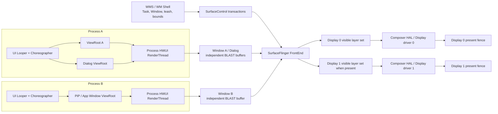
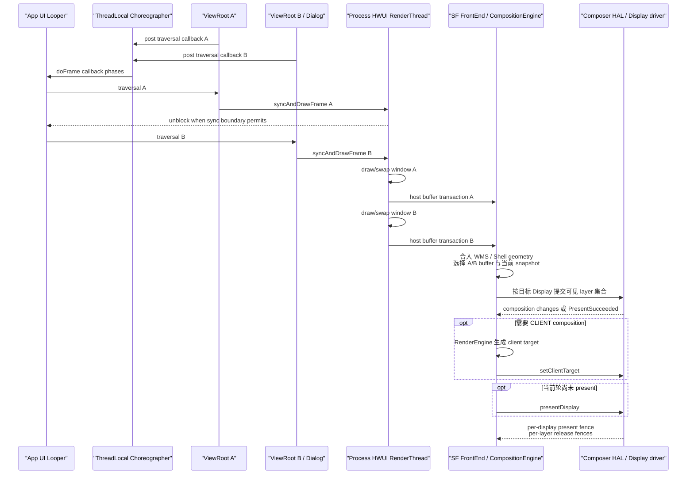

# Android Perfetto 系列 - App 出图类型 - 多窗口类型

多窗口分析要同时区分 Window、进程和 Display。两个窗口可以共享同一应用主线程与 RenderThread，也可以来自不同进程；它们还可能位于不同 Display，使用不同刷新节奏和 present fence。

Perfetto 排查从“每个窗口属于哪个 `ViewRootImpl`、哪个 Window/Task、哪个 SF layer、哪个 Display”开始。这个映射建立后，主线程串行、RenderThread 排队、窗口几何、Shell transition 和 HWC 资源竞争才有明确的责任对象。

<!--more-->

## 阅读导航

### 本文目录

- 阅读说明
- 1. 一帧完整流程：多个窗口怎样进入一个或多个 Display
- 2. 类型判定：窗口形态、执行拓扑与 Display 拓扑
- 3. 同进程多窗口：多个 ViewRootImpl 共享什么
- 4. 跨进程多窗口：哪些工作独立，哪些资源仍共享
- 5. WMS 与 Shell：Task、Window、leash 和 SurfaceControl
- 6. 生命周期、输入与 Insets：显示问题前的状态检查
- 7. 几何与 buffer 同步：resize、PiP 与 transition
- 8. SurfaceFlinger 与 HWC：按 Display 组织合成
- 9. 版本演进：Android 12 到 Android 17
- 10. 源码入口：Android 17 应该跟读哪里
- 11. Perfetto 证据链：按 Window 和 Display 复原一帧
- 12. 类型边界与故障模式
- 总结

### 系列文章目录

1. [Android Perfetto 系列 - App 出图类型 - 总览与识别方法](S01_rendering_types_overview.md)
2. [Android Perfetto 系列 - App 出图类型 - AOSP 标准类型](S02_aosp_standard_type.md)
3. [Android Perfetto 系列 - App 出图类型 - SurfaceView 类型](S03_surfaceview_type.md)
4. [Android Perfetto 系列 - App 出图类型 - TextureView 类型](S04_textureview_type.md)
5. [Android Perfetto 系列 - App 出图类型 - 混合出图类型](S05_mixed_rendering_type.md)
6. [Android Perfetto 系列 - App 出图类型 - 多窗口类型](S06_multi_window_type.md)
7. [Android Perfetto 系列 - App 出图类型 - Software / 离屏类型](S07_software_offscreen_type.md)
8. [Android Perfetto 系列 - App 出图类型 - Native Graphics 类型](S08_native_graphics_type.md)
9. [Android Perfetto 系列 - App 出图类型 - WebView 类型](S09_webview_type.md)
10. [Android Perfetto 系列 - App 出图类型 - Flutter 类型](S10_flutter_type.md)
11. [Android Perfetto 系列 - App 出图类型 - Camera 类型](S11_camera_type.md)
12. [Android Perfetto 系列 - App 出图类型 - Video Overlay / HWC 类型](S12_video_overlay_hwc_type.md)
13. [Android Perfetto 系列 - App 出图类型 - Game 类型](S13_game_type.md)
14. [Android Perfetto 系列 - App 出图类型 - React Native 类型](S14_react_native_type.md)

## 阅读说明

平台源码固定到 Android 17 / API 37 的 `android-17.0.0_r1`，kernel 源码固定到 `android17-6.18-2026-06_r6`。`ViewRootImpl`、Choreographer、HWUI RenderThread、WindowManager、WM Shell、SurfaceFlinger 和 HWC 的名称按平台 tag 核查；调度与 fence 的 kernel 机制按指定 kernel tag 核查。

多窗口包含 split screen、picture-in-picture（PiP）、freeform/desktop windowing、Dialog、PopupWindow、Activity Embedding、多 Display 与厂商自定义形态。用户看到的形态不能直接推出执行拓扑。本文所有结论都要落到 `pid/tid/Looper/ViewRootImpl/WindowState/SurfaceControl/displayId`。

版本演进以 Android 12 为起点，Android 12L 作为 API 32 的大屏节点单列。Android 17 大屏方向与可调整大小行为按 target 37 的官方规则解释；小屏、游戏豁免和厂商 windowing 配置仍要单独确认。

## 1. 一帧完整流程：多个窗口怎样进入一个或多个 Display

下面以“同一 Display 上的主应用 + PiP 视频 + 应用 Dialog”为例：

1. WindowManager 和 WM Shell 维护可见 Task、Activity、Window、transition leash、bounds、Z-order、focus 与 Insets。每个对象都归属于一个 `DisplayContent`。
2. 主应用窗口与同进程 Dialog 各有 `ViewRootImpl`。如果它们创建在同一 UI Looper，就共享该线程的 Choreographer；各自的 traversal callback 在同一 Looper 上串行执行。
3. PiP 若来自另一个进程，会使用另一个 UI Looper、Choreographer connection 和 HWUI RenderThread。两个进程的 pending frame 状态互不共享，但它们仍围绕同一个物理 Display 的调度与 present 周期工作。
4. 每个硬件加速窗口通常拥有自己的 `ThreadedRenderer`/`CanvasContext` 与 App Window Surface。相同进程里的多个 renderer 把任务投到进程级 HWUI RenderThread，任务按线程队列执行。
5. 每个窗口通过自己的 Surface/BLAST 提交窗口 buffer 和完成 fence。Dialog 轻量不代表没有独立窗口 buffer；是否独立要看 `ViewRootImpl`、WindowState 与 SF layer。
6. WMS/Shell 对 Task bounds、leash position/crop、visibility 与 windowing mode 的修改通过 `WindowContainerTransaction` 和 `SurfaceControl.Transaction` 进入相应层级。应用 buffer 更新来自各自 BLAST。
7. transition 或 resize 需要等待多窗口 draw 时，WMS 内部同步引擎收集参与 WindowContainer 的结果；应用和嵌入 Surface 还可能使用公开 `SurfaceSyncGroup`。未加入同步的 Producer 不会被自动等待。
8. SurfaceFlinger FrontEnd 接收窗口 buffer 与几何 transaction，更新 `RequestedLayerState` 和 `LayerSnapshot`。container/leash 的新几何与窗口 buffer 是两个状态来源。
9. SurfaceFlinger 按 Display 构造可见 layer 集合。没有新 buffer 的窗口可以继续显示上次内容；目标 transition 是否允许这种组合取决于同步约束。
10. 每个 Display 独立进入 CompositionEngine/HWC strategy。多个窗口的缩放、圆角、alpha、HDR/SDR、protected 属性和 overlay plane 占用共同决定 DEVICE/CLIENT。
11. `presentOrValidateDisplay()` 返回 `PresentSucceeded` 时该 Display 已执行 present 并保存 fences；其它分支处理 changes、可选 client composition 后调用 `presentAndGetReleaseFences()`。
12. 每个 Display 得到自己的 present fence，各窗口/层得到对应 release fence。窗口分布在两个 Display 时，不能用默认屏的一份 present fence 解释外接屏结果。

### 多窗口拓扑

这张图把同进程、跨进程和多 Display 分开。Perfetto 中需要找到图上每个窗口的 pid、ViewRoot、host layer 与 display id。



同进程窗口共享执行线程，不共享窗口 buffer。跨进程窗口的应用工作独立，仍在目标 Display 的 SF/HWC 阶段竞争 composition 资源。

### 同进程时序

该图描述两个 traversal 在同一 VSync callback 批次中都已到期的情况。callback 若在批次结束后才入队，会进入后续 frame。



主线程在 `syncAndDrawFrame()` 后可能提前解除等待，但 RenderThread 仍只有一条任务队列。Window A 的 GPU/交换或 fence 路径占用 RenderThread 时，Window B 的 layer update 与 draw 会延后。

## 2. 类型判定：窗口形态、执行拓扑与 Display 拓扑

### 2.1 窗口形态

- split screen：多个 Task/Activity pane 同时可见；
- PiP：pinned windowing mode 的小窗与其它任务同屏；
- freeform/desktop：Task 可移动、缩放并带 caption/系统装饰；
- Dialog/Popup：通常由应用添加的独立顶层 window；
- Activity Embedding：一个 Task window 内使用 primary/secondary TaskFragment/Activity 容器；
- multi-display：窗口或 Task 位于不同 display id，可能各自有 SystemUI、focus 与 present。

形态只用于描述产品界面。执行拓扑还要继续判断。

### 2.2 执行拓扑

| 证据 | 拓扑判断 | 性能含义 |
|---|---|---|
| 同 pid、同 UI tid、多个 ViewRoot | 共享 UI Looper/Choreographer | traversal 与 callback 串行，任一窗口主线程工作会推迟后续 callback |
| 同 pid、多个 HWUI CanvasContext | 共享进程级 RenderThread | 多个 `DrawFrame`/layer update 在同一 RenderThread 队列执行 |
| 不同 pid | UI Looper 与 RenderThread 独立 | 应用 CPU 工作不直接串行，SF/HWC/内存带宽仍共享 |
| 不同 display id | 不同 display layer set/present | deadline、mode、color/HWC 能力和 present fence 要按 Display 分开 |

### 2.3 不能单独作为证据的现象

- 屏幕上有两个面板：可能是同一个窗口内的普通 View 双栏布局；
- layer tree 中有多个 layer：系统栏、壁纸、输入法本来就会存在；
- 同一进程有多个 `DrawFrame`：也可能是离屏 renderer 或其它 HWUI surface；
- 两个 Activity 同时可见：它们可能同进程，也可能通过 `android:process` 分到不同进程。

## 3. 同进程多窗口：多个 ViewRootImpl 共享什么

### 3.1 Choreographer 按 Looper 保存

`Choreographer` 使用 ThreadLocal。多个 `ViewRootImpl` 若创建在同一 UI 线程，会取得同一个 Choreographer 实例；它们分别向 `CALLBACK_TRAVERSAL` 队列提交 callback。

同一 `doFrame()` 会按 callback 类型执行到期任务。同类型 callback 也在 UI 线程串行运行。Window A 的 `performTraversals()` 超时，会占用 Window B callback 原本可用的 CPU 时间。

这条规则不能扩展成“同进程永远只有一个 Choreographer”。应用可以创建其它带 Looper 的线程，并在该线程取得 Choreographer；判断必须使用 Looper/tid。

### 3.2 ViewRootImpl 和窗口状态各自独立

每个顶层 window 有自己的 `ViewRootImpl`、AttachInfo、Insets 状态、dirty region、relayout 条件和 Surface。Dialog/Popup 是否很小，不改变它作为独立 window 的生命周期和 buffer 责任。

`performTraversals()` 也不保证每帧都调用 WMS。首帧、尺寸/可见性/LayoutParams/Insets 等状态要求 relayout 时，才通过 `IWindowSession` 进入 system_server。稳定绘制帧可以只更新应用内容。

### 3.3 RenderThread 是进程级共享执行者

Android 17 HWUI `RenderThread::getInstance()` 提供进程级 RenderThread。每个硬件窗口各有 renderer/CanvasContext，但 `DrawFrameTask` 和相关 layer update 进入同一 RenderThread 任务系统。

共享 RenderThread 带来三种常见影响：

- Window A 的 CPU render preparation 很长，Window B 任务排队；
- Window A 的 buffer dequeue/release wait 占用 RenderThread，后续窗口无法及时进入；
- Window A 提交大量 GPU 工作后，即便 Window B CPU task 很短，也可能受 GPU queue 与内存带宽影响。

CPU 任务串行与 GPU 执行依赖要分开。RenderThread slice 排队可以证明 CPU 侧顺序，GPU overlap/等待仍需 GPU 和 fence 轨迹。

### 3.4 每个窗口有独立 buffer 周转

共享主线程和 RenderThread 不会合并窗口 BufferQueue。Window A、Dialog B 与 Popup C 各自提交 host buffer，SurfaceFlinger 也按对应 layer 记录 `BufferTX - <layerName>`、buffer readiness 和 release callback。

一个窗口的 release fence 延迟只直接约束该窗口的 buffer 复用；它还可能通过共享 RenderThread 间接推迟其它窗口任务。

## 4. 跨进程多窗口：哪些工作独立，哪些资源仍共享

### 4.1 独立部分

不同进程各有：

- UI Looper、Choreographer pending frame 状态与 callback 队列；
- HWUI RenderThread 与应用 GPU submission；
- App Window Surface、BLAST/BufferQueue 与 release channel；
- 应用 FrameTimeline SurfaceFrame、GC、Binder pool 和调度状态。

来自同一 Display Scheduler 的 VSync 预测会经各自 connection 送到应用。两个进程可以一快一慢，也可以因 frame-rate override 使用不同内容更新频率；它们并不拥有两套物理 VSync。

### 4.2 共享部分

同一 Display 上的窗口共享：

- SurfaceFlinger transaction/layer 处理预算；
- CompositionEngine、RenderEngine client composition；
- HWC overlay plane、scaler、bandwidth 与 protected path；
- display mode、颜色模式、present deadline 和 panel；
- GPU、内存带宽、CPU/thermal/power 等设备资源。

所以 App A 的 `doFrame()` 正常不能证明整屏正常。App B 的 late buffer、Shell transition 或 HWC strategy 变化仍能让目标 DisplayFrame 迟到。

### 4.3 低帧率窗口可复用旧内容

PiP 视频可能按 24/30 fps 更新，主窗口可能按 60/90/120 Hz 更新。SurfaceFlinger 可以在多个 display frame 中复用 PiP 上次已选中的 buffer。复用符合帧率设计，不能按“PiP 每个 VSync 都没有 BufferTX”判为丢帧。

要检查的是视频 timestamp、目标 display period、实际 buffer 选择和用户观察到的 cadence 是否一致。

## 5. WMS 与 Shell：Task、Window、leash 和 SurfaceControl

### 5.1 WMS 逻辑层级

Android 17 的窗口管理对象包括：

- `RootWindowContainer` / `DisplayContent`：按 Display 组织窗口与 policy；
- `DisplayArea` / `TaskDisplayArea`：显示区域与 Task 容器；
- `Task` / `TaskFragment`：windowing mode、bounds、Activity 分组；
- `ActivityRecord` / `WindowToken` / `WindowState`：Activity 和具体应用窗口；
- `WindowContainer`：多种 WMS 容器的共同层级抽象。

这是一棵逻辑管理树，不应机械等同于 SurfaceFlinger layer tree。transition 可以创建 leash 并临时 reparent surface，container/effect layer 也会让两棵树的节点数量不同。

### 5.2 WindowContainerTransaction 与 SurfaceControl.Transaction

`WindowContainerTransaction`（WCT）描述 WindowContainer 的高层变化，例如 bounds、windowing mode、TaskFragment 或 hierarchy 操作。WindowOrganizer/WM Shell 将 WCT 交给 system_server。

WMS/Shell 再通过 `SurfaceControl.Transaction` 更新具体 layer 的 position、crop、matrix、alpha、Z-order、visibility 与 reparent。WCT 不是 buffer transaction，也不携带应用下一块 App Window buffer。

下面的职责示意用于区分两类 transaction。它不是可编译代码。

```text
WindowContainerTransaction
  setBounds(task or taskFragment)
  setWindowingMode(...)
  hierarchy / reparent operation
  apply through WindowOrganizer / system_server

SurfaceControl.Transaction
  setPosition(leash or window surface)
  setCrop(...)
  setMatrix(...)
  setAlpha(...)
  show / hide / reparent
  原子应用 layer 状态

App BLAST buffer transaction
  setBuffer(app window layer, buffer, acquire fence, frame number)
```

WCT 改变管理状态，SurfaceControl transaction 改变合成层状态，BLAST transaction 提交应用内容。resize 和 transition 出错时要分别找证据。

### 5.3 transition leash

Shell transition 常把 Task/Activity/window surface reparent 到临时 leash，由 transition handler 对 leash 做动画。动画期间看到 position/crop/alpha 落在 leash 上，不代表 child App Window 没有 geometry。

分析 layer tree 时要保留 parent chain。只按 layer name 找 App Window，容易漏掉实际控制它的 transition leash。

## 6. 生命周期、输入与 Insets：显示问题前的状态检查

### 6.1 Window 生命周期

窗口创建、attach、relayout、visibility、surface replacement 与 remove 会改变 ViewRoot、WindowState、SurfaceControl 和 layer id。Dialog 快速开关、Popup anchor 离开、Activity 进入 PiP、Display 移除都可能让旧对象失效。

跨生命周期 trace 应拆段。相同 layer name 不保证 layer id、BufferQueue 与 window token 相同。

### 6.2 focus 与输入目标

用户看到窗口却没有输入响应时，问题可能在 input focus/touchable region，而非绘制。多窗口要记录：

- 当前 focused window 与 focused app；
- input window handle、touchable region 与 transform；
- PiP/embedded window 是否允许输入；
- 不同 Display 的 focus policy 与输入设备路由。

InputDispatcher 与 WMS 窗口状态能证明输入发给谁；`doFrame()` 是否运行只能证明某个窗口在绘制。

### 6.3 Insets 与 IME

状态栏、导航栏、caption、display cutout 和 IME 可能分别由系统窗口或 leash 表示。Insets 变化会触发应用 traversal，也会伴随 Shell/WMS SurfaceControl transaction。

键盘弹出时出现窗口 resize、平移或内容遮挡，要同时对齐：

- Insets source/control 与 animation；
- 应用 `WindowInsets` dispatch 和 traversal；
- IME window/leash geometry；
- App Window buffer size/crop 与 SF layer 状态。

只看 IME 进程或应用 layout 都不能覆盖完整路径。

## 7. 几何与 buffer 同步：resize、PiP 与 transition

### 7.1 几何和内容是两个输入

Task/window bounds、leash position/crop 与 App Window buffer size 来自不同模块。系统需要在 transition 中决定何时显示新 bounds、何时等待应用 draw、何时允许旧 buffer 被缩放或 letterbox。

常见组合包括：

- 新 geometry + 旧 buffer：过渡期缩放旧内容；
- 新 geometry + 新 buffer：resize draw 已赶上；
- 旧 geometry + 新 buffer：应用已按新配置画，但 layer 状态尚未切换时会出现错误组合；
- snapshot/splash/starting window：系统用替代 layer 覆盖应用重绘间隙。

其中哪些组合被允许，取决于 transition/sync 设计。不能用“只要一边没 ready 就一定阻塞整个 Display”解释。

### 7.2 WMS 内部同步与公开 SurfaceSyncGroup

WMS 的 `BLASTSyncEngine` 用于等待一组 WindowContainer 的 draw/surface transaction，再通过 ready callback 交给 transition 或调用方。它是 system_server 内部机制。

API 34 `SurfaceSyncGroup` 面向应用与嵌入 Surface，支持 `AttachedSurfaceControl`、`SurfaceControlViewHost.SurfacePackage` 和附加 Transaction。两者名称都带 sync，但 API、参与对象和调用方不同。

同步机制只等待注册对象。Camera、codec 或引擎 Producer 的逻辑下一帧若没有通过受控 Surface 进入同步，系统不能替它建立业务时刻关系。

### 7.3 AutoSingleLayer 不负责跨窗口同步

Android 13 `AutoSingleLayer` 仅允许单 layer 的简单 buffer update 在特定条件下 latch unsignaled buffer。官方文档排除跨 layer、几何变化和 sync transaction。

resize、PiP、分屏拖拽和 transition 常包含多个 layer 与 geometry，因此不能把 `AutoSingleLayer` 当成多窗口同步或“局部推进其它窗口”的机制。它只可能作用于某次满足单 layer 限制的 buffer update。

### 7.4 relayout 只在条件命中时跨 Binder

`ViewRootImpl.performTraversals()` 会根据首帧、尺寸/可见性、Insets、LayoutParams 和强制 relayout 等状态决定是否调用 `IWindowSession.relayout()`。稳定帧不必每次进入 WMS。

看到 `relayoutWindow`、WMS surface placement 与应用 traversal 同时变长时，检查 Binder 排队、system_server 锁/线程、DisplayContent surface placement 和返回的 surface/bounds；没有 relayout slice 时，不要把普通绘制超时归给 WMS。

## 8. SurfaceFlinger 与 HWC：按 Display 组织合成

### 8.1 FrontEnd 按 layer 处理，Output 按 Display 处理

SurfaceFlinger FrontEnd 接收各窗口和 Shell/WMS transaction，更新 layer 状态、hierarchy 和 snapshot。CompositionEngine 为每个 Output/Display 构造可见 layer 集合。

同一个 layer 可能经过 mirror、virtual display 或 display-specific projection 出现在不同 Output；分析时要用目标 Display 的 Output layer 状态，不能只看全局 layer 是否存在。

### 8.2 buffer、geometry 与 present 要分开

| 信号 | 粒度 | 能回答什么 |
|---|---|---|
| `BufferTX - <layerName>` | buffer layer | SF server 有多少 pending buffer transaction |
| SurfaceControl 状态 | container/leash/window layer | position、crop、alpha、Z、visibility、reparent |
| acquire fence | 单块 buffer | Producer 写入何时完成 |
| release fence | 被消费的 layer/buffer | 旧 buffer 何时能复用 |
| present fence | 单个 Display present | 该 Display 的 present 工作何时到达显示栈完成边界 |

present fence 不属于某个 Window。两个物理 Display 各有 present；mirror/virtual display 还要确认具体 Output 和 fence 语义。

### 8.3 HWC 评估整个 Display 的 layer 集合

影响 DEVICE/CLIENT 的条件包括：

- 可用 overlay plane、scaler、bandwidth 与 vendor 限制；
- 每个窗口的 buffer format、dataspace、HDR metadata 与 protected usage；
- transition leash 的 scale、rotation、alpha、crop 与 rounded corner；
- 多窗口遮挡、dim、caption、SystemUI 与 IME；
- Display mode、resolution、color mode 与全局 transform。

窗口多不保证 client composition，单个复杂窗口也可能触发 CLIENT。比较 HWC strategy 时要记录整个可见集合和变化的 layer 属性。

### 8.4 protected 与 secure 不能混为一谈

`FLAG_SECURE` 约束截图、录屏和非安全 Display；protected buffer usage 要求硬件保护的读取与显示路径。两者可能同时出现，但不是同一个标志。

protected 视频与普通窗口同屏时，HWC 可能重分配 plane 或让普通 layer 进入 CLIENT，为受保护 layer 保留硬件路径。设备无法满足保护要求时可能黑屏或拒绝显示，不能把 protected buffer 交给普通非保护 RenderEngine。

### 8.5 present 流程

Android 17 的 HWC 分支可简化为下面的职责顺序。这是概念示意，不是可编译调用栈。

```text
for each target display
  向 HWC 提交可见 layer 状态
  if skip-validate conditions allow
    presentOrValidateDisplay()
    if PresentSucceeded
      use saved present/release fences
      stop; do not present again
  validate result
  read composition changes and display requests
  acceptChanges()
  if any CLIENT layer
    RenderEngine draws client target
    setClientTarget(output acquire fence)
  presentAndGetReleaseFences()
```

`PresentSucceeded` 表示 HAL 组合调用走了 present 分支，不表示 panel 扫描或光学响应完成。

## 9. 版本演进：Android 12 到 Android 17

| 平台 | 多窗口相关变化 | 对 Review 的影响 |
|---|---|---|
| Android 12 / API 31 | 现代 BLAST/FrameTimeline 基线；大屏与 foldable 已广泛使用多窗口 | 窗口 buffer、SF layer 与 DisplayFrame 可按现代路径分析 |
| Android 12L / API 32 | 大屏系统体验增强；Activity Embedding 在多数 Android 12L+ 大屏设备受支持 | 一个 Task window 可并列 primary/secondary Activity container；运行时仍要查询 split support |
| Android 13 / API 33 | HWC HAL 以 AIDL 定义；`AutoSingleLayer` 默认启用但排除跨 layer/geometry/sync | HAL 接口变化不改 HWC 职责；不能用 unsignaled latch 解释多窗口同步 |
| Android 14 / API 34 | `SurfaceSyncGroup` 成为公开 API，适用于 AttachedSurfaceControl 与 SurfacePackage 等 | 应用/跨进程嵌入 Surface 可显式收集同步结果；WMS 内部仍有独立 sync engine |
| Android 15 / API 35 | edge-to-edge 对 target 35 应用成为重要窗口/Insets 行为；Transaction desired present/frame timeline/completed listener 公开 | 多窗口 resize/IME/caption 测试要覆盖新的 Insets/内容区域；调度 API 不会消除 buffer fence |
| Android 16 / API 36 | OEM 可支持 desktop windowing；target 36 大屏应用的方向、宽高比和 resizability 限制被系统忽略，但存在 opt-out 阶段 | 大屏更频繁进入 resize/旋转/freeform；应用必须处理配置和 window bounds 变化 |
| Android 17 / API 37 | target 37、`sw ≥ 600dp` 时移除上述开发者 opt-out；小于 600dp 与 game category 豁免 | 不可调整大小/固定方向不能再作为大屏布局前提；trace 中 relayout/config/transition 增加不代表 SF 管线换代 |

### Android 12 与 12L

Android 12 已具备本文使用的 BLAST 和 FrameTimeline 基线。Android 12L 面向大屏优化系统 UI、多任务和兼容体验；Jetpack WindowManager Activity Embedding 在多数 Android 12L/API 32 及以上大屏设备受支持，也可能由厂商扩展到更低版本。

Activity Embedding 是 split task window：primary/secondary container 持有 Activity。它不等于两个独立应用进程，也不保证两个 Activity 使用不同主线程。运行时应查询 `SplitController` support，并从实际 pid/tid/ViewRoot 验证。

### Android 13

Android 13 将 HWC HAL 定义转向 AIDL，同时引入默认 `AutoSingleLayer` 配置。HWC AIDL 改变 framework/vendor 接口，SurfaceFlinger 仍要为每个 Display 协商 composition strategy。

`AutoSingleLayer` 的官方限制对多窗口格外重要：只处理单 layer 简单 buffer update，跨 layer、几何和 sync transaction 不适用。

### Android 14

API 34 的 `SurfaceSyncGroup` 让应用和跨进程嵌入 hierarchy 能收集多个 Surface 的同步 transaction。WindowManager transition 自己使用 system_server 内部同步组件，二者不能按同一个 API 解释。

### Android 15

target 35 的 edge-to-edge 行为会改变内容区域与系统栏处理，多窗口、IME、caption 和 cutout 场景可能触发不同 Insets/layout 工作。它不创建新的 App Window Producer，页面仍按实际 Window/Surface 拓扑分类。

API 35 的 desired present、frame timeline 和 completed listener 可补充 SurfaceControl transaction 的调度与完成证据；acquire fence 和 Display 能力仍是硬约束。

### Android 16

Android 16 允许 OEM 配置 desktop windowing，freeform、caption、任务缩放、外接 Display 和桌面 workspace 进入系统实现范围。具体设备是否启用由资源 overlay、设备能力和厂商配置决定。

对 target 36 的应用，大屏会忽略限制方向、宽高比和 resizability 的属性/API；该阶段仍提供开发者 opt-out。测试应覆盖 `sw ≥ 600dp`、旋转、resize、折叠状态和 freeform bounds。

### Android 17

Android 17 对 target 37 移除 Android 16 的 opt-out。大屏上 `screenOrientation`、`setRequestedOrientation()` 的固定方向值、`resizeableActivity`、`minAspectRatio` 与 `maxAspectRatio` 会被忽略。小于 600dp 的屏幕和按 `android:appCategory` 分类的游戏不受该规则影响。

Android 官方说明这一步没有引入另一套方向/resize 机制，变化是 opt-out 不再可用。渲染 Review 要关注应用对 configuration、bounds、资源与状态保存的处理；SurfaceFlinger/BLAST 主路径仍按 Android 17 固定源码分析。

### 固定版本来源

- [AOSP multi-window](https://source.android.com/docs/core/display/multi-window)、[multi-display overview](https://source.android.com/docs/core/display/multi_display)：确认 windowing mode 与 Display 组织；
- [Activity Embedding](https://developer.android.com/develop/ui/views/layout/activity-embedding)：确认 Android 12L/API 32 支持和运行时查询；
- [Android 13 release notes](https://source.android.com/docs/whatsnew/android-13-release)、[AutoSingleLayer](https://source.android.com/docs/core/graphics/unsignaled-buffer-latch)：确认 HWC AIDL 与适用限制；
- [API 34 `SurfaceSyncGroup`](https://developer.android.com/reference/android/window/SurfaceSyncGroup)：确认公开同步对象；
- [Android 15 edge-to-edge](https://developer.android.com/develop/ui/views/layout/edge-to-edge)：确认 target 35 Insets/内容区域行为；
- [Android 16 summary](https://developer.android.com/about/versions/16/summary)、[AOSP desktop windowing](https://source.android.com/docs/core/display/multi-window#desktop-windowing)：确认 API 36 大屏与 OEM desktop 配置；
- [Android 17 release notes](https://developer.android.com/about/versions/17/release-notes)、[resizability guidance](https://developer.android.com/blog/posts/prepare-your-app-for-the-resizability-and-orientation-changes-in-android-17)：确认 target 37 opt-out 移除与豁免。

## 10. 源码入口：Android 17 应该跟读哪里

### App / HWUI

| 核查点 | 一手来源 | 用来确认什么 |
|---|---|---|
| 每窗口 ViewRoot | [AOSP `ViewRootImpl.java`](https://android.googlesource.com/platform/frameworks/base/+/refs/tags/android-17.0.0_r1/core/java/android/view/ViewRootImpl.java) | traversal、relayout 条件、draw、App Window Surface |
| Looper 帧调度 | [AOSP `Choreographer.java`](https://android.googlesource.com/platform/frameworks/base/+/refs/tags/android-17.0.0_r1/core/java/android/view/Choreographer.java) | ThreadLocal、callback 队列、VSync pending 状态 |
| 进程级 RenderThread | [AOSP `RenderThread.cpp`](https://android.googlesource.com/platform/frameworks/base/+/refs/tags/android-17.0.0_r1/libs/hwui/renderthread/RenderThread.cpp)、[`DrawFrameTask.cpp`](https://android.googlesource.com/platform/frameworks/base/+/refs/tags/android-17.0.0_r1/libs/hwui/renderthread/DrawFrameTask.cpp) | singleton、任务队列、UI unblock 与 draw/swap |
| 窗口 buffer | [AOSP `BLASTBufferQueue.cpp`](https://android.googlesource.com/platform/frameworks/native/+/refs/tags/android-17.0.0_r1/libs/gui/BLASTBufferQueue.cpp) | 每窗口 buffer transaction、release callback |

### WindowManager / Shell

| 核查点 | 一手来源 | 用来确认什么 |
|---|---|---|
| WindowContainer 层级 | [AOSP `WindowContainer.java`](https://android.googlesource.com/platform/frameworks/base/+/refs/tags/android-17.0.0_r1/services/core/java/com/android/server/wm/WindowContainer.java)、[`DisplayContent.java`](https://android.googlesource.com/platform/frameworks/base/+/refs/tags/android-17.0.0_r1/services/core/java/com/android/server/wm/DisplayContent.java) | Display/Task/Activity/Window 组织与 SurfaceControl |
| 具体窗口 | [AOSP `WindowState.java`](https://android.googlesource.com/platform/frameworks/base/+/refs/tags/android-17.0.0_r1/services/core/java/com/android/server/wm/WindowState.java) | relayout、surface position、visibility、Insets/input 关系 |
| Task / TaskFragment | [AOSP `Task.java`](https://android.googlesource.com/platform/frameworks/base/+/refs/tags/android-17.0.0_r1/services/core/java/com/android/server/wm/Task.java)、[`TaskFragment.java`](https://android.googlesource.com/platform/frameworks/base/+/refs/tags/android-17.0.0_r1/services/core/java/com/android/server/wm/TaskFragment.java) | bounds、windowing mode、Activity Embedding container |
| WindowContainerTransaction | [AOSP `WindowContainerTransaction.java`](https://android.googlesource.com/platform/frameworks/base/+/refs/tags/android-17.0.0_r1/core/java/android/window/WindowContainerTransaction.java) | organizer 传递的高层 window/container 变更 |
| WMS 内部 sync | [AOSP `BLASTSyncEngine.java`](https://android.googlesource.com/platform/frameworks/base/+/refs/tags/android-17.0.0_r1/services/core/java/com/android/server/wm/BLASTSyncEngine.java) | WindowContainer draw/transaction 收集、ready 与回调 |
| Transition | [AOSP `TransitionController.java`](https://android.googlesource.com/platform/frameworks/base/+/refs/tags/android-17.0.0_r1/services/core/java/com/android/server/wm/TransitionController.java) | transition 收集、sync、Shell handoff |

### SurfaceFlinger / Display

| 核查点 | 一手来源 | 用来确认什么 |
|---|---|---|
| SurfaceControl 状态 | [AOSP `SurfaceControl.java`](https://android.googlesource.com/platform/frameworks/base/+/refs/tags/android-17.0.0_r1/core/java/android/view/SurfaceControl.java)、[`SurfaceComposerClient.cpp`](https://android.googlesource.com/platform/frameworks/native/+/refs/tags/android-17.0.0_r1/libs/gui/SurfaceComposerClient.cpp) | position/crop/reparent/buffer/fence transaction |
| FrontEnd | [AOSP FrontEnd](https://android.googlesource.com/platform/frameworks/native/+/refs/tags/android-17.0.0_r1/services/surfaceflinger/FrontEnd/)、[`SurfaceFlinger.cpp`](https://android.googlesource.com/platform/frameworks/native/+/refs/tags/android-17.0.0_r1/services/surfaceflinger/SurfaceFlinger.cpp) | 状态、snapshot、transaction readiness、per-display output |
| Composition / HWC | [AOSP CompositionEngine](https://android.googlesource.com/platform/frameworks/native/+/refs/tags/android-17.0.0_r1/services/surfaceflinger/CompositionEngine/)、[`HWComposer.cpp`](https://android.googlesource.com/platform/frameworks/native/+/refs/tags/android-17.0.0_r1/services/surfaceflinger/DisplayHardware/HWComposer.cpp) | output layer、DEVICE/CLIENT、validate/present/fences |

### Kernel：`android17-6.18-2026-06_r6`

- [`kernel/sched/core.c`](https://android.googlesource.com/kernel/common/+/refs/tags/android17-6.18-2026-06_r6/kernel/sched/core.c)、[`kernel/cgroup/cpuset.c`](https://android.googlesource.com/kernel/common/+/refs/tags/android17-6.18-2026-06_r6/kernel/cgroup/cpuset.c)：多个应用/UI/RenderThread 的调度与 cpuset 约束；
- [`drivers/dma-buf/sync_file.c`](https://android.googlesource.com/kernel/common/+/refs/tags/android17-6.18-2026-06_r6/drivers/dma-buf/sync_file.c)、[`drivers/dma-buf/dma-fence.c`](https://android.googlesource.com/kernel/common/+/refs/tags/android17-6.18-2026-06_r6/drivers/dma-buf/dma-fence.c)：窗口 buffer fence fd、signal 与 wait。

公共 kernel 源码不能解释某台设备的 HWC plane、DPU、GPU 或 Display driver 延迟。设备结论仍要结合 vendor trace 与驱动。

## 11. Perfetto 证据链：按 Window 和 Display 复原一帧

### 11.1 按 Display 分组

记录目标 `displayId`、刷新率/mode、物理或虚拟类型、分辨率、color mode 与 present timeline。窗口跨 Display 时分别选目标 DisplayFrame，不要把时间线合成一条。

### 11.2 建立 Window 表

| 字段 | 记录内容 |
|---|---|
| 归属 | uid、pid、package、Activity/Dialog/Popup/PiP/SystemUI |
| 执行 | UI tid/Looper、Choreographer、RenderThread tid、ViewRoot identity |
| WMS | displayId、Task/TaskFragment、WindowToken/WindowState、windowing mode、bounds |
| SF | container/leash/buffer layer id、parent、Z、crop、visibility |
| Buffer | BLAST/BufferQueue 名、BufferTX counter、frame number、fence |
| FrameTimeline | SurfaceFrame token、DisplayFrame token、layer name、present type |

Window 表能直接发现“同名窗口已重建”“Dialog 与主窗共享线程”“PiP 实际在另一 Display”等问题。

### 11.3 同进程：按 UI 和 RenderThread 队列排序

在 UI tid 上列出目标 `doFrame()` 中所有 traversal callback、`performTraversals()`、relayout Binder 调用和 `syncAndDrawFrame()`。按开始顺序判断哪个窗口占用时间，不能只找最长 slice。

再到进程 RenderThread 列出每个 CanvasContext/窗口的 `DrawFrame`、dequeue、GPU submit 与 queue。Window B 开始晚可能只是排在 Window A 后面；Window B 自己的 draw duration 短，仍会错过 deadline。

### 11.4 跨进程：分别完成应用侧判断

对每个应用检查：

- 是否按本窗口 expected timeline 起帧；
- main/RenderThread/GPU 是否按时提交；
- App Window `BufferTX` 是否进入 SF；
- acquire fence 与 release backpressure 是否属于本窗口。

之后再进入同一 Display 的 SF/HWC。如果两个应用都按时提交而 DisplayFrame 迟到，重点转向 Shell geometry、SurfaceFlinger、client composition、HWC 和 display。

### 11.5 对齐 WMS/Shell transaction

窗口移动、resize、PiP 或 transition 期间记录：

1. WCT 的 bounds/windowing mode/hierarchy 变化；
2. WMS `BLASTSyncEngine` sync id 与参与 WindowContainer；
3. Shell transition id、leash 创建/reparent 与动画 transaction；
4. 应用 relayout/configuration/traversal 与新 buffer；
5. SF 中 geometry 和 buffer 各自生效的 display frame。

若 system_server/Shell 密集 transaction 与应用重绘并发，Binder 和 surface transaction flow 能证明等待位置。单凭窗口抖动录像无法区分应用 layout 与 leash animation。

### 11.6 检查 HWC 与 present

按目标 Display 比较相邻帧的 visible layer set、DEVICE/CLIENT、client target、protected layer、display mode 和 present fence。Dialog、caption、IME、dim 或 transition leash 出现后 composition type 改变，往往比单个应用 `doFrame` 更能解释 GPU/功耗跳变。

present fence 只给 Android 显示栈边界。触摸到光子、panel scanout 或外接 Display 设备延迟需要额外测量。

### 11.7 可复用排查顺序

1. 选择目标 Display 和异常 present；
2. 列出该 Display 的 Window、leash 与可见 SF layer；
3. 标记每个 Window 的 pid/UI tid/RenderThread/ViewRoot；
4. 同进程窗口检查 callback 与 RenderThread 串行；
5. 跨进程窗口分别检查应用提交；
6. 对齐 WCT、sync id、transition leash 与 relayout；
7. 检查每个窗口 buffer、geometry、fence 和新旧选择；
8. 比较 HWC strategy，定位最早偏离目标 frame 的对象。

## 12. 类型边界与故障模式

### 12.1 与双栏 View 布局

同一个 Activity/Window 内用 RecyclerView、Compose 或 SlidingPaneLayout 做双栏，仍可能只有一个 ViewRoot 和 App Window buffer。这是单窗口布局，不应因为视觉上有两个 pane 就按多窗口分析。

### 12.2 与混合出图

混合出图区分多个内容 Producer/Consumer；多窗口区分多个顶层 Window/WindowContainer/Display。一个 Window 内可以混合 SurfaceView/TextureView，一个多窗口页面里的每个 Window 也可以各自混合出图。分析顺序是按 Display→Window 分组，再展开 Window 内的内容对象。

### 12.3 与多 Display

多窗口可以发生在一个 Display，多 Display 也可能每屏只有一个窗口。进入多个 display id 后，必须分别处理刷新率、色彩、HWC capability、focus、SystemUI 和 present fence。

### 12.4 故障模式

| 现象 | 首要检查 | 容易写错的结论 |
|---|---|---|
| Dialog 出现后主窗卡顿 | 同 UI callback 顺序、共享 RenderThread、HWC layer 集合 | Dialog 小，不可能影响主窗 |
| PiP 流畅而主窗卡 | 两个进程各自 frame、主窗提交、SF/HWC | PiP 抢了应用主线程 |
| 分屏拖拽出现黑边 | WCT/bounds、sync、应用 resize draw、leash crop、旧 buffer 缩放 | 应用没有画任何内容 |
| 窗口位置跳一下 | Shell leash animation 与 child geometry、生效的 display frame | App `layout()` 计算错 |
| 同进程 Window B 总晚 | UI traversal 顺序、RenderThread queue、Window A fence wait | Window B 自己 draw 太慢 |
| 外接屏晚、内屏正常 | displayId、mode、HWC/output、每屏 present fence | 同一进程帧应同时显示 |
| `BufferTX` 只在一个窗口积压 | 对应 layer fence/readiness/release channel | 整个进程 BufferQueue 都堵塞 |
| AutoSingleLayer trace 出现 | 是否单 layer 简单 buffer update | 多窗口同步已完成 |
| protected PiP 黑屏 | secure/protected path、目标 Display 能力、HWC | 普通 GPU client composition 可回退 |
| target 37 大屏布局突变 | resize/orientation 限制被忽略、configuration/Insets | Android 17 换了 SF 管线 |

### Review 清单

1. 问题发生在哪个 `displayId`，目标 present fence 属于哪一屏？
2. 屏幕上每个可见 pane 是普通 View、Activity container 还是独立 Window？
3. 每个 Window 的 pid、UI tid、ViewRoot 和 RenderThread 是什么？
4. 同进程 traversal 与 DrawFrame 的实际出队顺序是什么？
5. WMS 逻辑 parent 与 SF layer parent/leash 是否都已记录？
6. 本轮是否发生 relayout、configuration、Insets 或 transition？
7. geometry transaction 和 App Window buffer 分别在哪个 DisplayFrame 生效？
8. acquire/release/present fence 是否按 Window/Display 标明？
9. HWC strategy 是否因 caption、IME、leash、HDR 或 protected layer 改变？
10. Android target、屏幕 `sw`、game category 与 desktop/multi-window 设备配置是否确认？

## 总结

多窗口分析的第一层分组是 Display，第二层是 Window，第三层才是进程和内容 Producer。同一 UI Looper 上的多个 ViewRoot 共享 Choreographer callback 队列，同进程硬件窗口共享进程级 RenderThread；每个窗口仍有独立 Surface/BLAST 与 SF buffer layer。

跨进程窗口拥有独立应用帧执行，但同一 Display 的 SurfaceFlinger、HWC、overlay、client target、带宽和 present deadline 仍然共享。WMS/WCT 管理 Task/Window 状态，SurfaceControl transaction 管理 layer 几何，应用 BLAST 提交窗口内容，三者要分别对齐。

Android 17 对 target 37 大屏应用移除了方向、宽高比和 resizability opt-out，增加了应用遇到 resize/configuration/transition 的概率，没有替换 BLAST 或 SurfaceFlinger 显示主线。定位问题时，从目标 Display present 反向列出 Window、leash、buffer 和几何，再回到最早迟到的 UI/RenderThread、WMS/Shell 同步或 HWC 阶段。
