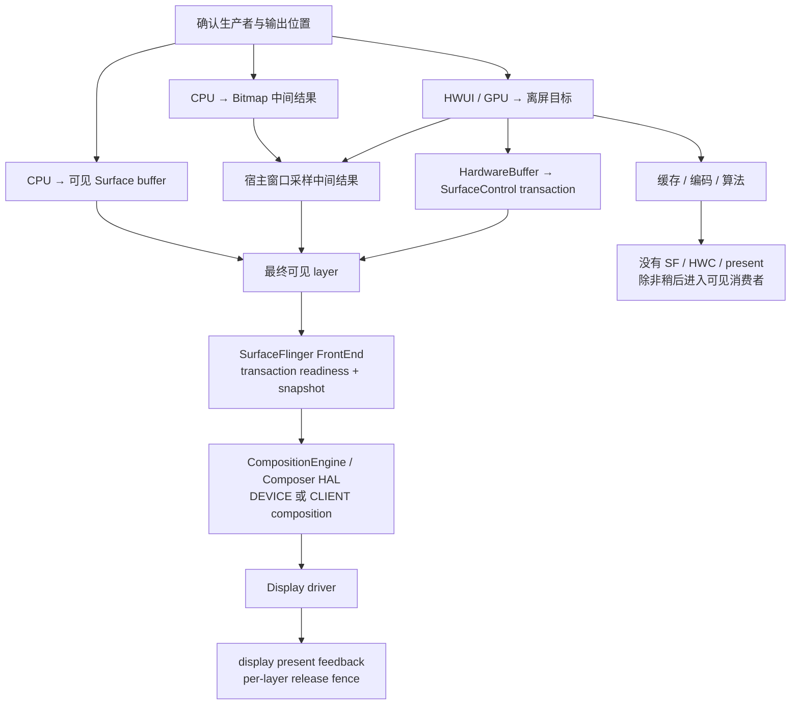
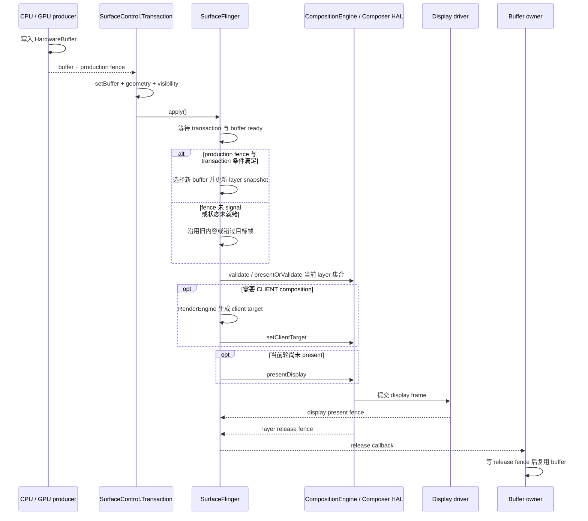

# Android Perfetto 系列 - App 出图类型 - Software / 离屏类型

Software rendering（软件渲染）描述“谁来生成像素”，offscreen rendering（离屏渲染）描述“像素先写到哪里”。两者是正交维度：CPU 可以直接写可见 `Surface`，GPU 也可以先画进离屏纹理或 `HardwareBuffer`。如果只凭“没看到 `DrawFrame`”或“出现了一块中间 buffer”判断路径，很容易把生产者、消费者和最终显示对象混在一起。

这篇文章以 Android 17 / API 37、`android-17.0.0_r1` 为平台源码锚点，kernel 侧以 `android17-6.18-2026-06_r6` 为锚点。分析目标是回答四个问题：谁生成像素，像素写到哪里，谁消费结果，结果有没有进入显示链路。

<!--more-->

## 阅读导航

### 本文目录

- 1. 两个维度：生产方式与结果去向
- 2. CPU 直接写可见 Surface
- 3. View 的 software layer
- 4. GPU 与 HardwareBuffer 离屏渲染
- 5. SurfaceControl.setBuffer 直接提交
- 6. 调度、fence 与 buffer 生命周期
- 7. Perfetto 证据链
- 8. 性能成本与内存压力
- 9. Android 12—17 版本演进
- 10. Android 17 源码入口
- 11. 类型边界与常见误判
- 总结

### 系列文章目录

1. [Android Perfetto 系列 - App 出图类型 - 总览与识别方法](S01_rendering_types_overview.md)
2. [Android Perfetto 系列 - App 出图类型 - AOSP 标准类型](S02_aosp_standard_type.md)
3. [Android Perfetto 系列 - App 出图类型 - SurfaceView 类型](S03_surfaceview_type.md)
4. [Android Perfetto 系列 - App 出图类型 - TextureView 类型](S04_textureview_type.md)
5. [Android Perfetto 系列 - App 出图类型 - 混合出图类型](S05_mixed_rendering_type.md)
6. [Android Perfetto 系列 - App 出图类型 - 多窗口类型](S06_multi_window_type.md)
7. [Android Perfetto 系列 - App 出图类型 - Software / 离屏类型](S07_software_offscreen_type.md)
8. [Android Perfetto 系列 - App 出图类型 - Native Graphics 类型](S08_native_graphics_type.md)
9. [Android Perfetto 系列 - App 出图类型 - WebView 类型](S09_webview_type.md)
10. [Android Perfetto 系列 - App 出图类型 - Flutter 类型](S10_flutter_type.md)
11. [Android Perfetto 系列 - App 出图类型 - Camera 类型](S11_camera_type.md)
12. [Android Perfetto 系列 - App 出图类型 - Video Overlay / HWC 类型](S12_video_overlay_hwc_type.md)
13. [Android Perfetto 系列 - App 出图类型 - Game 类型](S13_game_type.md)
14. [Android Perfetto 系列 - App 出图类型 - React Native 类型](S14_react_native_type.md)

## 1. 两个维度：生产方式与结果去向

第一维是像素生产方式。

- CPU software：CPU 通过 `Canvas`、Bitmap 栅格化或直接内存写入生成像素。
- HWUI / GPU：HWUI、Skia、OpenGL ES 或 Vulkan 把绘制命令交给 GPU。
- 外部硬件：相机、视频解码器等硬件模块写入 buffer。它们属于更专门的 Camera、Video 类型，本篇只用来说明分类边界。

第二维是输出位置。

- 直接可见：结果就是某个可见 `Surface` 的下一块 buffer，提交后可以进入 SurfaceFlinger。
- 中间结果：先写入 Bitmap、GPU render target、FBO、`HardwareBuffer` 或 `ImageReader`，稍后由窗口、编码器、算法模块或 `SurfaceControl` 消费。

把两个维度组合起来，常见路径可以收敛为下表。

| 生产者 | 输出 | 最终可见对象 | 典型入口 |
|---|---|---|---|
| CPU | 可见 Surface buffer | 当前窗口或独立 Surface layer | `ViewRootImpl.drawSoftware()`、`Surface.lockCanvas()` |
| CPU | Bitmap 中间结果 | 宿主窗口 layer | `LAYER_TYPE_SOFTWARE`、自建 Bitmap 缓存 |
| HWUI / GPU | GPU 中间目标或 `HardwareBuffer` | 取决于消费者 | `saveLayer()`、`RenderEffect`、`HardwareBufferRenderer` |
| App GPU | `HardwareBuffer` | 独立 `SurfaceControl` layer | EGL / Vulkan 生产后调用 `Transaction#setBuffer()` |

下面这张图把生产和显示分成两段。图中的 present 只存在于最终可见结果，纯离屏任务不会自然获得 display present fence。



图里最关键的一条线是“中间结果 → 消费者”。离屏生产完成只说明 buffer 可读，无法说明用户已经看到内容。要把生产耗时、消费等待和显示耗时分别落到对应时间线上。

## 2. CPU 直接写可见 Surface

整窗口关闭硬件加速时，Android 17 的 `ViewRootImpl.drawSoftware()` 会锁住窗口 `Surface`，取得软件 `Canvas`，调用 `mView.draw(canvas)` 绘制 View 树，随后执行 `unlockCanvasAndPost()`。自定义 Surface 绘制也可以由业务线程通过 `SurfaceHolder.lockCanvas()` 完成，线程节奏不必跟随宿主窗口的 `Choreographer`。

这条链路的源码形状如下。代码只保留诊断需要的调用关系，异常处理、坐标变换和脏区维护均已省略。

```text
ViewRootImpl.drawSoftware(...)
  → Surface.lockCanvas(dirty)
    → android_view_Surface.nativeLockCanvas(...)
      → Surface::lock(...)
        → dequeueBuffer(...)
        → GraphicBuffer::lockAsync(...)
  → View.draw(canvas)
  → Surface.unlockCanvasAndPost(canvas)
    → Surface::unlockAndPost()
      → GraphicBuffer::unlockAsync(&fenceFd)
      → queueBuffer(buffer, fenceFd)
```

这段关系说明软件绘制仍受 BufferQueue 生命周期约束。`lockCanvas()` 可能等待可用 slot 或上一轮 release fence，CPU 栅格化只是锁成功之后的一段。使用脏区绘制时，native `Surface` 还可能复制上一块 buffer 中未变更的区域；高分辨率窗口中的 copyback 会消耗可观的内存带宽。

`unlockCanvasAndPost()` 之后，buffer 进入可见 Surface 的消费路径。SurfaceFlinger 等待必要的 acquire fence，选择本轮 layer snapshot，并交给 HWC 规划 DEVICE composition 或 CLIENT composition。存在 CLIENT layer 时，RenderEngine 先生成 client target，再由 `HWComposer::setClientTarget()` 交给 HWC。Android 17 最终通过 `presentAndGetReleaseFences()` 取得显示 present fence 和各 layer 的 release fence。

CPU 生成的 buffer 并不会被强制分配到 HWC overlay。format、dataspace、缩放、旋转、裁剪、alpha 和设备能力共同决定组合方式。软件绘制慢和 CLIENT composition 慢也要分开：前者发生在 App 生产阶段，后者发生在 SurfaceFlinger / RenderEngine 的显示阶段。

## 3. View 的 software layer

`View#setLayerType(LAYER_TYPE_SOFTWARE, paint)` 只改变指定 View 子树的绘制方式。即便窗口开启硬件加速，该子树仍会被软件栅格化到 Bitmap，再作为缓存结果参与宿主窗口的硬件绘制。宿主窗口的 HWUI RenderThread、窗口 BufferQueue 和 SurfaceFlinger layer 都还存在。

这条路径有三个容易混淆的边界。

第一，SurfaceFlinger 看不到独立的“software View layer”。View 子树已经被扁平化到宿主窗口 buffer，SF 侧只能观察宿主 App Window。Perfetto 中最终 `BufferTX - <layerName>`、latch 和 present 也属于宿主窗口。

第二，公开的 `View.buildDrawingCache()` 从 API 28 起已弃用，不能据此把 Android 17 的 software layer 固定描述成某个历史私有函数序列。稳定的公开语义是“软件渲染到 Bitmap”。源码跟读可以查看 `View#setLayerType()`、`buildLayer()` 和 display list 更新分支，但诊断结论应落在 Bitmap 分配、CPU 栅格化、缓存失效与 GPU 采样成本上。

第三，`LAYER_TYPE_HARDWARE`、硬件加速 Canvas 的 `saveLayer()`、`RenderEffect` 和 Compose 离屏合成都属于 GPU 中间目标。它们可能创建纹理或 render target，并不会自动出现 CPU Bitmap 栅格化。相同的模糊或透明效果，在软件 Canvas 和硬件 Canvas 上会落到不同的执行单元。

判断单个 View 的 software layer 时，需要同时看到两部分证据：主线程或相关 CPU 线程上的软件绘制成本，以及宿主 RenderThread 的窗口帧。只看到前者不足以证明整窗口退出 HWUI；只看 `DrawFrame` 又会漏掉前面为 Bitmap 生成像素的时间。

## 4. GPU 与 HardwareBuffer 离屏渲染

离屏渲染可以只服务于本地缓存、缩略图、编码和算法处理，也可以生成稍后要上屏的内容。前一种路径没有 SurfaceFlinger layer；后一种路径要继续追踪宿主窗口采样或独立 layer 提交。

Android 14 / API 34 提供公开的 `HardwareBufferRenderer`。它把 `RenderNode` 场景画入调用方提供的 `HardwareBuffer`，适合生成可供系统合成器、编码器或后续 GPU pass 使用的结果。它与 `HardwareRenderer` 使用同一个进程级 HWUI render thread，因此某个 consumer 长时间不释放资源或某次 GPU 工作过重，可能影响该进程里的其他 HWUI renderer。

`HardwareBufferRenderer.RenderResult#getFence()` 返回的是中间 buffer 的生产完成 fence。消费者在读取 buffer 前需要等待或把 fence 继续向下传递。它与 display present fence 的语义不同：前者保护“何时可以读这块 buffer”，后者表示“一轮 display frame 已进入显示设备的 present 边界”。

使用 `HardwareBufferRenderer` 还要注意两个所有权规则。

- renderer 不会在每次 draw 前自动清空 `HardwareBuffer`；复用 buffer 时应全量覆盖或显式清屏，避免旧像素残留。
- `close()` 释放 renderer 资源，不会替调用方关闭传入的 `HardwareBuffer`；buffer 池、关闭时机和跨模块引用仍由调用方管理。

传统的 `HardwareRenderer` 面向输出 `Surface`，公开于 API 29；EGL / Vulkan 也可以直接把 `AHardwareBuffer` 导入为图像并完成离屏绘制。Perfetto 分析时要先确认 API 与实现：看到 App 自有 GL / Vulkan 线程时，不应把它归到 HWUI common render thread。

## 5. SurfaceControl.setBuffer 直接提交

Android 13 / API 33 起，公开的 `SurfaceControl.Transaction#setBuffer()` 可以把 `HardwareBuffer` 直接设置到 `SurfaceControl`。这里跳过的是该 layer 在 producer 侧的 `dequeueBuffer()` / `queueBuffer()` 循环；SurfaceFlinger transaction、fence readiness、layer snapshot、HWC composition 和 release 生命周期仍然存在。

直接提交的同步关系如下。



提交时 buffer 仍在写入，就应把有效 `SyncFence` 交给 `setBuffer()`。compositor 会等待它 signal。一个 transaction 同时设置多块 buffer 时，所有 production fence 都满足之后，这组 buffer 才能保持原子一致地显示；其中一块晚到会拖住整组 transaction。

用于 `setBuffer()` 的 `HardwareBuffer` 需要同时支持 `USAGE_COMPOSER_OVERLAY` 和 `USAGE_GPU_SAMPLED_IMAGE`，因为设备可能使用硬件 plane，也可能由 GPU 采样。usage 只表示允许的消费者，无法保证 HWC 一定选择 DEVICE composition。

连续生产必须使用 release callback 或等价的 release fence 管理复用。Java 带 `releaseCallback` 的 overload 会在当前 buffer 可以安全复用时回调；返回的 `SyncFence` 有效时，复用前必须等待。Android 16 / API 36 起，NDK 提供 `ASurfaceTransaction_setBufferWithRelease()`，把当前 `AHardwareBuffer` 的 release 回调与提交绑定。旧的 transaction complete 回调描述的是 transaction 完成状态，不能替代当前 buffer 的可靠回收协议。

## 6. 调度、fence 与 buffer 生命周期

软件和离屏路径没有统一的起跑线。

- 整窗口 `drawSoftware()` 通常仍由 ViewRoot 的 traversal 与 `Choreographer#doFrame()` 驱动，主要工作落在主线程。
- `SurfaceHolder.lockCanvas()` 可以运行在业务线程的循环中，生产节奏由应用决定。
- `HardwareBufferRenderer` 由调用线程发起 request，绘制工作进入 common HWUI render thread 和 GPU。
- EGL / Vulkan 离屏任务可以完全脱离 `vsync-app`，直到某个可见消费者在自己的帧里使用结果。

一块会上屏的离屏 buffer，至少要分清三类 fence。

| fence | 保护的边界 | 等待方 | 常见错误 |
|---|---|---|---|
| production / acquire fence | producer 已完成写入，consumer 可以读取 | 宿主 GPU、SurfaceFlinger 或其他消费者 | 把它当作已显示证明 |
| display present fence | 这一轮 display frame 到达显示 present 边界 | SurfaceFlinger 的显示时间线 | 当成某块 buffer 独享的 fence |
| layer release fence | consumer 不再读取该 buffer，可以回池复用 | producer / buffer pool | callback 一到就立即写，未等待有效 fence |

纯离屏任务通常只有生产完成与消费者 release 边界。没有可见 layer，也就没有 SF latch、HWC validate/present 和 display present fence。Perfetto 中找不到 SF 对象时，应先检查任务是否设计上就不需要上屏。

进入 Android kernel 后，跨设备和跨进程共享的图形 buffer 通常由 dma-buf 表示，同步通过 dma-fence，并可借助 sync_file 暴露为文件描述符。`android17-6.18-2026-06_r6` 锚点下，应用层的 `SyncFence`、native fence fd 与内核 dma-fence 是同一条所有权链上的不同接口层。trace 中看到 fence wait 时，要继续确认等待的是 GPU 写入、HWC 释放，还是 buffer pool 自身不足。

## 7. Perfetto 证据链

分析顺序应从 producer 开始，再追 consumer，继而检查可见 layer。SurfaceFlinger 平静只能说明结果尚未进入它的视野，无法排除前面的生产延迟。

### 第一步：确认最终结果是否可见

先在 SurfaceFlinger layer、WindowManager 窗口和目标 display 中寻找对应对象。纯 Bitmap 缓存、编码输入或算法 buffer 不会自然生成 SF layer。通过宿主窗口采样的中间结果只对应宿主 layer；通过 `setBuffer()` 提交的结果才对应目标 `SurfaceControl` layer。

### 第二步：确认像素生产者

| trace 现象 | 更可能的路径 | 下一步 |
|---|---|---|
| 没有 HWUI `DrawFrame`，主线程出现软件 View 绘制 | 整窗口 software rendering | 查 `lockCanvas` 等待、View 树 CPU 栅格化、post 时间 |
| 业务线程周期性 lock/post 独立 Surface | `SurfaceHolder` 软件生产者 | 查线程节奏、BufferQueue slot 与 release fence |
| 有宿主 `DrawFrame`，前面伴随 Bitmap 分配和 CPU raster | 单个 View software layer 或 Bitmap 缓存 | 查缓存失效、尺寸、上传和 GC |
| RenderThread / GPU 出现离屏 pass，没有对应 SF layer | GPU 纯离屏任务 | 找编码器、ImageReader、缓存或算法消费者 |
| 出现 `HardwareBufferRenderer` request 和 `setBuffer` transaction | `HardwareBuffer` 直接提交 | 对齐生产 fence、transaction、latch 与 release callback |

slice 名会受设备厂商、图形后端和 trace 配置影响。没有某个固定字符串时，可以用线程、调用栈、fence、buffer id 和 layer id 建立关系，不要把一条 slice 名当作类型定义。

### 第三步：把等待拆开

`lockCanvas()` 变长时，先看线程状态。如果线程睡眠在 `dequeueBuffer`、futex 或 fence wait，问题位于 buffer 可用性；锁成功后长时间 Running，才更像 CPU 绘制或内存带宽压力。

`HardwareBufferRenderer` 的 callback 变晚时，要分辨 common RenderThread 排队、GPU 执行和完成 fence signal。`setBuffer()` 已 apply 但 layer 没更新时，再查 transaction readiness、production fence、期望显示时间、目标 layer 是否可见，以及是否沿用旧 buffer。

最终显示阶段关注以下证据：目标 layer 的 transaction / buffer 更新、SurfaceFlinger latch、composition type、RenderEngine CLIENT composition、HWC present、display present fence 和 layer release fence。生产快而 present 晚，瓶颈位于显示后半段；生产本身已越过目标 deadline，SF 只能显示旧内容或错过当前周期。

### 第四步：量化节拍

不要只量一帧。连续帧至少记录：请求时间、拿到可写 buffer 的时间、生产完成时间、提交时间、latch 时间、present 时间、release 时间。用 buffer id 或 transaction id 关联同一帧，才能区分以下三种问题：生产变慢、消费间隔变长、buffer 池耗尽后反压 producer。

## 8. 性能成本与内存压力

Software / 离屏问题经常由内存流量主导。RGBA_8888 的理论字节量可用下面的式子估算：

`width × height × 4 × bufferCount`

一张 1440 × 3200 的 RGBA_8888 buffer 约为 17.6 MiB。三缓冲只计算像素存储就超过 52 MiB；再叠加软件脏区 copyback、CPU 写入、纹理上传、GPU 采样和 client composition，单帧可能多次穿过内存系统。

Perfetto 中可以补看这些轨道：

- CPU 调度、频率和 Running 时间，判断软件栅格化是否受算力或抢占影响；
- ART GC、native heap、Bitmap 与 graphics memory，判断缓存反复分配；
- GPU queue、GPU frequency 和 render stage，判断离屏 pass 是否挤占窗口帧；
- dma-buf 分配、page fault、direct reclaim、`kswapd`、zram 和 PSI memory，判断内存回收是否进入关键路径；
- HWC composition type 与 RenderEngine，判断中间结果的 format、缩放或透明度是否触发额外 CLIENT composition。

优化时优先削减不必要的中间结果面积和更新频率。software layer 的 bounds、`saveLayer()` 的范围、模糊半径、`HardwareBuffer` 尺寸和 buffer 池深度都会直接放大成本。局部效果却分配全屏离屏目标，是这类路径中最常见的浪费之一。

## 9. Android 12—17 版本演进

版本演进需要同时看稳定主干和新增公开能力。Android 12 以前的 `lockCanvas()`、View software layer、`HardwareRenderer`、EGL 与 BufferQueue 仍有历史意义，但现代诊断从 Android 12 起更贴近当前设备和 trace 结构。

### Android 12 / API 31

CPU 直写 `Surface`、单 View software layer 和 HWUI 离屏 layer 已经是成熟路径。Android 12 引入公开 `RenderEffect`，模糊、颜色和 shader 效果更容易触发 GPU 中间渲染；同时 BLAST 与 FrameTimeline 成为现代窗口显示分析的重要背景。此时还没有公开 `HardwareBufferRenderer`，离屏硬件生产通常使用 `HardwareRenderer` + `Surface`、EGL / Vulkan 或平台私有接口。

### Android 13 / API 33

`SurfaceControl.Transaction#setBuffer()`、平台 `SyncFence` 以及相关 release callback 成为公开 API。应用可以把符合 usage 要求的 `HardwareBuffer` 直接设置到 `SurfaceControl`，并显式传递生产 fence 与回收 fence。直接 buffer transaction 从这一版起具备清晰的公开 Java API 边界。

### Android 14 / API 34

`HardwareBufferRenderer` 成为公开 API，提供 `RenderNode → HardwareBuffer` 的现代离屏 HWUI 路径。它复用 common render thread，返回生产完成 fence，并明确把 buffer 清理和关闭责任留给调用方。离屏生产与最终显示由此可以通过公开 API 分层实现。

### Android 15 / API 35

`SurfaceControl.Transaction#setFrameTimeline()`、desired present time 和更完整的 transaction 完成反馈，让直接提交的 buffer 更容易表达目标显示周期并建立观测边界。这些 API 没有改变 buffer 的生产方式，作用集中在 transaction 调度与完成反馈。

### Android 16 / API 36

NDK 增加 `ASurfaceTransaction_setBufferWithRelease()`。Native producer 可以在提交 `AHardwareBuffer` 时绑定当前 buffer 的 release callback，避免用 transaction 完成回调推测 buffer 是否已安全释放。Java 侧已有对应能力，这一版补齐了 NDK 连续 buffer 生产的回收语义。

### Android 17 / API 37

本文讨论的四条主路径保持稳定：`drawSoftware()` / `lockCanvas()`、View software layer、`HardwareBufferRenderer` 离屏生产、`SurfaceControl.Transaction#setBuffer()` 直接提交。源码锚点统一到 `android-17.0.0_r1` 后，显示后半段应按当前 SurfaceFlinger FrontEnd layer snapshot、CompositionEngine、AIDL Composer HAL 和 `presentAndGetReleaseFences()` 理解；不能把早期 HWC2 教程中的函数序列直接当作 Android 17 的完整实现。

kernel 锚点统一到 `android17-6.18-2026-06_r6` 后，dma-buf、dma-fence 与 sync_file 仍是 buffer 共享和同步的核心基础设施。上层 API 名称在演进，buffer 所有权、生产完成、显示消费和安全复用这四个问题一直存在。

## 10. Android 17 源码入口

下面的入口足以覆盖 CPU 软件绘制、HWUI 离屏生产、直接 buffer transaction 和最终显示。

- [`ViewRootImpl.java`](https://android.googlesource.com/platform/frameworks/base/+/android-17.0.0_r1/core/java/android/view/ViewRootImpl.java)：查看 `drawSoftware()` 如何锁窗口 Surface、绘制根 View 并 post buffer。
- [`Surface.java`](https://android.googlesource.com/platform/frameworks/base/+/android-17.0.0_r1/core/java/android/view/Surface.java) 与 [`android_view_Surface.cpp`](https://android.googlesource.com/platform/frameworks/base/+/android-17.0.0_r1/core/jni/android_view_Surface.cpp)：查看 Java Canvas 锁定与 native `Surface` 的桥接。
- [`Surface.cpp`](https://android.googlesource.com/platform/frameworks/native/+/android-17.0.0_r1/libs/gui/Surface.cpp) 与 [`GraphicBuffer.cpp`](https://android.googlesource.com/platform/frameworks/native/+/android-17.0.0_r1/libs/ui/GraphicBuffer.cpp)：查看 `dequeueBuffer()`、`lockAsync()`、`unlockAsync()` 和 `queueBuffer()`。
- [`View.java`](https://android.googlesource.com/platform/frameworks/base/+/android-17.0.0_r1/core/java/android/view/View.java) 与 [View layer 官方说明](https://developer.android.com/develop/ui/views/graphics/hardware-accel)：核对 `LAYER_TYPE_SOFTWARE` 的公开语义与实现分支。
- [`HardwareBufferRenderer.java`](https://android.googlesource.com/platform/frameworks/base/+/android-17.0.0_r1/graphics/java/android/graphics/HardwareBufferRenderer.java) 与 [API Reference](https://developer.android.com/reference/android/graphics/HardwareBufferRenderer)：核对 common render thread、生产 fence、清屏和资源所有权。
- [`SurfaceControl.java`](https://android.googlesource.com/platform/frameworks/base/+/android-17.0.0_r1/core/java/android/view/SurfaceControl.java) 与 [`SurfaceControl.Transaction` API Reference](https://developer.android.com/reference/android/view/SurfaceControl.Transaction)：核对 `setBuffer()`、usage、production fence 和 release callback。
- [NDK Native Activity / SurfaceControl Reference](https://developer.android.com/ndk/reference/group/native-activity)：核对 API 36 的 `ASurfaceTransaction_setBufferWithRelease()`。
- [`SurfaceFlinger.cpp`](https://android.googlesource.com/platform/frameworks/native/+/android-17.0.0_r1/services/surfaceflinger/SurfaceFlinger.cpp)、[`HWComposer.cpp`](https://android.googlesource.com/platform/frameworks/native/+/android-17.0.0_r1/services/surfaceflinger/DisplayHardware/HWComposer.cpp) 与 [`HWC2.cpp`](https://android.googlesource.com/platform/frameworks/native/+/android-17.0.0_r1/services/surfaceflinger/DisplayHardware/HWC2.cpp)：核对最终 layer snapshot、composition 和 present / release fence。
- Android17 kernel [`dma-buf.rst`](https://android.googlesource.com/kernel/common/+/refs/tags/android17-6.18-2026-06_r6/Documentation/driver-api/dma-buf.rst)、[`sync_file.rst`](https://android.googlesource.com/kernel/common/+/refs/tags/android17-6.18-2026-06_r6/Documentation/driver-api/sync_file.rst) 与 [`sync_file.c`](https://android.googlesource.com/kernel/common/+/refs/tags/android17-6.18-2026-06_r6/drivers/dma-buf/sync_file.c)：核对共享 buffer、dma-fence 和 fence fd 的基础语义。

## 11. 类型边界与常见误判

### 与标准 HWUI 窗口的边界

标准 HWUI 窗口由 UI Thread 更新 RenderNode / display list，RenderThread 和 GPU 直接生成当前窗口 buffer。整窗口 software rendering 把像素生产移到 CPU；View software layer 只把某个子树移到 CPU，最终窗口仍由 HWUI 输出；GPU 离屏则在最终窗口之前增加中间 render target。

### 与 Native Graphics 的边界

App 自有 EGL / Vulkan 线程如果直接面向可见 `Surface` 的 swapchain 持续出图，应归入 Native Graphics。相同线程先写 `HardwareBuffer`，结果用于缓存、编码或稍后 `setBuffer()`，本篇的离屏生产与消费模型更合适。分类依据是 buffer 的去向，不是开发语言。

### 常见误判

| 误判 | 正确检查方式 |
|---|---|
| 没有 `DrawFrame`，trace 一定漏采 | 查整窗口 `drawSoftware()`、`lockCanvas()` 和自定义 Surface 线程 |
| `lockCanvas()` 很长，CPU 绘制很慢 | 先拆开 slot / release fence 等待与锁成功后的 CPU Running 时间 |
| `LAYER_TYPE_SOFTWARE` 会让整个窗口退出 HWUI | 查宿主 RenderThread 和 App Window buffer；它只影响 View 子树 |
| 离屏渲染都由 CPU 完成 | 查 HWUI / Skia offscreen pass、EGL / Vulkan 和 `HardwareBufferRenderer` |
| `RenderResult#getFence()` 表示已经上屏 | 它只表示中间 buffer 的生产完成；显示还要经过消费者、SF 和 HWC |
| `setBuffer()` 绕过 SurfaceFlinger | 它只绕过 producer 侧 BufferQueue 循环，SF transaction 与 composition 仍在 |
| transaction complete 后 buffer 一定可以复用 | 使用专门的 release callback，并等待回调携带的有效 release fence |
| HWC overlay usage 能保证 DEVICE composition | usage 只允许该消费方式，最终选择还受整组 layer 和设备能力影响 |

## 总结

Software / 离屏类型要用两个维度判断：生产者是谁，结果先落在哪里。CPU `lockCanvas()` 可以直接生成可见 Surface buffer；`LAYER_TYPE_SOFTWARE` 只把 View 子树栅格化成 Bitmap；`HardwareBufferRenderer` 与 EGL / Vulkan 可以在 GPU 上生成离屏结果；`SurfaceControl.Transaction#setBuffer()` 再把 `HardwareBuffer` 接入独立 layer 的显示链路。

Perfetto 分析时按 producer、intermediate buffer、consumer、visible layer 的顺序取证，并分别对齐 production fence、display present fence 和 layer release fence。这样才能判断慢点位于像素生成、buffer 等待、消费衔接，还是 SurfaceFlinger / HWC 的最终显示阶段。
