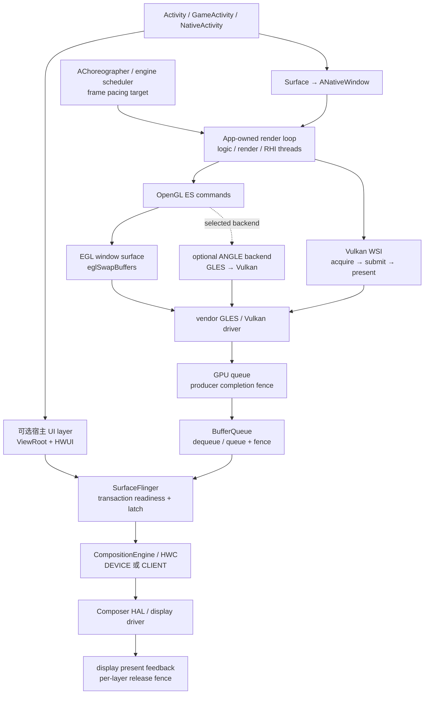
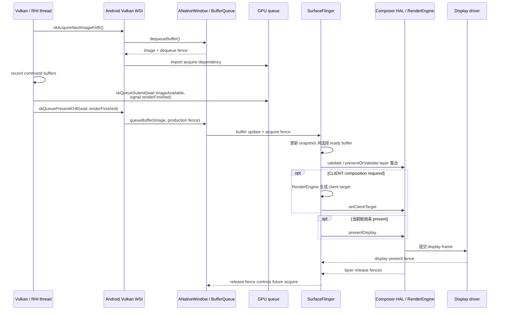

# Android Perfetto 系列 - App 出图类型 - Native Graphics 类型

Native Graphics 的识别标准不在 C++、OpenGL ES 或 Vulkan 这些标签本身，而在画面生产权：关键内容由应用自己的 render loop 获取 buffer、组织 GPU 工作并提交到可见 `Surface`。普通 ViewRoot 和 HWUI RenderThread 可能只负责窗口外壳，也可能完全不参与主体画面。

这篇文章以 Android 17 / API 37、`android-17.0.0_r1` 为平台源码锚点，kernel 侧以 `android17-6.18-2026-06_r6` 为锚点。EGL、Vulkan WSI、ANGLE 和 Swappy 的版本边界分别说明，避免把图形库能力当作所有 Android 17 设备的固定行为。

<!--more-->

## 阅读导航

### 本文目录

- 1. Native Graphics 的系统位置
- 2. EGL / OpenGL ES 一帧怎样提交
- 3. Vulkan swapchain 一帧怎样提交
- 4. render loop 与 frame pacing
- 5. ANGLE：GLES API 下的 Vulkan backend
- 6. BufferQueue、SurfaceFlinger 与 HWC 收尾
- 7. Perfetto 证据链
- 8. 常见瓶颈与优化方向
- 9. Android 12—17 版本演进
- 10. Android 17 源码入口
- 11. 类型边界与常见误判
- 总结

### 系列文章目录

1. [Android Perfetto 系列 - App 出图类型 - 总览与识别方法](S01_rendering_types_overview.md)
2. [Android Perfetto 系列 - App 出图类型 - AOSP 标准类型](S02_aosp_standard_type.md)
3. [Android Perfetto 系列 - App 出图类型 - SurfaceView 类型](S03_surfaceview_type.md)
4. [Android Perfetto 系列 - App 出图类型 - TextureView 类型](S04_textureview_type.md)
5. [Android Perfetto 系列 - App 出图类型 - 混合出图类型](S05_mixed_rendering_type.md)
6. [Android Perfetto 系列 - App 出图类型 - 多窗口类型](S06_multi_window_type.md)
7. [Android Perfetto 系列 - App 出图类型 - Software / 离屏类型](S07_software_offscreen_type.md)
8. [Android Perfetto 系列 - App 出图类型 - Native Graphics 类型](S08_native_graphics_type.md)
9. [Android Perfetto 系列 - App 出图类型 - WebView 类型](S09_webview_type.md)
10. [Android Perfetto 系列 - App 出图类型 - Flutter 类型](S10_flutter_type.md)
11. [Android Perfetto 系列 - App 出图类型 - Camera 类型](S11_camera_type.md)
12. [Android Perfetto 系列 - App 出图类型 - Video Overlay / HWC 类型](S12_video_overlay_hwc_type.md)
13. [Android Perfetto 系列 - App 出图类型 - Game 类型](S13_game_type.md)
14. [Android Perfetto 系列 - App 出图类型 - React Native 类型](S14_react_native_type.md)

## 1. Native Graphics 的系统位置

Native Graphics 通常由 `SurfaceView`、`NativeActivity`、`GameActivity` 或引擎自己的窗口封装提供 `Surface`。Java `Surface` 通过 `ANativeWindow_fromSurface()` 转换为带引用计数的 `ANativeWindow`；EGL window surface 和 Vulkan Android surface 都以它为平台连接点。AOSP 内部的 `android::Surface` 实现 `ANativeWindow` 接口，并连接到 BufferQueue producer。

应用掌握的是 producer 前半段，系统仍掌握 consumer 后半段。



图中的宿主 UI 与 native surface 经常是两个 layer。比如游戏主体画在 `SurfaceView` child layer，登录弹窗或系统栏由另一个窗口 / layer 提供。引擎内 HUD 若直接画入同一张 swapchain image，SurfaceFlinger 只看到一层，不能因为画面上有按钮就推断系统多了一层。

Native render loop 也不等于纯 native 进程。Java/Kotlin 可以创建窗口和处理生命周期，C++ 只接管渲染；Flutter、WebView 或视频组件内部也可能有 native GPU 线程。归类时看主体画面的 producer 和最终 Surface，不看调用语言。

## 2. EGL / OpenGL ES 一帧怎样提交

EGL window surface 把 OpenGL ES 与 `ANativeWindow` 接在一起。应用在线程上绑定 EGL 上下文和 surface，发出 GLES draw call，再调用 `eglSwapBuffers()` 交付当前 back buffer。

下面的调用关系用于定位 trace，不代表每个 vendor EGL 都在同一个函数里完成所有动作。

```text
render thread
  → GLES draw calls
  → eglSwapBuffers(display, surface)
    → flush / submit pending GPU work
    → ANativeWindow queueBuffer(currentBuffer, productionFence)
    → acquire or prepare another buffer as implementation requires
  → next frame
```

`eglSwapBuffers()` 的时长混合了多种成本：driver flush、GPU queue 管理、等待可用 BufferQueue slot、等待 release fence、swap interval、presentation time 和 frame pacing。函数很长只能说明调用线程没有立即返回，无法直接证明 GPU shader 很慢。

buffer 随 `queueBuffer()` 进入 consumer 后，producer completion fence 在 SurfaceFlinger 侧作为 acquire fence 使用：fence signal 前，consumer 不能读取尚未写完的像素。显示完成后，per-layer release fence 回到 producer，决定旧 buffer 何时能够再次被写入。

EGL swap 的返回也不代表画面已经显示。它通常只表示当前 buffer 已交给平台队列，并满足 EGL 实现定义的同步要求。用户可见时间还要继续经过 SF latch、HWC / RenderEngine composition 和 display present。

## 3. Vulkan swapchain 一帧怎样提交

Vulkan 把 image 获取、GPU 提交和 present 拆成显式步骤。Android Vulkan WSI 通过 `VK_KHR_android_surface` 把 `VkSurfaceKHR` 连接到 `ANativeWindow`，swapchain image 与 BufferQueue buffer 建立对应关系。



AOSP Android 17 的 `vulkan/libvulkan/swapchain.cpp` 展示了平台内部桥接：acquire 路径从 native window dequeue buffer，并通过驱动的 Android WSI 接口导入 fence；present 路径取得 producer 完成 fence，再把 image queue 回 native window。这里的 producer fence 仍然不是 display present fence。

`vkAcquireNextImageKHR()` 可能阻塞，也可能立即返回；`vkQueuePresentKHR()` 也可能因 driver 和 presentation engine 状态呈现不同阻塞行为。它们只能管理 swapchain，不能充当业务线程之间的通用同步器。GPU—GPU 依赖使用 semaphore，GPU—CPU 完成通知使用 fence，resource hazard 使用 pipeline barrier 或 event。

swapchain 的 image count、format、color space、extent、preTransform、usage 和 present mode 都应从 surface capabilities 查询。不能把桌面平台常见的 IMMEDIATE、MAILBOX 或 FIFO_RELAXED 当作 Android 设备必有能力。旋转时忽略 `currentTransform` / pre-rotation 还可能增加 compositor 旋转成本，并降低 overlay 机会。

## 4. render loop 与 frame pacing

Native render loop 的起点可能来自 `AChoreographer`、引擎 scheduler、音频时钟、网络 tick、XR 运行时或上一帧 backpressure。`vsync-app` 可以是 pacing 参考，也可以只驱动宿主 UI。判断一帧从哪里开始，要以引擎 marker、输入采样和 acquire / submit 序列为证据。

“能多快就多快地 present”会把 BufferQueue 塞满。队列满后，render thread 被迫在 swap 或 acquire 中等待显示消费，形成 queue-stuffing：表面帧率可能接近目标值，输入却在较早的帧中采样，额外排队直接增加触控到显示延迟。

Android Frame Pacing library（Swappy）是 AGDK 库，不属于 `android-17.0.0_r1` 平台 API。OpenGL ES 接入点是 `SwappyGL_swap()`，它包装 `eglSwapBuffers()`；Vulkan 接入点是 `SwappyVk_queuePresent()`，它代为调用 `vkQueuePresentKHR()`，并可能向 present queue 插入同步命令。分析前要先确认应用打包的 Swappy 版本和运行时是否成功启用。

Swappy 综合 Choreographer、presentation timestamp 和 sync fence，控制 swap interval、目标 present 时间与 pipeline mode。它的主动等待可能是在避免 queue-stuffing，不应直接标为卡顿。判断这段等待是否合理，要比较目标帧率、相邻 present 间隔、输入延迟和队列深度。

Vulkan 应用也可以自己实现 pacing。较早设备可查询 `VK_GOOGLE_display_timing`，设置 desired present time 并读取过去的 presentation timing；Android 17 / API 37 起新增 `VK_EXT_present_timing` 平台支持，提供标准化且更细的 present 阶段反馈。extension 必须在运行时枚举，Android 17 版本号不等于所有物理设备、驱动与 swapchain 组合都支持应用想用的全部扩展能力。

帧率选择与帧 pacing 是两个问题。`ANativeWindow_setFrameRate()` / Java `Surface#setFrameRate()` 向系统声明内容帧率和兼容性，系统再结合其他 layer、显示模式和切换策略选择 refresh rate；pacing 决定应用把每一帧放到哪个显示周期。只改 refresh rate 而不修正提交节拍，仍会出现短帧、长帧交替。

## 5. ANGLE：GLES API 下的 Vulkan backend

ANGLE 可以把应用的 OpenGL ES / EGL 调用翻译到 Vulkan 等 backend。此时应用可见边界仍是 GLES draw call 和 `eglSwapBuffers()`，底层却可能出现 Vulkan command buffer、queue submit 和 Vulkan driver 工作。

诊断时把成本分成三段：应用 GLES 调用，ANGLE 状态跟踪与命令翻译，Vulkan driver / GPU 执行。大量细碎 GLES 状态切换、shader 编译或 pipeline 缓存未命中可能在 ANGLE 层放大；另一台设备也可能因为 Vulkan driver 更稳定而获得更好的兼容性和性能。

ANGLE 的选择受系统版本、设备配置、开发者选项、应用 manifest、系统 graphics driver 包和厂商策略共同影响。Android 15 的开发者选项可以用于测试 ANGLE，不代表所有 Android 15 设备默认使用；Android 17 的请求信号也要结合实际 driver selection 验证。Perfetto、logcat、Graphics Driver Inspector 信息或 EGL vendor / renderer 字符串应共同确认 backend。

## 6. BufferQueue、SurfaceFlinger 与 HWC 收尾

GLES 和 Vulkan 的提交最终都变成 BufferQueue producer 的 buffer update。SurfaceFlinger 关心目标 layer、frame number、buffer、dataspace、crop、transform、damage、期望显示时间和 acquire fence；它不需要知道上游使用哪种 shader 语言。

Android 17 的显示后半段可以按以下边界理解：

1. SurfaceFlinger FrontEnd 处理 transaction，生成本轮 `RequestedLayerState` / `LayerSnapshot`。
2. 满足 transaction 与 fence readiness 的 buffer 才能进入候选 snapshot；晚到时可能沿用旧内容或错过目标周期。
3. CompositionEngine 为 display 准备 layer stack，并与 HWC 协商 composition type。
4. 可以直接交给硬件 plane 的 layer 使用 DEVICE composition；需要 GPU 合成的 layer 由 RenderEngine 生成 client target，再通过 `setClientTarget()` 交给 HWC。
5. HWC validate / present 成功后，`presentAndGetReleaseFences()` 收集 display present fence 与 per-layer release fence。`presentOrValidate` 的 PresentSucceeded 快路径已经完成 present，不能再写成随后必定执行第二次 present。

Native Graphics 不保证 DEVICE composition。透明混合、缩放、旋转、HDR / SDR 混合、受保护内容、显示 LUT、其他系统 layer 和 HWC plane 资源都会改变策略。GPU 已经渲染一次的画面若又进入 CLIENT composition，会多一次全屏采样和写回，需要结合 GPU 与内存带宽判断代价。

kernel 锚点 `android17-6.18-2026-06_r6` 下，GraphicBuffer / swapchain image 的跨模块共享落到 dma-buf，GPU、SurfaceFlinger 和 HWC 的异步完成关系通过 dma-fence / sync_file 传递。vendor GPU driver 的 job scheduler、频率、抢占和内存管理决定 GPU 工作何时完成；Android common kernel 锚点并不抹平不同 GPU 驱动的 tracepoint 与调度差异。

## 7. Perfetto 证据链

Native Graphics 应从应用 render loop 向显示端推进。先看普通 HWUI RenderThread，往往只能看到宿主壳或什么都看不到。

### 第一步：锁定 Surface 与 producer 线程

从窗口和 SurfaceFlinger layer 树确认主体画面对应哪个 Surface。再通过线程名、引擎 marker、`eglSwapBuffers()`、`vkAcquireNextImageKHR()`、`vkQueueSubmit()` 和 `vkQueuePresentKHR()` 找到 producer tid。线程名只能提供线索，调用栈与提交事件更可靠。

### 第二步：建立逐帧时间线

每帧至少标出以下节点：输入采样、logic start/end、render preparation、acquire、CPU submit、GPU start/end、swap / queuePresent、BufferQueue queue、SF latch、HWC present、display present、buffer release。引擎 frame id、Vulkan present id、buffer id、frame number 和 FrameTimeline token 能用多少就用多少，避免只按时间邻近猜测。

### 第三步：按 API 拆等待

| 现象 | 可能原因 | 验证证据 |
|---|---|---|
| `eglSwapBuffers()` 长 | driver flush、GPU fence、free slot、release fence、swap interval、Swappy wait | 线程状态、GPU queue、BufferQueue depth、Swappy marker |
| `vkAcquireNextImageKHR()` 长 | 没有可用 image、FIFO 节拍、consumer release 晚、surface resize | image count、present mode、release fence、`OUT_OF_DATE` / `SUBOPTIMAL` |
| `vkQueueSubmit()` 调用晚 | logic / command recording 晚、CPU 抢占、RHI 队列阻塞 | 上游 thread slice、Runnable latency、worker dependency |
| submit 早但 GPU 完成晚 | GPU 负载、shader / pipeline、带宽、driver queue、thermal throttling | GPU stage、frequency、job queue、counter、fence signal |
| buffer 已 queue 但 SF 没换新 | acquire fence 未 ready、目标 present 未到、layer 不可见、transaction 条件未满足 | layer trace、fence、FrameTimeline、transaction 状态 |
| SF latch 正常但 present 晚 | CLIENT composition、HWC validate、display contention | RenderEngine、composition type、HWC 与 present fence |

### 第四步：识别 queue-stuffing

典型信号是 pending buffer 长期维持在高水位，producer 仍持续尽快提交，随后周期性卡在 swap / acquire；输入到 present 延迟增加，帧间隔却可能没有明显恶化。修复方向是显式 pacing、降低 in-flight frame 数、推迟输入采样或调整 pipeline mode，不能只缩短 swap 调用本身。

### 第五步：正确使用 FrameTimeline

普通 App Window 常有完整的 expected / actual timeline。独立 native Surface 是否带标准 App FrameTimeline token，取决于 producer 是否传递 frame timeline / desired present 信息以及 trace 配置。缺少 expected slice 不代表没有显示；此时用 buffer frame number、layer latch、HWC present 和 display fence 补齐。不同 layer 的 token 也不能混成一条窗口帧。

## 8. 常见瓶颈与优化方向

CPU 侧常见问题包括逻辑与渲染串行、command buffer 录制不均、JNI 往返、频繁内存分配、shader / pipeline 同步编译、driver ioctl 阻塞和线程优先级不当。Vulkan 多线程录制只有在任务拆分、command pool 和 descriptor 管理合理时才有收益；线程数量超过可用大核会增加调度与缓存争用。

GPU 侧需要分辨算术、纹理、带宽、tile memory、overdraw、同步 bubble 和频率限制。分辨率缩放能缓解 fragment 与带宽压力，对 CPU draw-call 瓶颈帮助有限；减少 draw call 能缓解 CPU / driver 开销，对全屏重 shader 未必有效。使用 GPU counter 或 vendor profiler 确认瓶颈，再选择策略。

swapchain 配置也会改变延迟。image 太少容易让 acquire 频繁等待，太多又允许更多 in-flight frame，增加输入延迟和显存占用。buffer age、damage region、pre-rotation、颜色空间和 protected usage 都会影响后续合成。最佳配置要按设备能力、目标帧率和 latency 目标测试。

移动设备的持续性能受温度和功耗约束。短时间跑满 GPU 得到的峰值不能代表十分钟后的稳定帧率。ADPF Performance Hint Session、thermal API，以及 Android 16 的 CPU / GPU headroom 可以帮助 workload 自适应；提示系统时应报告真实周期和线程集合，不能把 hint 当作固定锁频接口。

## 9. Android 12—17 版本演进

Native Graphics 的核心桥接在 Android 12 前已经形成：`ANativeWindow`、EGL window surface、Vulkan Android WSI、BufferQueue 与 SurfaceFlinger。现代版本演进更集中在刷新率、frame pacing、HWC 接口、native 兼容性和时间反馈。

### Android 12 / API 31

Android 12 改进 `Surface#setFrameRate()` 的刷新率切换策略，系统可以在显示不支持 seamless transition 时按应用声明选择非无缝切换。BLAST 与 FrameTimeline 构成现代窗口显示诊断基线，能更清楚地区分应用提交晚和 SurfaceFlinger / display 晚。Performance Hint Manager 同期公开，为周期性 native workload 提供 target / actual duration 提示，但它不替代 frame pacing。

### Android 13 / API 33

HWC HAL 从这一版起以 AIDL 定义，HIDL Composer 2.1—2.4 进入弃用路径。SurfaceFlinger 增加 `AutoSingleLayer` 配置，可在只有单 layer 简单 buffer update 时采用 unsignaled buffer latching；涉及 geometry 或 sync transaction 的跨 layer 场景不适用，不能把它解释成任意 native layer 的低延迟通道。Android 13 QPR 还加入游戏 FPS throttling intervention，平台可能在无需游戏改码的情况下限制帧率，因此 trace 中的目标帧率要结合 Game Mode / intervention 配置。

### Android 14 / API 34

EGL / Vulkan 到 BufferQueue 的主路径没有结构性更换。此阶段更值得关注应用是否正确使用 Swappy、ADPF 和 Vulkan Profiles，而不是寻找一个“Android 14 专属 swap 流程”。API 34 新增的 `HardwareBufferRenderer` 服务于 `RenderNode → HardwareBuffer` 离屏生产，不会替换持续面向可见 swapchain 的 EGL / Vulkan producer。

### Android 15 / API 35

Android 15 引入 Adaptive Refresh Rate（ARR）的平台基础，并提供 ANGLE 开发者选项用于测试 GLES 应用的 Vulkan backend。Vulkan Profiles for Android 从 `VPA15_minimums` 建立年度 profile 线，应用仍要运行时查询 API 版本和 extension。AOSP 开始支持 16 KB page size 设备，包含引擎、graphics plugin 和 vendor-independent native library 在内的所有 `.so` 都需要正确的 ELF 与 APK 对齐；这属于 native 可运行性边界，不会改变 swapchain 的 buffer 语义。

### Android 16 / API 36

Android 16 公开 ARR capability / suggested frame rate 相关 API，并在 ADPF 增加 CPU / GPU headroom 观测能力。面向 Android 16 的 GPU syscall filtering 不改变受支持的 OpenGL ES / Vulkan API，但自带非标准 GPU ioctl、注入层或陈旧调试工具需要单独验证。Native Graphics 的诊断主线仍是 acquire、submit、GPU completion、queue、latch 和 present。

### Android 17 / API 37

Android 17 增加 `VK_EXT_present_timing` 平台支持，为自研 Vulkan pacing 提供标准化的 present stage 时间反馈；较老的 `VK_GOOGLE_display_timing` 仍覆盖更多设备。Android 17 同时提供 WebGPU 平台 API，体现 Android 向 Vulkan 作为主要低层 GPU API 的迁移，但已有 EGL / GLES、ANGLE 和 Vulkan 应用不会因此自动切换 backend。

源码分析统一到 `android-17.0.0_r1` 后，Android WSI 要看当前 `swapchain.cpp`，显示端要看 FrontEnd snapshot、CompositionEngine 与 AIDL Composer 路径。kernel 统一到 `android17-6.18-2026-06_r6` 后，再用具体设备的 GPU / display driver tracepoint 补足 dma-buf、dma-fence、job scheduler 和频率信息。

## 10. Android 17 源码入口

- [`native_window.h`](https://android.googlesource.com/platform/frameworks/native/+/android-17.0.0_r1/libs/nativewindow/include/android/native_window.h) 与 [`native_window_jni.h`](https://android.googlesource.com/platform/frameworks/native/+/android-17.0.0_r1/include/android/native_window_jni.h)：查看 `ANativeWindow` NDK 接口、Java Surface 转换与引用计数。
- [`Surface.h`](https://android.googlesource.com/platform/frameworks/native/+/android-17.0.0_r1/libs/gui/include/gui/Surface.h) 与 [`Surface.cpp`](https://android.googlesource.com/platform/frameworks/native/+/android-17.0.0_r1/libs/gui/Surface.cpp)：查看 AOSP `Surface` 对 `ANativeWindow` 和 BufferQueue producer 的实现。
- [`BufferQueueProducer.cpp`](https://android.googlesource.com/platform/frameworks/native/+/android-17.0.0_r1/libs/gui/BufferQueueProducer.cpp) 与 [`BufferQueueConsumer.cpp`](https://android.googlesource.com/platform/frameworks/native/+/android-17.0.0_r1/libs/gui/BufferQueueConsumer.cpp)：查看 slot、dequeue、queue、acquire 和 release 生命周期。
- Vulkan [`swapchain.cpp`](https://android.googlesource.com/platform/frameworks/native/+/android-17.0.0_r1/vulkan/libvulkan/swapchain.cpp)、[`driver.cpp`](https://android.googlesource.com/platform/frameworks/native/+/android-17.0.0_r1/vulkan/libvulkan/driver.cpp) 与 [`api.cpp`](https://android.googlesource.com/platform/frameworks/native/+/android-17.0.0_r1/vulkan/libvulkan/api.cpp)：查看 Android WSI、loader 与 vendor driver 边界。
- [`NativeActivity.java`](https://android.googlesource.com/platform/frameworks/base/+/android-17.0.0_r1/core/java/android/app/NativeActivity.java) 与 [`android_app_NativeActivity.cpp`](https://android.googlesource.com/platform/frameworks/base/+/android-17.0.0_r1/core/jni/android_app_NativeActivity.cpp)：查看 lifecycle、Surface 和 input 如何交给 native callback。
- [`SurfaceFlinger.cpp`](https://android.googlesource.com/platform/frameworks/native/+/android-17.0.0_r1/services/surfaceflinger/SurfaceFlinger.cpp)、[`FrameTimeline.cpp`](https://android.googlesource.com/platform/frameworks/native/+/android-17.0.0_r1/services/surfaceflinger/Scheduler/FrameTimeline.cpp) 与 [`HWComposer.cpp`](https://android.googlesource.com/platform/frameworks/native/+/android-17.0.0_r1/services/surfaceflinger/DisplayHardware/HWComposer.cpp)：查看 layer latch、FrameTimeline、composition 与 present / release fence。
- [AOSP Vulkan 架构](https://source.android.com/docs/core/graphics/arch-vulkan) 与 [`ANativeWindow` NDK Reference](https://developer.android.com/ndk/reference/group/a-native-window)：核对平台公开接口和 WSI 结构。
- [Android Frame Pacing / Swappy](https://developer.android.com/games/sdk/frame-pacing) 与 [Vulkan frame pacing extensions](https://developer.android.com/games/develop/vulkan/frame-pacing-extensions)：核对库级 pacing 和 Android 17 `VK_EXT_present_timing` 边界。
- [Vulkan native engine 指南](https://developer.android.com/games/develop/vulkan/native-engine-support) 与 [Vulkan WSI Reference](https://docs.vulkan.org/refpages/latest/refpages/source/VK_KHR_android_surface.html)：核对运行时能力查询、同步与 swapchain 要求。
- kernel `android17-6.18-2026-06_r6` 的 [`dma-buf.c`](https://android.googlesource.com/kernel/common/+/refs/tags/android17-6.18-2026-06_r6/drivers/dma-buf/dma-buf.c)、[`sync_file.c`](https://android.googlesource.com/kernel/common/+/refs/tags/android17-6.18-2026-06_r6/drivers/dma-buf/sync_file.c) 以及 [Linux dma-buf 文档](https://docs.kernel.org/6.18/driver-api/dma-buf.html)：核对固定 tag 下的共享 buffer 与 fence fd 语义。

## 11. 类型边界与常见误判

### 与标准 HWUI 的边界

标准 HWUI 由 UI Thread 更新 RenderNode / display list，再由进程内 HWUI RenderThread 和 GPU 生成窗口 buffer。Native Graphics 由应用自有 render / RHI 线程直接管理 EGL surface 或 Vulkan swapchain。两者最终都会进入 SurfaceFlinger，区别位于 producer。

### 与 SurfaceView 的边界

`SurfaceView` 描述承载结构：宿主 View 树之外有独立 child layer。Native Graphics 描述生产方式：谁 acquire、submit 和 present。同一个画面可以同时属于两种结构，独立文章仍需分别检查 SurfaceView 几何 / lifecycle 与 native render loop。

### 与软件及离屏渲染的边界

CPU `lockCanvas()` 直接写可见 Surface 属于软件 producer；GPU 先写 `HardwareBuffer` 再编码、缓存或 `setBuffer()`，属于离屏生产与消费；EGL / Vulkan render loop 持续面向可见 window swapchain 出图，属于 Native Graphics。判断点是 producer 与结果去向。

### 常见误判

| 误判 | 正确检查方式 |
|---|---|
| 出现 C++ 线程就是 Native Graphics | 确认该线程是否管理可见 Surface 的 acquire / submit / present |
| `eglSwapBuffers()` 长等于 GPU draw 慢 | 拆 driver flush、slot / fence、swap interval 和 pacing wait |
| `vkQueueSubmit()` 返回就代表 buffer ready | 对齐 GPU execution 与 producer fence signal |
| `vkQueuePresentKHR()` 返回就代表已经上屏 | 继续追 queueBuffer、SF latch、HWC 与 display present |
| `vkAcquireNextImageKHR()` 可以同步业务线程 | 使用显式 semaphore / fence；acquire 阻塞行为依赖实现状态 |
| Vulkan 一定比 GLES 快 | 比较 CPU driver overhead、GPU workload、实现质量、稳定性和 pacing |
| ANGLE 一定更慢或一定更快 | 先确认 backend，再量翻译、driver、GPU 和 pipeline 缓存 |
| Swappy 中的等待都是卡顿 | 对齐目标 slot、队列深度、present 间隔和输入延迟 |
| `SurfaceView` 上有 HUD 就一定多一个 SF layer | 引擎内 HUD 通常已画进同一 swapchain image |
| Native layer 一定走 HWC overlay | 查本帧 composition type、格式、变换、alpha 与 plane 资源 |

## 总结

Native Graphics 的主线是应用自有 render loop：EGL / GLES 通过 `eglSwapBuffers()` 交付 window buffer，Vulkan 通过 acquire、submit、present 管理 swapchain，ANGLE 可能在 GLES API 下使用 Vulkan backend，Swappy 或自研算法负责帧 pacing。它们最终都回到 `ANativeWindow`、BufferQueue、SurfaceFlinger 和 HWC。

Perfetto 中应从主体 Surface 和 producer tid 开始，逐帧对齐输入、逻辑、acquire、CPU submit、GPU completion、queue、SF latch、HWC present 与 release。只有把 producer、GPU 和显示三段分开，才能判断等待来自应用工作、GPU 执行、queue-stuffing、SurfaceFlinger readiness，还是最终 composition。
