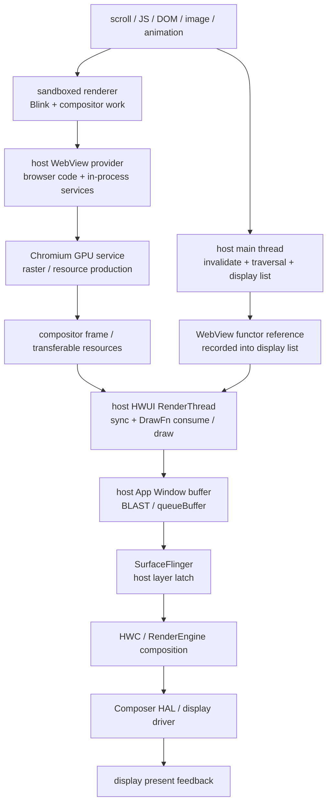
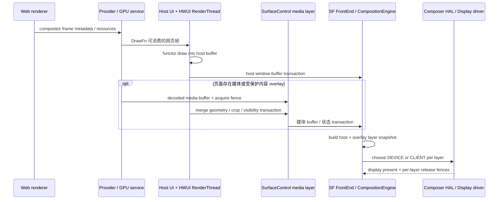

# Android Perfetto 系列 - App 出图类型 - WebView 类型

WebView 卡顿经常跨越三个边界：网页 renderer、宿主 App 进程中的 WebView / GPU 服务、Android 窗口显示链路。标准 `android.webkit.WebView` 的主体内容通常通过 HWUI WebView functor / DrawFn 合入宿主窗口；视频、受保护内容或 provider overlay 才可能增加独立 `SurfaceControl` layer。把网页主体、媒体 overlay 和定制内核混为一条路径，Perfetto 结论很容易落错进程或落错 layer。

这篇文章以 Android 17 / API 37、`android-17.0.0_r1` 为平台源码锚点，kernel 侧以 `android17-6.18-2026-06_r6` 为锚点。Chromium WebView 是可更新 provider，必须以设备上的 provider 包名和版本为第二锚点，不能用 Android 17 平台 tag 代替 Chromium revision。

<!--more-->

## 阅读导航

### 本文目录

- 1. 两条版本线与三个执行域
- 2. 标准硬件加速路径：WebView functor
- 3. 软件绘制 fallback
- 4. 媒体与 SurfaceControl overlay
- 5. 从网页更新到屏幕的一帧
- 6. renderer 生命周期与内存压力
- 7. Perfetto 证据链
- 8. 常见瓶颈与优化方向
- 9. Android 12—17 版本演进
- 10. Android 17 与 Chromium 源码入口
- 11. 类型边界与常见误判
- 总结

### 系列文章目录

1. [Android Perfetto 系列 - App 出图类型 - 总览与识别方法](S01_rendering_types_overview.md)
2. [Android Perfetto 系列 - App 出图类型 - AOSP 标准类型](S02_aosp_standard_type.md)
3. [Android Perfetto 系列 - App 出图类型 - SurfaceView 类型](S03_surfaceview_type.md)
4. [Android Perfetto 系列 - App 出图类型 - TextureView 类型](S04_textureview_type.md)
5. [Android Perfetto 系列 - App 出图类型 - 混合出图类型](S05_mixed_rendering_type.md)
6. [Android Perfetto 系列 - App 出图类型 - 多窗口类型](S06_multi_window_type.md)
7. [Android Perfetto 系列 - App 出图类型 - Software / 离屏类型](S07_software_offscreen_type.md)
8. [Android Perfetto 系列 - App 出图类型 - Native Graphics 类型](S08_native_graphics_type.md)
9. [Android Perfetto 系列 - App 出图类型 - WebView 类型](S09_webview_type.md)
10. [Android Perfetto 系列 - App 出图类型 - Flutter 类型](S10_flutter_type.md)
11. [Android Perfetto 系列 - App 出图类型 - Camera 类型](S11_camera_type.md)
12. [Android Perfetto 系列 - App 出图类型 - Video Overlay / HWC 类型](S12_video_overlay_hwc_type.md)
13. [Android Perfetto 系列 - App 出图类型 - Game 类型](S13_game_type.md)
14. [Android Perfetto 系列 - App 出图类型 - React Native 类型](S14_react_native_type.md)

## 1. 两条版本线与三个执行域

`android.webkit.WebView` 是 Android framework API，页面引擎由 WebView provider 包实现。自 Android 5 起，AOSP WebView 已是可更新组件；同一台 Android 17 设备可以随着系统组件更新获得不同 Chromium milestone。同一个 provider 也可能通过 feature flag、GPU blocklist 和厂商配置选择不同实现。

开始分析前应记录这些信息：

- Android build 与 API level；
- 当前 WebView provider 包名、versionName、versionCode；
- 应用是否使用系统 `android.webkit.WebView`、AndroidX WebKit、定制 Chromium 或第三方内核；
- hardware acceleration、renderer multiprocess 状态、页面 URL / 场景和复现时间；
- GPU backend、WebView feature flag 与是否出现媒体 overlay。

现代 Chromium WebView 可以按三个执行域理解。

1. **宿主 App 进程**：framework WebView、provider glue、WebView browser code、UI 协调，以及 Chromium 架构文档所述的 in-process GPU service / Network Service。
2. **sandboxed renderer 进程**：Blink 执行 JavaScript、style、layout、paint，并运行 renderer / compositor 相关工作。一个 renderer 进程可以服务一个或多个 WebView，具体复用由 provider 决定。
3. **Android 显示系统**：宿主 ViewRoot、HWUI RenderThread、BLAST / BufferQueue、SurfaceFlinger、CompositionEngine 和 HWC。

这三个域之间有 IPC、task queue、GPU resource 和 fence。主线程空闲不能排除 renderer 忙；renderer 已产出 compositor frame 也不能证明宿主窗口及时消费；宿主窗口已 queue buffer 之后还要检查 SF / HWC。

## 2. 标准硬件加速路径：WebView functor

标准硬件加速 WebView 仍是 Android `View`。它参与宿主 View 的 measure、layout、invalidate、clip、alpha 和窗口生命周期，但网页像素不会由普通 `Canvas.drawText()` / `drawBitmap()` 一项项重放。provider 通过 WebView functor 把 Chromium 合成结果接入 HWUI。

Android 17 的 `WebViewFunctor.h` 同时定义 GLES 与 Vulkan 回调。HWUI 在 RenderThread 上调用 functor 的 sync / draw / postDraw 等阶段，provider 的 `AwDrawFnImpl` 再把 Chromium compositor frame 接入当前 HWUI 图形上下文。当前 HWUI backend 与 provider 支持情况共同决定走 GLES 还是 Vulkan functor 分支。

主线程在 display list 中记录 functor 引用和绘制边界，重工作不等于都发生在主线程。RenderThread 执行 functor 时，如果 Chromium frame、resource import 或 GPU service 未就绪，宿主窗口帧可能在这一段等待或复用旧网页内容。

网页主体已经合入 host App Window buffer 后，SurfaceFlinger 通常只看到宿主窗口 layer。网页中的 DOM layer、CSS transform、canvas 和普通图片不会逐个变成 SF layer，HWC 也无法单独把某个 DOM 元素分配到 overlay plane。

functor 还要遵守宿主 View 属性。clip、matrix、alpha、窗口缩放和圆角会影响 HWUI 怎样调用和合成 WebView 内容。WebView 尺寸过大、长期保留不可见区域或频繁改变复杂 clip，都可能增加 tile、raster 和宿主 GPU 成本。

## 3. 软件绘制 fallback

窗口关闭硬件加速、Canvas 不是 hardware accelerated，或 provider 的硬件 draw request 未被接受时，WebView 可以走软件绘制 fallback。此时网页内容以 CPU raster 结果画入宿主软件 Canvas 或 View software layer，成本模型转向 CPU、Bitmap / shared memory 和内存带宽。

软件 fallback 仍归属于宿主 View 的绘制结果。整窗口软件绘制时，宿主 `ViewRootImpl.drawSoftware()` 最终通过 `Surface.lockCanvas()` / `unlockCanvasAndPost()` 提交 App Window buffer；单个 View software layer 时，结果先成为 Bitmap，再由宿主 HWUI 窗口消费。SurfaceFlinger 看到的依旧主要是宿主 layer。

Perfetto 中缺少 WebView GPU / DrawFn slice，同时主线程出现长时间软件 raster、Bitmap 分配或 `lockCanvas()`，才有理由怀疑 fallback。只凭低端设备或某个 CSS 特性不能断言“WebView 自动切软件”。需要结合 Canvas acceleration、provider log、调用栈和 GPU process / service 状态确认。

## 4. 媒体与 SurfaceControl overlay

网页主体的 functor 路径与网页中的视频 layer 要分开。视频解码输出、受保护内容、全屏媒体或 provider 的 overlay promotion 可以通过独立 Surface / `SurfaceControl` 进入系统，使宿主窗口之外多出 child layer。

Android 17 的 `WebViewFunctor` 回调包含 overlay data、merge transaction 和 remove overlays 等接口。它允许 provider 在 HWUI draw 周期中协调 overlay 的几何与事务；这项能力不能推导出整个网页都绕过宿主窗口。常见结构是“网页 UI 在 host buffer，视频在独立 layer”。

overlay 的 buffer ready 与宿主几何 ready 是两个条件。视频 producer 晚到可能沿用旧视频帧；宿主滚动 / transform transaction 晚到会造成位置不同步；HWC plane 不足、复杂裁剪、透明度或 HDR / SDR 组合变化又可能让视频从 DEVICE 切到 CLIENT composition。

全屏视频还可能由应用通过 `WebChromeClient.onShowCustomView()` 放入单独的 native View / Surface 容器。此时 trace 中的关键 layer 可能属于应用创建的播放器 View，不应继续把所有成本归到 WebView functor。

`TextureView`、`SurfaceView` 和 `ImageReader` 也可能出现在定制浏览器内核或应用包装层中，但它们不是标准 `android.webkit.WebView` 的五个可互换主渲染模式。看到这些对象时，要按实际 owner 和调用栈归类，不要仅凭“内容来自网页”贴 WebView 标签。

## 5. 从网页更新到屏幕的一帧

一帧可以拆成六段，每段都有独立迟到方式。

1. **网页状态更新**：JavaScript、DOM、style、layout、paint invalidation、图片解码或滚动改变页面内容。
2. **renderer 合成准备**：Blink / compositor 生成 frame，raster worker 准备 tile，跨进程把 frame / resource 信息送到 browser 侧。
3. **宿主 invalidate 与 traversal**：WebView 通知宿主需要 redraw，主线程在 `Choreographer#doFrame()` 中执行 traversal 并记录 functor。
4. **RenderThread functor draw**：HWUI 同步 View 树状态，调用 DrawFn，等待或导入 Chromium resource，把网页与其他 View 合入 host buffer。
5. **窗口提交**：HWUI 完成 GPU 工作，把 host buffer 与 producer fence 通过 BLAST / BufferQueue 交给 SurfaceFlinger。
6. **系统显示**：SF latch host layer 和可选 media overlay，HWC / RenderEngine 完成 composition，display present fence 标记显示栈 present 边界。

这六段并非严格串行。renderer 可以提前生产，宿主也可能在网页 frame 未更新时重画遮罩；GPU 工作跨 CPU task 异步执行。分析必须用 frame / buffer / token 对齐，不能把相邻 slice 自动当作同一帧。

主 WebView 内容经 host layer 提交时，标准 App FrameTimeline 更容易覆盖宿主窗口，很少单独给出“网页 frame”的 expected / actual。Chromium 内部 frame id、WebView trace event 和 host FrameTimeline 要做关联。媒体 overlay 还可能拥有自己的 buffer frame number 与 fence。

## 6. renderer 生命周期与内存压力

WebView renderer 进程可能因为 crash 或系统回收而消失。官方 Termination Handling API 要求：应用若选择继续运行，原 WebView 实例不能复用，需要从 hierarchy 移除、destroy，再创建新实例。忽略 `onRenderProcessGone()` 会把后续白屏、重复 crash 或无响应误判成渲染性能问题。

`setRendererPriorityPolicy()` 可以在 multiprocess 模式下调整 renderer importance。把不可见 WebView 的 renderer importance 降低，有利于系统回收内存，但应用必须具备 renderer 消失后的恢复路径。页面切后台后白屏重载，先查 renderer OOM / process death，再查绘制链路。

WebView 首次初始化本身很重，默认可能在首次调用 `android.webkit` / `androidx.webkit` API 或 inflate WebView 时隐式发生在 UI 线程。首屏卡顿应把 provider load、native library、Chromium startup、renderer 创建、网络和首帧 raster 分开。稳态滚动 trace 无法解释冷启动成本。

大页面可能同时占用 DOM / JS heap、decoded image、Skia resource、GPU texture、tile 缓存和宿主 graphics memory。内存压力会触发 raster eviction、重新解码、GC、renderer 回收或 dma-buf 分配抖动。kernel 6.18 侧可以补看 page fault、direct reclaim、`kswapd`、zram、PSI memory、dma-buf 和 GPU driver memory wait。

## 7. Perfetto 证据链

### 第一步：固定 provider 与进程

先记录 provider 版本，再在 trace 中找宿主进程、sandboxed renderer 进程和宿主进程内的 Chromium / GPU service 线程。provider 更新后线程名和 slice 会变化，因此线程名只能做入口，进程关系、调用栈和 trace category 更重要。

### 第二步：确认最终 layer 结构

检查 SurfaceFlinger layer tree：只有 host App Window，通常表示网页主体已通过 functor 合入；额外出现视频 / protected / WebView child layer，再检查其 parent、buffer format、dataspace、crop 和 owner。没有证据时，不要假设 TextureView、SurfaceView 或 ImageReader 中转。

### 第三步：从网页到宿主逐段对齐

| 现象 | 更可能的瓶颈 | 需要补看的证据 |
|---|---|---|
| renderer main 长任务 | JavaScript、style、layout、paint | renderer task、Long Task、DevTools、CPU profile |
| raster worker / image decode 晚 | tile raster、图片解码、缓存未命中 | worker queue、Skia / decode slice、内存与 I/O |
| frame 已到 browser 侧，宿主很晚才 draw | invalidate / traversal、主线程抢占 | host `doFrame`、ViewRoot、Runnable latency |
| RenderThread 在 WebView DrawFn 段变长 | resource import、functor sync/draw、GPU service 或 GPU 工作 | DrawFn slice、GPU queue、fence、backend |
| host `queueBuffer` 正常，SF 没有及时换帧 | acquire fence、latch / transaction 或 display 问题 | host layer、FrameTimeline、SF/HWC |
| 网页 UI 正常，视频卡或位置漂移 | media producer / overlay transaction | video layer buffer、decoder fence、geometry transaction |

### 第四步：区分 CPU 等待与 CPU 工作

renderer 或 host 线程 slice 很长时，结合线程状态判断 Running、Runnable、Sleeping 和 blocked。Runnable 很长是调度延迟；Sleeping / futex 可能在等 IPC、task 或 fence；Running 才继续看 JavaScript、layout、paint 或 native CPU 栈。只量 slice wall time 会把等待算成计算。

### 第五步：验证最终显示

宿主 functor 路径查看 host App Window 的 `BufferTX - <layerName>`、FrameTimeline、SF latch、composition type 和 display present fence。媒体 overlay 路径还要逐层查看 buffer ready、transaction ready、HWC DEVICE / CLIENT 变化与 release fence。网页内部 compositor frame ready 不是最终上屏证据。

## 8. 常见瓶颈与优化方向

网页侧优先控制长 JavaScript task、强制同步 layout、过大的 DOM、频繁 style invalidation、巨幅图片、复杂 filter / blend、全屏 canvas 重绘和过量动画。Chrome DevTools 能回答 DOM / JS / style 问题，Perfetto 更适合把这些成本与 Android 调度、GPU、宿主窗口和显示端对齐。

宿主侧应避免在 WebView 上叠加频繁变化的大面积透明层、复杂 clip、软件 layer 或每帧 resize。WebView 与 Compose / View overlay 混合时，要确认宿主 traversal 和 RenderThread 是否因其他 UI 抢占 deadline。把网页优化到 5 ms，而宿主主线程仍晚 20 ms，用户看到的帧仍然晚。

首屏优化要减少隐式 WebView startup 落在关键 UI 操作上，合理安排 provider 初始化、renderer 创建和网络预热。预热会增加进程和内存常驻，必须以真实启动路径和后台资源预算评估。

视频问题则看 codec output、surface buffer、HDR / protected usage、overlay geometry 与 HWC plane。降低 DOM 成本无法修复 decoder fence 晚；调整播放器 buffer 也无法修复宿主主线程滚动 transaction 晚。

## 9. Android 12—17 版本演进

WebView 的演进要同时保留“平台集成线”和“provider 更新线”。下面各版本描述 Android 平台边界；Chromium milestone、Skia backend、feature flag 和安全修复必须另按设备 provider 核对。

### Android 12 / API 31

Android 12 上，现代 WebView 已采用可更新 Chromium provider，并具备 sandboxed renderer、宿主 HWUI functor 与独立 renderer 生命周期管理。平台显示端进入 BLAST / FrameTimeline 诊断基线。WebView 主体仍通常合入 host App Window，不能因为 Chromium 自带 compositor 就把它当成独立 SF layer。

### Android 13 / API 33

Android 13 增加公开的 algorithmic darkening 控制，可能改变网页颜色处理与 raster 结果，但不改变 functor → host buffer 的基本拓扑。显示端 HWC HAL 进入 AIDL 时代；WebView provider 仍按自身发布节奏更新，Android 13 版本号不能唯一确定 Chromium 实现。

### Android 14 / API 34

标准 WebView 的 framework / provider / renderer / HWUI 分层保持稳定。Android 14 的平台图形新增能力不会自动把 WebView 主体改成 `HardwareBufferRenderer` 或独立 `SurfaceControl`。这一阶段的差异更多来自 provider milestone、GPU blocklist、Skia / Chromium feature flag 和 OEM WebView 包。

### Android 15 / API 35

Android 15 支持 16 KB page size 设备。宿主 App、WebView provider 与其 native libraries 都需要兼容对应 ELF / APK 对齐；不兼容时常见的首个表现是加载或运行失败，不能归因于 functor 性能。平台 FrameTimeline 与 transaction 反馈继续增强，网页主体仍应围绕 host window token 分析。

### Android 16 / API 36

Android 16 的 GPU syscall filtering 对面向 target 36 的应用生效，但官方支持的 GLES / Vulkan 路径不受破坏。定制内核、注入层、非标准 GPU ioctl 或陈旧调试组件需要额外验证。WebView provider 可更新属性和标准 functor 主线保持不变。

### Android 17 / API 37

Android 17 的平台源码锚点中，`WebViewFunctor` 已明确包含 GLES / Vulkan draw callback、overlay transaction 协调和 rendering thread reporting 等边界；SurfaceFlinger 后半段按 FrontEnd layer snapshot、CompositionEngine 与 AIDL Composer 理解。它描述平台如何承接 provider，不固定设备上的 Chromium milestone。

截至本文锚点，WebView 文档与 provider 仍持续独立更新。复现报告必须同时写 `android-17.0.0_r1` 对应的平台语义和设备实际 provider 版本，否则同为 Android 17 的两台设备可能拥有不同 Chromium 行为。

kernel 统一到 `android17-6.18-2026-06_r6` 后，网页主窗口与媒体 overlay 仍沿用 dma-buf、dma-fence / sync_file 语义；具体 GPU service、vendor driver 与 codec driver 的调度要用设备 tracepoint 补齐。

## 10. Android 17 与 Chromium 源码入口

### Android 平台

- [`WebView.java`](https://android.googlesource.com/platform/frameworks/base/+/android-17.0.0_r1/core/java/android/webkit/WebView.java) 与 [`WebViewFactory.java`](https://android.googlesource.com/platform/frameworks/base/+/android-17.0.0_r1/core/java/android/webkit/WebViewFactory.java)：查看 framework API 如何选择并加载 provider。
- [`WebViewDelegate.java`](https://android.googlesource.com/platform/frameworks/base/+/android-17.0.0_r1/core/java/android/webkit/WebViewDelegate.java) 与 [`WebViewFunctor.h`](https://android.googlesource.com/platform/frameworks/base/+/android-17.0.0_r1/libs/hwui/private/hwui/WebViewFunctor.h)：查看 framework / HWUI 提供给 provider 的 functor 边界。
- [`WebViewFunctorManager.cpp`](https://android.googlesource.com/platform/frameworks/base/+/android-17.0.0_r1/libs/hwui/WebViewFunctorManager.cpp) 与 [`RenderThread.cpp`](https://android.googlesource.com/platform/frameworks/base/+/android-17.0.0_r1/libs/hwui/renderthread/RenderThread.cpp)：查看 functor 生命周期和 RenderThread 执行环境。
- [`SurfaceFlinger.cpp`](https://android.googlesource.com/platform/frameworks/native/+/android-17.0.0_r1/services/surfaceflinger/SurfaceFlinger.cpp)、[`FrameTimeline.cpp`](https://android.googlesource.com/platform/frameworks/native/+/android-17.0.0_r1/services/surfaceflinger/Scheduler/FrameTimeline.cpp) 与 [`HWComposer.cpp`](https://android.googlesource.com/platform/frameworks/native/+/android-17.0.0_r1/services/surfaceflinger/DisplayHardware/HWComposer.cpp)：查看 host / overlay layer 的最终显示。

### WebView provider

- [Chromium WebView architecture](https://chromium.googlesource.com/chromium/src/+/refs/heads/main/android_webview/docs/architecture.md)：查看 browser code、renderer process、in-process services 与可更新包结构。
- [`AwContents.java`](https://chromium.googlesource.com/chromium/src/+/refs/heads/main/android_webview/java/src/org/chromium/android_webview/AwContents.java) 与 [`AwDrawFnImpl`](https://chromium.googlesource.com/chromium/src/+/refs/heads/main/android_webview/browser/gfx/aw_draw_fn_impl.cc)：查看当前上游 functor 与 compositor frame consumer。排障时应切到设备 provider 对应 revision。
- [WebView 官方开发指南](https://developer.android.com/develop/ui/views/layout/webapps/webview)、[renderer 管理](https://developer.android.com/develop/ui/views/layout/webapps/managing-webview) 与 [startup 优化](https://developer.android.com/develop/ui/views/layout/webapps/optimize-webview-startup)：核对公开生命周期和启动要求。
- kernel `android17-6.18-2026-06_r6` 的 [`dma-buf.c`](https://android.googlesource.com/kernel/common/+/refs/tags/android17-6.18-2026-06_r6/drivers/dma-buf/dma-buf.c)、[`sync_file.c`](https://android.googlesource.com/kernel/common/+/refs/tags/android17-6.18-2026-06_r6/drivers/dma-buf/sync_file.c) 以及 [Linux dma-buf 文档](https://docs.kernel.org/6.18/driver-api/dma-buf.html)：核对固定 tag 下的 buffer / fence 基础语义。

## 11. 类型边界与常见误判

### 与标准 HWUI 的边界

WebView 主体最终复用宿主 HWUI 窗口，但 producer 前面还有 Blink、renderer compositor、raster 和 Chromium GPU service。只按普通 View 的 measure / layout / draw 分析，会漏掉网页侧和 functor 侧。

### 与 SurfaceView / Video Overlay 的边界

网页中的视频或全屏 custom view 可以增加独立 Surface layer。此时网页 UI 仍可能走 host functor，视频 buffer 走 media layer，两条路径必须分别检查 producer、fence 和 transaction。

### 与 TextureView / 离屏路径的边界

定制内核可以选择 TextureView、ImageReader 或 `HardwareBuffer` 中转。标准 WebView 没有公开 API 让应用在五种渲染目标之间随意切换。trace 中只有出现对应 BufferQueue、SurfaceTexture 或 ImageReader owner 后，才按定制路径分析。

### 常见误判

| 误判 | 正确检查方式 |
|---|---|
| Android 17 唯一确定 WebView 源码 | 同时记录并匹配 provider 包版本 / Chromium revision |
| WebView 所有工作都在宿主主线程 | 同看 sandboxed renderer、宿主 Chromium 线程、GPU service 与 HWUI RT |
| Chromium 有 compositor，所以网页一定是独立 SF layer | 标准主体通常经 functor 合入 host App Window |
| DOM layer 对应 SurfaceFlinger layer | DOM / cc layer 通常已在 Chromium / HWUI 内合成 |
| 看到额外 layer 就是整个 WebView 独立出图 | 先判断是否为视频、protected content 或 custom view |
| renderer frame ready 表示用户已看到 | 继续追 host draw、queueBuffer、SF latch 与 display present |
| 主线程空闲说明 WebView 没问题 | renderer、raster、GPU service 或 RenderThread 仍可能迟到 |
| renderer 被系统回收后可以复用原 WebView | 按官方要求 destroy 旧实例并新建 |
| provider 更新只影响网页功能 | Chromium、Skia、GPU backend、thread / trace slice 都可能变化 |

## 总结

WebView 的标准显示主线是：sandboxed renderer 准备网页内容，宿主进程中的 provider / GPU service 交付 compositor frame，主线程记录 WebView functor，HWUI RenderThread 把网页合入 App Window，随后经 BLAST、SurfaceFlinger 和 HWC 显示。视频、受保护内容或全屏媒体可以另外生成 `SurfaceControl` layer，但它们不能代表整个网页主体。

Perfetto 分析要同时固定 Android 平台版本与 WebView provider 版本，再按 renderer、host functor、host window、media overlay 和 display 五层对齐证据。这样才能区分网页计算晚、raster 晚、IPC / resource 晚、宿主窗口晚与 SurfaceFlinger / HWC 晚。
