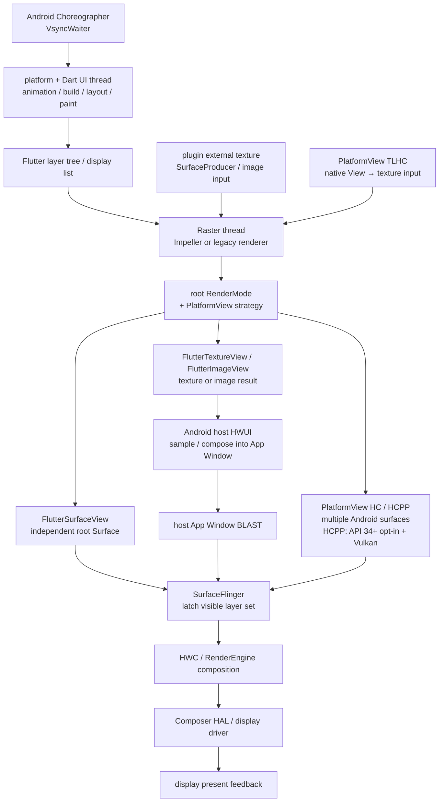

# Android Perfetto 系列 - App 出图类型 - Flutter 类型

Flutter 页面不能只用“Dart UI thread + Raster thread”概括。最终显示形态由三组配置共同决定：Flutter root 使用哪种 Android render target，插件外部纹理由谁生产，PlatformView 采用哪种合成策略。同一页面可以同时出现 Flutter root Surface、相机 external texture、原生地图 View 和系统 overlay。

这篇文章以 Android 17 / API 37、`android-17.0.0_r1` 为平台源码锚点，kernel 侧以 `android17-6.18-2026-06_r6` 为锚点。Flutter framework、engine 和 Flutter Android embedding 随 App 一起发布，必须另行记录 Flutter 版本、engine revision、Impeller backend 与插件版本。

<!--more-->

## 阅读导航

### 本文目录

- 1. Flutter 一帧的公共前半段
- 2. Root RenderMode：surface、texture、image
- 3. 插件 external texture 与 SurfaceProducer
- 4. PlatformView：TLHC、HC 与 HCPP
- 5. Fence、FrameTimeline 与最终显示
- 6. Perfetto 证据链
- 7. 常见瓶颈与优化方向
- 8. Android 12—17 与 Flutter 版本演进
- 9. Android 17 与 Flutter 源码入口
- 10. 类型边界与常见误判
- 总结

### 系列文章目录

1. [Android Perfetto 系列 - App 出图类型 - 总览与识别方法](S01_rendering_types_overview.md)
2. [Android Perfetto 系列 - App 出图类型 - AOSP 标准类型](S02_aosp_standard_type.md)
3. [Android Perfetto 系列 - App 出图类型 - SurfaceView 类型](S03_surfaceview_type.md)
4. [Android Perfetto 系列 - App 出图类型 - TextureView 类型](S04_textureview_type.md)
5. [Android Perfetto 系列 - App 出图类型 - 混合出图类型](S05_mixed_rendering_type.md)
6. [Android Perfetto 系列 - App 出图类型 - 多窗口类型](S06_multi_window_type.md)
7. [Android Perfetto 系列 - App 出图类型 - Software / 离屏类型](S07_software_offscreen_type.md)
8. [Android Perfetto 系列 - App 出图类型 - Native Graphics 类型](S08_native_graphics_type.md)
9. [Android Perfetto 系列 - App 出图类型 - WebView 类型](S09_webview_type.md)
10. [Android Perfetto 系列 - App 出图类型 - Flutter 类型](S10_flutter_type.md)
11. [Android Perfetto 系列 - App 出图类型 - Camera 类型](S11_camera_type.md)
12. [Android Perfetto 系列 - App 出图类型 - Video Overlay / HWC 类型](S12_video_overlay_hwc_type.md)
13. [Android Perfetto 系列 - App 出图类型 - Game 类型](S13_game_type.md)
14. [Android Perfetto 系列 - App 出图类型 - React Native 类型](S14_react_native_type.md)

## 1. Flutter 一帧的公共前半段

Android embedding 从 `Choreographer` 获得 vsync 时间，经 `VsyncWaiter` 交给 engine。Dart framework 在 frame callback 中执行 animation、build、layout、paint，生成 layer tree / display list；engine rasterizer 再用 Impeller 或旧 Skia backend 把场景转成 GPU 工作。

Flutter 3.29 起，Android 和 iOS 默认合并 UI thread 与 platform thread：Dart UI work 运行在 Android platform thread。Raster thread 仍负责栅格化与 GPU 提交。看到新版 trace 时，不能继续寻找固定名称的独立 Flutter UI thread；平台消息、Android callback 和 Dart frame work 可能在同一线程竞争 deadline。

图中的 Classify 不能省略。Raster 完成 GPU 工作只表示某个 target 的内容接近 ready；root 是独立 Surface 还是宿主纹理、external texture 是否更新、PlatformView 是否另有 layer，决定后续 fence 和 layer 数量。

## 2. Root RenderMode：surface、texture、image

Android embedding 的 `RenderMode` 当前包含 `surface`、`texture` 和 `image`。它描述 Flutter root 内容接到哪种 Android View，不描述 PlatformView 怎样嵌入。

### `RenderMode.surface`

`FlutterSurfaceView` 背后是 `SurfaceView` 与独立 Surface。engine 直接面向这条 BufferQueue 生产 Flutter root buffer，Raster / GPU completion fence 随 queue 进入 SurfaceFlinger。宿主 Activity 窗口仍负责 ViewRoot、输入、系统栏和其他 Android View，但纯 Flutter 主体通常对应独立 child layer。

这条路径少一次回宿主纹理采样，通常是 opaque Flutter 页面首选。代价是独立 layer 的 z-order、alpha、生命周期和窗口 transition 需要 embedding 协调。Surface 创建、销毁或尺寸变化时，engine 必须及时切换输出 target。

### `RenderMode.texture`

`FlutterTextureView` 让 engine 先写 `SurfaceTexture`。宿主 HWUI 在下一次窗口 draw 中取得最新 texture image，把 Flutter 内容采样进 host App Window buffer，再由宿主 BLAST / BufferQueue 提交。

这条路径便于透明背景和 View hierarchy 变换，但多了 producer SurfaceTexture 与 host window 两段节拍。Flutter buffer ready、`onFrameAvailable` / invalidate、宿主 traversal、HWUI texture acquire 和 host queue 任何一段迟到，都会影响最终帧。SurfaceFlinger 通常只看到 host window，不会看到独立 Flutter root layer。

### `RenderMode.image`

`FlutterImageView` 使用 `ImageReader` 接收 engine 输出，再把 image 作为 Android View 内容画回宿主。它主要服务 render surface 切换等特定 embedding 场景，不能当作普通页面的默认高性能模式。分析时要额外检查 Image acquire、`HardwareBuffer` / Bitmap 包装、宿主 draw 和 image release。

三种 root 路径的关键差异如下。

| RenderMode | 中间对象 | SF 主要可见对象 | 常见等待 |
|---|---|---|---|
| surface | 独立 Surface buffer | Flutter root child layer | root dequeue / GPU fence / SF latch |
| texture | SurfaceTexture image | host App Window | texture acquire + host traversal / draw |
| image | ImageReader image | host App Window | image acquire / copy 或采样 + host draw |

## 3. 插件 external texture 与 SurfaceProducer

相机、视频、地图或 native renderer 可以通过 `TextureRegistry` 向 Flutter scene 提供 external texture。producer 先写 Android Surface，Flutter Raster 在合成 root scene 时采样最新 image，最终仍按当前 root RenderMode 输出。

这形成两级 producer：插件 producer 负责 camera / codec / GL buffer，Flutter engine 负责采样并生成 root buffer。插件帧率和 Flutter 帧率可以不同。Flutter 每帧都画不代表相机每帧都更新；相机 buffer ready 也不代表 Flutter 已在下一帧采样。

Flutter 3.24 稳定的 `TextureRegistry.SurfaceProducer` 让 engine 根据平台与 API level 选择 backing implementation。在当前 Flutter 源码里，未强制 GL texture、API 29+ 且设备不在已知 HardwareBuffer 缺陷列表时，`createSurfaceProducer()` 优先创建 `ImageReaderSurfaceProducer`；否则回退到 `SurfaceTextureSurfaceProducer`。

这两个 backing 的契约不同，trace 里不能只写一个抽象的 `SurfaceProducer`。`ImageReaderSurfaceProducer` 会在后台 reset / 内存压力路径触发 `onSurfaceCleanup()`，恢复时再触发 `onSurfaceAvailable()`；插件需要重新取得 surface 并补画当前内容。`onSurfaceDestroyed()` 只是旧别名，当前源码建议使用 `onSurfaceCleanup()`。`SurfaceTextureSurfaceProducer` 的 `setCallback()` 在源码中为空，不会收到同样的平台清理通知。

使用相机预览时还要检查 `handlesCropAndRotation()`。当前 `ImageReaderSurfaceProducer` 返回 `false`，`SurfaceTextureSurfaceProducer` 返回 `true`：前者可能需要插件或 Flutter widget 修正传感器方向、裁剪与设备方向，后者更接近旧 SurfaceTexture 语义。方向错误属于 producer / embedding 契约问题，与 SurfaceFlinger transform 不是同一层。

## 4. PlatformView：TLHC、HC 与 HCPP

PlatformView 用于在 Flutter 页面中嵌入原生 Android View，例如 WebView、地图和广告。Flutter widget tree 与 Android View hierarchy 是两套树，合成策略决定谁被转成 texture、谁保留为 Android View。

### Texture Layer Hybrid Composition（TLHC）与旧 Virtual Display

TLHC 把原生 View 的绘制结果放进 Flutter 可采样 texture，再由 Flutter scene 合入 root target。优点是 Flutter transform、clip 和 opacity 更容易保持；代价是额外 buffer、invalidate、texture acquire 和输入 / accessibility 桥接。包含 `SurfaceView` 的平台控件可能受限，因为独立 Surface 内容无法像普通 View 像素一样自然重定向。

旧 Virtual Display 路径也会把平台 View 放进虚拟显示和中转 Surface，链路更长，可能增加 buffer、内存和延迟。具体是否使用要看 Flutter / plugin 版本，不能只凭 `AndroidView` 推断。

### Hybrid Composition（HC）

HC 让平台 View 按 Android View 正常绘制，Flutter 内容放入 texture / overlay 后由 Android / SurfaceFlinger 组合。原生 View fidelity 较好，但 Flutter root、Flutter overlay、host window 和 Surface-backed child 可能形成多条提交节拍。平台 View 与 Flutter overlay 任一方迟到，都可能出现错位或旧内容。

### Hybrid Composition++（HCPP）

Flutter 3.44 起提供实验性 opt-in HCPP，要求 Android API 34+ 且设备可用 Vulkan。不满足条件时会回退到应用原先配置的平台 View 策略。HCPP 使用新的 transaction synchronization 改善旧 HC 的合成与同步问题，但不能假设启用后页面只剩一个 layer。

HCPP 是 Flutter 版本能力，Android 14 / 15 / 16 / 17 本身不会自动开启。报告中应同时写明 Flutter 3.44+、manifest / run flag、Vulkan capability 和实际 fallback 结果。

## 5. Fence、FrameTimeline 与最终显示

`RenderMode.surface` 的 root buffer 有自己的 producer fence 和 layer release fence；`texture` / `image` 路径先有中间 image ready / release，再由宿主窗口生成新的 GPU completion fence；PlatformView 与 overlay 还会引入各自 buffer 和 transaction。

SurfaceFlinger 在 Android 17 FrontEnd 中处理这些状态，生成本轮 layer snapshot。CompositionEngine 再与 HWC 协商 DEVICE / CLIENT composition；需要 CLIENT 时，RenderEngine 生成 client target。`presentAndGetReleaseFences()` 取得 display present fence 和 per-layer release fence。PresentSucceeded 快路径已经执行 present，后面不能再重复计算一次 present。

FrameTimeline token 也按输出对象区分。宿主 App Window、Flutter root Surface 和独立 PlatformView layer 可能拥有不同 frame number / token，external texture 的中间帧甚至没有标准 App FrameTimeline。应使用 engine frame id、texture id、buffer id、layer id 和实际时间建立关联。

kernel `android17-6.18-2026-06_r6` 下，root buffer、external texture 与 PlatformView buffer 都依赖 dma-buf 共享和 dma-fence / sync_file 同步。GPU driver、codec、camera 与 HWC 的 fence wait 必须结合具体设备 tracepoint 解释。

## 6. Perfetto 证据链

### 第一步：固定双版本与配置

记录 Android build、Flutter SDK / engine revision、Impeller 是否启用及 backend、root RenderMode、PlatformView API、HCPP flag 和插件版本。Flutter 升级可能改变线程模型与 Surface backing，同一 Android 版本上的 trace 不能直接横比。

### 第二步：画出实际对象树

从 Android View hierarchy 与 SurfaceFlinger layer tree 确认：root 是 `FlutterSurfaceView` 还是 host texture，是否存在 PlatformView、Flutter overlay、视频 / 相机 Surface。对象树确定后再选线程和 fence，避免把 external texture 的 producer 当作 Flutter root producer。

### 第三步：对齐 Flutter 帧

| 现象 | 更可能的瓶颈 | 补看证据 |
|---|---|---|
| platform / Dart thread 晚 | build、layout、paint、platform message、线程合并竞争 | Flutter frame event、CPU Running / Runnable、callback |
| Raster thread 晚 | display list raster、shader、texture upload、GPU submit | Raster event、Impeller / Skia、GPU queue |
| Raster 已提交，GPU fence 晚 | GPU workload、pipeline、带宽、频率 / thermal | GPU stage、counter、frequency、fence |
| external texture 没更新 | camera / codec / plugin producer 晚或 Surface 已重建 | texture id、producer queue、SurfaceProducer callback |
| texture root 有新帧，host window 晚 | TextureView acquire、host traversal / RenderThread | SurfaceTexture、ViewRoot、host `DrawFrame` |
| PlatformView 与 Flutter 错位 | 两套 traversal / transaction 不同步 | host vsync、Flutter frame、overlay transaction、layer latch |

### 第四步：验证系统显示

`surface` 路径看 Flutter root layer 的 buffer update、SF latch、composition type 和 present；`texture` / `image` 路径看 host App Window；HC / HCPP 再逐层检查 platform view 和 overlay。Dart frame 标为完成，只说明 framework 交出 layer tree，不能作为上屏时间。

## 7. 常见瓶颈与优化方向

Dart / platform thread 侧常见成本是 widget rebuild 范围过大、同步 layout、复杂 paint、频繁 platform channel、JSON / image decode 和 merged thread 下的 Android callback 竞争。先用 Flutter frame event 定位 UI phase，再用 Perfetto 区分 Running 与 Runnable。

Raster / GPU 侧常见成本是过量 saveLayer、blur、shader / pipeline 首次创建、大图上传、external texture 同步和高分辨率 overdraw。Impeller 减少运行时 shader 编译抖动，不会消除昂贵的像素工作与内存带宽。

PlatformView 性能问题先评估合成策略。TLHC 可能增加 texture 中转，HC 可能增加多 layer 同步，HCPP 仍处于实验阶段并有已知限制。不存在对所有 View 和设备都最优的固定模式，应以交互、变换 fidelity、帧率、输入延迟和内存共同评估。

## 8. Android 12—17 与 Flutter 版本演进

两条演进线必须分开：Android 决定 Surface、HWUI、SF / HWC 和 kernel 语义；Flutter 决定 engine、thread、renderer、embedding 与 PlatformView 策略。

### Android 12 / API 31

现代 SurfaceView / TextureView、BLAST 与 FrameTimeline 已形成当前分析基线。运行在 Android 12 的 Flutter App 可以携带不同 engine，不能用 OS 版本推断 Skia / Impeller、root RenderMode 或 PlatformView 实现。

### Android 13 / API 33

显示端进入 AIDL HWC HAL，并增加单 layer 简单 buffer update 的 AutoSingleLayer 能力。它不会替 Flutter 自动同步 root、host 与 PlatformView 多 layer。Flutter engine 和插件仍按 App 版本发布。

### Android 14 / API 34

API 34 是后来 HCPP 所需的最低 Android 版本，只满足平台 transaction synchronization 前提。只有 Flutter 3.44+、显式 opt-in、Vulkan 可用且未回退时，页面才会使用 HCPP。

### Android 15 / API 35

Android 15 支持 16 KB page size 设备，Flutter engine、AOT library 和所有 native plugin 都要满足 ELF / APK 对齐。Flutter 3.27 同期把 Impeller 设为 Android API 29+ 默认 renderer；这是 Flutter release 决策，Android 15 不会替旧 App 自动升级 engine。

### Android 16 / API 36

GPU syscall filtering 不破坏受支持的 GLES / Vulkan API，但定制 engine、注入层和陈旧 native plugin 需要测试。Flutter 3.29 起默认合并 UI / platform thread，运行在 Android 16 的旧 Flutter App 仍可能保留旧线程模型。

### Android 17 / API 37

平台锚点统一到 `android-17.0.0_r1`，显示端按 FrontEnd snapshot、CompositionEngine 和 AIDL Composer 分析。当前 Flutter 3.44 文档中 HCPP 仍为实验性 opt-in；`SurfaceProducer`、Impeller 和 thread merge 均需按 App engine revision 核对。kernel 统一到 `android17-6.18-2026-06_r6` 后，再结合具体 GPU / camera / codec driver 补充 fence 与内存证据。

## 9. Android 17 与 Flutter 源码入口

- Flutter 源码链接固定到 `8a9f61cfd67396fb2f9afc3cd7854035e9cd6fc2`，用于复核当前文档语义；实际线上 App 仍要回到它携带的 engine revision。
- Flutter [`RenderMode.java`](https://github.com/flutter/flutter/blob/8a9f61cfd67396fb2f9afc3cd7854035e9cd6fc2/engine/src/flutter/shell/platform/android/io/flutter/embedding/android/RenderMode.java)、[`FlutterSurfaceView.java`](https://github.com/flutter/flutter/blob/8a9f61cfd67396fb2f9afc3cd7854035e9cd6fc2/engine/src/flutter/shell/platform/android/io/flutter/embedding/android/FlutterSurfaceView.java)、[`FlutterTextureView.java`](https://github.com/flutter/flutter/blob/8a9f61cfd67396fb2f9afc3cd7854035e9cd6fc2/engine/src/flutter/shell/platform/android/io/flutter/embedding/android/FlutterTextureView.java) 与 [`FlutterImageView.java`](https://github.com/flutter/flutter/blob/8a9f61cfd67396fb2f9afc3cd7854035e9cd6fc2/engine/src/flutter/shell/platform/android/io/flutter/embedding/android/FlutterImageView.java)：核对 root target。
- [`FlutterRenderer.java`](https://github.com/flutter/flutter/blob/8a9f61cfd67396fb2f9afc3cd7854035e9cd6fc2/engine/src/flutter/shell/platform/android/io/flutter/embedding/engine/renderer/FlutterRenderer.java)、[`TextureRegistry.java`](https://github.com/flutter/flutter/blob/8a9f61cfd67396fb2f9afc3cd7854035e9cd6fc2/engine/src/flutter/shell/platform/android/io/flutter/view/TextureRegistry.java)、[`SurfaceTextureSurfaceProducer.java`](https://github.com/flutter/flutter/blob/8a9f61cfd67396fb2f9afc3cd7854035e9cd6fc2/engine/src/flutter/shell/platform/android/io/flutter/embedding/engine/renderer/SurfaceTextureSurfaceProducer.java) 与 [Surface plugins migration](https://docs.flutter.dev/release/breaking-changes/android-surface-plugins)：核对 external texture / `SurfaceProducer` backing、生命周期与 crop / rotation 契约。
- [`PlatformViewsController.java`](https://github.com/flutter/flutter/blob/8a9f61cfd67396fb2f9afc3cd7854035e9cd6fc2/engine/src/flutter/shell/platform/android/io/flutter/plugin/platform/PlatformViewsController.java)、[`PlatformViewsController2.java`](https://github.com/flutter/flutter/blob/8a9f61cfd67396fb2f9afc3cd7854035e9cd6fc2/engine/src/flutter/shell/platform/android/io/flutter/plugin/platform/PlatformViewsController2.java) 与 [PlatformView / HCPP 文档](https://docs.flutter.dev/platform-integration/android/platform-views)：核对 TLHC、HC、HCPP 与回退。
- [Flutter architecture](https://docs.flutter.dev/resources/architectural-overview) 与 [Impeller](https://docs.flutter.dev/perf/impeller)：核对 Flutter 3.29 thread merge 与 Flutter 3.27 Android 默认范围。
- Android 17 [`TextureView.java`](https://android.googlesource.com/platform/frameworks/base/+/android-17.0.0_r1/core/java/android/view/TextureView.java)、[`SurfaceView.java`](https://android.googlesource.com/platform/frameworks/base/+/android-17.0.0_r1/core/java/android/view/SurfaceView.java) 与 [`SurfaceFlinger.cpp`](https://android.googlesource.com/platform/frameworks/native/+/android-17.0.0_r1/services/surfaceflinger/SurfaceFlinger.cpp)：核对宿主 target 与最终 layer。
- kernel `android17-6.18-2026-06_r6` 的 [`dma-buf.c`](https://android.googlesource.com/kernel/common/+/refs/tags/android17-6.18-2026-06_r6/drivers/dma-buf/dma-buf.c)、[`sync_file.c`](https://android.googlesource.com/kernel/common/+/refs/tags/android17-6.18-2026-06_r6/drivers/dma-buf/sync_file.c) 以及 [Linux dma-buf 文档](https://docs.kernel.org/6.18/driver-api/dma-buf.html)：核对固定 tag 下的 buffer / fence 语义。

## 10. 类型边界与常见误判

### 与标准 HWUI 的边界

Flutter framework 自己完成 widget、layout、paint 与 scene composition，root surface 通常由 Flutter Raster / GPU producer 生成；Android HWUI 只在 texture / image root、宿主 UI 或 PlatformView 中负责部分绘制。

### 与 SurfaceView / TextureView 的边界

Flutter root 可以由这两种 Android View 承载，但文章还需覆盖 engine frame、external texture 与 PlatformView。只按容器分析会漏掉 Dart / Raster 和插件 producer。

### 常见误判

| 误判 | 正确检查方式 |
|---|---|
| Flutter 固定有独立 UI、Raster、platform 三线程 | Flutter 3.29+ 默认合并 UI 与 platform，按实际 engine 确认 |
| Flutter 帧结束就是上屏 | 继续追 GPU fence、root / host queue、SF latch 与 present |
| `RenderMode.surface` 内容属于 host App Window buffer | 查独立 `FlutterSurfaceView` child layer |
| `RenderMode.texture` 只有一条队列 | 分开 producer SurfaceTexture 与 host window BufferQueue |
| external texture 更新等于 Flutter 已显示 | 还要等待 Raster 采样、root 提交与 display present |
| `AndroidView` 固定使用 Hybrid Composition | 核对 TLHC / VD / HC / HCPP 与运行时回退 |
| Android 14+ 自动启用 HCPP | 还需 Flutter 3.44+、opt-in 与 Vulkan，且当前仍实验性 |
| Android 15 自动把旧 Flutter App 切到 Impeller | renderer 由 App 携带的 Flutter engine 决定 |

## 总结

Flutter 的显示链路要按三个维度展开：root RenderMode 决定 Flutter 主画面落到独立 Surface 还是宿主窗口；external texture 增加插件 producer 与 Flutter 采样；PlatformView 策略决定原生 View 被转成 texture，还是作为 Android 对象参与多 layer 合成。

Perfetto 分析时先固定 Android 与 Flutter 双版本，再画 View / Surface / layer 对象树，随后对齐 platform / Dart work、Raster、GPU completion、external texture、root 提交、SF latch 和 display present。这样才能把 Flutter framework 慢、插件 producer 慢、宿主消费慢与系统合成慢分开。
