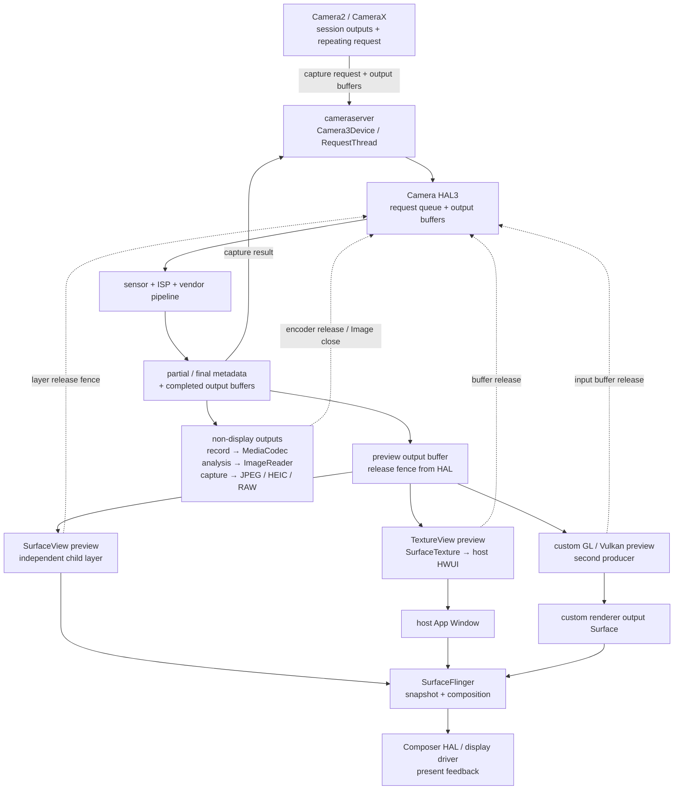

# Android Perfetto 系列 - App 出图类型 - Camera 类型

Camera 页面的主体像素由 sensor、ISP 与 Camera HAL 生产，宿主 UI 只配置输出目标、控制拍摄并承载预览。预览、录像、分析和拍照可以来自同一组 capture request，却拥有不同 buffer pool、consumer 和返回节奏；任一 consumer 长时间占用 buffer，都可能反压整个 session。

本文以 Android 17 / API 37、`android-17.0.0_r1` 为平台源码锚点，kernel 侧以 `android17-6.18-2026-06_r6` 为锚点。CameraX、vendor tag、HAL / ISP 与厂商 SDK 另按设备版本核对。

<!--more-->

## 阅读导航

### 本文目录

- 1. HAL3 request-result 与多输出
- 2. SurfaceView、TextureView 与自研预览
- 3. 三组 fence 与 consumer backpressure
- 4. Perfetto 证据链
- 5. HAL、kernel 与内存证据
- 6. Android 12—17 版本演进
- 7. Android 17 源码入口
- 8. 类型边界与常见误判
- 总结

### 系列文章目录

1. [Android Perfetto 系列 - App 出图类型 - 总览与识别方法](S01_rendering_types_overview.md)
2. [Android Perfetto 系列 - App 出图类型 - AOSP 标准类型](S02_aosp_standard_type.md)
3. [Android Perfetto 系列 - App 出图类型 - SurfaceView 类型](S03_surfaceview_type.md)
4. [Android Perfetto 系列 - App 出图类型 - TextureView 类型](S04_textureview_type.md)
5. [Android Perfetto 系列 - App 出图类型 - 混合出图类型](S05_mixed_rendering_type.md)
6. [Android Perfetto 系列 - App 出图类型 - 多窗口类型](S06_multi_window_type.md)
7. [Android Perfetto 系列 - App 出图类型 - Software / 离屏类型](S07_software_offscreen_type.md)
8. [Android Perfetto 系列 - App 出图类型 - Native Graphics 类型](S08_native_graphics_type.md)
9. [Android Perfetto 系列 - App 出图类型 - WebView 类型](S09_webview_type.md)
10. [Android Perfetto 系列 - App 出图类型 - Flutter 类型](S10_flutter_type.md)
11. [Android Perfetto 系列 - App 出图类型 - Camera 类型](S11_camera_type.md)
12. [Android Perfetto 系列 - App 出图类型 - Video Overlay / HWC 类型](S12_video_overlay_hwc_type.md)
13. [Android Perfetto 系列 - App 出图类型 - Game 类型](S13_game_type.md)
14. [Android Perfetto 系列 - App 出图类型 - React Native 类型](S14_react_native_type.md)

## 1. HAL3 request-result 与多输出

Camera2 App 创建 `CameraCaptureSession` 时，把 preview、record、analysis、still capture 等 `Surface` 交给 camera service。`setRepeatingRequest()` 建立持续 request 流；framework `Camera3Device` / RequestThread 把 request、settings 和 output buffer 交给 HAL，HAL 驱动 sensor / ISP，并通过 `processCaptureResult()` 异步返回 metadata 与 buffer。

同一个 frame number 的 partial metadata、final metadata 和各 output buffer 可以分开返回。preview ready 不代表 analysis ready，capture callback 到达也不代表预览已 present。需要用 frame number、sensor timestamp、request id、buffer id 和 capture result 对齐。

`OutputConfiguration#setStreamUseCase()` 只是向 HAL 表达 preview、video record、still capture 等意图，帮助设备选择 sensor mode、ISP tuning 与 pipeline；它不创建额外同步，也不保证某路一定更快。支持集合必须从 camera characteristics 查询。

CameraX 在 Camera2 之上管理生命周期、use case binding、resolution negotiation 与 surface request。`PreviewView` 的 implementation mode、设备兼容性和变换需求会影响最终使用 SurfaceView 还是 TextureView。排障时同时记录 CameraX 版本和实际 target Surface。

## 2. SurfaceView、TextureView 与自研预览

### SurfaceView preview

HAL 把 preview buffer 直接 queue 到独立 Surface。SurfaceFlinger 看到 preview child layer 与宿主 App Window 两个对象：preview layer 承载相机像素，host window 承载快门、对焦框和遮罩。SF 在同一 display 周期选择可用 snapshot，HWC 再决定 preview 是否能用 DEVICE composition。

独立 layer 避免宿主每帧采样预览纹理，适合高分辨率持续预览。几何、crop、rotation、alpha、圆角和 lifecycle 仍由宿主 transaction 协调；preview buffer 早到而几何晚到，同样会出现错位或沿用旧状态。

### TextureView preview

HAL 先写 `SurfaceTexture`，宿主 HWUI 在窗口 draw 中 acquire 最新 camera buffer，并作为 texture 采样进 App Window。这里有两条 BufferQueue：camera → SurfaceTexture，以及 host HWUI → App Window。相机帧 ready 以后还要等宿主 `Choreographer`、traversal、RenderThread 与 host queue。

TextureView 便于 matrix、clip、alpha 和 View hierarchy 动画，但会增加一次宿主 GPU 采样与带宽。SF 最终通常只看到 host window，不能用 layer tree 直接判断 camera producer 是否晚。

### GL / Vulkan 自研预览

滤镜、畸变矫正、分割或 AR 常让 camera buffer 先进入 external OES texture、`AHardwareBuffer` 或 `ImageReader`，经 App GPU pass 后再输出到可见 Surface。此时 HAL 是第一生产者，自研 renderer 是中间 consumer 与第二生产者。要分别量 camera fence、GPU 处理和最终 surface present。

## 3. 三组 fence 与 consumer backpressure

HAL3 buffer 流转至少涉及三类同步。

| 同步对象 | 含义 | 常见等待方 |
|---|---|---|
| framework acquire fence 交给 HAL | output buffer 何时可供 HAL 写入 | HAL / ISP |
| HAL release fence 随 result 返回 | HAL 何时完成写入，consumer 可以读取 | BufferQueue、ImageReader、codec、App GPU |
| SF / HWC layer release fence | display consumer 不再读取 preview buffer | preview producer / BufferQueue |

display present fence 只描述一轮 display frame 的 present 边界，不能替代 camera frame completion。analysis / capture buffer 不上屏时也没有 display present fence。

`ImageReader.acquireLatestImage()` 可以丢弃旧分析帧，适合只关心最新结果；`acquireNextImage()` 保留顺序，consumer 处理跟不上时更容易耗尽 `maxImages`。无论使用哪一个，`Image.close()` / `ImageProxy.close()` 都是归还 buffer 的关键动作。录像 encoder 不及时消费、still capture 持有 Image 过久，也可能让 HAL 缺少 output buffer。

多路 session 的 stall 不一定同时发生。HAL 可以先返回 preview，稍后等待 analysis；也有设备 pipeline 会因共享 ISP stage 或有限 buffer pool 让慢 consumer 拖住后续 request。必须以实际 request-result 和 buffer 状态确认。

## 4. Perfetto 证据链

第一步记录 camera id、physical / logical camera、session outputs、format、size、fps range、dynamic range profile、stream use case、CameraX 版本和预览 carrier。

第二步找出 App camera thread、binder callback、`cameraserver`、Camera3 RequestThread、vendor HAL 线程、ImageReader / codec consumer 和最终 preview layer。线程名受厂商影响，request id、frame number 和调用栈更可靠。

| 现象 | 可能瓶颈 | 验证证据 |
|---|---|---|
| request 提交间隔异常 | App / CameraX 控制、session 重配、cameraserver 排队 | repeating request、binder、RequestThread |
| sensor timestamp 间隔异常 | sensor / HAL / ISP、曝光或帧率切换 | result metadata、vendor event、SOF |
| HAL 结果晚 | ISP、vendor algorithm、output buffer 不足 | process request/result、fence、buffer 状态 |
| analysis 越来越晚 | consumer 慢或 Image 未关闭 | acquire / close、`maxImages`、queue depth |
| SurfaceView preview 已 queue 但没换帧 | acquire fence、SF latch 或 HWC | preview layer、FrameTimeline、composition |
| TextureView buffer 已到但屏幕晚 | host traversal / texture acquire / GPU | SurfaceTexture、host main / RT、host layer |

复原单帧时按 request → sensor timestamp → HAL result → preview queue → SF latch → display present 排列。多路输出各自保留 result 时间，避免用 analysis callback 代替 preview ready。

## 5. HAL、kernel 与内存证据

AOSP 只能固定 framework 与 camera service 边界，vendor HAL、ISP firmware、sensor driver 和算法库需要设备证据。可用信息包括 camera service event log、HAL dump、vendor trace、V4L2 / media controller event、SOF / EOF、ISP job、IOMMU fault 和频率 / 带宽轨道。

`android17-6.18-2026-06_r6` 下，camera GraphicBuffer 通常借助 dma-buf 跨 HAL、GPU、codec 和 HWC 共享，dma-fence / sync_file 传递异步完成关系。内存压力还要看 dma-buf 总量、CMA / page allocation、IOMMU map、page fault、direct reclaim、PSI memory 与内存带宽。Android common kernel 不规定厂商 camera driver 必须暴露同一组 tracepoint。

## 6. Android 12—17 版本演进

### Android 12 / API 31

Camera2 vendor extensions 正式进入平台，Bokeh、HDR、Night 等能力可通过 `CameraExtensionSession` 查询和使用；maximum-resolution stream 配置也为 Quad / Nona Bayer 传感器提供公开边界。HAL3 多输出与 Surface 预览主线保持稳定。

### Android 13 / API 33

Camera2 增加 10-bit HDR video capture 与 DynamicRangeProfiles，preview 和 record 需要协商兼容 profile、format 与 surface 组合。stream use case 进入公开配置，帮助 HAL 按预览、录像、拍照等意图优化 pipeline。它们扩大了配置空间，也增加 session 组合验证的重要性。

### Android 14 / API 34

Android 14 引入 Ultra HDR still image 并增强 camera extensions。Gainmap 图像保存与显示属于拍照结果链路，不应写成 preview 必然变成 HDR。标准 request-result、ImageReader 回收和预览承载拓扑没有结构性变化。

### Android 15 / API 35

Low Light Boost 成为 Camera2 与 night extension 可查询的连续预览 AE mode，可在暗光下增强 preview / video；它与多帧合成的 Night still capture 机制不同。更长曝光和算法负载可能改变帧间隔，分析时结合 result metadata。

### Android 16 / API 36

Camera2 新增更精细的 color temperature / tint、hybrid auto-exposure、night mode indicator 与 motion photo capture intent 等能力。它们改变控制和 metadata，不替代 output Surface、HAL buffer 与 consumer 回收主线。

### Android 17 / API 37

Android 17 新增 `ImageFormat.RAW14`，兼容传感器可输出 14-bit RAW。RAW14 会提高单帧数据量和内存 / 存储压力，但普通 preview 不会自动改为 RAW14。平台源码按 `android-17.0.0_r1` 的 Camera3、BufferQueue 与 SF FrontEnd 分析，vendor pipeline 仍需设备版本锚点。

## 7. Android 17 源码入口

- [`CameraDeviceImpl.java`](https://android.googlesource.com/platform/frameworks/base/+/android-17.0.0_r1/core/java/android/hardware/camera2/impl/CameraDeviceImpl.java) 与 [`CameraCaptureSessionImpl.java`](https://android.googlesource.com/platform/frameworks/base/+/android-17.0.0_r1/core/java/android/hardware/camera2/impl/CameraCaptureSessionImpl.java)：Camera2 session 与 callback。
- [`Camera3Device.cpp`](https://android.googlesource.com/platform/frameworks/av/+/android-17.0.0_r1/services/camera/libcameraservice/device3/Camera3Device.cpp)、[`Camera3Stream.cpp`](https://android.googlesource.com/platform/frameworks/av/+/android-17.0.0_r1/services/camera/libcameraservice/device3/Camera3Stream.cpp)：request、stream 与 buffer 状态。
- [Camera HAL3 request / result](https://source.android.com/docs/core/camera/camera3_requests_hal) 与 [Camera2 multiple streams](https://developer.android.com/media/camera/camera2/multiple-camera-streams-simultaneously)：核对多输出语义。
- [CameraX Preview](https://developer.android.com/media/camera/camerax/preview)、[Image analysis](https://developer.android.com/media/camera/camerax/analyze) 与 [`ImageReader`](https://developer.android.com/reference/android/media/ImageReader)：核对 carrier 和 backpressure。
- [`SurfaceFlinger.cpp`](https://android.googlesource.com/platform/frameworks/native/+/android-17.0.0_r1/services/surfaceflinger/SurfaceFlinger.cpp) 与 [`HWComposer.cpp`](https://android.googlesource.com/platform/frameworks/native/+/android-17.0.0_r1/services/surfaceflinger/DisplayHardware/HWComposer.cpp)：预览最终显示。
- [Android 17 release notes](https://developer.android.com/about/versions/17/release-notes)、kernel `android17-6.18-2026-06_r6` 的 [`dma-buf.c`](https://android.googlesource.com/kernel/common/+/refs/tags/android17-6.18-2026-06_r6/drivers/dma-buf/dma-buf.c) 与 [`sync_file.c`](https://android.googlesource.com/kernel/common/+/refs/tags/android17-6.18-2026-06_r6/drivers/dma-buf/sync_file.c)：核对 RAW14 与固定 kernel tag 的同步边界。

## 8. 类型边界与常见误判

SurfaceView / TextureView 描述预览承载，Camera 描述 HAL producer 与多输出。自研 GL 预览同时具有 Camera 输入和 Native Graphics 输出，两个阶段都要分析。

| 误判 | 正确检查方式 |
|---|---|
| 宿主 `doFrame` 正常，camera preview 就正常 | 继续查 HAL result、preview buffer 与 carrier |
| preview 正常，analysis / record 也正常 | 按每个 output 的 buffer 和 consumer 分别验证 |
| capture callback 到达就是照片完整可用 | 区分 metadata、buffer ready 与 Image close |
| `Image.close()` 只影响内存 | 它决定 buffer 是否回池，可能反压后续 request |
| SurfaceView 预览一定走 HWC overlay | 查实际 composition type 与整组 layer 条件 |
| Low Light Boost 等于 Night still capture | 前者是连续预览 AE mode，后者通常是多帧静态合成 |
| RAW14 会改变所有 Android 17 预览 | 仅支持并显式配置的 RAW capture stream 使用 |

## 总结

Camera trace 要从 session outputs 和 HAL3 request-result 开始，再沿 preview、record、analysis、capture 四类 consumer 追踪 buffer 回收。SurfaceView 预览形成独立 layer，TextureView 预览还要经过宿主 HWUI，自研 renderer 则增加第二生产者。

把 request、sensor timestamp、HAL result、consumer release、preview latch 和 display present 串起来，才能区分 sensor / ISP 慢、output buffer 不足、analysis 或 encoder 回压、宿主消费晚与 SF / HWC 显示晚。
