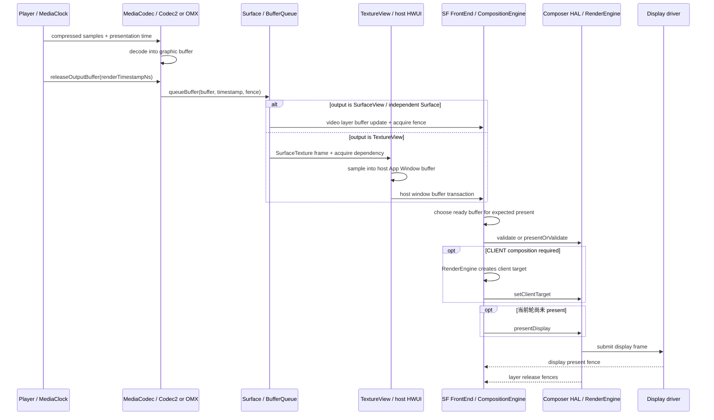
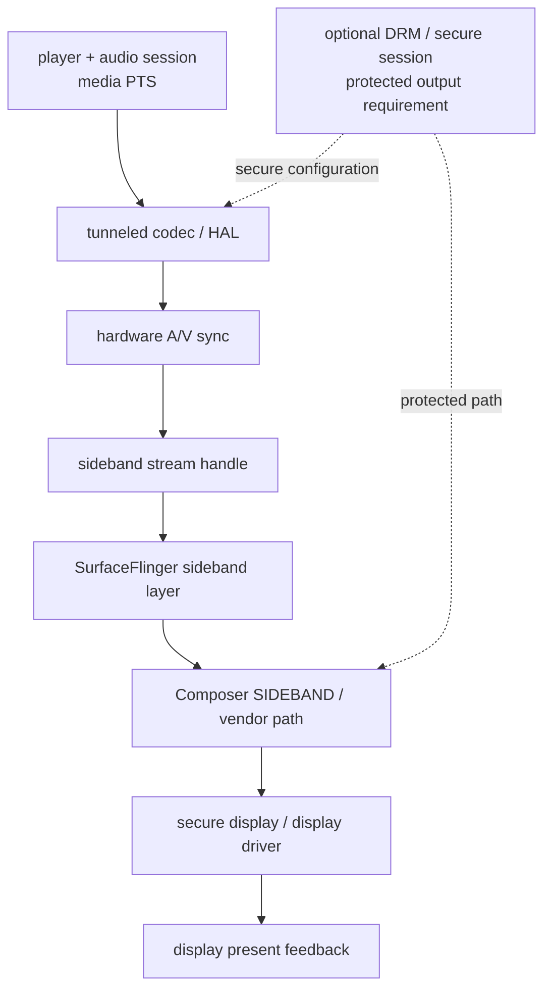

# Android Perfetto 系列 - App 出图类型 - Video Overlay / HWC 类型

视频是否走 overlay 不是播放器创建 `SurfaceView` 时就确定的。播放器和 codec 负责按媒体时钟提交视频帧，SurfaceFlinger 每个显示周期把完整 layer 集合交给 HWC，HWC 再根据格式、缩放、旋转、HDR、protected usage、plane 数量与带宽选择 DEVICE、CLIENT 或 SIDEBAND 等 composition type。

本文以 Android 17 / API 37、`android-17.0.0_r1` 为平台源码锚点，kernel 侧以 `android17-6.18-2026-06_r6` 为锚点。播放器、Codec2 / OMX 组件、DRM、codec HAL、display HAL 与厂商驱动另按设备版本核对。

<!--more-->

## 阅读导航

### 本文目录

- 1. 普通 Surface 视频输出
- 2. SurfaceView 与 TextureView 的显示差异
- 3. Tunneled Playback 与 sideband
- 4. Protected content 与安全显示
- 5. HWC composition、时间戳与刷新率
- 6. Perfetto 证据链
- 7. Kernel / driver 证据
- 8. Android 12—17 版本演进
- 9. Android 17 源码入口
- 10. 类型边界与常见误判
- 总结

### 系列文章目录

1. [Android Perfetto 系列 - App 出图类型 - 总览与识别方法](S01_rendering_types_overview.md)
2. [Android Perfetto 系列 - App 出图类型 - AOSP 标准类型](S02_aosp_standard_type.md)
3. [Android Perfetto 系列 - App 出图类型 - SurfaceView 类型](S03_surfaceview_type.md)
4. [Android Perfetto 系列 - App 出图类型 - TextureView 类型](S04_textureview_type.md)
5. [Android Perfetto 系列 - App 出图类型 - 混合出图类型](S05_mixed_rendering_type.md)
6. [Android Perfetto 系列 - App 出图类型 - 多窗口类型](S06_multi_window_type.md)
7. [Android Perfetto 系列 - App 出图类型 - Software / 离屏类型](S07_software_offscreen_type.md)
8. [Android Perfetto 系列 - App 出图类型 - Native Graphics 类型](S08_native_graphics_type.md)
9. [Android Perfetto 系列 - App 出图类型 - WebView 类型](S09_webview_type.md)
10. [Android Perfetto 系列 - App 出图类型 - Flutter 类型](S10_flutter_type.md)
11. [Android Perfetto 系列 - App 出图类型 - Camera 类型](S11_camera_type.md)
12. [Android Perfetto 系列 - App 出图类型 - Video Overlay / HWC 类型](S12_video_overlay_hwc_type.md)
13. [Android Perfetto 系列 - App 出图类型 - Game 类型](S13_game_type.md)
14. [Android Perfetto 系列 - App 出图类型 - React Native 类型](S14_react_native_type.md)

## 1. 普通 Surface 视频输出

常规播放从压缩码流、媒体时钟和解码器开始。播放器把输出 `Surface` 传给 `MediaCodec.configure()`；Codec2 或旧 OMX 组件解码后，播放器调用 `releaseOutputBuffer(index, render)` 或带纳秒时间戳的 overload，把对应 output buffer 送往 Surface。

`releaseOutputBuffer()` 返回只表示播放器已把 output buffer 交给 Surface 路径。Codec GPU / hardware 写入完成、BufferQueue queue、SF latch 和 display present 仍在后面。

带 `renderTimestampNs` 的提交会成为 buffer 的期望显示时间。Android 17 `BufferQueueProducer` 保存 requested present timestamp，consumer 在 `acquireBuffer(expectedPresent)` 中可能返回 `PRESENT_LATER`，避免过早取出未来帧。时间戳离系统单调时钟太远、播放器媒体时钟漂移或队列堆积，都会造成重复旧帧或丢弃晚帧。

普通视频输出仍有三类 fence：codec / producer 完成写入的 acquire fence，HWC / SF 不再使用 layer buffer 的 release fence，以及一轮 display frame 的 present fence。present fence 属于 display，不属于某一块视频 buffer。

## 2. SurfaceView 与 TextureView 的显示差异

### SurfaceView：独立视频 layer

视频直接输出到 `SurfaceView` 时，buffer 进入独立 child Surface。宿主 App Window 负责播放器控件、字幕、弹幕和遮罩；视频 layer 拥有自己的 buffer update、fence 与 composition type。

YUV buffer 若满足设备 plane 的格式、缩放、旋转、色彩、protected 与带宽条件，HWC 可以选择 DEVICE composition，避免 RenderEngine 再做一次全屏采样。这个结果每帧都可能变化：弹窗、系统栏、圆角遮罩、其他视频、HDR / SDR 混合和 plane 竞争都可能让它回到 CLIENT composition。

### TextureView：先采样进宿主窗口

视频输出到 `SurfaceTexture` 后，宿主 HWUI acquire 最新 image，把它采样进 App Window buffer。SurfaceFlinger 通常只看到 host window，视频已失去独立 layer 的直接 HWC plane 选择机会。

TextureView 便于 View matrix、clip、alpha 与动画，却增加一条 producer BufferQueue、宿主 texture acquire、GPU 采样和 host BufferQueue。codec 按时提交以后，宿主主线程或 RenderThread 迟到仍会让视频晚一帧。

### 自研 GL / Vulkan 视频处理

滤镜、超分、色彩转换或字幕烧录会让解码 buffer 先进入 App GPU，再输出到新的可见 Surface。此时 codec 是第一生产者，App renderer 是第二生产者。输入 fence、GPU pass、输出 fence 和最终 composition 都要量，不能只看 `MediaCodec`。

## 3. Tunneled Playback 与 sideband

Tunneled Playback 把视频解码、音频时钟和显示硬件放到更直接的硬件同步路径。应用先查询 `FEATURE_TunneledPlayback`，配置 audio session id；支持的 codec / HAL 建立 sideband stream，并通过 native window sideband handle 交给 SurfaceFlinger / HWC。

sideband layer 不以普通非 tunneled 视频的逐帧 `queueBuffer()` 形态出现。App trace 中可能没有对应的 `BufferTX`、buffer id 和 release 节奏，帧选择与 A/V sync 主要在 codec HAL、audio / AV sync、HWC 和 driver 中完成。

Android 17 旧 OMX 路径的 `ACodec` 会为 tunneled video 配置 video tunnel mode，并调用 `native_window_set_sideband_stream()`。设备也可以通过 Codec2 与厂商组件实现同类能力。API capability 只说明可请求，实际建立、稳定播放和时间戳质量仍需日志与 HAL 证据。

## 4. Protected content 与安全显示

DRM 内容可能要求 secure decoder、protected graphic buffer、secure Surface 和受保护的 HWC / display path。保护要求由 DRM session、codec capability、buffer usage 与设备认证共同决定。

protected layer 不等于普通 overlay 的同义词。设备可能用安全硬件 plane，也可能使用受保护图形上下文的安全合成路径；任何不安全的 readback、截图或普通 GPU 上下文都必须被拒绝。黑屏、绿屏或 `MediaCodec` 配置失败时，先核对 secure decoder、Surface security、HDCP / external display 与 protected composition 能力。

安全内容经常无法被常规 screenshot、screen recording 或 GPU capture 工具读取。Perfetto 仍可观察线程、transaction、fence 和 composition metadata，但像素不可见属于安全设计，不能当成 trace 缺失。

## 5. HWC composition、时间戳与刷新率

Android 17 Composer3 的 `Composition` 包含 CLIENT、DEVICE、SOLID_COLOR、CURSOR、SIDEBAND 等类型。SurfaceFlinger 先准备 layer 状态，再由 `HWComposer::getDeviceCompositionChanges()` 触发 validate / presentOrValidate 协商。HWC 返回 changed composition types 后，SF 接受调整；需要 CLIENT 时，RenderEngine 生成 client target 并交给 HWC。

`presentOrValidate` 返回 PresentSucceeded 时，本轮已经执行 present。后续流程只收集对应结果，不能再描述成“随后固定调用第二次 present”。常规 validate 分支完成状态调整后才进入 present。

视频 cadence 与 display refresh rate 要分开。24 fps 内容可以在 120 Hz display 上用 5:5 cadence 稳定显示，也可以请求切换到兼容模式。`Surface#setFrameRate()` / `ANativeWindow_setFrameRate()` 提供内容帧率提示，系统还会综合其他 layer、触摸、功耗和显示模式；调用成功不保证立刻切换刷新率。

刷新率切换、VRR / ARR 解决 display cadence 与功耗，无法修复 decoder 晚、timestamp 错、queue-stuffing 或 acquire fence 晚。Perfetto 中应同时看 requested frame rate、active mode、vsync period、buffer timestamp、latch 和 present。

## 6. Perfetto 证据链

第一步记录内容 codec、分辨率、帧率、HDR profile、DRM / secure、tunneled 状态、输出 Surface 类型、播放器版本和 display mode。

第二步在 layer tree 中确认视频主体。SurfaceView 通常有独立 video layer；TextureView 只剩 host App Window；tunneled path 表现为 sideband layer。layer name 只是线索，owner、parent、buffer format、composition type 和 sideband 状态更可靠。

| 现象 | 可能瓶颈 | 验证证据 |
|---|---|---|
| decoder output 晚 | 码流、codec、硬件负载、DRM | input / output PTS、codec callback、HAL event |
| output 已 release 但 buffer 晚 | codec fence、Surface queue、timestamp | queueBuffer、acquire fence、requested present |
| video layer ready 但未更新 | SF 选择未来帧、acquire fence、layer 状态 | acquireBuffer、latch、FrameTimeline |
| DEVICE 频繁切 CLIENT | plane 竞争、变换、alpha、HDR、系统 overlay | composition type、RenderEngine、layer 状态 |
| 视频流畅但控件卡 | host App Window 或主线程晚 | host `doFrame`、RenderThread、host layer |
| tunneled 只有音频或黑屏 | tunnel 建立、sideband、secure / HDCP | codec config、sideband handle、HWC / DRM log |

普通路径按 compressed sample → codec output → release timestamp → queueBuffer → SF latch → HWC present 复原单帧。Tunneled path 改用 PTS、audio clock、codec / HAL 与 sideband / HWC 事件关联，不能强找不存在的逐帧 BufferQueue 证据。

## 7. Kernel / driver 证据

`android17-6.18-2026-06_r6` 下，非 tunneled graphic buffer 通常通过 dma-buf 跨 codec、GPU、SF 与 HWC 共享，dma-fence / sync_file 传递异步完成关系。补看 codec job、GPU / display frequency、DRM / KMS 或厂商 display trace、IOMMU、内存带宽和 fence wait。

Android 设备未必使用主线 DRM / KMS 显示栈，很多 SoC 保留厂商驱动与私有 tracepoint。kernel 锚点固定公共同步语义，具体 plane 分配、带宽投票、secure path 和 scanout 时序仍以设备驱动为准。

## 8. Android 12—17 版本演进

### Android 12 / API 31

Android 12 改善 `setFrameRate()` 的刷新率切换，应用可允许非无缝 mode switch。普通 Surface video、tunneled sideband 与 protected playback 主线已经成熟；BLAST / FrameTimeline 成为现代显示诊断背景。

### Android 13 / API 33

HWC HAL 从这一版起以 AIDL 定义。SurfaceFlinger 新增 AutoSingleLayer，可在单 layer 简单 buffer update 时允许特定 unsignaled latching；包含 geometry 或 sync transaction 的多 layer 场景不适用。Choreographer / SurfaceControl 公开更多 frame timeline 信息，播放器仍需正确提交时间戳。

### Android 14 / API 34

普通 codec → Surface → SF / HWC 拓扑保持稳定。平台增加扩展亮度 / HDR 相关控制，但 HDR 视频仍需从 codec capability、MediaFormat、dataspace 与 display 能力逐项协商。Android 14 版本号不能保证某种 HDR 或 tunneled 组合可用。

### Android 15 / API 35

Android 15 提供 `setDesiredHdrHeadroom()`，混合 HDR 视频与 SDR UI 时可表达期望亮度范围；系统仍可能按面板与全局内容调整。ARR 在支持硬件上进入平台，用离散 Vsync 步进适应内容帧率。

### Android 16 / API 36

Android 16 增加 ARR capability / suggested frame rate API、APV codec 支持，以及 TV 侧 `MediaQuality` picture / audio profile。APV 面向高质量录制和后期场景，不能据此推断所有播放设备有硬件 APV overlay。

### Android 17 / API 37

Android 17 增加 VVC / H.266 平台支持，并改进 encoder temporal layering capability 反馈。它们改变 codec 能力与编码配置，常规解码 Surface、sideband、SF FrontEnd、CompositionEngine 与 AIDL Composer 主线保持稳定。源码统一到 `android-17.0.0_r1`，设备能力仍需运行时查询。

## 9. Android 17 源码入口

- [`MediaCodec.java`](https://android.googlesource.com/platform/frameworks/base/+/android-17.0.0_r1/media/java/android/media/MediaCodec.java) 与 [`MediaFormat.java`](https://android.googlesource.com/platform/frameworks/base/+/android-17.0.0_r1/media/java/android/media/MediaFormat.java)：输出 Surface、render timestamp、tunneled 配置。
- [`CCodecBufferChannel.cpp`](https://android.googlesource.com/platform/frameworks/av/+/android-17.0.0_r1/media/codec2/sfplugin/CCodecBufferChannel.cpp) 与 [`ACodec.cpp`](https://android.googlesource.com/platform/frameworks/av/+/android-17.0.0_r1/media/libstagefright/ACodec.cpp)：Codec2 普通 Surface 输出与旧 OMX tunneled sideband。
- [`BufferQueueProducer.cpp`](https://android.googlesource.com/platform/frameworks/native/+/android-17.0.0_r1/libs/gui/BufferQueueProducer.cpp) 与 [`BufferQueueConsumer.cpp`](https://android.googlesource.com/platform/frameworks/native/+/android-17.0.0_r1/libs/gui/BufferQueueConsumer.cpp)：时间戳、queue 与 expected present 选择。
- [`Composition.aidl`](https://android.googlesource.com/platform/hardware/interfaces/+/android-17.0.0_r1/graphics/composer/aidl/android/hardware/graphics/composer3/Composition.aidl)、[`Display.cpp`](https://android.googlesource.com/platform/frameworks/native/+/android-17.0.0_r1/services/surfaceflinger/CompositionEngine/src/Display.cpp) 与 [`HWComposer.cpp`](https://android.googlesource.com/platform/frameworks/native/+/android-17.0.0_r1/services/surfaceflinger/DisplayHardware/HWComposer.cpp)：composition type、validate 与 present。
- [Frame rate guide](https://developer.android.com/media/optimize/performance/frame-rate)、[Multimedia tunneling](https://source.android.com/docs/devices/tv/multimedia-tunneling) 与 [Android 17 release notes](https://developer.android.com/about/versions/17/release-notes)：公开节拍、sideband 与版本边界。
- kernel `android17-6.18-2026-06_r6` 的 [`dma-buf.c`](https://android.googlesource.com/kernel/common/+/refs/tags/android17-6.18-2026-06_r6/drivers/dma-buf/dma-buf.c)、[`sync_file.c`](https://android.googlesource.com/kernel/common/+/refs/tags/android17-6.18-2026-06_r6/drivers/dma-buf/sync_file.c) 与 [`dma-fence.h`](https://android.googlesource.com/kernel/common/+/refs/tags/android17-6.18-2026-06_r6/include/linux/dma-fence.h)：固定 kernel tag 下的共享 buffer 与 fence 语义。

## 10. 类型边界与常见误判

SurfaceView 描述视频承载对象，Video Overlay / HWC 关注 codec 时间戳、sideband、protected path 与最终 composition。Camera 也可能获得 DEVICE composition，但 producer 来自 sensor / ISP，节拍由 capture request 驱动。

| 误判 | 正确检查方式 |
|---|---|
| 使用 SurfaceView 就固定走 overlay | 查看每帧实际 composition type 与 plane 条件 |
| `releaseOutputBuffer()` 返回就已显示 | 继续追 queue、latch、HWC 和 present |
| DEVICE composition 表示 decode 零成本 | 它只省去 SF GPU 合成，解码成本仍在 codec 侧 |
| TextureView 视频仍能独立分配 HWC plane | 视频已采样进 host window，HWC 看到宿主 buffer |
| tunneled playback 也有普通逐帧 BufferTX | 检查 sideband layer、audio clock 与 HAL / HWC |
| protected content 一定走普通 overlay | 核对 secure decoder、protected buffer 与安全合成能力 |
| 切换到 120 Hz 就能修复 24 fps 卡顿 | 同时检查 PTS、cadence、decoder 与队列节拍 |

## 总结

普通视频路径从 MediaCodec output、render timestamp 和 Surface queue 进入 SurfaceFlinger；SurfaceView 保留独立视频 layer，TextureView 把视频合入宿主窗口。Tunneled Playback 改用 sideband 与硬件 A/V 同步，protected content 还要满足安全显示要求。

Perfetto 分析要把 codec 输出、buffer timestamp、acquire fence、SF 选择、composition type、display mode 和 present 放在同一条时间线上。这样才能区分解码晚、播放器时间戳错误、BufferQueue 堆积、HWC 策略变化、刷新率 cadence 与 display driver 问题。
