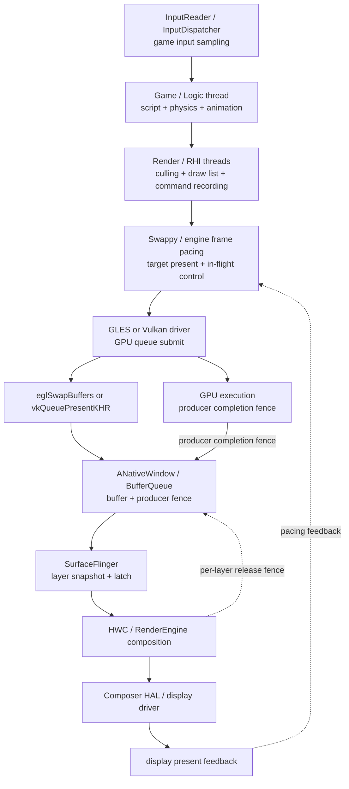

# Android Perfetto 系列 - App 出图类型 - Game 类型

本地游戏通常由自有 game loop、render / RHI thread 和 GPU swapchain 生产画面。分析重点是触控到显示的整段延迟：输入在哪一帧采样，逻辑和渲染何时完成，GPU 何时写完 buffer，队列里压了几帧，SurfaceFlinger 最终显示哪一帧。

本文以 Android 17 / API 37、`android-17.0.0_r1` 为平台源码锚点，kernel 侧以 `android17-6.18-2026-06_r6` 为锚点。Unity、Unreal、Cocos、自研引擎、Swappy 与 XR 运行时都有独立版本，报告中要记录引擎版本、graphics API、render pipeline 与 frame pacing 配置。

<!--more-->

## 阅读导航

### 本文目录

- 1. 本地游戏一帧的完整路径
- 2. Frame pacing、queue-stuffing 与输入延迟
- 3. CPU、GPU 与显示端怎么分责
- 4. ADPF、Game Mode 与持续性能
- 5. 小游戏、云游戏、AR 与 XR 的边界
- 6. Perfetto 证据链
- 7. Android 12—17 版本演进
- 8. Android 17 源码入口
- 9. 常见误判
- 总结

### 系列文章目录

1. [Android Perfetto 系列 - App 出图类型 - 总览与识别方法](S01_rendering_types_overview.md)
2. [Android Perfetto 系列 - App 出图类型 - AOSP 标准类型](S02_aosp_standard_type.md)
3. [Android Perfetto 系列 - App 出图类型 - SurfaceView 类型](S03_surfaceview_type.md)
4. [Android Perfetto 系列 - App 出图类型 - TextureView 类型](S04_textureview_type.md)
5. [Android Perfetto 系列 - App 出图类型 - 混合出图类型](S05_mixed_rendering_type.md)
6. [Android Perfetto 系列 - App 出图类型 - 多窗口类型](S06_multi_window_type.md)
7. [Android Perfetto 系列 - App 出图类型 - Software / 离屏类型](S07_software_offscreen_type.md)
8. [Android Perfetto 系列 - App 出图类型 - Native Graphics 类型](S08_native_graphics_type.md)
9. [Android Perfetto 系列 - App 出图类型 - WebView 类型](S09_webview_type.md)
10. [Android Perfetto 系列 - App 出图类型 - Flutter 类型](S10_flutter_type.md)
11. [Android Perfetto 系列 - App 出图类型 - Camera 类型](S11_camera_type.md)
12. [Android Perfetto 系列 - App 出图类型 - Video Overlay / HWC 类型](S12_video_overlay_hwc_type.md)
13. [Android Perfetto 系列 - App 出图类型 - Game 类型](S13_game_type.md)
14. [Android Perfetto 系列 - App 出图类型 - React Native 类型](S14_react_native_type.md)

## 1. 本地游戏一帧的完整路径

引擎线程名各不相同，职责通常可以归入五段：输入与逻辑、渲染准备、GPU 提交、swapchain present、Android 显示。

Game / Logic thread 处理输入、脚本、物理和动画。Render / RHI thread 做可见性裁剪、draw list、resource transition 与 command buffer 录制。Vulkan 通过 `vkAcquireNextImageKHR()`、`vkQueueSubmit()`、`vkQueuePresentKHR()` 管理 swapchain；OpenGL ES 通过 EGL window surface 和 `eglSwapBuffers()` 交付 buffer。

CPU submit 返回以后，GPU 仍在异步执行。producer fence signal 才表示 SurfaceFlinger 可以读取这块 buffer；display present fence 表示整轮 display frame 已进入 present 边界；layer release fence 决定旧 swapchain image 何时可复用。这三个时间不能合成一个“渲染完成”。

游戏 Surface 最终仍是 Android layer。SF FrontEnd 选择本轮 snapshot，CompositionEngine 与 HWC 决定 DEVICE / CLIENT composition。游戏本身已占满 GPU 时，额外的 RenderEngine client composition 会与游戏争抢 GPU 和内存带宽。

## 2. Frame pacing、queue-stuffing 与输入延迟

游戏持续尽快 present 会填满 BufferQueue。队列满后，render thread 周期性卡在 acquire、swap 或 present，表面上获得了“自动限速”，代价是更多 in-flight frame。输入在更早的逻辑帧采样，用户看到结果时可能已多排一到两帧。

Swappy 是 AGDK Frame Pacing library。GLES 使用 `SwappyGL_swap()` 包装 `eglSwapBuffers()`；Vulkan 使用 `SwappyVk_queuePresent()` 代为调用 `vkQueuePresentKHR()`，并可能插入 presentation timestamp 与同步命令。它利用 Choreographer、`EGL_ANDROID_presentation_time` / `VK_GOOGLE_display_timing` 和 fence 控制 swap interval 与 pipeline mode。

Swappy 中的等待可以是主动 pacing。判断它是否合理，要一起看目标帧率、GPU 完成时间、pending buffer、相邻 present 间隔与输入到显示延迟。只把 wait slice 缩短，往往会重新制造 queue-stuffing。

Vulkan acquire / present 的阻塞行为取决于 driver、present mode 与 presentation engine 状态，不能充当业务线程同步器。GPU—GPU 使用 semaphore，GPU—CPU 使用 fence，resource hazard 使用 barrier / event。

触控到显示至少包含：InputReader 采样、InputDispatcher 分发、游戏读取输入、logic / simulation、render preparation、GPU execution、queue、SF latch、display present。游戏 FPS 正常时，任一段额外排队仍可能让操作发飘。

## 3. CPU、GPU 与显示端怎么分责

CPU bound 常见表现是 Game / Render thread 超过帧预算，GPU 队列出现空洞。原因可能是脚本、物理、animation、draw-call preparation、shader / pipeline 同步创建、资源上传、JNI、锁竞争或 Runnable 调度延迟。

GPU bound 常见表现是 CPU 提交较早，GPU job 持续占满，producer fence 晚。需要用 GPU stage / counter 区分 fragment、vertex、texture、带宽、overdraw、tile memory、同步 bubble 与频率限制。降低分辨率主要缓解像素和带宽成本，减少 draw call 主要缓解 CPU / driver 成本。

display bound 指游戏 buffer 已 ready，后续仍错过 latch 或 present。检查 requested present time、SF layer、FrameTimeline、composition type、刷新率切换、HWC validate 与 display driver。SF 正常沿用旧帧时，根因也可能是 producer 晚到，而非 SF 自身计算慢。

稳定帧率要看长时间运行。温度上升后 CPU / GPU 频率下降、内存带宽限频或 power HAL 策略变化，会把首分钟的 120 fps 变成十分钟后的 80—100 fps 波动。性能测试应记录设备温度、Game Mode、充电状态、亮度、网络与环境温度。

## 4. ADPF、Game Mode 与持续性能

Game Mode 允许应用读取 STANDARD、PERFORMANCE、BATTERY 等用户选择，并调整帧率、分辨率与画质。OEM 也可以配置 Game Mode interventions；Android 13 QPR 起的 FPS throttling intervention 可能在平台侧限制游戏帧率。trace 中出现稳定的 45 / 60 fps 上限时，要先核对 intervention，不能直接归因于 engine limiter。

ADPF Performance Hint Session 把一组长期线程与周期 target duration 告诉系统，并持续报告 actual work duration。它帮助 power HAL 做动态资源分配，不是锁定大核或固定频率的接口。线程列表、目标时间和每帧报告不准确，会降低提示效果。

Game State / loading mode 让系统区分加载和持续 gameplay。Android 13 的 `GAME_LOADING` 可以在加载期提供临时策略，Android 14 的 `GAME` power mode 为前台游戏提供持续策略入口。具体 boost、持续时间和 thermal 处理由 OEM Power HAL 决定。

质量调节应形成反馈控制：温度、CPU / GPU headroom、实际 frame time 与用户 Game Mode 共同决定分辨率、阴影、后处理、LOD 和目标 FPS。频繁来回切档会制造新的 shader、resource 和 frame-time 抖动，需要滞回与最短保持时间。

## 5. 小游戏、云游戏、AR 与 XR 的边界

小游戏容器多一层 JS / TS 运行时、Canvas / WebGL 翻译与宿主 bridge。最终可能使用独立 Surface，也可能回到 TextureView 或 WebView host window。分析顺序是 JS task、native bridge、GPU submit、最终 Surface；不能只套本地 C++ 引擎线程名。

云游戏本地端主要是网络 jitter buffer、MediaCodec 解码与视频 Surface。端到端延迟还包括输入上行、云端排队、渲染、编码和下行网络。Perfetto 只能完整覆盖本机输入、网络线程、解码和显示，云端段需要服务端 timestamp / telemetry。

手机 AR 在本地游戏 loop 前增加 Camera sensor timestamp、IMU、VIO / SLAM 与 pose prediction。present fence 只证明 Android 显示完成；运动到光子的评估还要把 sensor、pose 与 predicted display time 放进同一时钟域。

头显 XR / OpenXR 由 `xrWaitFrame()` 给出 predicted display time，App 向运行时 swapchain 提交图像，运行时 compositor 负责 reprojection / timewarp 和最终显示。某些设备不会把最终帧呈现为普通 Android App Surface，验收边界要改用运行时与 display driver 事件。

## 6. Perfetto 证据链

第一步记录引擎版本、graphics API、refresh rate、目标 FPS、Game Mode、Swappy / 自研 pacing、render scale、HDR、Surface 类型和最大 in-flight frame 数。

第二步找到 Input、Game / Logic、Render / RHI、worker、GPU submit 和最终 layer。再为连续帧标出 input sample、logic start/end、submit、GPU end、queue、latch、present 与 release。

| 现象 | 可能瓶颈 | 验证证据 |
|---|---|---|
| Game thread 晚 | script、physics、锁、Runnable 延迟 | 线程状态、task marker、CPU profile |
| Render / RHI 晚 | culling、draw call、command recording、driver | render marker、worker dependency、ioctl |
| submit 早但 GPU fence 晚 | GPU workload、带宽、thermal、queue backlog | GPU stage、counter、frequency、fence |
| acquire / swap 周期性变长 | queue-stuffing、release fence、pacing | pending buffer、Swappy、present interval |
| buffer ready 但 present 晚 | SF / HWC、CLIENT composition、display mode | layer、FrameTimeline、composition、present fence |
| FPS 稳定但输入延迟大 | in-flight frame 过多或输入采样太早 | input id、frame id、queue depth、present |

单帧偶发问题看依赖链，持续波动看频率、温度和 pacing。平均 FPS 会掩盖 1% low、长帧簇和输入延迟，至少同时统计 frame-time 分布与 present-to-present 间隔。

kernel `android17-6.18-2026-06_r6` 下，swapchain buffer 使用 dma-buf，GPU / HWC 同步使用 dma-fence / sync_file。vendor GPU scheduler、devfreq、thermal、IOMMU fault、memory reclaim 和 display driver tracepoint 需要按设备补充。

## 7. Android 12—17 版本演进

### Android 12 / API 31

Game Mode API 在部分 Android 12 设备提供 STANDARD、PERFORMANCE 与 BATTERY 选择；Performance Hint Manager 也在 API 31 公开。BLAST / FrameTimeline 和改进后的 `setFrameRate()` 构成现代游戏显示分析基线。

### Android 13 / API 33

Game Mode 与 interventions 覆盖 Android 13+ 设备，QPR 加入 FPS throttling intervention；`GAME_LOADING` power mode 为加载阶段提供信号。HWC 进入 AIDL，AutoSingleLayer 只覆盖单 layer 简单 buffer 更新，不能同步复杂游戏 overlay。

### Android 14 / API 34

ADPF 增加前台 `GAME` power mode，OEM Power HAL 可据此应用游戏策略。EGL / Vulkan swapchain、BufferQueue 与 SF 主线没有结构性更换，实际表现更多取决于 engine、driver 与设备策略。

### Android 15 / API 35

ARR 进入支持设备，Vulkan Profiles for Android 从 `VPA15_minimums` 建立年度 profile 线。16 KB page size 要求 engine 和所有 native plugin 满足 ELF / APK 对齐；旧预编译库可能直接加载失败。

### Android 16 / API 36

Android 16 提供 CPU / GPU headroom 和 ARR capability / suggested frame rate API。面向 target 36 的 GPU syscall filtering 不影响受支持的 GLES / Vulkan API，但非标准 ioctl、注入层和陈旧工具要验证。

### Android 17 / API 37

Android 17 支持 `VK_EXT_present_timing`，自研 Vulkan pacing 可以获得标准化 present stage 反馈；仍要枚举 extension 及 `VK_KHR_present_id2` 等前置能力。Android 17 大屏适配规则对 `android:appCategory="game"` 有豁免，但游戏窗口、Surface 和显示主线仍按 `android-17.0.0_r1` 分析。

## 8. Android 17 源码入口

- Android Vulkan [`swapchain.cpp`](https://android.googlesource.com/platform/frameworks/native/+/android-17.0.0_r1/vulkan/libvulkan/swapchain.cpp) 与 [`Surface.cpp`](https://android.googlesource.com/platform/frameworks/native/+/android-17.0.0_r1/libs/gui/Surface.cpp)：swapchain 到 BufferQueue。
- [`GameManager.java`](https://android.googlesource.com/platform/frameworks/base/+/android-17.0.0_r1/core/java/android/app/GameManager.java) 与 [Game Mode API](https://developer.android.com/games/optimize/adpf/gamemode/gamemode-api)：模式与 intervention 边界。
- [`PerformanceHintManager.java`](https://android.googlesource.com/platform/frameworks/base/+/android-17.0.0_r1/core/java/android/os/PerformanceHintManager.java) 与 [ADPF guide](https://developer.android.com/games/optimize/adpf)：hint session 与持续性能。
- [Swappy / Frame Pacing](https://developer.android.com/games/sdk/frame-pacing)、[Vulkan native engine guide](https://developer.android.com/games/develop/vulkan/native-engine-support) 与 [Vulkan present timing](https://developer.android.com/games/develop/vulkan/frame-pacing-extensions)：pacing、显式同步与 Android 17 扩展。
- [`SurfaceFlinger.cpp`](https://android.googlesource.com/platform/frameworks/native/+/android-17.0.0_r1/services/surfaceflinger/SurfaceFlinger.cpp) 与 [`HWComposer.cpp`](https://android.googlesource.com/platform/frameworks/native/+/android-17.0.0_r1/services/surfaceflinger/DisplayHardware/HWComposer.cpp)：最终 latch、composition 与 present。
- kernel `android17-6.18-2026-06_r6` 的 [`dma-buf.c`](https://android.googlesource.com/kernel/common/+/refs/tags/android17-6.18-2026-06_r6/drivers/dma-buf/dma-buf.c)、[`sync_file.c`](https://android.googlesource.com/kernel/common/+/refs/tags/android17-6.18-2026-06_r6/drivers/dma-buf/sync_file.c) 与 [`dma-fence.h`](https://android.googlesource.com/kernel/common/+/refs/tags/android17-6.18-2026-06_r6/include/linux/dma-fence.h)：固定 kernel tag 下的 buffer 与 fence 语义。

## 9. 常见误判

| 误判 | 正确检查方式 |
|---|---|
| FPS 高就表示触控延迟低 | 对齐输入采样、in-flight frame 和 display present |
| `vkQueueSubmit()` 返回代表 GPU 完成 | 查看 GPU job 与 producer fence signal |
| swap / acquire 等待都是 GPU 慢 | 检查 queue-stuffing、release fence 和主动 pacing |
| Vulkan 一定比 GLES 快 | 比较 engine 实现、driver、workload 和稳定性 |
| Performance Hint 可以锁频 | 它提供 workload 提示，资源决策仍由系统完成 |
| Game Mode performance 一定提高 FPS | OEM 策略可能优先稳定性、温度或分辨率 |
| 云游戏卡顿只看本地 GPU | 分开上行、云端、下行、解码和本地 present |
| OpenXR 帧一定有普通 App FrameTimeline | 以运行时 compositor 和设备 display 事件为准 |

## 总结

本地游戏 trace 从输入、Game / Logic、Render / RHI、GPU submit、swapchain、BufferQueue 一路追到 SF / HWC present。Frame pacing 决定提交节拍和 in-flight 深度，ADPF 与 Game Mode 影响长期资源策略，任何一项都不能替代逐帧证据。

小游戏、云游戏、手机 AR 和头显 XR 各自增加 JS bridge、网络与解码、sensor / pose 或运行时 compositor。先确认 producer 与最终显示边界，再选择对应线程、buffer 和 timestamp。
