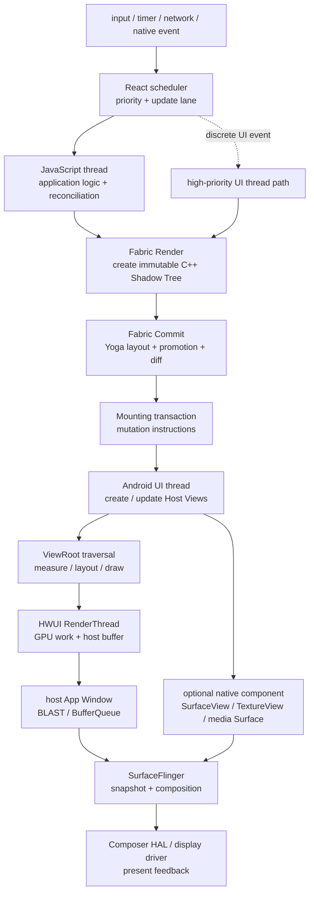

# Android Perfetto 系列 - App 出图类型 - React Native 类型

React Native 的额外成本集中在 Android View 绘制之前：JavaScript 执行 React render，Fabric 创建与提交 C++ Shadow Tree，mounting layer 再把 mutation 应用到 Android Host View Tree。主流 RN 组件完成 mount 后，仍由 ViewRoot、HWUI RenderThread、SurfaceFlinger 和 HWC 显示。

本文以 Android 17 / API 37、`android-17.0.0_r1` 为平台源码锚点，kernel 侧以 `android17-6.18-2026-06_r6` 为锚点。React Native 以当前稳定 `v0.86.0` 为框架锚点；Hermes、Reanimated、React Native Skia、Expo 与业务 native module 必须按项目版本核对。

<!--more-->

## 阅读导航

### 本文目录

- 1. Fabric 的 Render、Commit、Mount
- 2. Mount 之后怎样进入 Android 显示
- 3. 线程模型、JSI 与同步调用
- 4. 动画、列表与自绘组件
- 5. 启动、多 Surface 与多实例
- 6. Perfetto 证据链
- 7. Android 12—17 与 RN 版本演进
- 8. Android 17 与 RN 0.86 源码入口
- 9. 类型边界与常见误判
- 总结

### 系列文章目录

1. [Android Perfetto 系列 - App 出图类型 - 总览与识别方法](S01_rendering_types_overview.md)
2. [Android Perfetto 系列 - App 出图类型 - AOSP 标准类型](S02_aosp_standard_type.md)
3. [Android Perfetto 系列 - App 出图类型 - SurfaceView 类型](S03_surfaceview_type.md)
4. [Android Perfetto 系列 - App 出图类型 - TextureView 类型](S04_textureview_type.md)
5. [Android Perfetto 系列 - App 出图类型 - 混合出图类型](S05_mixed_rendering_type.md)
6. [Android Perfetto 系列 - App 出图类型 - 多窗口类型](S06_multi_window_type.md)
7. [Android Perfetto 系列 - App 出图类型 - Software / 离屏类型](S07_software_offscreen_type.md)
8. [Android Perfetto 系列 - App 出图类型 - Native Graphics 类型](S08_native_graphics_type.md)
9. [Android Perfetto 系列 - App 出图类型 - WebView 类型](S09_webview_type.md)
10. [Android Perfetto 系列 - App 出图类型 - Flutter 类型](S10_flutter_type.md)
11. [Android Perfetto 系列 - App 出图类型 - Camera 类型](S11_camera_type.md)
12. [Android Perfetto 系列 - App 出图类型 - Video Overlay / HWC 类型](S12_video_overlay_hwc_type.md)
13. [Android Perfetto 系列 - App 出图类型 - Game 类型](S13_game_type.md)
14. [Android Perfetto 系列 - App 出图类型 - React Native 类型](S14_react_native_type.md)

## 1. Fabric 的 Render、Commit、Mount

React Native 0.82 起只运行 New Architecture；0.86 继续移除 Legacy Architecture 检查和类。Paper + Bridge 仍会出现在旧 App trace 中，但它属于历史兼容分析，不能和 RN 0.86 当作两条并列现行主线。

Fabric 更新分为 Render、Commit、Mount 三个阶段。

Render 阶段执行产品逻辑与 React reconciliation，并为 Host Component 创建 C++ Shadow Node。JSI 让 JavaScript 运行时持有和访问 C++ 对象，省去旧 Bridge 对 JSON-like payload 的批量序列化；业务计算、对象创建与 JavaScript GC 仍会消耗时间。

Commit 阶段完成 Shadow Tree promotion、Yoga layout、tree diff 和 mounting transaction 准备。Text、TextInput 等节点的测量会调用 host platform 能力。React State update、C++ State update 与高优先级 UI event 可以走不同线程和同步策略，因此不能把全部 layout 固定归到一个 JS thread slice。

Mount 阶段把 mutation 应用到 Android Host View Tree。创建 View、设置属性、插入 / 删除 child 和更新 layout 最终要在 Android UI thread 执行。Fabric 的 view flattening 可以减少 Host View 数量，却不会让剩余 View 绕过 Android measure / layout / draw。

到这里可以得到一个实用边界：React commit 完成表示下一棵树可 mount；mount 完成表示 Android View 状态已更新；用户看到画面还要经过 ViewRoot traversal、HWUI、buffer 提交与 display present。

## 2. Mount 之后怎样进入 Android 显示

mounting transaction 在 UI thread 更新 View 后，View invalidation / layout request 触发宿主 `Choreographer` 与 ViewRoot traversal。UI thread 记录 RenderNode / display list，`ThreadedRenderer` 把 frame 交给进程内 HWUI RenderThread，GPU 生成 host App Window buffer。

buffer 经 BLAST / BufferQueue 进入 SurfaceFlinger。Android 17 FrontEnd 生成 layer snapshot，CompositionEngine 与 HWC 协商 DEVICE / CLIENT composition；需要 CLIENT 时由 RenderEngine 生成 client target。`presentAndGetReleaseFences()` 返回 display present fence 与各 layer release fence。

普通 RN `View`、`Text`、`Image` 与 layout 容器都在 host window buffer 中。React Native 文档里的 React “Surface”表示独立 React root / rendering surface 的逻辑边界，不自动对应 Android `Surface`、`SurfaceControl` 或 SF layer。只有组件明确创建 `SurfaceView`、`TextureView`、视频、相机或自绘 Surface 时，显示对象树才会改变。

多个 RN root 可以共享一个 Android window，也可以分布在 Activity、Dialog 或多个 window。`surfaceId` / root tag 用于区分 React tree 与 mounting 目标，SF layer 仍按实际 Android window / Surface 划分。

## 3. 线程模型、JSI 与同步调用

New Architecture 主要涉及 UI thread 和 JavaScript thread，render pipeline 还会使用背景线程。常见更新在 JS thread 完成大部分 Render / Commit，然后把 Mount 调度到 UI thread；高优先级离散事件也可以在 UI thread 同步推进 render pipeline。线程安全来自不可变 Shadow Tree 与 C++ const 约束，不代表所有更新都固定异步。

TurboModules 通过 JSI 提供 native 能力。同步 JSI 调用可以减少异步往返，也可能让 JS thread 直接等待 native 锁、I/O 或重计算；native 同步回调到 UI thread 还可能形成反向依赖。Perfetto 要按调用栈和线程状态确认等待方向。

Hermes V1 从 RN 0.84 起成为 Android 与 iOS 默认 JavaScript engine。JS parse / bytecode、GC 与运行时事件名称会随 Hermes 版本变化。0.86 App 也可以包含业务定制运行时或调试配置，不能只凭 RN 版本推断所有 JS 性能特征。

## 4. 动画、列表与自绘组件

JS-driven animation 每帧需要 JavaScript 计算与状态更新，JS 长任务会直接破坏动画节拍。Native Animated、LayoutAnimation、Reanimated worklet 或 RN 0.85 的新 animation backend 可以把部分工作移出普通 JS 更新路径；最终属性 mutation、View traversal 或自绘提交仍要按实际实现追踪。

列表卡顿要拆成数据准备、React render、Shadow Tree diff、mount、Android View 创建 / 绑定、图片解码和 HWUI 绘制。Fabric 减少跨边界序列化并提供 view flattening，过量组件、频繁 key 变化、无效重渲染和大图仍会产生真实成本。

React Native Skia 等自绘库通过 JSI 接入自己的 renderer。后半段可能使用 TextureView 并回到 host window，也可能使用 SurfaceView / 独立 Surface。必须记录 library 版本和实际 View / layer tree；“使用 Skia”本身不能确定 SF 对象。

WebView、视频、相机和地图组件也可能增加独立 Surface 或外部纹理。此时 RN 负责组件生命周期与几何，媒体 / camera / native renderer 负责像素生产，两个 producer 节拍要分别验证。

## 5. 启动、多 Surface 与多实例

冷启动包含 APK / native library 加载、ReactHost / 运行时创建、Hermes 初始化、bundle 读取、native module 注册、首棵 Shadow Tree、首次 mount 与第一帧 HWUI。稳态滚动只覆盖其中一小部分，不能用稳态 trace 解释白屏启动。

预热运行时或复用 React instance 可以缩短后续 Surface 启动，但会增加内存常驻、module 状态共享和生命周期管理成本。多个 React Surface 共享 JS 运行时时，一处长 JS task 可能阻塞其他 Surface 更新；它们是否共享 Android window 则决定后半段是同一 FrameTimeline 还是多个 window token。

RN 0.86 在 Android 15+ 提供更完整的 edge-to-edge 支持。Insets 变化、system bar、keyboard 与 modal 会触发 Android layout 和 RN 状态更新。大屏 / 多窗口 resize 还可能同时触发 host configuration、surface size 与 React layout，不能只看 JS reconciliation。

## 6. Perfetto 证据链

第一步记录 RN 版本、New Architecture、Hermes 版本、release / debug build、Expo / Reanimated / Skia 版本、React root 数量和 Android window / Surface 结构。RN 0.82+不再接受“是否启用 Legacy Architecture”作为运行时分支。

第二步按连续帧标出 event、JS render、commit / layout、mounting transaction、UI thread mutation、ViewRoot traversal、HWUI `DrawFrame`、host queue、SF latch 与 display present。

| 现象 | 可能瓶颈 | 验证证据 |
|---|---|---|
| JS thread 长时间 Running | 业务逻辑、reconciliation、序列化、GC | JS marker、Hermes event、CPU profile |
| Commit / layout 晚 | Shadow Tree 大、Yoga、host text 测量、commit 重试 | Fabric marker、tree 规模、text measure |
| Mount 晚 | mutation 多、View 创建、UI thread 抢占 | mounting transaction、主线程状态 |
| Mount 已结束但 traversal 晚 | Android 主线程其他 callback、layout / draw | Choreographer、ViewRoot、Runnable 延迟 |
| host frame 已 queue 但 present 晚 | acquire fence、SF / HWC、CLIENT composition | host layer、FrameTimeline、HWC |
| JS 和 host 都正常但自绘组件晚 | Skia / video / camera 独立 producer | 对应 Surface、GPU / codec / camera fence |

JS slice 的 wall time 要结合 Running、Runnable、Sleeping 判断。UI thread 上一个长 Fabric slice 也可能包含等待，不应全部算作 C++ 计算。frame id、commit number、surfaceId、host frame number 与 layer id 能关联多少就保留多少。

kernel `android17-6.18-2026-06_r6` 下，host window 与自绘 / 媒体 Surface 使用 dma-buf，GPU / HWC 通过 dma-fence / sync_file 同步。JavaScript 和 Fabric CPU 问题主要看调度、futex、Binder、page fault、GC 与 memory pressure；Surface 类组件再补 GPU / display driver 证据。

## 7. Android 12—17 与 RN 版本演进

RN 随 App 发布，Android 版本与 RN 版本没有一一对应关系。下面同时保留平台变化和同期 RN 架构演进，排障仍以 APK 内实际版本为准。

### Android 12 / API 31

BLAST / FrameTimeline 与现代 HWUI 窗口路径成为显示基线。当时线上 RN 仍以 Paper / Bridge 为主，New Architecture 处于早期 opt-in 阶段；今天运行在 Android 12 上的新 App 也可以使用 Fabric，OS 版本不能确定架构。

### Android 13 / API 33

HWC 进入 AIDL，Choreographer / SurfaceControl 提供更完整 frame timeline 信息。RN 前段没有由 Android 13 强制改变，Paper 或 Fabric 取决于 App 携带的 RN 版本。

### Android 14 / API 34

Android View / HWUI / SF 主线保持稳定。React Native 0.76 在 2024 年把 New Architecture 设为新项目默认，但旧项目仍可选择 Legacy；这属于 RN 发布线，不是 Android 14 平台行为。

### Android 15 / API 35

16 KB page size 要求 React Native engine、Hermes 和所有 native module 满足 ELF / APK 对齐；RN 0.77 明确加入 Android 16 KB page 支持。Android 15 edge-to-edge 变化也会影响宿主 insets 与 layout。

### Android 16 / API 36

RN 0.81 加入 Android 16 支持；RN 0.82 随后成为 New Architecture-only，忽略关闭 New Architecture 的配置。RN 0.84 把 Hermes V1 设为默认并继续删除 Legacy 代码。运行在 Android 16 的旧 APK 仍保持其原有 RN 架构。

### Android 17 / API 37

当前稳定 RN 0.86 继续移除 Legacy Architecture 检查，并补强 Android 15+ edge-to-edge 与 mounting 同步。平台侧统一按 `android-17.0.0_r1` 的 ViewRoot、HWUI FrontEnd / SF 与 AIDL Composer 分析；target 37 可能进入 Android 17 的 concurrent `MessageQueue` 路径，改变主线程 queue 争用与 trace 形态，但不会绕过 Fabric Mount 与 ViewRoot traversal。

## 8. Android 17 与 RN 0.86 源码入口

- [RN Architecture Overview](https://reactnative.dev/architecture/overview)、[Render / Commit / Mount](https://reactnative.dev/architecture/render-pipeline) 与 [Threading Model](https://reactnative.dev/architecture/threading-model)：Fabric 阶段与线程边界。
- [React Native 0.82](https://reactnative.dev/blog/2025/10/08/react-native-0.82)、[0.84](https://reactnative.dev/blog/2026/02/11/react-native-0.84) 与 [0.86](https://reactnative.dev/blog/2026/06/11/react-native-0.86)：New Architecture-only、Hermes V1 和当前版本演进。
- RN 0.86 [`ReactAndroid`](https://github.com/react/react-native/tree/v0.86.0/packages/react-native/ReactAndroid) 与 [`ReactCommon`](https://github.com/react/react-native/tree/v0.86.0/packages/react-native/ReactCommon)：Android mounting、Fabric 与 JSI 源码。
- Android 17 [`ViewRootImpl.java`](https://android.googlesource.com/platform/frameworks/base/+/android-17.0.0_r1/core/java/android/view/ViewRootImpl.java)、[`ThreadedRenderer.java`](https://android.googlesource.com/platform/frameworks/base/+/android-17.0.0_r1/core/java/android/view/ThreadedRenderer.java) 与 [`SurfaceFlinger.cpp`](https://android.googlesource.com/platform/frameworks/native/+/android-17.0.0_r1/services/surfaceflinger/SurfaceFlinger.cpp)：mount 后的 Android 显示主线。
- Android 17 [`CombinedMessageQueue/MessageQueue.java`](https://android.googlesource.com/platform/frameworks/base/+/android-17.0.0_r1/core/java/android/os/CombinedMessageQueue/MessageQueue.java)、[`LegacyMessageQueue/MessageQueue.java`](https://android.googlesource.com/platform/frameworks/base/+/android-17.0.0_r1/core/java/android/os/LegacyMessageQueue/MessageQueue.java) 与 [`Looper.java`](https://android.googlesource.com/platform/frameworks/base/+/android-17.0.0_r1/core/java/android/os/Looper.java)：target 37 下主线程队列语义与 trace 解释入口。
- kernel `android17-6.18-2026-06_r6` 的 [`dma-buf.c`](https://android.googlesource.com/kernel/common/+/refs/tags/android17-6.18-2026-06_r6/drivers/dma-buf/dma-buf.c)、[`sync_file.c`](https://android.googlesource.com/kernel/common/+/refs/tags/android17-6.18-2026-06_r6/drivers/dma-buf/sync_file.c) 与 [`dma-fence.h`](https://android.googlesource.com/kernel/common/+/refs/tags/android17-6.18-2026-06_r6/include/linux/dma-fence.h)：固定 kernel tag 下的 buffer 与 fence 语义。

## 9. 类型边界与常见误判

普通 RN 组件最终是 Android Host View；React Native Skia、视频、Camera、WebView 和地图可能另有 Surface 或外部纹理。先确认实际 View / layer tree，再决定是否需要追加对应 producer 分析。

| 误判 | 正确检查方式 |
|---|---|
| RN 0.86 仍可在 Paper 和 Fabric 之间选择 | 0.82 起只运行 New Architecture，旧架构只用于旧 App 分析 |
| JSI 消除了 JS 与 native 之间的成本 | 仍有 JS 计算、对象转换、同步等待和 native 工作 |
| React commit 完成就是 Android 已绘制 | 继续追 Mount、ViewRoot、HWUI、SF 与 present |
| React Surface 等于 Android SurfaceControl | 它是 React root 逻辑边界，按实际 Android 对象验证 |
| Fabric 所有工作都固定在 JS thread | 高优先级场景可在 UI thread 同步执行 |
| Hermes V1 消除了 JavaScript 卡顿 | 业务长任务、GC 压力和同步 native 调用仍会超预算 |
| RN Skia 固定形成独立 SF layer | 查具体 library 版本、TextureView / SurfaceView 与 layer tree |
| JS frame 正常就能排除 RN 问题 | Commit、Mount、host traversal 或自绘 producer 仍可能迟到 |

## 总结

React Native 0.86 的主线是 New Architecture：JavaScript 执行 Render，Fabric 创建并提交 C++ Shadow Tree，Mounting Layer 把 mutation 应用到 Android Host View，随后进入 ViewRoot、HWUI、SurfaceFlinger 与 HWC。

Perfetto 分析要把 JS、Commit / Layout、Mount、Android traversal、HWUI 和 display present 分开。自绘、视频、相机或 WebView 组件若创建额外 Surface，再为对应 producer 建立独立的 buffer 与 fence 时间线。
