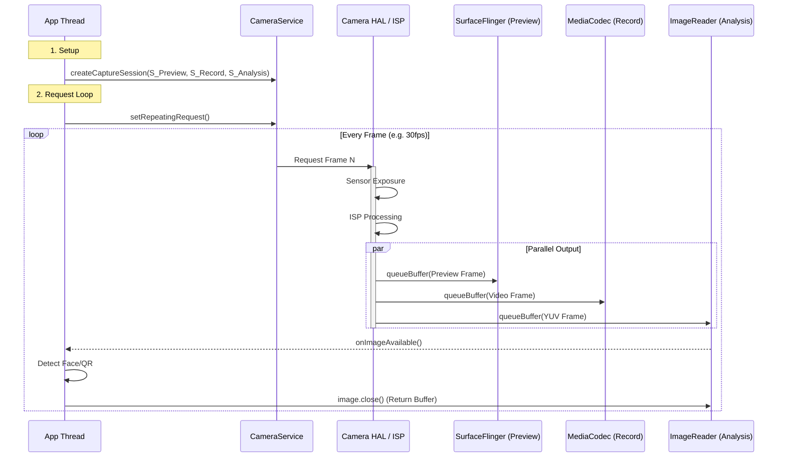
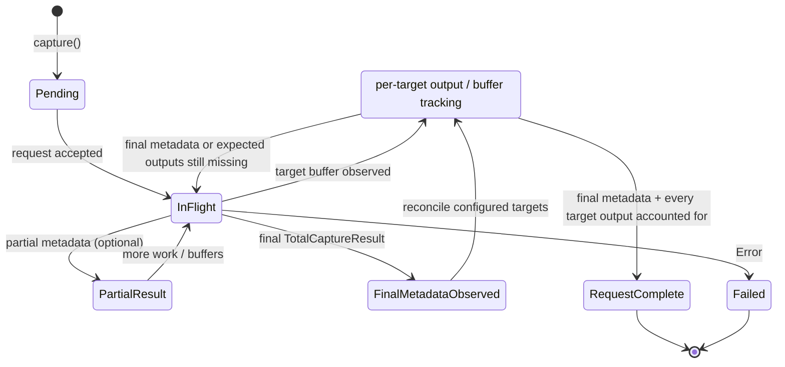
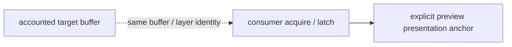

# Camera Rendering Pipeline (Camera2 & HAL3)

Camera 是 Android 系统中数据量最大、实时性要求最高的子系统之一。理解 Camera 管线对于优化取景器预览、录像和图像分析（如扫码、人脸识别）至关重要。需要特别注意的是：Camera 在 Perfetto 中的可观测性高度依赖设备、OEM 与启用的数据源，不能假设所有 trace 都会暴露同一组 `Camera*` slice。

## 1. 核心架构：多流并发 (Multi-Stream)

与简单的 View 渲染不同，Camera 系统天生就是**多消费者 (Multiple Consumers)** 的。
Camera HAL (Hardware Abstraction Layer) 可以同时向多个 Surface 输出数据；具体 buffer topology、复制路径与 ZSL 行为取决于设备 capability、实现和 App 配置，不能预设为统一的零拷贝拓扑。

### 关键组件

1.  **CameraService (Native)**: 系统服务，负责管理 Camera 硬件资源。
2.  **Start Request**: App 发送 CaptureRequest (不仅包含“拍”的指令，还包含 ISO、曝光等参数)。
3.  **App Surface**: App 提前配置好的一组 Surface（例如一个给屏幕预览，一个给编码器录像）。
4.  **HAL3 / ISP**: 硬件图像信号处理器，产生原始数据并转换为 YUV/JPEG。

---

## 2. 数据流详解 (Deep Execution Flow)

### 阶段一：Configure (配置流)
在使用相机前，App 必须告诉系统“我要几路数据，每路多大”：
1.  **createCaptureSession**: App 传入一组 Surface 列表。
    *   `SurfaceView` (Preview)
    *   `MediaRecorder.getSurface()` (Video)
    *   `ImageReader.getSurface()` (Analysis/YUV)
2.  **HAL Configure**: CameraService 将这些 Surface 的 Usage/Format 告诉 HAL。HAL 会根据硬件能力（如 ISP 吞吐量）决定是否支持该组合。

### 阶段二：Request & Produce (生产)
1.  **setRepeatingRequest**: App 下发一个循环请求（通常用于预览）。
2.  **Request / Result**: Camera2/HAL3 request 按序提交，但流水线中可同时有多个 request in-flight；一个 request 可返回 partial metadata 和一个或多个输出 buffer。
3.  **ISP Processing**: 传感器 (Sensor) 曝光 -> ISP 去噪/白平衡 -> 输出 RAW/YUV。
4.  **Buffer Fill**: HAL 按已配置的输出 Surface 交付 buffer；是否有额外复制由能力、实现与 App 配置决定。

### 阶段三：Consume (消费/渲染)

#### Case A: Preview (预览)
*   **SurfaceView**: HAL 填充 Buffer -> SurfaceFlinger (Overlay) -> 屏幕。
    *   *延迟*: 最低。
*   **TextureView**: HAL 填充 Buffer -> SurfaceTexture -> App GL Texture -> App Draw -> SF -> 屏幕。
    *   *延迟*: 较高（多了一次 GPU 采样）。

#### Case B: Recording (录像)
*   **MediaCodec Input Surface**: HAL 填充 Buffer -> MediaCodec (Encoder) -> H.264/265 bitstream。
    *   *路径*: 在支持的设备与流组合上可使用硬件 buffer 路径；不能仅凭 Surface 配置断言全程零拷贝。

#### Case C: Analysis (AI/CV)
*   **ImageReader**: HAL 填充 Buffer -> App `onImageAvailable`。
    *   App 通过 `image.getPlanes()` 获取 YUV 数据指针 (ByteBuffer)。
    *   *性能假设*: App 长时间持有 image 可能导致 backpressure，但只有 trace 中存在 buffer ownership、acquire/release 或 fence 证据时才应报告这一结论。

---

## 3. 渲染时序图

这是一个典型的“一产多销”模型。

## 4. 性能特征与调优

### 4.1 ZSL (Zero Shutter Lag)
ZSL 用于降低按下快门到输出照片的延迟，但其可用性、历史帧缓存格式、reprocessing 路径和 buffer topology 都取决于设备 capability、HAL/OEM 实现与 App 配置。不能假设所有设备都会持续保存全分辨率 YUV/RAW 环形缓冲区，也不能从 `createReprocessableCaptureSession()` 名称单独还原实际 ZSL 数据路径。

### 4.2 SurfaceView vs TextureView
*   **更倾向 SurfaceView** 的场景：高帧率/高分辨率预览、追求更低延迟或更低功耗时，SurfaceView 往往更有优势。
*   **可以使用 TextureView** 的场景：需要对预览画面做滤镜（美颜）、需要预览画面做动画（缩放/圆角）。

### 4.3 内存抖动
*   **ImageReader**: 务必复用。很多初学者在 `onImageAvailable` 里 `new byte[]` 来拷贝数据，这是性能杀手。应该优先使用 NDK、GPU、Vulkan、OpenGL ES 或其他现代加速路径直接处理 `ByteBuffer`；RenderScript 已废弃，不应再作为推荐方案。
*   **证据边界**: PSS/RSS 增长只能说明进程内存变化，不能单独证明 ImageReader 泄漏或 backpressure；需要关联 buffer ownership、acquire/release、队列深度或 fence 证据。

## 5. 常见 Trace 分析
在 Perfetto 中：
*   **CameraProvider / CameraService / vendor camera threads**: 若数据源启用且设备支持，可作为 HAL / service / request activity candidate；vendor slice 名本身不能证明具体 request/result/buffer 阶段。
*   **dma_buf**: 可用于监控 GraphicBuffer / DMA-BUF 的内存分配，Camera 预览通常也是大内存消耗户。
*   **注意**: 缺少 `CameraProvider` 或 `CaptureSession` slice 并不代表没有 Camera 压力，很多设备只暴露更粗粒度的 proto / vendor 事件。
*   **Pixel fast path**: `pixel.camera` 解析只是 Pixel 设备上可选的 vendor-specific 快速路径，不是可移植的 Android Camera contract；仍需用稳定 identity 和明确生命周期锚点交叉验证。

## 6. HAL3 Request-Buffer 生命周期 (Deep Dive)

理解 Camera2 的 Request 与 Buffer 的生命周期是追查**掉帧**和**延迟**问题的关键。

### 6.1 Request 状态机

Camera2/HAL3 request 按序进入管线，但多个 request 可以同时处于 in-flight。每个 request 可能分批返回 partial metadata，并向一个或多个配置好的 Surface 交付 buffer；最终 metadata 完成与各 buffer 的交付/呈现不是同一个事件。

Request completion 必须按配置的目标 Surface 分别跟踪其 buffer 状态；final metadata 不能直接把 request 标为完成。Preview presentation 是 buffer 离开 Camera request/result 生命周期后的下游独立事件，必须用单独的 consumer/display 锚点关联，不能并入 request completion。

### 6.2 Buffer 生命周期

| 阶段 | 触发者 | Buffer 状态 |
|:---|:---|:---|
| **Dequeue** | HAL (ISP) | HAL 拥有，正在填充 |
| **Fill** | ISP Pipeline | 数据写入中 |
| **Queue** | HAL | 提交给 Consumer (SF/App) |
| **Acquire** | Consumer | Consumer 拥有，正在使用 |
| **Release** | Consumer | 归还给 BufferQueue |

### 6.3 Session Callback (性能关键)

`CameraCaptureSession.CaptureCallback` 提供候选锚点，但每个回调都需要同一 session/request/frame identity 下的关联证据：

| 回调方法 | 候选锚点 | 必要关联证据与事实边界 |
|:---|:---|:---|
| `onCaptureStarted` | capture-start callback / exposure timestamp | 只有同时存在 request submission 锚点，才能计算 submission-to-capture 延迟；单独回调不能表示“Request 下发延迟” |
| `onCaptureProgressed` | partial capture result | 必须关联同 identity，且 metadata 中实际存在 AE/AF/AWB state 字段，才能分析 3A；partial metadata 本身不证明 3A 状态或收敛 |
| `onCaptureCompleted` | final `TotalCaptureResult` | 只证明 final metadata 返回；不等于目标 buffer 已交付、预览已呈现或 pipeline 总耗时完成，仍需关联每个目标 output/buffer、fence 与 presentation 证据 |
| `onCaptureFailed` | capture failure callback | 必须关联同 identity 和错误信息；不能单独定位 HAL、ISP 或 consumer 根因 |
| `onCaptureBufferLost` | 某个目标 Surface 的 buffer-lost callback | 必须关联同 identity、目标 Surface 与 buffer/fence 证据，才能判断受影响输出和压力来源 |

### 6.4 启动、首帧与 3A 证据边界

*   `CameraDevice.StateCallback.onOpened` 只证明设备打开完成，不证明首个 capture result、首个输出 buffer 或首个预览 presentation。
*   首个预览 timing 必须先建立稳定的 session/camera identity，再分别找到明确的 request、result、buffer 与 presentation 锚点；vendor slice-name inventory 单独只能标为 candidate。
*   首帧到达时 AE/AF/AWB 仍可能处于 searching 状态。有 trace metadata 证据时应把 3A 状态单独报告，不能把“首帧已到达”等同于“3A 已收敛”。
*   `prepare()` 是 buffer 预分配的延迟/内存取舍：它可能减少后续分配抖动，也可能推迟首次输出并增加内存占用，因此不是 blanket first-frame fix。

### 6.5 典型掉帧场景

1.  **Buffer Starvation 候选**: Consumer (`ImageReader`) 处理太慢、`image.close()` 不及时可能让 HAL 缺少空闲 Buffer。
    *   *Trace*: 只有看到 buffer ownership、acquire/release、队列或 fence 证据时才把它报告为受支持的 backpressure 假设；`CameraProvider::dequeueBuffer` 等 vendor 名称单独仍只是 candidate。
2.  **Pipeline Stall 候选**: HDR、夜景等处理可能让 Camera pipeline 延迟增长，但不能仅凭回调间隔归因 ISP。
    *   *Trace*: 只有在同一 session/request/frame identity 下串联 request、result、各目标 buffer/fence 与 presentation 证据，并能把延迟定位到对应阶段时，才把 stall 报告为受支持的候选；`onCaptureCompleted` 与 `onCaptureStarted` 的间隔本身不足以定位 ISP。
3.  **Binder Congestion**: CameraService 与 App 之间的 IPC 拥塞。
    *   *Trace*: `binder transaction` 耗时异常。
