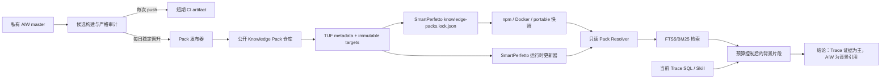

# AIW Knowledge Pack 自动发布与 SmartPerfetto 消费设计

日期：2026-07-18

状态：已选定方案，进入实现前审查

涉及仓库：

- 私有源仓库：`Gracker/android-internals-wiki`
- 产品仓库：`Gracker/SmartPerfetto`
- 新建公开分发仓库：`Gracker/android-internals-knowledge-pack`

## 1. 目标

Android Internals Wiki（AIW）每天持续更新，但 SmartPerfetto 用户不应依赖维护者本机的私有 checkout。系统需要把已定稿、已审查、允许公开分发的 AIW 文章构建成独立的版本化 Knowledge Pack，供 SmartPerfetto 离线携带和在线更新。

完成后的产品行为是：

1. AIW 每次 `master` 更新都构建和验证候选 Pack。
2. 每天最多晋升一个稳定 Pack；公开内容没有变化时不发布空版本。
3. Pack 只包含公开检索所需的正文片段和安全元数据，不包含私有仓库日志、队列、审稿记录、本机路径或草稿。
4. SmartPerfetto 的 npm、Docker、portable 发行物携带锁定的已验证快照。
5. 已安装的 SmartPerfetto 可以独立检查和原子切换到更新的 Pack；更新失败时继续使用上一个已知可用版本。
6. AIW 命中只解释系统背景，不能替代当前 Trace 的 SQL/Skill 证据。

## 2. 已比较方案

### 方案 A：把 AIW 正文直接提交到 SmartPerfetto

优点是读取最简单、离线天然可用。缺点是公开/私有边界耦合、SmartPerfetto Git 历史快速膨胀、AIW 每日更新会制造产品仓库噪声，撤回和许可证治理也困难。

结论：不采用。

### 方案 B：独立、签名、版本化的 Knowledge Pack

AIW 私库构建候选，公开分发仓库只承载不可变 Pack 和 TUF 元数据。SmartPerfetto 通过锁文件携带快照，并可在运行时独立更新。

优点是源仓库继续私有、发行边界清楚、可离线、可回滚、可撤回、可审计，且不需要托管在线检索服务。

结论：采用。

### 方案 C：SmartPerfetto 调用托管 RAG API

优点是知识实时、客户端轻。缺点是引入在线服务、账号、成本、隐私、可用性和服务端多租户治理；离线、Docker 和本地 CLI 体验变差。

结论：不作为 v1 默认路径。未来可作为企业镜像或远程检索后端。

## 3. 总体架构

三个仓库的职责严格分离：

- AIW：内容真相、公开资格、确定性构建、泄漏扫描和发布触发。
- 公开 Pack 仓库：不可变目标文件、TUF 元数据和公开下载，不接收 Markdown 源仓库。
- SmartPerfetto：可信根、锁定版本、更新器、只读检索、会话固定和引用投影。

## 4. 公开资格与失败关闭

### 4.1 仓库级公开授权

AIW 增加版本化发布策略 `knowledge-pack/policy.yaml`。策略明确声明：

- `smartperfetto.default: include-if-eligible`
- 权利持有人和版权归属
- 社区与商业双许可标识
- 显式排除路径、标签和文章 ID
- 允许导出的元数据字段

这是对“所有满足资格的文章允许进入 SmartPerfetto Pack”的仓库级明确授权。单篇文章可用 frontmatter 的 `distribution.smartperfetto: exclude` 覆盖默认值。新文章不会仅因存在于私库而发布；它必须先通过下面全部流水线状态。

### 4.2 文章资格

只有同时满足以下条件的文章进入 Pack：

- 文件位于 `src/**/*.md`，但不是 `README.md`、`SUMMARY.md` 或生成目录；
- frontmatter 使用拒绝重复 key 的严格 YAML 解析；
- `status: finalized`；
- `pipeline_stage: ready-to-publish`；
- `task6_state: reviewed`；
- `task6_result: pass-light-edit`；
- `task9_state: reviewed`；
- `task9_result: pass-tech-review`；
- 不带 `deprecated`、`superseded`、`quarantined` 或发布排除标记；
- 文章路径不在 `metadata/queue.json` 的 `pending`、`rework`、`blocked`
  或 `in-progress` 项中，也不在发布策略的人工 blocklist 中；
- 未命中本机绝对路径、私钥、令牌、API key、私有仓库 URL 等泄漏规则；
- 正文非空且能产生至少一个有效片段。

`task9_state` 只是流程状态，不能代替技术通过结果。v1 不把
`task9_result: auto-fixed` 当作通过；未来若要纳入，必须先引入独立的机器可验证
复核字段并完成 schema 迁移。`metadata/queue.json` 同时兼容历史 `path` 和
`file` 字段；同一路径的 queue/frontmatter 结论冲突时按不公开处理。
`metadata/progress.json` 目前只有汇总值，logs 是非结构化审计材料，二者不直接
授予发布资格；已知冲突通过版本化 blocklist 失败关闭。

不合格文章只进入 `audit-summary.json`。单篇格式或状态问题按文章失败关闭，
不阻塞其他合格文章；任何高置信秘密命中、策略解析失败、零文章输出或输出
完整性失败会阻止整个 Pack 发布。

## 5. Pack 格式

每个版本由三个目标文件组成：

- `manifest.json`
- `content.sqlite.gz`
- `audit-summary.json`

版本使用 UTC 构建日期的 CalVer：`YYYY.MM.DD.N`。同一天只有内容修复或紧急重发时递增 `N`。版本不可覆盖。

`manifest.json` 至少包含：

- `packId`、`packFormatVersion`、`contentVersion`
- AIW 完整 source SHA 和公开内容 fingerprint
- builder 名称、版本和构建时间
- 文章数、片段数、压缩前后字节数
- SQLite SHA-256、压缩目标 SHA-256
- 最低/最高兼容 SmartPerfetto 版本
- `licenseExpression: CC-BY-NC-SA-4.0 OR LicenseRef-AIW-Commercial`
- 归属、商业许可说明和许可证文件
- 撤回状态与 `minimumSafeVersion`

SQLite 是不可变只读数据库：

- `pack_manifest`：与外部 manifest 一致的核心身份；
- `articles`：稳定 article ID、相对路径、标题、版本边界、置信度、最后验证时间、source SHA；
- `sections`：稳定 section ID、标题层级和源行范围；
- `chunks`：稳定 chunk ID、正文片段、chunk hash、token 估算和引用字段；
- `sources`：只保留安全的公开 URL 和来源类型；
- `chunks_fts`：FTS5 检索索引。

Pack 不包含原始 frontmatter、OpenClaw 日志、review notes、queue、绝对路径、Git remote、私有 URL 或非入选文章的正文。

### 5.1 Markdown 切片

构建器按 Markdown block 解析，识别标题、段落、列表、引用、表格和 fenced code：

- 标题开启新 section；
- 普通 chunk 目标约 1,800 字符，硬上限 4,000 字符；
- 表格和 fenced code 默认保持完整；
- 单个表格或代码块超过 16 KiB 时按行切分，并保留同一 section 身份；
- 相邻 chunk 只重叠最后一个普通段落，不重复大型表格或代码块；
- article、section、chunk ID 由规范化路径、标题链、正文 hash 推导，不依赖扫描顺序。

## 6. 检索设计

v1 使用 SQLite FTS5/BM25，不引入 embedding：

- 中文连续汉字生成 bigram；
- Java/Kotlin/C++ 标识符保留全名并展开 camelCase、snake_case；
- title、heading、tags、body 使用不同 BM25 权重；
- capability map 可对场景和 Android 子系统做确定性加权；
- 返回 Top-N 后按精确标题、标签、版本适用性做轻量重排；
- 查询、排序和输出在同一 Pack 上可重复。

当前公开候选语料规模适合先建立可测的词法基线。v1 不依赖本地 embedding 模型，也不把用户查询发送给额外模型厂商。后续只有在黄金查询集证明 Recall@K 不足时，才增加“固定模型版本 + 固定维度 + Pack 内向量”的混合检索 v2。

## 7. AIW 自动化

### 7.1 候选构建

`master` 的每次 push 和 pull request 运行：

1. 安装锁定的 Python 依赖；
2. 运行现有 frontmatter 和进度检查；
3. 构建 Pack 到临时目录；
4. 运行 schema、SQLite `quick_check`、哈希、泄漏、许可证和检索黄金集验证；
5. 上传短期 CI artifact，不对外晋升。

### 7.2 每日稳定晋升

定时任务在每天 `00:30 Asia/Shanghai` 运行，晚于 AIW 的每日汇总提交：

1. checkout `master` 的确定 SHA；
2. 重新构建而不是复用未固定 artifact；
3. 比较公开内容 fingerprint；未变化则成功 no-op；
4. 计算当天 CalVer；
5. 通过仅对公开 Pack 仓库有写权限的 deploy key 推送候选目标；
6. 生成并签名 TUF delegated targets、snapshot、timestamp；
7. 原子推送公开仓库；
8. 从公开 URL 用全新临时客户端执行一次 TUF 下载与 SQLite 检索 canary；
9. 生成 GitHub artifact attestation 作为补充来源证明。

`workflow_dispatch` 支持紧急重发、撤回和 dry-run。并发组保证同一时间只有一个稳定晋升任务。

### 7.3 TUF 信任划分

- root 与 top-level targets key 离线保存；
- top-level targets 只委托 `channels/*` 与 `packs/*` 给 nightly delegated role；
- delegated targets、snapshot、timestamp 使用独立在线 key；
- SmartPerfetto 携带初始 `root.json`；
- consistent snapshots 开启，目标文件按内容 hash 命名并永久保留；
- timestamp 短期过期，snapshot 与 delegated targets 使用较长但有限的过期时间；
- root 轮换必须由旧 root 和新 root 的阈值共同签名。

## 8. SmartPerfetto 运行时

### 8.1 独立来源类型

新增 `android_internals_pack` 作为内置公开来源；现有 `android_internals_wiki` 保持“操作员注册的私有 checkout”语义。不得通过放宽现有 `rightsAcknowledged`、`sendToProvider` 或路径白名单来实现公共 Pack。

公共 Pack 使用只读 `AndroidInternalsPackStore`，不写入用户/租户的可变 `RagStore`。检索器可以组合：

- 公共 Pack；
- `androidperformance.com`；
- 当前请求明确授权的私有 AIW connector。

组合结果按 article ID 和 chunk hash 去重；显式选择的私有 connector 可以覆盖同一公开文章，但必须继续受隐私同意和 scope 约束。

### 8.2 版本解析与存储

解析优先级：

1. 管理员显式 pin 的已验证版本；
2. runtime data 中的 active 已知可用版本；
3. 发行物携带的 bundled snapshot；
4. 都不可用时关闭 AIW Pack，Trace 分析继续。

运行时文件写入 `backendDataPath('knowledge-packs')`，不修改 npm 安装目录或只读容器层。目录包含 TUF metadata cache、下载暂存区、不可变版本目录、active 指针和 last-known-good 指针。

每次分析会话启动时固定 Pack 的 `contentVersion + fingerprint`。会话中途发生更新时，旧会话继续读取已固定版本；被紧急撤回的版本会让后续知识查询返回 `analysis_context_changed_restart_required`，不能静默切换。

### 8.3 更新事务

更新器执行：

1. 获取跨进程文件锁；
2. 用 `tuf-js` 刷新元数据；
3. 下载 stable manifest 和其声明的 Pack 目标；
4. TUF 校验长度与 hash；
5. 解压到随机暂存目录；
6. 校验外部/内部 manifest 一致性、兼容范围、SQLite `quick_check`、表结构和内置 smoke queries；
7. 原子 rename 为不可变版本目录；
8. 原子替换 active 指针；
9. 保留 bundled、last-known-good 和最近两个已验证版本；
10. 释放锁。

失败不得破坏 active 指针。Windows 使用文件指针 JSON 的原子替换，不依赖可变 symlink。

默认在服务启动后异步检查一次，此后每 24 小时检查一次并 `unref()`；可通过环境变量禁用、改为只检查不安装、固定版本、配置镜像或手动触发。无网络和只读环境继续使用 bundled/last-known-good。

## 9. 撤回与修订

普通文章修订或删除通过新不可变 Pack 表达，旧版本仍可审计。

紧急撤回通过 TUF stable channel 的签名元数据表达：

- `revokedVersions`
- `minimumSafeVersion`
- `reasonCode`

客户端发现 active 版本被撤回时：

- 有安全版本：安装后让新会话使用；
- 离线或没有安全版本：禁用公共 AIW Pack，不继续使用已知不安全内容；
- 正在运行的会话：下一次知识查询要求重启分析上下文；
- Trace SQL、Skill 和不依赖 AIW 的分析能力继续可用。

管理员 pin 不能绕过撤回，除非未来增加单独的高风险离线取证模式。

## 10. 模型投影与引用

公共 Pack 命中通过预算控制、秘密脱敏和片段上限后发送给当前模型厂商。日志和流式事件默认只记录元数据，不复制完整正文。

新增 `BackgroundKnowledgeReference`，与 Trace 的 `ClaimReference`/证据引用分开：

- `sourceKind`
- `packVersion`
- `sourceRevision`
- `articleId`
- `articleTitle`
- `sectionId`
- `sectionHeading`
- `chunkId`
- `chunkHash`
- `license`
- `confidence`
- `lastVerified`

聊天显示简洁的 `[AIW packVersion · 文章标题 · 小节]`；HTML report、CLI turn artifact 和 analysis snapshot 保留完整引用字段。SSE 只投影允许的引用元数据。

所有运行时 prompt/tool description 必须保留约束：AIW 是背景知识，不是当前 Trace 证据。根因、数值、时序和进程归属结论仍需引用当前 Trace 的 SQL/Skill 实际结果。

## 11. 双许可证

AIW 内容提供两个替代许可：

1. 社区使用：CC BY-NC-SA 4.0；
2. 商业使用：权利持有人单独授予的 AIW Commercial License。

公开仓库和 Pack 同时携带社区许可证、商业许可说明、归属和 SPDX 风格表达。商业许可说明明确：仅有 Pack 不代表获得商业授权；已有单独书面商业授权的组织可记录 `commercialLicenseId` 供本地审计。

v1 不加入联网 license key、遥测或远程授权服务。SmartPerfetto 展示许可证和当前本地 license mode，但检索能力不依赖外部许可服务器。SmartPerfetto 获得构建、打包和再分发该 Pack 的明确授权；最终使用者仍按其选择或获得的 AIW 许可使用内容。

## 12. 发行集成

SmartPerfetto 提交：

- TUF 初始 root；
- `knowledge-packs.lock.json`，固定 bundled 版本、目标路径和 manifest hash；
- 下载/验证/状态脚本；
- 不提交 AIW 正文或生成的 SQLite。

发行构建在干净环境中执行 lock fetch：

- npm `prepack` 获取并验证锁定 Pack，然后把它放入 npm tarball；
- portable 打包复用相同 fetch 脚本并把 Pack 放入 backend resources；
- Docker builder 复用相同 lock 和 fetch 脚本；
- source checkout 在本地没有 bundled Pack 时可按 lock 首次获取。

`cli:pack-check`、portable manifest verifier、Docker 静态测试和 `smp doctor` 都报告 Pack 是否存在、版本、fingerprint、许可证、来源和验证状态。

## 13. 测试与验收

### AIW

- 严格 YAML：重复 key、错误类型、非法状态；
- 资格矩阵：finalized/draft/review/pipeline/exclude；
- 泄漏测试：token、私钥、本机路径、私有 URL；
- Markdown：中英文标题、表格、超长代码、空 section、稳定 ID；
- 确定性：同一输入两次构建的 manifest fingerprint、文章/chunk ID 和 SQLite 逻辑内容一致；
- SQLite schema、`quick_check`、manifest/hash；
- 黄金查询集：中英混合、Android 子系统、负查询，检查 Recall@5、MRR 和无草稿泄漏；
- 发布 dry-run、同 fingerprint no-op、CalVer 递增、并发保护。

### SmartPerfetto

- bundled/active/pin/last-known-good 解析；
- TUF 过期、回滚、错误签名、hash 不符和下载中断；
- 解压炸弹、SQLite 损坏、schema 不兼容；
- 原子切换、并发更新、Windows 指针语义、失败回滚；
- 会话版本固定和紧急撤回；
- FTS5 中文 bigram、技术标识符、权重和去重；
- 公共 Pack 与私有 connector 权利/隐私边界；
- 模型预算、脱敏和背景引用；
- npm、Docker、portable 和 source 发行面；
- doctor/health 状态。

落地前运行两个仓库现有规则定义的最小验证入口；SmartPerfetto 落地前运行 `npm run verify:pr`，发行资产变化额外运行 CLI pack-check、portable package verification 和 Docker path smoke。

## 14. 实现顺序

1. AIW：策略、双许可证、严格构建器、测试和候选 CI。
2. 公开 Pack 仓库：TUF bootstrap、在线角色、不可变目标布局。
3. AIW：每日稳定晋升、手动 dry-run/retract、公开 canary。
4. SmartPerfetto：manifest/schema、只读 SQLite store、检索和引用。
5. SmartPerfetto：TUF updater、版本解析、会话固定和撤回。
6. SmartPerfetto：npm/Docker/portable/source 发行集成、doctor 和文档。
7. 两仓库全量验证、独立终审、提交并 push。

## 15. 明确不做

- 不公开 AIW Markdown 源仓库；
- 不让 SmartPerfetto 默认依赖本机 AIW checkout；
- 不把公共 Pack 写入租户可变 RagStore；
- 不在 v1 引入托管 RAG 服务、向量数据库或在线 embedding；
- 不在 v1 建商业许可证服务器；
- 不让 AIW 引用替代当前 Trace 证据；
- 不覆盖或删除不可变历史 Pack。
